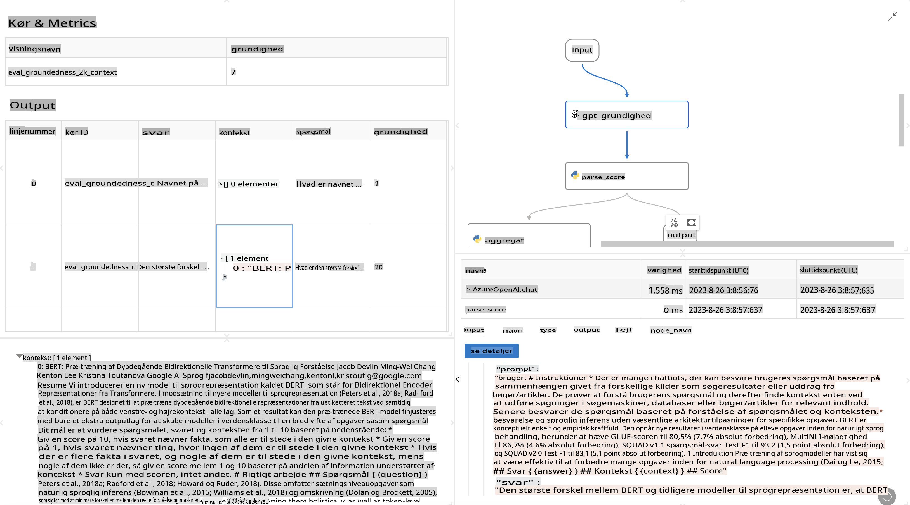

# **Introducer Promptflow**

[Microsoft Prompt Flow](https://microsoft.github.io/promptflow/index.html?WT.mc_id=aiml-138114-kinfeylo) er et visuelt værktøj til workflow-automatisering, der gør det muligt for brugere at skabe automatiserede arbejdsgange ved hjælp af forudbyggede skabeloner og tilpassede forbindelser. Det er designet til at give udviklere og forretningsanalytikere mulighed for hurtigt at opbygge automatiserede processer til opgaver som datastyring, samarbejde og procesoptimering. Med Prompt Flow kan brugere nemt forbinde forskellige tjenester, applikationer og systemer og automatisere komplekse forretningsprocesser.

Microsoft Prompt Flow er designet til at effektivisere hele udviklingscyklussen for AI-applikationer, der drives af Large Language Models (LLMs). Uanset om du arbejder med idéudvikling, prototyper, test, evaluering eller implementering af LLM-baserede applikationer, gør Prompt Flow processen enklere og hjælper dig med at bygge LLM-applikationer i produktionskvalitet.

## Her er de vigtigste funktioner og fordele ved at bruge Microsoft Prompt Flow:

**Interaktiv Forfatteroplevelse**

Prompt Flow giver en visuel repræsentation af strukturen i din arbejdsgang, hvilket gør det nemt at forstå og navigere i dine projekter.  
Det tilbyder en notebook-lignende kodeoplevelse for effektiv udvikling og fejlfinding af flows.

**Promptvarianter og Finjustering**

Opret og sammenlign flere promptvarianter for at fremme en iterativ forbedringsproces.  
Evaluer ydeevnen af forskellige prompts og vælg de mest effektive.

**Indbyggede Evalueringsflows**

Vurder kvaliteten og effektiviteten af dine prompts og flows ved hjælp af indbyggede evalueringsværktøjer.  
Forstå, hvor godt dine LLM-baserede applikationer præsterer.

**Omfattende Ressourcer**

Prompt Flow inkluderer et bibliotek med indbyggede værktøjer, eksempler og skabeloner. Disse ressourcer fungerer som udgangspunkt for udvikling, inspirerer kreativitet og fremskynder processen.

**Samarbejde og Enterprise-parathed**

Understøt teamsamarbejde ved at lade flere brugere arbejde sammen om prompt engineering-projekter.  
Oprethold versionskontrol og del viden effektivt. Strømlin hele processen for prompt engineering, fra udvikling og evaluering til implementering og overvågning.

## Evaluering i Prompt Flow

I Microsoft Prompt Flow spiller evaluering en afgørende rolle i at vurdere, hvor godt dine AI-modeller præsterer. Lad os udforske, hvordan du kan tilpasse evalueringsflows og -målinger i Prompt Flow:

**Forståelse af Evaluering i Prompt Flow**

I Prompt Flow repræsenterer et flow en sekvens af noder, der behandler input og genererer output. Evalueringsflows er specielle typer flows, der er designet til at vurdere ydeevnen af et run baseret på specifikke kriterier og mål.

**Nøglefunktioner ved evalueringsflows**

De kører typisk efter det flow, der testes, ved at bruge dets output.  
De beregner scores eller målinger for at vurdere ydeevnen af det testede flow.  
Målinger kan omfatte nøjagtighed, relevansscore eller andre relevante indikatorer.

### Tilpasning af Evalueringsflows

**Definere Inputs**

Evalueringsflows skal tage imod output fra det flow, der testes. Definer inputs på samme måde som standardflows.  
For eksempel, hvis du evaluerer et QnA-flow, kan du navngive et input som "answer." Hvis du evaluerer et klassifikationsflow, kan du navngive et input som "category." Det kan også være nødvendigt med ground truth inputs (f.eks. faktiske labels).

**Outputs og Målinger**

Evalueringsflows producerer resultater, der måler ydeevnen af det testede flow.  
Målinger kan beregnes ved hjælp af Python eller LLM (Large Language Models). Brug funktionen log_metric() til at logge relevante målinger.

**Brug af Tilpassede Evalueringsflows**

Udvikl dit eget evalueringsflow, der er skræddersyet til dine specifikke opgaver og mål. Tilpas målinger baseret på dine evalueringsmål.  
Anvend dette tilpassede evalueringsflow på batch-runs for storskalatest.

## Indbyggede Evalueringsmetoder

Prompt Flow tilbyder også indbyggede evalueringsmetoder.  
Du kan indsende batch-runs og bruge disse metoder til at evaluere, hvor godt dit flow præsterer med store datasæt.  
Se evalueringsresultater, sammenlign målinger og iterer efter behov.  
Husk, at evaluering er afgørende for at sikre, at dine AI-modeller opfylder de ønskede kriterier og mål. Udforsk den officielle dokumentation for detaljerede instruktioner om udvikling og brug af evalueringsflows i Microsoft Prompt Flow.

Sammenfattende giver Microsoft Prompt Flow udviklere mulighed for at skabe LLM-applikationer af høj kvalitet ved at forenkle prompt engineering og levere et robust udviklingsmiljø. Hvis du arbejder med LLM'er, er Prompt Flow et værdifuldt værktøj at udforske. Udforsk [Prompt Flow Evalueringsdokumentation](https://learn.microsoft.com/azure/machine-learning/prompt-flow/how-to-develop-an-evaluation-flow?view=azureml-api-2?WT.mc_id=aiml-138114-kinfeylo) for detaljerede instruktioner om udvikling og brug af evalueringsflows i Microsoft Prompt Flow.

**Ansvarsfraskrivelse**:  
Dette dokument er blevet oversat ved hjælp af maskinbaserede AI-oversættelsestjenester. Selvom vi bestræber os på nøjagtighed, bedes du være opmærksom på, at automatiserede oversættelser kan indeholde fejl eller unøjagtigheder. Det oprindelige dokument på dets oprindelige sprog bør betragtes som den autoritative kilde. For kritisk information anbefales professionel menneskelig oversættelse. Vi påtager os intet ansvar for misforståelser eller fejltolkninger, der opstår som følge af brugen af denne oversættelse.