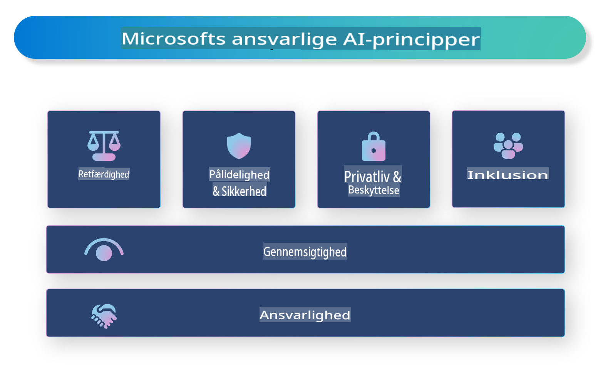

# **Introducer ansvarlig AI**

[Microsoft Responsible AI](https://www.microsoft.com/ai/responsible-ai?WT.mc_id=aiml-138114-kinfeylo) er en initiativ, der har til formål at hjælpe udviklere og organisationer med at bygge AI-systemer, der er gennemsigtige, pålidelige og ansvarlige. Initiativet tilbyder vejledning og ressourcer til at udvikle ansvarlige AI-løsninger, der er i overensstemmelse med etiske principper som privatliv, retfærdighed og gennemsigtighed. Vi vil også undersøge nogle af de udfordringer og bedste praksisser, der er forbundet med at bygge ansvarlige AI-systemer.

## Oversigt over Microsoft Responsible AI

**Etiske principper**

Microsoft Responsible AI er baseret på et sæt etiske principper som privatliv, retfærdighed, gennemsigtighed, ansvarlighed og sikkerhed. Disse principper er designet til at sikre, at AI-systemer udvikles på en etisk og ansvarlig måde.

**Gennemsigtig AI**

Microsoft Responsible AI understreger vigtigheden af gennemsigtighed i AI-systemer. Dette inkluderer at give klare forklaringer på, hvordan AI-modeller fungerer, samt sikre, at datakilder og algoritmer er offentligt tilgængelige.

**Ansvarlig AI**

[Microsoft Responsible AI](https://www.microsoft.com/ai/responsible-ai?WT.mc_id=aiml-138114-kinfeylo) fremmer udviklingen af ansvarlige AI-systemer, som kan give indsigt i, hvordan AI-modeller træffer beslutninger. Dette kan hjælpe brugere med at forstå og stole på AI-systemernes output.

**Inklusion**

AI-systemer bør designes til at gavne alle. Microsoft stræber efter at skabe inkluderende AI, der tager højde for forskellige perspektiver og undgår bias eller diskrimination.

**Pålidelighed og sikkerhed**

Det er afgørende at sikre, at AI-systemer er pålidelige og sikre. Microsoft fokuserer på at bygge robuste modeller, der fungerer konsekvent og undgår skadelige resultater.

**Retfærdighed i AI**

Microsoft Responsible AI anerkender, at AI-systemer kan videreføre bias, hvis de trænes på biased data eller algoritmer. Initiativet tilbyder vejledning til at udvikle retfærdige AI-systemer, der ikke diskriminerer baseret på faktorer som race, køn eller alder.

**Privatliv og sikkerhed**

Microsoft Responsible AI understreger vigtigheden af at beskytte brugernes privatliv og datasikkerhed i AI-systemer. Dette inkluderer implementering af stærk datakryptering og adgangskontrol samt regelmæssig audit af AI-systemer for sårbarheder.

**Ansvarlighed og ansvar**

Microsoft Responsible AI fremmer ansvarlighed og ansvar i udviklingen og implementeringen af AI. Dette inkluderer at sikre, at udviklere og organisationer er bevidste om de potentielle risici forbundet med AI-systemer og tager skridt til at reducere disse risici.

## Bedste praksisser for at bygge ansvarlige AI-systemer

**Udvikl AI-modeller ved hjælp af mangfoldige datasæt**

For at undgå bias i AI-systemer er det vigtigt at bruge mangfoldige datasæt, der repræsenterer en bred vifte af perspektiver og erfaringer.

**Brug forklarlige AI-teknikker**

Forklarlige AI-teknikker kan hjælpe brugere med at forstå, hvordan AI-modeller træffer beslutninger, hvilket kan øge tilliden til systemet.

**Auditér AI-systemer regelmæssigt for sårbarheder**

Regelmæssige audits af AI-systemer kan hjælpe med at identificere potentielle risici og sårbarheder, der skal adresseres.

**Implementér stærk datakryptering og adgangskontrol**

Datakryptering og adgangskontrol kan hjælpe med at beskytte brugernes privatliv og sikkerhed i AI-systemer.

**Følg etiske principper i AI-udvikling**

Ved at følge etiske principper som retfærdighed, gennemsigtighed og ansvarlighed kan man opbygge tillid til AI-systemer og sikre, at de udvikles på en ansvarlig måde.

## Brug af AI Foundry til ansvarlig AI

[Azure AI Foundry](https://ai.azure.com?WT.mc_id=aiml-138114-kinfeylo) er en kraftfuld platform, der gør det muligt for udviklere og organisationer hurtigt at skabe intelligente, banebrydende, markedsparate og ansvarlige applikationer. Her er nogle nøglefunktioner og muligheder i Azure AI Foundry:

**Færdige API'er og modeller**

Azure AI Foundry tilbyder forudbyggede og tilpasselige API'er og modeller. Disse dækker en bred vifte af AI-opgaver, herunder generativ AI, naturlig sprogbehandling til samtaler, søgning, overvågning, oversættelse, tale, vision og beslutningstagning.

**Prompt Flow**

Prompt flow i Azure AI Foundry gør det muligt at skabe konverserende AI-oplevelser. Det giver dig mulighed for at designe og administrere samtaleforløb, hvilket gør det nemmere at bygge chatbots, virtuelle assistenter og andre interaktive applikationer.

**Retrieval Augmented Generation (RAG)**

RAG er en teknik, der kombinerer retrieval-baserede og generative tilgange. Det forbedrer kvaliteten af genererede svar ved at udnytte både eksisterende viden (retrieval) og kreativ generering (generation).

**Evaluering og overvågningsmålinger for generativ AI**

Azure AI Foundry tilbyder værktøjer til evaluering og overvågning af generative AI-modeller. Du kan vurdere deres ydeevne, retfærdighed og andre vigtige målinger for at sikre ansvarlig implementering. Hvis du har oprettet et dashboard, kan du desuden bruge den kodefrie brugerflade i Azure Machine Learning Studio til at tilpasse og generere et Responsible AI Dashboard og en tilhørende scorecard baseret på [Responsible AI Toolbox](https://responsibleaitoolbox.ai/?WT.mc_id=aiml-138114-kinfeylo) Python-biblioteker. Dette scorecard hjælper dig med at dele vigtige indsigter relateret til retfærdighed, funktioners betydning og andre overvejelser om ansvarlig implementering med både tekniske og ikke-tekniske interessenter.

For at bruge AI Foundry med ansvarlig AI kan du følge disse bedste praksisser:

**Definér problemet og målene for dit AI-system**

Før du begynder udviklingsprocessen, er det vigtigt at klart definere det problem eller mål, som dit AI-system skal løse. Dette vil hjælpe dig med at identificere de data, algoritmer og ressourcer, der er nødvendige for at bygge en effektiv model.

**Indsaml og forbehandl relevante data**

Kvaliteten og mængden af data, der bruges til at træne et AI-system, kan have en betydelig indflydelse på dets ydeevne. Derfor er det vigtigt at indsamle relevante data, rense dem, forbehandle dem og sikre, at de er repræsentative for den population eller det problem, du forsøger at løse.

**Vælg passende evaluering**

Der findes forskellige evalueringsalgoritmer. Det er vigtigt at vælge den mest passende algoritme baseret på dine data og dit problem.

**Evaluer og fortolk modellen**

Når du har bygget en AI-model, er det vigtigt at evaluere dens ydeevne ved hjælp af passende målinger og fortolke resultaterne på en gennemsigtig måde. Dette vil hjælpe dig med at identificere eventuelle bias eller begrænsninger i modellen og foretage forbedringer, hvor det er nødvendigt.

**Sørg for gennemsigtighed og forklarlighed**

AI-systemer bør være gennemsigtige og forklarlige, så brugere kan forstå, hvordan de fungerer, og hvordan beslutninger træffes. Dette er især vigtigt for applikationer, der har betydelig indvirkning på menneskers liv, såsom sundhedspleje, finans og juridiske systemer.

**Overvåg og opdater modellen**

AI-systemer bør løbende overvåges og opdateres for at sikre, at de forbliver præcise og effektive over tid. Dette kræver løbende vedligeholdelse, test og genuddannelse af modellen.

Afslutningsvis er Microsoft Responsible AI et initiativ, der har til formål at hjælpe udviklere og organisationer med at bygge AI-systemer, der er gennemsigtige, pålidelige og ansvarlige. Husk, at implementering af ansvarlig AI er afgørende, og Azure AI Foundry sigter mod at gøre det praktisk for organisationer. Ved at følge etiske principper og bedste praksisser kan vi sikre, at AI-systemer udvikles og implementeres på en ansvarlig måde, der gavner samfundet som helhed.

**Ansvarsfraskrivelse**:  
Dette dokument er blevet oversat ved hjælp af maskinbaserede AI-oversættelsestjenester. Selvom vi bestræber os på nøjagtighed, skal du være opmærksom på, at automatiserede oversættelser kan indeholde fejl eller unøjagtigheder. Det originale dokument på dets oprindelige sprog bør betragtes som den autoritative kilde. For kritisk information anbefales professionel menneskelig oversættelse. Vi påtager os intet ansvar for misforståelser eller fejltolkninger, der måtte opstå som følge af brugen af denne oversættelse.