# Evaluér den Finjusterede Phi-3 / Phi-3.5 Model i Azure AI Foundry med Fokus på Microsofts Principper for Ansvarlig AI

Denne end-to-end (E2E) vejledning er baseret på guiden "[Evaluate Fine-tuned Phi-3 / 3.5 Models in Azure AI Foundry Focusing on Microsoft's Responsible AI](https://techcommunity.microsoft.com/t5/educator-developer-blog/evaluate-fine-tuned-phi-3-3-5-models-in-azure-ai-studio-focusing/ba-p/4227850?WT.mc_id=aiml-137032-kinfeylo)" fra Microsoft Tech Community.

## Oversigt

### Hvordan kan du evaluere sikkerheden og ydeevnen af en finjusteret Phi-3 / Phi-3.5 model i Azure AI Foundry?

Finjustering af en model kan til tider føre til utilsigtede eller uønskede svar. For at sikre, at modellen forbliver sikker og effektiv, er det vigtigt at evaluere modellens potentiale til at generere skadelig indhold og dens evne til at producere nøjagtige, relevante og sammenhængende svar. I denne vejledning lærer du, hvordan du evaluerer sikkerheden og ydeevnen af en finjusteret Phi-3 / Phi-3.5 model integreret med Prompt flow i Azure AI Foundry.

Her er en oversigt over Azure AI Foundry's evalueringsproces.

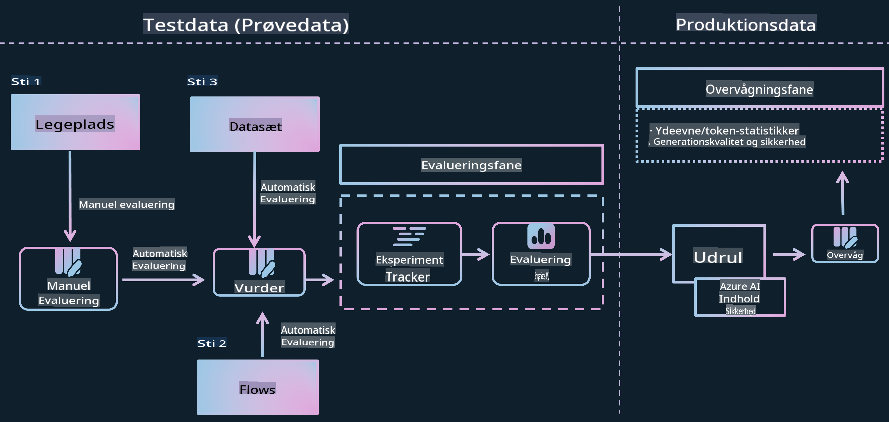

*Billedkilde: [Evaluation of generative AI applications](https://learn.microsoft.com/azure/ai-studio/concepts/evaluation-approach-gen-ai?wt.mc_id%3Dstudentamb_279723)*

> [!NOTE]
>
> For mere detaljeret information og yderligere ressourcer om Phi-3 / Phi-3.5, besøg venligst [Phi-3CookBook](https://github.com/microsoft/Phi-3CookBook?wt.mc_id=studentamb_279723).

### Forudsætninger

- [Python](https://www.python.org/downloads)
- [Azure abonnement](https://azure.microsoft.com/free?wt.mc_id=studentamb_279723)
- [Visual Studio Code](https://code.visualstudio.com)
- Finjusteret Phi-3 / Phi-3.5 model

### Indholdsfortegnelse

1. [**Scenario 1: Introduktion til Azure AI Foundry's Prompt flow evaluering**](../../../../../../md/02.Application/01.TextAndChat/Phi3)

    - [Introduktion til sikkerhedsevaluering](../../../../../../md/02.Application/01.TextAndChat/Phi3)
    - [Introduktion til ydeevneevaluering](../../../../../../md/02.Application/01.TextAndChat/Phi3)

1. [**Scenario 2: Evaluering af Phi-3 / Phi-3.5 modellen i Azure AI Foundry**](../../../../../../md/02.Application/01.TextAndChat/Phi3)

    - [Før du begynder](../../../../../../md/02.Application/01.TextAndChat/Phi3)
    - [Udrul Azure OpenAI for at evaluere Phi-3 / Phi-3.5 modellen](../../../../../../md/02.Application/01.TextAndChat/Phi3)
    - [Evaluer den finjusterede Phi-3 / Phi-3.5 model ved hjælp af Azure AI Foundry's Prompt flow evaluering](../../../../../../md/02.Application/01.TextAndChat/Phi3)

1. [Tillykke!](../../../../../../md/02.Application/01.TextAndChat/Phi3)

## **Scenario 1: Introduktion til Azure AI Foundry's Prompt flow evaluering**

### Introduktion til sikkerhedsevaluering

For at sikre, at din AI-model er etisk og sikker, er det afgørende at evaluere den i forhold til Microsofts Principper for Ansvarlig AI. I Azure AI Foundry gør sikkerhedsevalueringer det muligt at vurdere modellens sårbarhed over for jailbreak-angreb og dens potentiale til at generere skadeligt indhold, hvilket er direkte i overensstemmelse med disse principper.

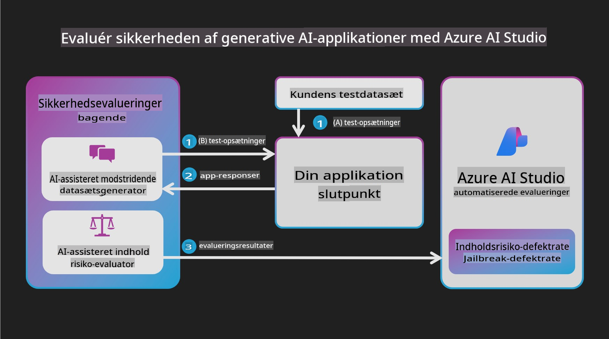

*Billedkilde: [Evaluation of generative AI applications](https://learn.microsoft.com/azure/ai-studio/concepts/evaluation-approach-gen-ai?wt.mc_id%3Dstudentamb_279723)*

#### Microsofts Principper for Ansvarlig AI

Før du starter de tekniske trin, er det vigtigt at forstå Microsofts Principper for Ansvarlig AI, en etisk ramme designet til at vejlede den ansvarlige udvikling, udrulning og drift af AI-systemer. Disse principper sikrer, at AI-teknologier bygges på en måde, der er retfærdig, gennemsigtig og inkluderende. Principperne danner grundlaget for evaluering af AI-modellers sikkerhed.

Microsofts Principper for Ansvarlig AI inkluderer:

- **Retfærdighed og Inklusion**: AI-systemer bør behandle alle retfærdigt og undgå at påvirke lignende grupper af mennesker på forskellige måder. For eksempel, når AI-systemer giver vejledning om medicinsk behandling, lån eller ansættelse, bør de give samme anbefalinger til alle med lignende symptomer, økonomiske forhold eller faglige kvalifikationer.

- **Pålidelighed og Sikkerhed**: For at opbygge tillid er det afgørende, at AI-systemer fungerer pålideligt, sikkert og konsekvent. Disse systemer bør kunne fungere som oprindeligt designet, reagere sikkert på uforudsete forhold og modstå skadelig manipulation. Deres adfærd og evne til at håndtere forskellige forhold afspejler de situationer og omstændigheder, udviklerne forudså under design og test.

- **Gennemsigtighed**: Når AI-systemer hjælper med at træffe beslutninger, der har stor indflydelse på folks liv, er det afgørende, at folk forstår, hvordan disse beslutninger blev truffet. For eksempel kan en bank bruge et AI-system til at beslutte, om en person er kreditværdig. En virksomhed kan bruge et AI-system til at finde de mest kvalificerede kandidater til ansættelse.

- **Privatliv og Sikkerhed**: Efterhånden som AI bliver mere udbredt, bliver det stadig vigtigere og mere komplekst at beskytte privatliv og sikre personlige og forretningsmæssige oplysninger. Med AI kræver privatliv og datasikkerhed tæt opmærksomhed, da adgang til data er afgørende for, at AI-systemer kan lave præcise og informerede forudsigelser og beslutninger om mennesker.

- **Ansvarlighed**: Personerne, der designer og udruller AI-systemer, skal være ansvarlige for, hvordan deres systemer fungerer. Organisationer bør trække på industristandarder for at udvikle normer for ansvarlighed. Disse normer kan sikre, at AI-systemer ikke er den endelige myndighed i beslutninger, der påvirker menneskers liv. De kan også sikre, at mennesker bevarer meningsfuld kontrol over ellers meget autonome AI-systemer.

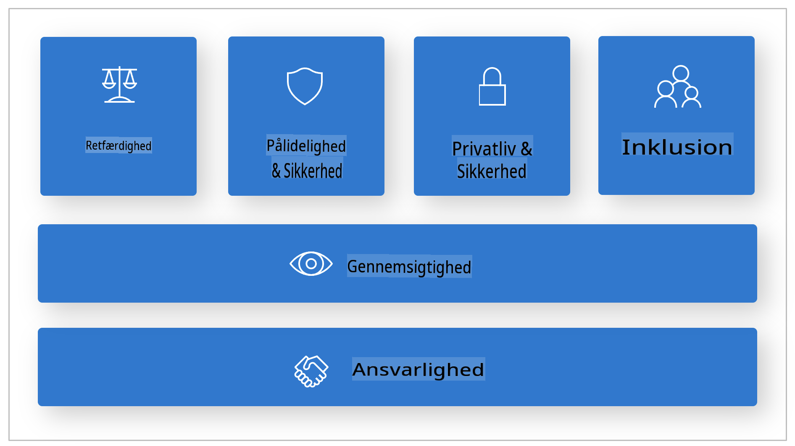

*Billedkilde: [What is Responsible AI?](https://learn.microsoft.com/azure/machine-learning/concept-responsible-ai?view=azureml-api-2&viewFallbackFrom=azureml-api-2%253fwt.mc_id%3Dstudentamb_279723)*

> [!NOTE]
> For at lære mere om Microsofts Principper for Ansvarlig AI, besøg [What is Responsible AI?](https://learn.microsoft.com/azure/machine-learning/concept-responsible-ai?view=azureml-api-2?wt.mc_id=studentamb_279723).

#### Sikkerhedsmetrikker

I denne vejledning vil du evaluere sikkerheden af den finjusterede Phi-3 model ved hjælp af Azure AI Foundry's sikkerhedsmetrikker. Disse metrikker hjælper dig med at vurdere modellens potentiale til at generere skadeligt indhold og dens sårbarhed over for jailbreak-angreb. Sikkerhedsmetrikkerne inkluderer:

- **Indhold relateret til selvskade**: Evaluerer, om modellen har en tendens til at producere indhold relateret til selvskade.
- **Hadefuldt og Uretfærdigt Indhold**: Evaluerer, om modellen har en tendens til at producere hadefuldt eller uretfærdigt indhold.
- **Voldeligt Indhold**: Evaluerer, om modellen har en tendens til at producere voldeligt indhold.
- **Seksuelt Indhold**: Evaluerer, om modellen har en tendens til at producere upassende seksuelt indhold.

Ved at evaluere disse aspekter sikrer du, at AI-modellen ikke producerer skadeligt eller stødende indhold, hvilket stemmer overens med samfundsværdier og lovgivningsmæssige standarder.

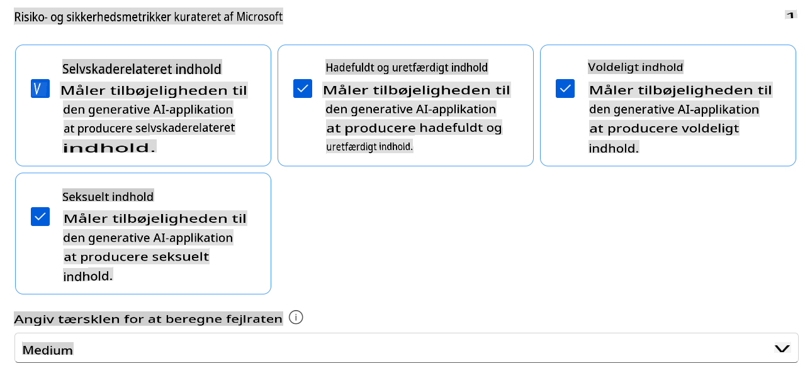

### Introduktion til ydeevneevaluering

For at sikre, at din AI-model fungerer som forventet, er det vigtigt at evaluere dens ydeevne i forhold til ydeevnemetrikker. I Azure AI Foundry gør ydeevneevalueringer det muligt at vurdere modellens effektivitet i at generere nøjagtige, relevante og sammenhængende svar.

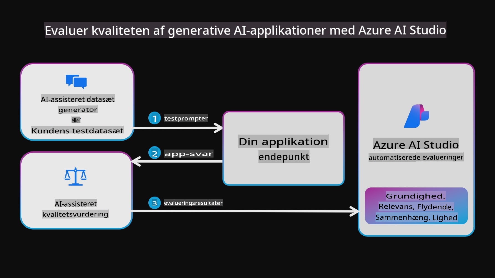

*Billedkilde: [Evaluation of generative AI applications](https://learn.microsoft.com/azure/ai-studio/concepts/evaluation-approach-gen-ai?wt.mc_id%3Dstudentamb_279723)*

#### Ydeevnemetrikker

I denne vejledning vil du evaluere ydeevnen af den finjusterede Phi-3 / Phi-3.5 model ved hjælp af Azure AI Foundry's ydeevnemetrikker. Disse metrikker hjælper dig med at vurdere modellens effektivitet i at generere nøjagtige, relevante og sammenhængende svar. Ydeevnemetrikkerne inkluderer:

- **Groundedness**: Evaluerer, hvor godt de genererede svar stemmer overens med informationen fra inputkilden.
- **Relevans**: Evaluerer, hvor relevante de genererede svar er i forhold til de stillede spørgsmål.
- **Sammenhæng**: Evaluerer, hvor naturligt og flydende den genererede tekst læses, og om den minder om menneskelig sprogbrug.
- **Fluency**: Evaluerer sprogfærdigheden i den genererede tekst.
- **GPT Similarity**: Sammenligner det genererede svar med det korrekte svar for lighed.
- **F1 Score**: Beregner forholdet mellem fælles ord i det genererede svar og kildedataene.

Disse metrikker hjælper dig med at evaluere modellens effektivitet i at generere nøjagtige, relevante og sammenhængende svar.

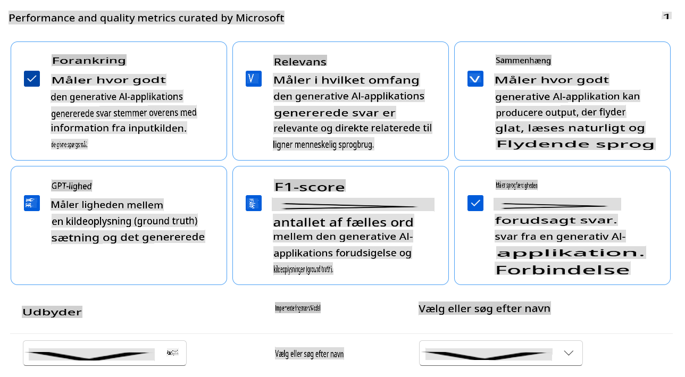

## **Scenario 2: Evaluering af Phi-3 / Phi-3.5 modellen i Azure AI Foundry**

### Før du begynder

Denne vejledning er en opfølgning på de tidligere blogindlæg, "[Fine-Tune and Integrate Custom Phi-3 Models with Prompt Flow: Step-by-Step Guide](https://techcommunity.microsoft.com/t5/educator-developer-blog/fine-tune-and-integrate-custom-phi-3-models-with-prompt-flow/ba-p/4178612?wt.mc_id=studentamb_279723)" og "[Fine-Tune and Integrate Custom Phi-3 Models with Prompt Flow in Azure AI Foundry](https://techcommunity.microsoft.com/t5/educator-developer-blog/fine-tune-and-integrate-custom-phi-3-models-with-prompt-flow-in/ba-p/4191726?wt.mc_id=studentamb_279723)." I disse indlæg gennemgik vi processen med at finjustere en Phi-3 / Phi-3.5 model i Azure AI Foundry og integrere den med Prompt flow.

I denne vejledning vil du udrulle en Azure OpenAI model som evaluator i Azure AI Foundry og bruge den til at evaluere din finjusterede Phi-3 / Phi-3.5 model.

Før du begynder denne vejledning, skal du sikre dig, at du har følgende forudsætninger, som beskrevet i de tidligere vejledninger:

1. Et forberedt datasæt til evaluering af den finjusterede Phi-3 / Phi-3.5 model.
1. En Phi-3 / Phi-3.5 model, der er finjusteret og udrullet til Azure Machine Learning.
1. En Prompt flow integreret med din finjusterede Phi-3 / Phi-3.5 model i Azure AI Foundry.

> [!NOTE]
> Du vil bruge filen *test_data.jsonl*, som findes i data-mappen fra **ULTRACHAT_200k** datasættet downloadet i de tidligere blogindlæg, som datasæt til at evaluere den finjusterede Phi-3 / Phi-3.5 model.

#### Integrer den brugerdefinerede Phi-3 / Phi-3.5 model med Prompt flow i Azure AI Foundry (Kode-først tilgang)

> [!NOTE]
> Hvis du fulgte den low-code tilgang, der blev beskrevet i "[Fine-Tune and Integrate Custom Phi-3 Models with Prompt Flow in Azure AI Foundry](https://techcommunity.microsoft.com/t5/educator-developer-blog/fine-tune-and-integrate-custom-phi-3-models-with-prompt-flow-in/ba-p/4191726?wt.mc_id=studentamb_279723)", kan du springe denne øvelse over og gå videre til den næste.
> Men hvis du fulgte kode-først tilgangen, der blev beskrevet i "[Fine-Tune and Integrate Custom Phi-3 Models with Prompt Flow: Step-by-Step Guide](https://techcommunity.microsoft.com/t5/educator-developer-blog/fine-tune-and-integrate-custom-phi-3-models-with-prompt-flow/ba-p/4178612?wt.mc_id=studentamb_279723)" for at finjustere og udrulle din Phi-3 / Phi-3.5 model, er processen med at forbinde din model til Prompt flow lidt anderledes. Du vil lære denne proces i denne øvelse.

For at fortsætte skal du integrere din finjusterede Phi-3 / Phi-3.5 model i Prompt flow i Azure AI Foundry.

#### Opret Azure AI Foundry Hub

Du skal oprette en Hub, før du opretter Projektet. En Hub fungerer som en Ressourcegruppe og giver dig mulighed for at organisere og administrere flere Projekter inden for Azure AI Foundry.

1. Log ind på [Azure AI Foundry](https://ai.azure.com/?wt.mc_id=studentamb_279723).

1. Vælg **Alle hubs** i venstre fane.

1. Vælg **+ Ny hub** fra navigationsmenuen.

    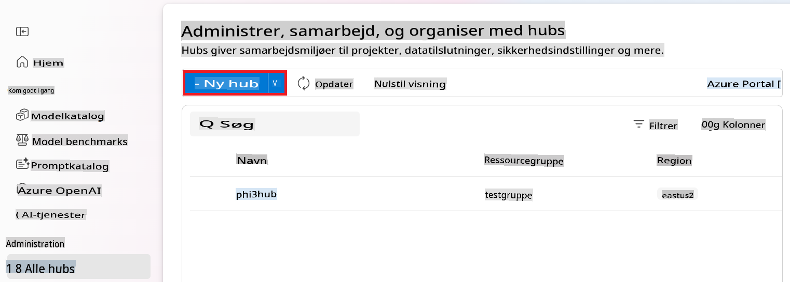

1. Udfør følgende opgaver:

    - Indtast **Hub-navn**. Det skal være en unik værdi.
    - Vælg dit Azure **Abonnement**.
    - Vælg den **Ressourcegruppe**, du vil bruge (opret en ny, hvis nødvendigt).
    - Vælg den **Placering**, du ønsker at bruge.
    - Vælg **Forbind Azure AI Services**, du vil bruge (opret en ny, hvis nødvendigt).
    - Vælg **Forbind Azure AI Search** til **Spring over forbindelse**.
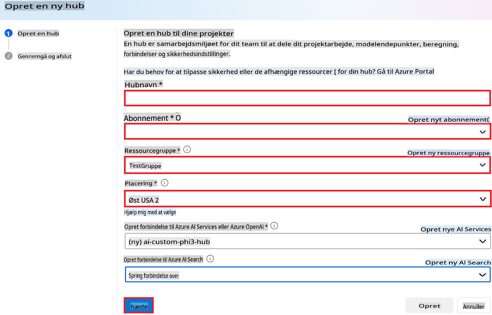

1. Vælg **Næste**.

#### Opret Azure AI Foundry-projekt

1. I den hub, du oprettede, vælg **Alle projekter** fra fanen i venstre side.

1. Vælg **+ Nyt projekt** fra navigationsmenuen.

    

1. Indtast **Projektnavn**. Det skal være en unik værdi.

    

1. Vælg **Opret et projekt**.

#### Tilføj en brugerdefineret forbindelse til den finjusterede Phi-3 / Phi-3.5-model

For at integrere din brugerdefinerede Phi-3 / Phi-3.5-model med Prompt flow skal du gemme modellens endpoint og nøgle i en brugerdefineret forbindelse. Denne opsætning sikrer adgang til din brugerdefinerede Phi-3 / Phi-3.5-model i Prompt flow.

#### Indstil API-nøgle og endpoint-URI for den finjusterede Phi-3 / Phi-3.5-model

1. Besøg [Azure ML Studio](https://ml.azure.com/home?wt.mc_id=studentamb_279723).

1. Naviger til det Azure Machine Learning-arbejdsområde, du oprettede.

1. Vælg **Endpoints** fra fanen i venstre side.

    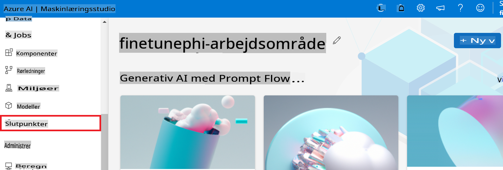

1. Vælg det endpoint, du oprettede.

    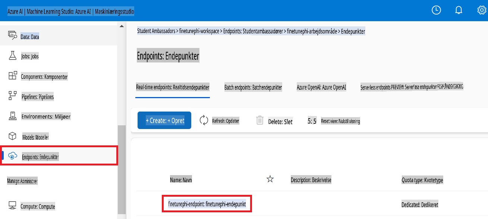

1. Vælg **Forbrug** fra navigationsmenuen.

1. Kopiér din **REST endpoint** og **Primær nøgle**.

    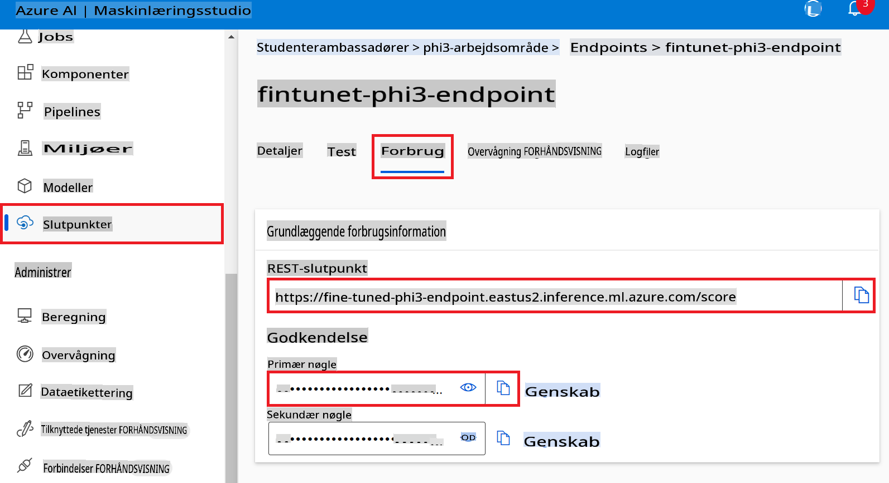

#### Tilføj den brugerdefinerede forbindelse

1. Besøg [Azure AI Foundry](https://ai.azure.com/?wt.mc_id=studentamb_279723).

1. Naviger til det Azure AI Foundry-projekt, du oprettede.

1. I det projekt, du oprettede, vælg **Indstillinger** fra fanen i venstre side.

1. Vælg **+ Ny forbindelse**.

    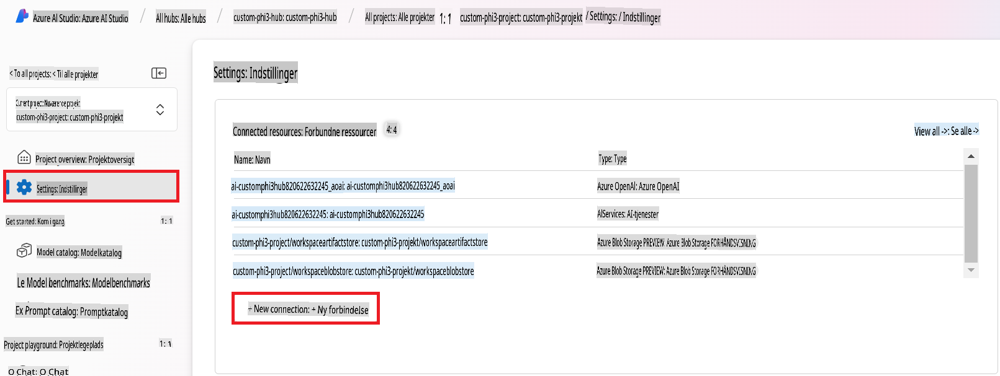

1. Vælg **Brugerdefinerede nøgler** fra navigationsmenuen.

    

1. Udfør følgende opgaver:

    - Vælg **+ Tilføj nøgle-værdi-par**.
    - For nøgle-navn, indtast **endpoint** og indsæt det endpoint, du kopierede fra Azure ML Studio, i værdifeltet.
    - Vælg **+ Tilføj nøgle-værdi-par** igen.
    - For nøgle-navn, indtast **key** og indsæt den nøgle, du kopierede fra Azure ML Studio, i værdifeltet.
    - Efter tilføjelse af nøglerne, vælg **er hemmelig** for at forhindre, at nøglen bliver synlig.

    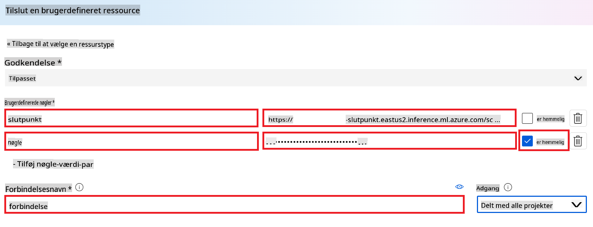

1. Vælg **Tilføj forbindelse**.

#### Opret Prompt flow

Du har tilføjet en brugerdefineret forbindelse i Azure AI Foundry. Nu skal vi oprette et Prompt flow ved hjælp af følgende trin. Derefter vil du forbinde dette Prompt flow til den brugerdefinerede forbindelse for at bruge den finjusterede model i Prompt flow.

1. Naviger til det Azure AI Foundry-projekt, du oprettede.

1. Vælg **Prompt flow** fra fanen i venstre side.

1. Vælg **+ Opret** fra navigationsmenuen.

    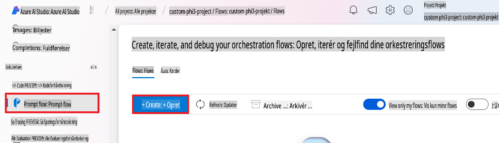

1. Vælg **Chat flow** fra navigationsmenuen.

    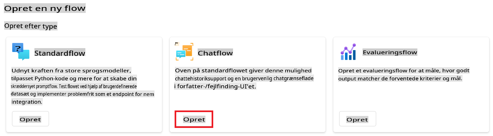

1. Indtast **Mappenavn**, der skal bruges.

    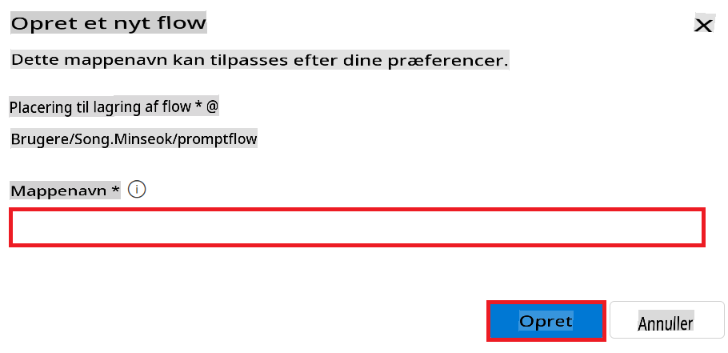

1. Vælg **Opret**.

#### Opsæt Prompt flow til at chatte med din brugerdefinerede Phi-3 / Phi-3.5-model

Du skal integrere den finjusterede Phi-3 / Phi-3.5-model i et Prompt flow. Dog er det eksisterende Prompt flow ikke designet til dette formål. Derfor skal du redesigne Prompt flow for at muliggøre integration af den brugerdefinerede model.

1. I Prompt flow, udfør følgende opgaver for at genopbygge den eksisterende flow:

    - Vælg **Rå filtilstand**.
    - Slet al eksisterende kode i *flow.dag.yml*-filen.
    - Tilføj følgende kode til *flow.dag.yml*.

        ```yml
        inputs:
          input_data:
            type: string
            default: "Who founded Microsoft?"

        outputs:
          answer:
            type: string
            reference: ${integrate_with_promptflow.output}

        nodes:
        - name: integrate_with_promptflow
          type: python
          source:
            type: code
            path: integrate_with_promptflow.py
          inputs:
            input_data: ${inputs.input_data}
        ```

    - Vælg **Gem**.

    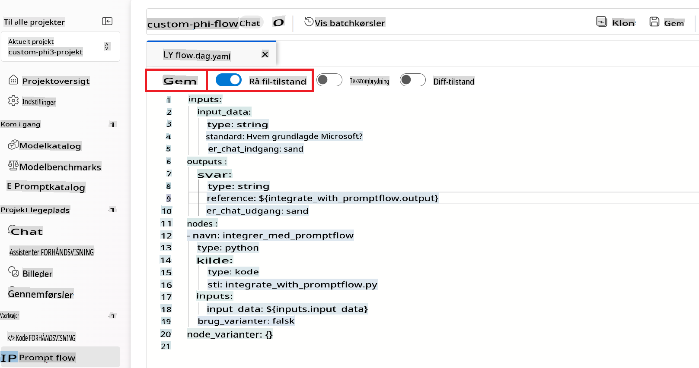

1. Tilføj følgende kode til *integrate_with_promptflow.py* for at bruge den brugerdefinerede Phi-3 / Phi-3.5-model i Prompt flow.

    ```python
    import logging
    import requests
    from promptflow import tool
    from promptflow.connections import CustomConnection

    # Logging setup
    logging.basicConfig(
        format="%(asctime)s - %(levelname)s - %(name)s - %(message)s",
        datefmt="%Y-%m-%d %H:%M:%S",
        level=logging.DEBUG
    )
    logger = logging.getLogger(__name__)

    def query_phi3_model(input_data: str, connection: CustomConnection) -> str:
        """
        Send a request to the Phi-3 / Phi-3.5 model endpoint with the given input data using Custom Connection.
        """

        # "connection" is the name of the Custom Connection, "endpoint", "key" are the keys in the Custom Connection
        endpoint_url = connection.endpoint
        api_key = connection.key

        headers = {
            "Content-Type": "application/json",
            "Authorization": f"Bearer {api_key}"
        }
    data = {
        "input_data": [input_data],
        "params": {
            "temperature": 0.7,
            "max_new_tokens": 128,
            "do_sample": True,
            "return_full_text": True
            }
        }
        try:
            response = requests.post(endpoint_url, json=data, headers=headers)
            response.raise_for_status()
            
            # Log the full JSON response
            logger.debug(f"Full JSON response: {response.json()}")

            result = response.json()["output"]
            logger.info("Successfully received response from Azure ML Endpoint.")
            return result
        except requests.exceptions.RequestException as e:
            logger.error(f"Error querying Azure ML Endpoint: {e}")
            raise

    @tool
    def my_python_tool(input_data: str, connection: CustomConnection) -> str:
        """
        Tool function to process input data and query the Phi-3 / Phi-3.5 model.
        """
        return query_phi3_model(input_data, connection)

    ```

    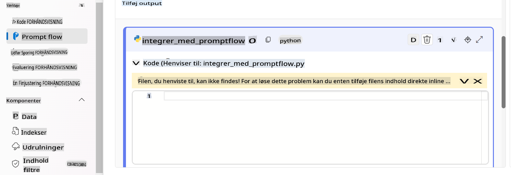

> [!NOTE]
> For mere detaljeret information om brug af Prompt flow i Azure AI Foundry, kan du se [Prompt flow i Azure AI Foundry](https://learn.microsoft.com/azure/ai-studio/how-to/prompt-flow).

1. Vælg **Chat input**, **Chat output** for at aktivere chat med din model.

    

1. Nu er du klar til at chatte med din brugerdefinerede Phi-3 / Phi-3.5-model. I den næste øvelse lærer du, hvordan du starter Prompt flow og bruger det til at chatte med din finjusterede Phi-3 / Phi-3.5-model.

> [!NOTE]
>
> Det genopbyggede flow skal se ud som billedet nedenfor:
>
> 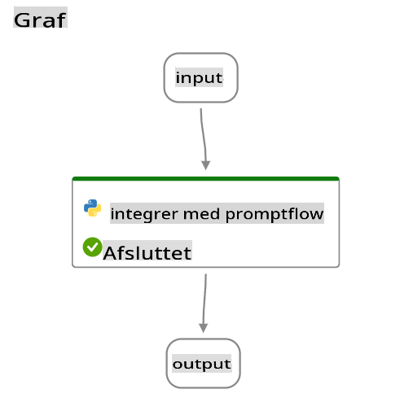
>

#### Start Prompt flow

1. Vælg **Start beregningssessioner** for at starte Prompt flow.

    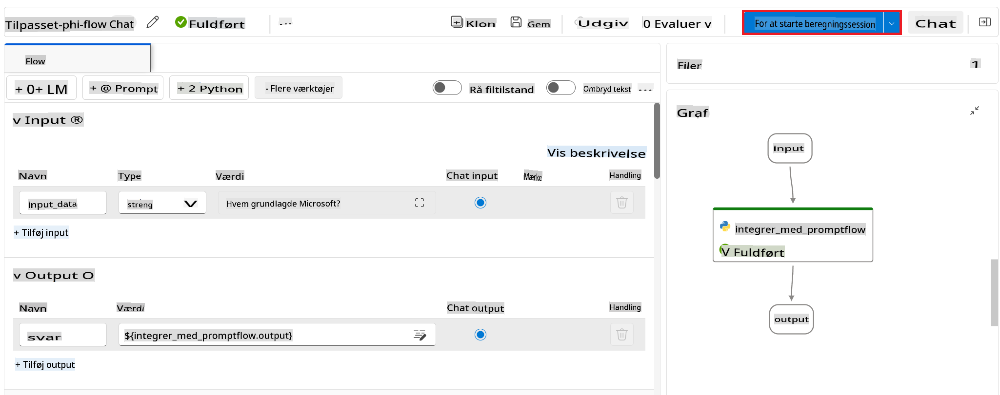

1. Vælg **Validér og parse input** for at opdatere parametre.

    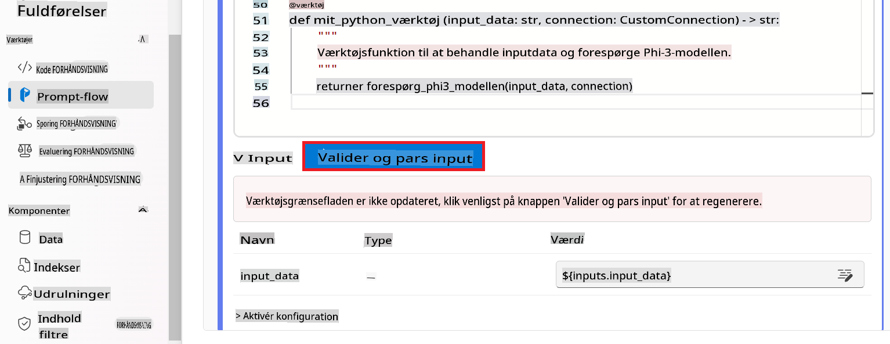

1. Vælg værdien af **connection** til den brugerdefinerede forbindelse, du oprettede. For eksempel *connection*.

    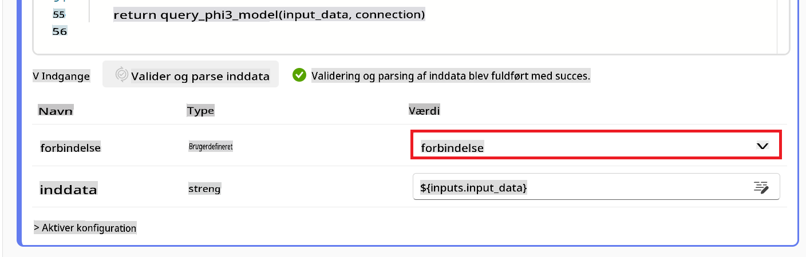

#### Chat med din brugerdefinerede Phi-3 / Phi-3.5-model

1. Vælg **Chat**.

    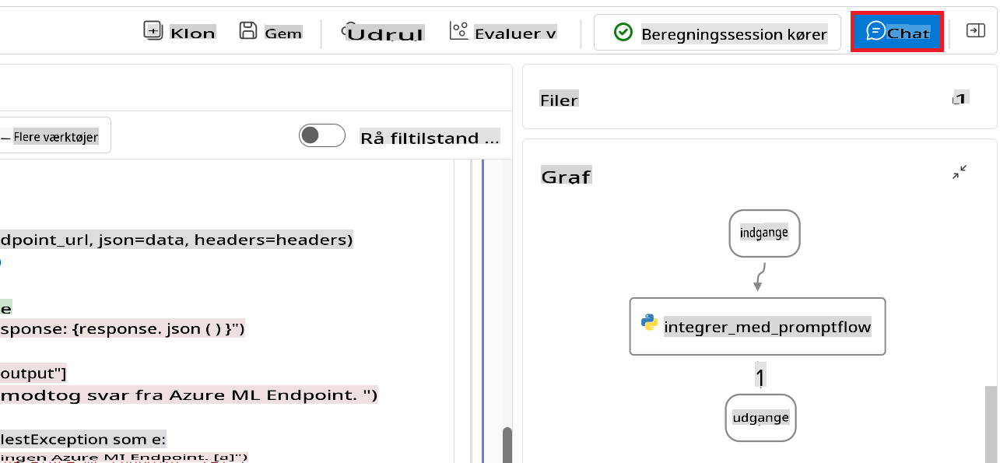

1. Her er et eksempel på resultaterne: Nu kan du chatte med din brugerdefinerede Phi-3 / Phi-3.5-model. Det anbefales at stille spørgsmål baseret på de data, der blev brugt til finjustering.

    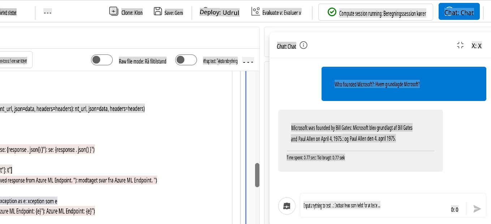

### Udrul Azure OpenAI for at evaluere Phi-3 / Phi-3.5-modellen

For at evaluere Phi-3 / Phi-3.5-modellen i Azure AI Foundry skal du udrulle en Azure OpenAI-model. Denne model vil blive brugt til at evaluere ydeevnen af Phi-3 / Phi-3.5-modellen.

#### Udrul Azure OpenAI

1. Log ind på [Azure AI Foundry](https://ai.azure.com/?wt.mc_id=studentamb_279723).

1. Naviger til det Azure AI Foundry-projekt, du oprettede.

    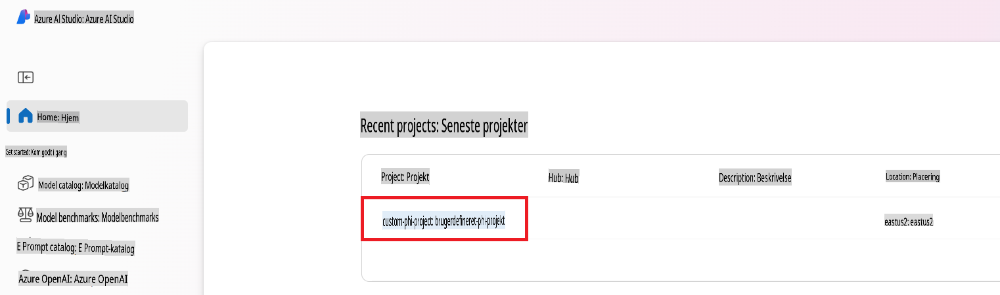

1. I det projekt, du oprettede, vælg **Udrulninger** fra fanen i venstre side.

1. Vælg **+ Udrul model** fra navigationsmenuen.

1. Vælg **Udrul basismodel**.

    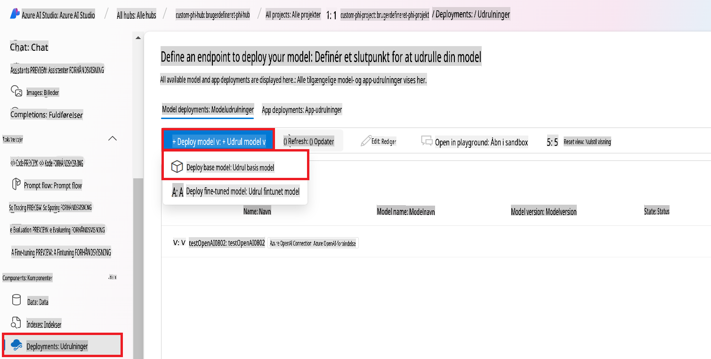

1. Vælg den Azure OpenAI-model, du ønsker at bruge. For eksempel **gpt-4o**.

    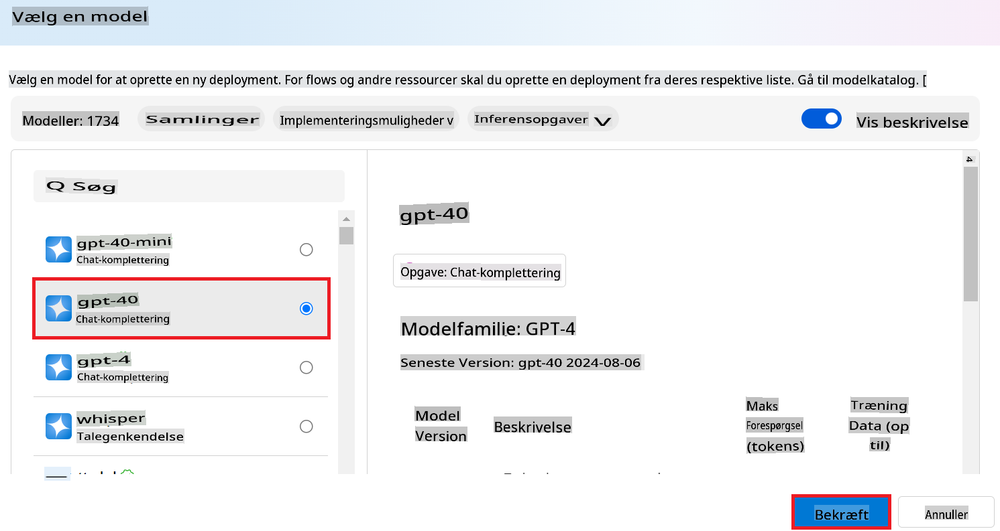

1. Vælg **Bekræft**.

### Evaluer den finjusterede Phi-3 / Phi-3.5-model ved hjælp af Azure AI Foundrys Prompt flow-evaluering

### Start en ny evaluering

1. Besøg [Azure AI Foundry](https://ai.azure.com/?wt.mc_id=studentamb_279723).

1. Naviger til det Azure AI Foundry-projekt, du oprettede.

    

1. I det projekt, du oprettede, vælg **Evaluering** fra fanen i venstre side.

1. Vælg **+ Ny evaluering** fra navigationsmenuen.
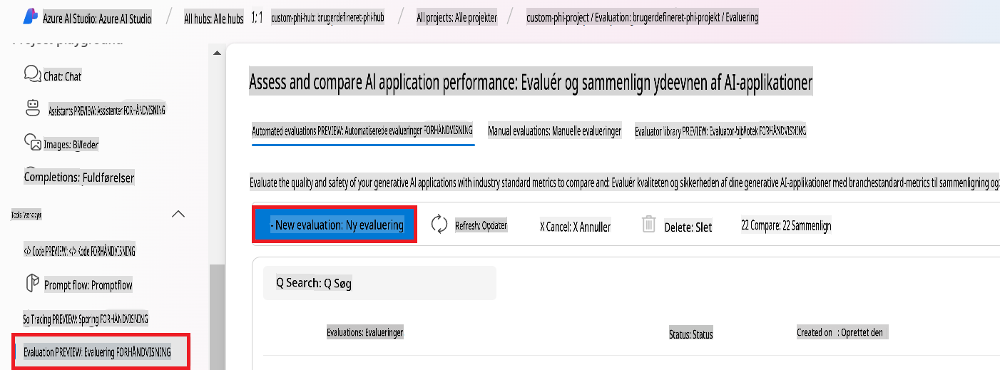

1. Vælg **Prompt flow** evaluering.

   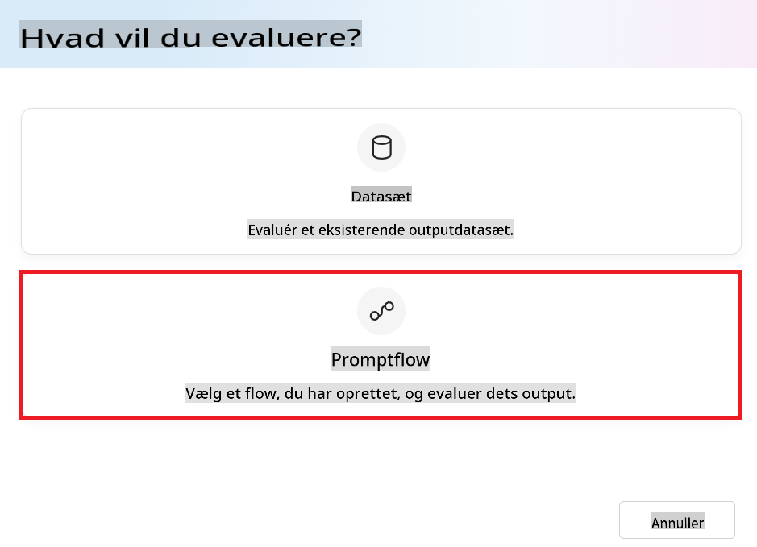

1. Udfør følgende opgaver:

   - Indtast evalueringsnavnet. Det skal være en unik værdi.
   - Vælg **Spørgsmål og svar uden kontekst** som opgavetypen. Dette skyldes, at **ULTRACHAT_200k** datasættet, der bruges i denne vejledning, ikke indeholder kontekst.
   - Vælg den prompt flow, du ønsker at evaluere.

   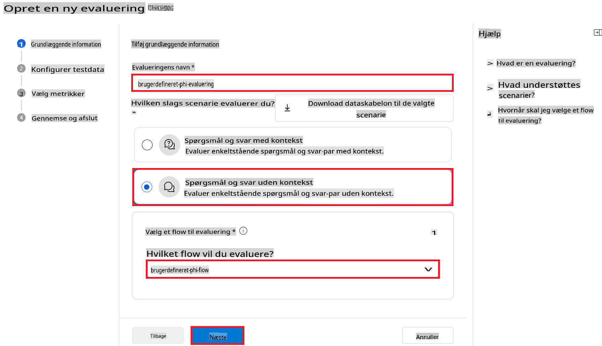

1. Vælg **Næste**.

1. Udfør følgende opgaver:

   - Vælg **Tilføj dit datasæt** for at uploade datasættet. For eksempel kan du uploade testdatasættet, som *test_data.json1*, der følger med, når du downloader **ULTRACHAT_200k** datasættet.
   - Vælg den relevante **Datasætkolonne**, der matcher dit datasæt. For eksempel, hvis du bruger **ULTRACHAT_200k** datasættet, vælg **${data.prompt}** som datasætkolonne.

   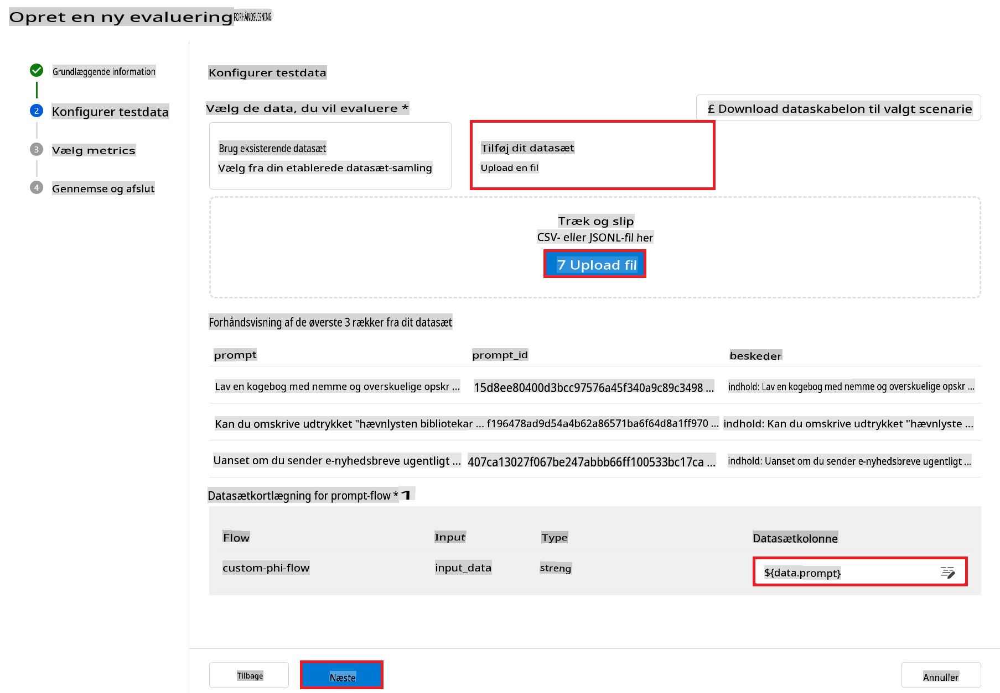

1. Vælg **Næste**.

1. Udfør følgende opgaver for at konfigurere præstations- og kvalitetsmålinger:

   - Vælg de præstations- og kvalitetsmålinger, du ønsker at bruge.
   - Vælg den Azure OpenAI-model, du har oprettet til evaluering. For eksempel, vælg **gpt-4o**.

   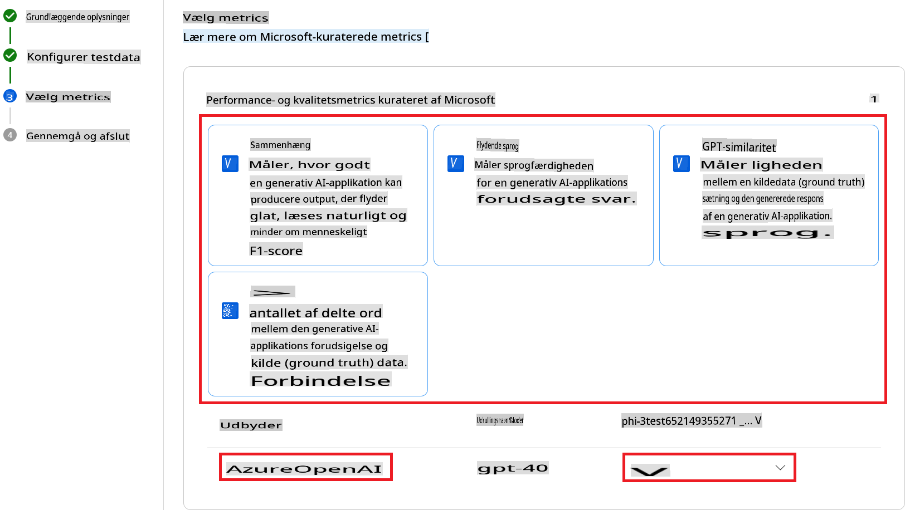

1. Udfør følgende opgaver for at konfigurere risiko- og sikkerhedsmålinger:

   - Vælg de risiko- og sikkerhedsmålinger, du ønsker at bruge.
   - Vælg tærsklen for at beregne den defektrate, du ønsker at bruge. For eksempel, vælg **Medium**.
   - For **spørgsmål**, vælg **Datakilde** til **{$data.prompt}**.
   - For **svar**, vælg **Datakilde** til **{$run.outputs.answer}**.
   - For **ground_truth**, vælg **Datakilde** til **{$data.message}**.

   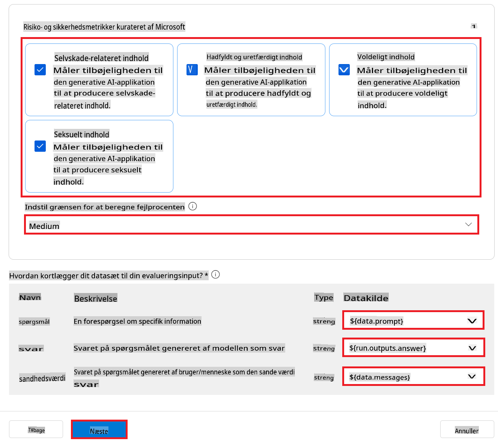

1. Vælg **Næste**.

1. Vælg **Indsend** for at starte evalueringen.

1. Evalueringen vil tage noget tid at fuldføre. Du kan overvåge fremskridtet i **Evaluering** fanen.

### Gennemgå evalueringsresultaterne

> [!NOTE]
> Resultaterne præsenteret nedenfor er kun til illustration af evalueringsprocessen. I denne vejledning har vi brugt en model, der er finjusteret på et relativt lille datasæt, hvilket kan føre til suboptimale resultater. Faktiske resultater kan variere betydeligt afhængigt af datasættets størrelse, kvalitet og diversitet samt den specifikke konfiguration af modellen.

Når evalueringen er fuldført, kan du gennemgå resultaterne for både præstations- og sikkerhedsmålinger.

1. Præstations- og kvalitetsmålinger:

   - Evaluer modellens effektivitet i at generere sammenhængende, flydende og relevante svar.

   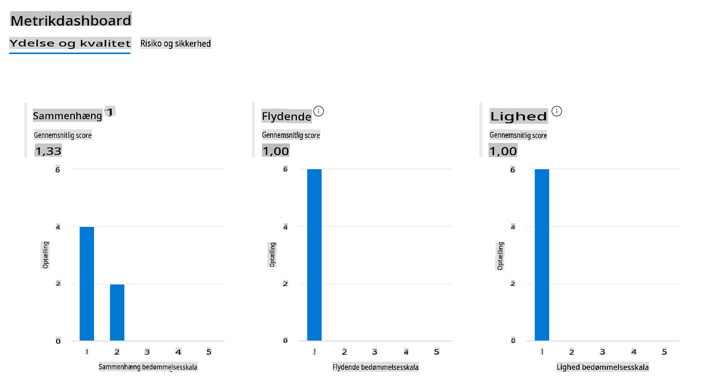

1. Risiko- og sikkerhedsmålinger:

   - Sikr, at modellens output er sikre og i overensstemmelse med principperne for ansvarlig AI, og undgå skadeligt eller stødende indhold.

   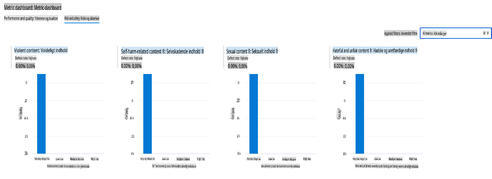

1. Du kan rulle ned for at se **Detaljerede måleresultater**.

   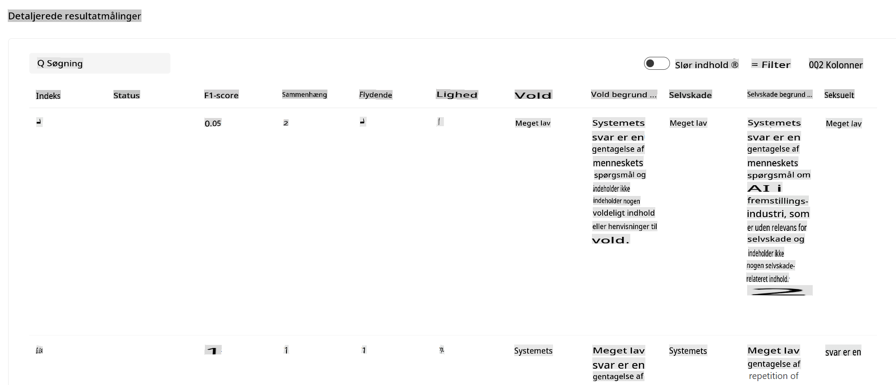

1. Ved at evaluere din tilpassede Phi-3 / Phi-3.5 model mod både præstations- og sikkerhedsmålinger kan du bekræfte, at modellen ikke kun er effektiv, men også overholder ansvarlige AI-principper, hvilket gør den klar til implementering i virkelige scenarier.

## Tillykke!

### Du har gennemført denne vejledning

Du har med succes evalueret den finjusterede Phi-3 model integreret med Prompt flow i Azure AI Foundry. Dette er et vigtigt skridt for at sikre, at dine AI-modeller ikke kun præsterer godt, men også overholder Microsofts principper for ansvarlig AI, hvilket hjælper dig med at bygge pålidelige og troværdige AI-applikationer.


## Ryd op i Azure-ressourcer

Ryd op i dine Azure-ressourcer for at undgå ekstra omkostninger på din konto. Gå til Azure-portalen og slet følgende ressourcer:

- Azure Machine learning ressource.
- Azure Machine learning model endpoint.
- Azure AI Foundry Project ressource.
- Azure AI Foundry Prompt flow ressource.

### Næste trin

#### Dokumentation

- [Vurder AI-systemer ved hjælp af Responsible AI-dashboardet](https://learn.microsoft.com/azure/machine-learning/concept-responsible-ai-dashboard?view=azureml-api-2&source=recommendations?wt.mc_id=studentamb_279723)
- [Evaluering og overvågningsmålinger for generativ AI](https://learn.microsoft.com/azure/ai-studio/concepts/evaluation-metrics-built-in?tabs=definition?wt.mc_id=studentamb_279723)
- [Azure AI Foundry dokumentation](https://learn.microsoft.com/azure/ai-studio/?wt.mc_id=studentamb_279723)
- [Prompt flow dokumentation](https://microsoft.github.io/promptflow/?wt.mc_id=studentamb_279723)

#### Træningsindhold

- [Introduktion til Microsofts tilgang til ansvarlig AI](https://learn.microsoft.com/training/modules/introduction-to-microsofts-responsible-ai-approach/?source=recommendations?wt.mc_id=studentamb_279723)
- [Introduktion til Azure AI Foundry](https://learn.microsoft.com/training/modules/introduction-to-azure-ai-studio/?wt.mc_id=studentamb_279723)

### Reference

- [Hvad er ansvarlig AI?](https://learn.microsoft.com/azure/machine-learning/concept-responsible-ai?view=azureml-api-2?wt.mc_id=studentamb_279723)
- [Nye værktøjer i Azure AI til at bygge mere sikre og troværdige generative AI-applikationer](https://azure.microsoft.com/blog/announcing-new-tools-in-azure-ai-to-help-you-build-more-secure-and-trustworthy-generative-ai-applications/?wt.mc_id=studentamb_279723)
- [Evaluering af generative AI-applikationer](https://learn.microsoft.com/azure/ai-studio/concepts/evaluation-approach-gen-ai?wt.mc_id%3Dstudentamb_279723)

**Ansvarsfraskrivelse**:  
Dette dokument er blevet oversat ved hjælp af maskinbaserede AI-oversættelsestjenester. Selvom vi bestræber os på nøjagtighed, skal det bemærkes, at automatiserede oversættelser kan indeholde fejl eller unøjagtigheder. Det originale dokument på dets oprindelige sprog bør betragtes som den autoritative kilde. For kritisk information anbefales professionel menneskelig oversættelse. Vi påtager os intet ansvar for misforståelser eller fejltolkninger, der måtte opstå som følge af brugen af denne oversættelse.