# Finjustér og integrer brugerdefinerede Phi-3-modeller med Prompt flow

Dette end-to-end (E2E) eksempel er baseret på guiden "[Finjustér og integrer brugerdefinerede Phi-3-modeller med Prompt Flow: Trin-for-Trin Guide](https://techcommunity.microsoft.com/t5/educator-developer-blog/fine-tune-and-integrate-custom-phi-3-models-with-prompt-flow/ba-p/4178612?WT.mc_id=aiml-137032-kinfeylo)" fra Microsoft Tech Community. Det introducerer processerne til finjustering, implementering og integration af brugerdefinerede Phi-3-modeller med Prompt flow.

## Oversigt

I dette E2E-eksempel vil du lære, hvordan du finjusterer Phi-3-modellen og integrerer den med Prompt flow. Ved at udnytte Azure Machine Learning og Prompt flow vil du etablere en arbejdsgang til implementering og brug af brugerdefinerede AI-modeller. Dette E2E-eksempel er opdelt i tre scenarier:

**Scenario 1: Opsæt Azure-ressourcer og forbered til finjustering**

**Scenario 2: Finjustér Phi-3-modellen og implementér i Azure Machine Learning Studio**

**Scenario 3: Integrér med Prompt flow og chat med din brugerdefinerede model**

Her er en oversigt over dette E2E-eksempel.

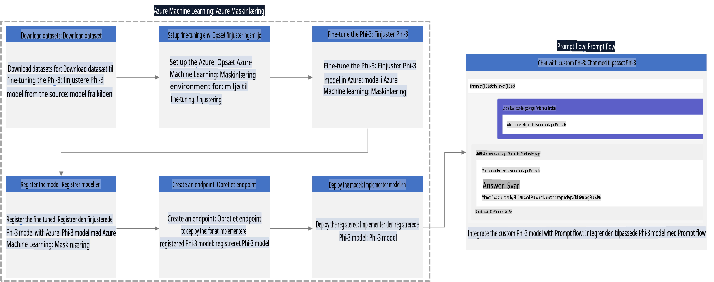

### Indholdsfortegnelse

1. **[Scenario 1: Opsæt Azure-ressourcer og forbered til finjustering](../../../../../../md/02.Application/01.TextAndChat/Phi3)**
    - [Opret et Azure Machine Learning Workspace](../../../../../../md/02.Application/01.TextAndChat/Phi3)
    - [Anmod om GPU-kvoter i Azure-abonnement](../../../../../../md/02.Application/01.TextAndChat/Phi3)
    - [Tilføj rolleopgaver](../../../../../../md/02.Application/01.TextAndChat/Phi3)
    - [Opsæt projekt](../../../../../../md/02.Application/01.TextAndChat/Phi3)
    - [Forbered datasæt til finjustering](../../../../../../md/02.Application/01.TextAndChat/Phi3)

1. **[Scenario 2: Finjustér Phi-3-modellen og implementér i Azure Machine Learning Studio](../../../../../../md/02.Application/01.TextAndChat/Phi3)**
    - [Opsæt Azure CLI](../../../../../../md/02.Application/01.TextAndChat/Phi3)
    - [Finjustér Phi-3-modellen](../../../../../../md/02.Application/01.TextAndChat/Phi3)
    - [Implementér den finjusterede model](../../../../../../md/02.Application/01.TextAndChat/Phi3)

1. **[Scenario 3: Integrér med Prompt flow og chat med din brugerdefinerede model](../../../../../../md/02.Application/01.TextAndChat/Phi3)**
    - [Integrér den brugerdefinerede Phi-3-model med Prompt flow](../../../../../../md/02.Application/01.TextAndChat/Phi3)
    - [Chat med din brugerdefinerede model](../../../../../../md/02.Application/01.TextAndChat/Phi3)

## Scenario 1: Opsæt Azure-ressourcer og forbered til finjustering

### Opret et Azure Machine Learning Workspace

1. Skriv *azure machine learning* i **søgefeltet** øverst på portalens side, og vælg **Azure Machine Learning** fra de viste muligheder.

    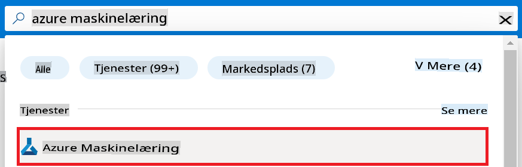

1. Vælg **+ Opret** fra navigationsmenuen.

1. Vælg **Nyt workspace** fra navigationsmenuen.

    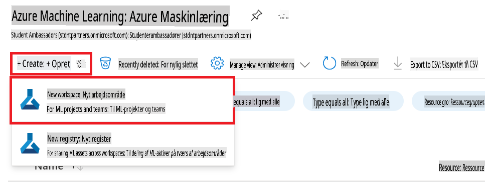

1. Udfør følgende opgaver:

    - Vælg dit Azure **Abonnement**.
    - Vælg den **Ressourcegruppe**, du vil bruge (opret en ny, hvis nødvendigt).
    - Indtast **Workspace-navn**. Det skal være en unik værdi.
    - Vælg den **Region**, du vil bruge.
    - Vælg den **Lagerkonto**, du vil bruge (opret en ny, hvis nødvendigt).
    - Vælg den **Key Vault**, du vil bruge (opret en ny, hvis nødvendigt).
    - Vælg den **Application Insights**, du vil bruge (opret en ny, hvis nødvendigt).
    - Vælg den **Container Registry**, du vil bruge (opret en ny, hvis nødvendigt).

    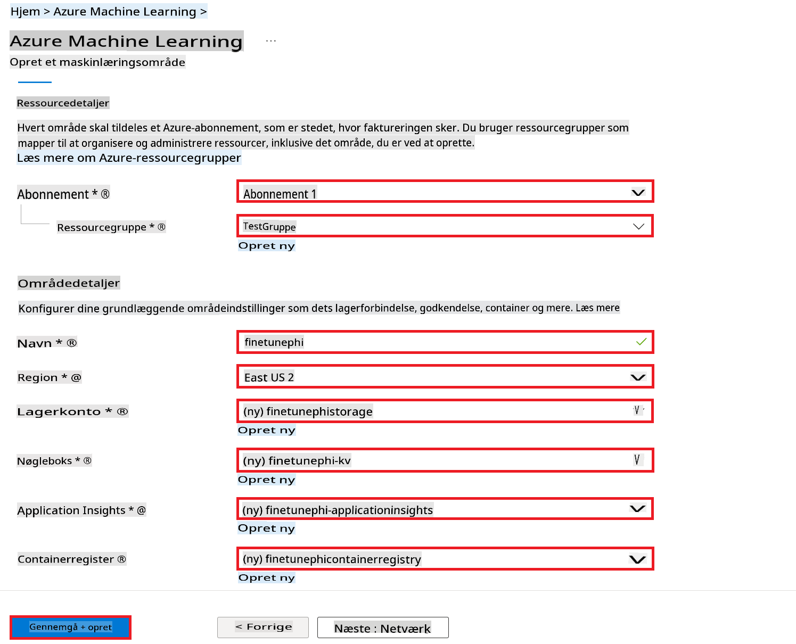

1. Vælg **Gennemse + Opret**.

1. Vælg **Opret**.

### Anmod om GPU-kvoter i Azure-abonnement

I dette E2E-eksempel vil du bruge *Standard_NC24ads_A100_v4 GPU* til finjustering, hvilket kræver en kvoteanmodning, og *Standard_E4s_v3* CPU til implementering, hvilket ikke kræver en kvoteanmodning.

> [!NOTE]
>
> Kun Pay-As-You-Go-abonnementer (standardabonnementstype) er berettiget til GPU-allokering; fordelingsabonnementer understøttes i øjeblikket ikke.
>
> For dem, der bruger fordelingsabonnementer (såsom Visual Studio Enterprise-abonnement) eller dem, der ønsker hurtigt at teste finjusterings- og implementeringsprocessen, giver denne vejledning også vejledning til finjustering med et minimalt datasæt ved hjælp af en CPU. Det er dog vigtigt at bemærke, at finjusteringsresultaterne er betydeligt bedre ved brug af en GPU med større datasæt.

1. Besøg [Azure ML Studio](https://ml.azure.com/home?wt.mc_id=studentamb_279723).

1. Udfør følgende opgaver for at anmode om *Standard NCADSA100v4 Family*-kvote:

    - Vælg **Kvote** fra venstre sidemenu.
    - Vælg den **Virtuelle maskinfamilie**, du vil bruge. For eksempel, vælg **Standard NCADSA100v4 Family Cluster Dedicated vCPUs**, som inkluderer *Standard_NC24ads_A100_v4* GPU.
    - Vælg **Anmod om kvote** fra navigationsmenuen.

        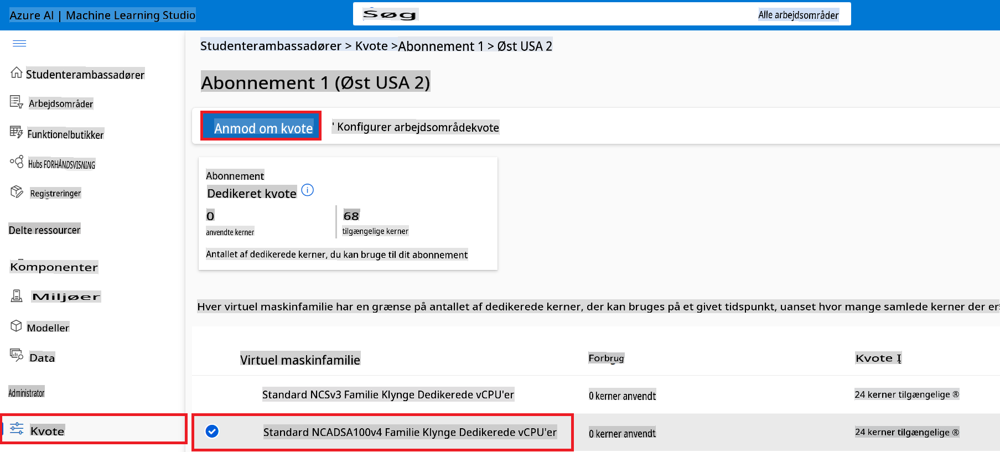

    - Inde på siden Anmod om kvote skal du indtaste den **Nye kernegrænse**, du vil bruge. For eksempel 24.
    - Inde på siden Anmod om kvote skal du vælge **Indsend** for at anmode om GPU-kvoten.

> [!NOTE]
> Du kan vælge den passende GPU eller CPU til dine behov ved at henvise til dokumentet [Størrelser for virtuelle maskiner i Azure](https://learn.microsoft.com/azure/virtual-machines/sizes/overview?tabs=breakdownseries%2Cgeneralsizelist%2Ccomputesizelist%2Cmemorysizelist%2Cstoragesizelist%2Cgpusizelist%2Cfpgasizelist%2Chpcsizelist).

### Tilføj rolleopgaver

For at finjustere og implementere dine modeller skal du først oprette en Bruger Tildelt Administreret Identitet (UAI) og tildele den de relevante tilladelser. Denne UAI vil blive brugt til autentificering under implementeringen.

#### Opret Bruger Tildelt Administreret Identitet (UAI)

1. Skriv *managed identities* i **søgefeltet** øverst på portalens side, og vælg **Managed Identities** fra de viste muligheder.

    

1. Vælg **+ Opret**.

    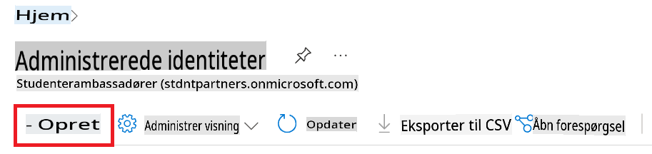

1. Udfør følgende opgaver:

    - Vælg dit Azure **Abonnement**.
    - Vælg den **Ressourcegruppe**, du vil bruge (opret en ny, hvis nødvendigt).
    - Vælg den **Region**, du vil bruge.
    - Indtast **Navn**. Det skal være en unik værdi.

1. Vælg **Gennemse + opret**.

1. Vælg **+ Opret**.

#### Tilføj Contributor-rolleopgave til Administreret Identitet

1. Naviger til den Administrerede Identitetsressource, du oprettede.

1. Vælg **Azure rolleopgaver** fra venstre sidemenu.

1. Vælg **+ Tilføj rolleopgave** fra navigationsmenuen.

1. Inde på siden Tilføj rolleopgave skal du udføre følgende opgaver:
    - Vælg **Omfang** som **Ressourcegruppe**.
    - Vælg dit Azure **Abonnement**.
    - Vælg den **Ressourcegruppe**, du vil bruge.
    - Vælg **Rolle** som **Contributor**.

    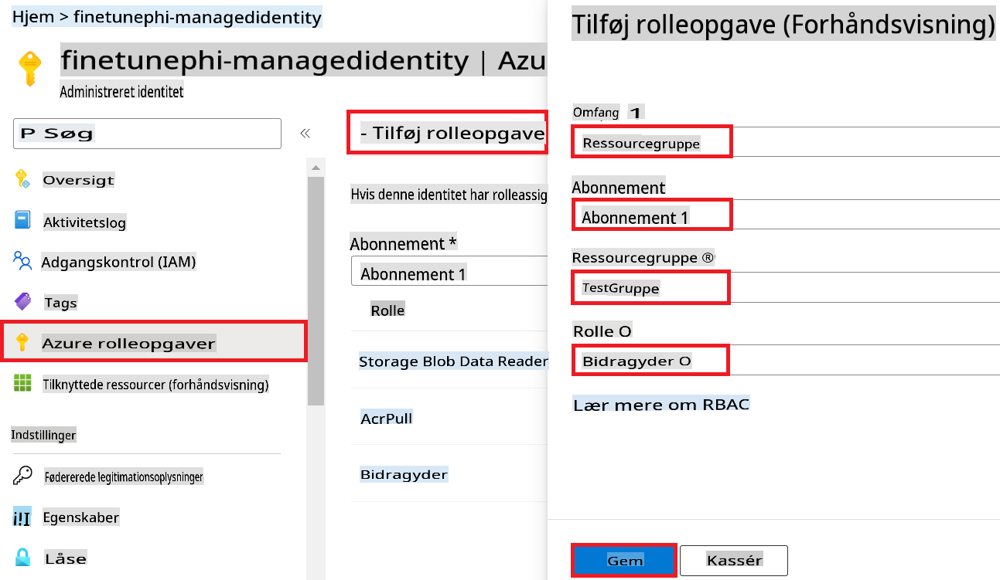

1. Vælg **Gem**.

#### Tilføj Storage Blob Data Reader-rolleopgave til Administreret Identitet

1. Skriv *storage accounts* i **søgefeltet** øverst på portalens side, og vælg **Storage accounts** fra de viste muligheder.

    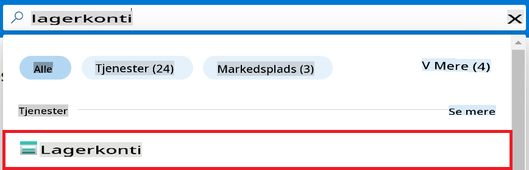

1. Vælg den lagerkonto, der er tilknyttet det Azure Machine Learning workspace, du oprettede. For eksempel *finetunephistorage*.

1. Udfør følgende opgaver for at navigere til siden Tilføj rolleopgave:

    - Naviger til den Azure Storage-konto, du oprettede.
    - Vælg **Adgangskontrol (IAM)** fra venstre sidemenu.
    - Vælg **+ Tilføj** fra navigationsmenuen.
    - Vælg **Tilføj rolleopgave** fra navigationsmenuen.

    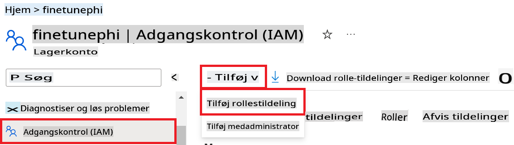

1. Inde på siden Tilføj rolleopgave skal du udføre følgende opgaver:

    - Inde på siden Rolle skal du skrive *Storage Blob Data Reader* i **søgefeltet** og vælge **Storage Blob Data Reader** fra de viste muligheder.
    - Inde på siden Rolle skal du vælge **Næste**.
    - Inde på siden Medlemmer skal du vælge **Tildel adgang til** **Administreret identitet**.
    - Inde på siden Medlemmer skal du vælge **+ Vælg medlemmer**.
    - Inde på siden Vælg administrerede identiteter skal du vælge dit Azure **Abonnement**.
    - Inde på siden Vælg administrerede identiteter skal du vælge **Administreret identitet** til **Administreret identitet**.
    - Inde på siden Vælg administrerede identiteter skal du vælge den Administrerede Identitet, du oprettede. For eksempel *finetunephi-managedidentity*.
    - Inde på siden Vælg administrerede identiteter skal du vælge **Vælg**.

    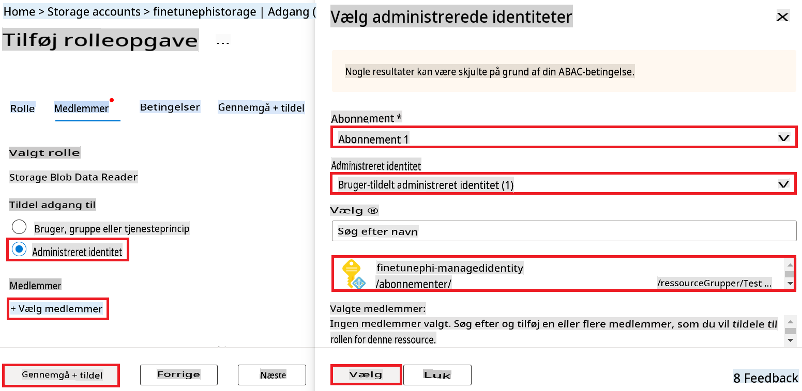

1. Vælg **Gennemse + tildel**.

#### Tilføj AcrPull-rolleopgave til Administreret Identitet

1. Skriv *container registries* i **søgefeltet** øverst på portalens side, og vælg **Container registries** fra de viste muligheder.

    

1. Vælg det containerregister, der er tilknyttet Azure Machine Learning workspace. For eksempel *finetunephicontainerregistries*.

1. Udfør følgende opgaver for at navigere til siden Tilføj rolleopgave:

    - Vælg **Adgangskontrol (IAM)** fra venstre sidemenu.
    - Vælg **+ Tilføj** fra navigationsmenuen.
    - Vælg **Tilføj rolleopgave** fra navigationsmenuen.

1. Inde på siden Tilføj rolleopgave skal du udføre følgende opgaver:

    - Inde på siden Rolle skal du skrive *AcrPull* i **søgefeltet** og vælge **AcrPull** fra de viste muligheder.
    - Inde på siden Rolle skal du vælge **Næste**.
    - Inde på siden Medlemmer skal du vælge **Tildel adgang til** **Administreret identitet**.
    - Inde på siden Medlemmer skal du vælge **+ Vælg medlemmer**.
    - Inde på siden Vælg administrerede identiteter skal du vælge dit Azure **Abonnement**.
    - Inde på siden Vælg administrerede identiteter skal du vælge **Administreret identitet** til **Administreret identitet**.
    - Inde på siden Vælg administrerede identiteter skal du vælge den Administrerede Identitet, du oprettede. For eksempel *finetunephi-managedidentity*.
    - Inde på siden Vælg administrerede identiteter skal du vælge **Vælg**.
    - Vælg **Gennemse + tildel**.

### Opsæt projekt

Nu skal du oprette en mappe at arbejde i og opsætte et virtuelt miljø til at udvikle et program, der interagerer med brugere og bruger gemt chathistorik fra Azure Cosmos DB til at informere dets svar.

#### Opret en mappe til arbejdet

1. Åbn et terminalvindue, og skriv følgende kommando for at oprette en mappe med navnet *finetune-phi* i standardstien.

    ```console
    mkdir finetune-phi
    ```

1. Skriv følgende kommando i terminalen for at navigere til den oprettede mappe *finetune-phi*.

    ```console
    cd finetune-phi
    ```

#### Opret et virtuelt miljø

1. Skriv følgende kommando i terminalen for at oprette et virtuelt miljø med navnet *.venv*.

    ```console
    python -m venv .venv
    ```

1. Skriv følgende kommando i terminalen for at aktivere det virtuelle miljø.

    ```console
    .venv\Scripts\activate.bat
    ```

> [!NOTE]
>
> Hvis det virkede, bør du se *(.venv)* foran kommandoprompten.

#### Installer de nødvendige pakker

1. Skriv følgende kommandoer i terminalen for at installere de nødvendige pakker.

    ```console
    pip install datasets==2.19.1
    pip install transformers==4.41.1
    pip install azure-ai-ml==1.16.0
    pip install torch==2.3.1
    pip install trl==0.9.4
    pip install promptflow==1.12.0
    ```

#### Opret projektfiler

I denne øvelse skal du oprette de nødvendige filer til vores projekt. Disse filer inkluderer scripts til at downloade datasættet, opsætte Azure Machine Learning-miljøet, finjustere Phi-3-modellen og implementere den finjusterede model. Du vil også oprette en *conda.yml*-fil til at opsætte finjusteringsmiljøet.

I denne øvelse skal du:

- Oprette en fil *download_dataset.py* til at downloade datasættet.
- Oprette en fil *setup_ml.py* til at opsætte Azure Machine Learning-miljøet.
- Oprette en fil *fine_tune.py* i mappen *finetuning_dir* til at finjustere Phi-3-modellen ved hjælp af datasættet.
- Oprette en fil *conda.yml* til at opsætte finjusteringsmiljøet.
- Oprette en fil *deploy_model.py* til at implementere den finjusterede model.
- Oprette en fil *integrate_with_promptflow.py* til at integrere den finjusterede model og køre modellen med Prompt flow.
- Oprette en fil *flow.dag.yml* til at opsætte arbejdsgangsstrukturen for Prompt flow.
- Oprette en fil *config.py* til at indtaste Azure-oplysninger.

> [!NOTE]
>
> Komplet mappeoversigt:
>
> ```text
> └── YourUserName
> .    └── finetune-phi
> .        ├── finetuning_dir
> .        │      └── fine_tune.py
> .        ├── conda.yml
> .        ├── config.py
> .        ├── deploy_model.py
> .        ├── download_dataset.py
> .        ├── flow.dag.yml
> .        ├── integrate_with_promptflow.py
> .        └── setup_ml.py
> ```

1. Åbn **Visual Studio Code**.

1. Vælg **Filer** i menulinjen.

1. Vælg **Åbn mappe**.

1. Vælg mappen *finetune-phi*, som du oprettede, placeret i *C:\Users\yourUserName\finetune-phi*.

    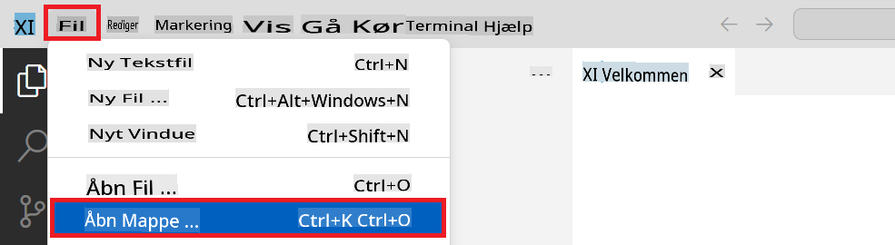

1. I venstre panel i Visual Studio Code skal du højreklikke og vælge **Ny fil** for at oprette en ny fil med navnet *download_dataset.py*.

1. I venstre panel i Visual Studio Code skal du højreklikke og vælge **Ny fil** for at oprette en ny fil med navnet *setup_ml.py*.

1. I venstre panel i Visual Studio Code skal du højreklikke og vælge **Ny fil** for at oprette en ny fil med navnet *deploy_model.py*.

    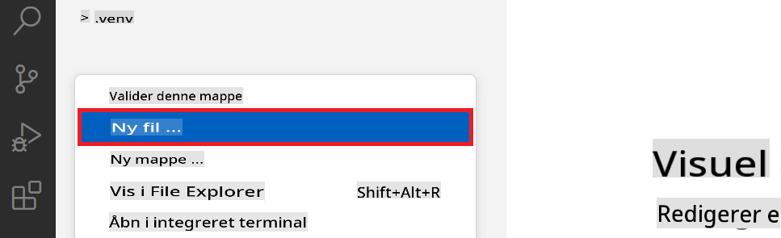

1. I venstre panel i Visual Studio Code skal du højreklikke og vælge **Ny mappe** for at oprette en ny mappe med navnet *finetuning_dir*.

1. I mappen *finetuning_dir* skal du oprette en ny fil med navnet *fine_tune.py*.

#### Opret og konfigurer *conda.yml*-filen

1. I venstre panel i Visual Studio Code skal du højreklikke og vælge **Ny fil** for at oprette en ny fil med navnet *conda.yml*.

1. Tilføj følgende kode til *conda.yml*-filen for at opsætte finjusteringsmiljøet for Phi-3-modellen.

    ```yml
    name: phi-3-training-env
    channels:
      - defaults
      - conda-forge
    dependencies:
      - python=3.10
      - pip
      - numpy<2.0
      - pip:
          - torch==2.4.0
          - torchvision==0.19.0
          - trl==0.8.6
          - transformers==4.41
          - datasets==2.21.0
          - azureml-core==1.57.0
          - azure-storage-blob==12.19.0
          - azure-ai-ml==1.16
          - azure-identity==1.17.1
          - accelerate==0.33.0
          - mlflow==2.15.1
          - azureml-mlflow==1.57.0
    ```

#### Opret og konfigurer *
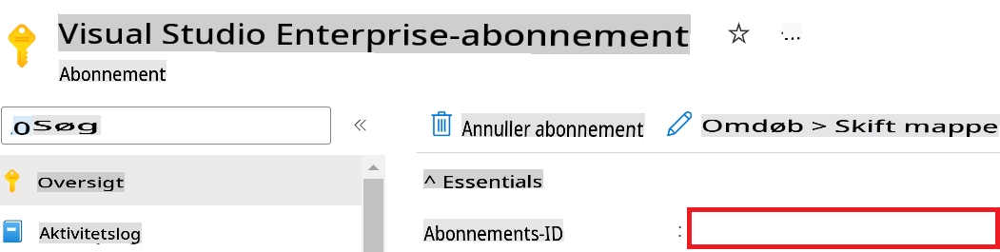

1. Udfør følgende trin for at tilføje Azure Workspace-navnet:

    - Gå til den Azure Machine Learning-ressource, du har oprettet.
    - Kopiér og indsæt dit kontonavn i *config.py*-filen.

    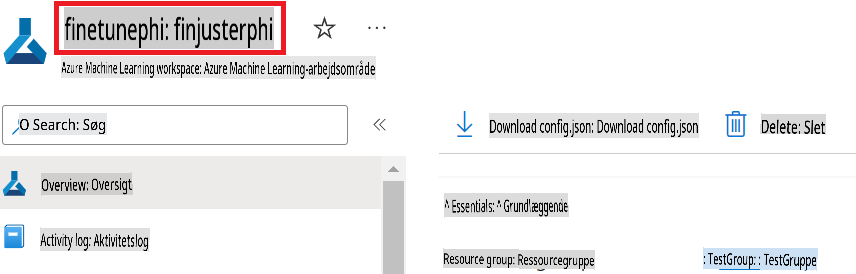

1. Udfør følgende trin for at tilføje Azure Resource Group-navnet:

    - Gå til den Azure Machine Learning-ressource, du har oprettet.
    - Kopiér og indsæt dit Azure Resource Group-navn i *config.py*-filen.

    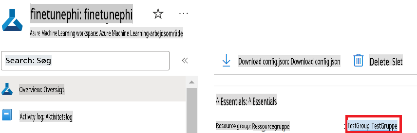

2. Udfør følgende trin for at tilføje Azure Managed Identity-navnet:

    - Gå til den Managed Identities-ressource, du har oprettet.
    - Kopiér og indsæt dit Azure Managed Identity-navn i *config.py*-filen.

    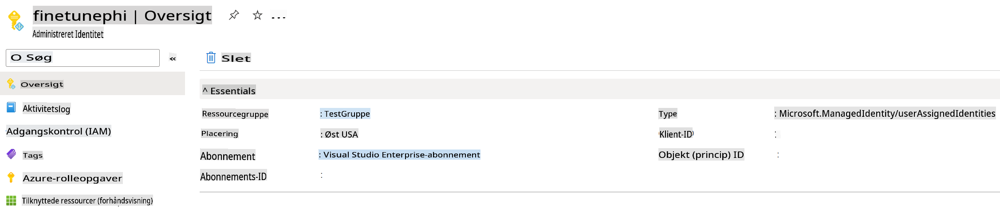

### Forbered datasæt til finjustering

I denne øvelse vil du køre *download_dataset.py*-filen for at downloade *ULTRACHAT_200k*-datasættene til dit lokale miljø. Derefter vil du bruge disse datasæt til at finjustere Phi-3-modellen i Azure Machine Learning.

#### Download dit datasæt ved hjælp af *download_dataset.py*

1. Åbn *download_dataset.py*-filen i Visual Studio Code.

1. Tilføj følgende kode til *download_dataset.py*.

    ```python
    import json
    import os
    from datasets import load_dataset
    from config import (
        TRAIN_DATA_PATH,
        TEST_DATA_PATH)

    def load_and_split_dataset(dataset_name, config_name, split_ratio):
        """
        Load and split a dataset.
        """
        # Load the dataset with the specified name, configuration, and split ratio
        dataset = load_dataset(dataset_name, config_name, split=split_ratio)
        print(f"Original dataset size: {len(dataset)}")
        
        # Split the dataset into train and test sets (80% train, 20% test)
        split_dataset = dataset.train_test_split(test_size=0.2)
        print(f"Train dataset size: {len(split_dataset['train'])}")
        print(f"Test dataset size: {len(split_dataset['test'])}")
        
        return split_dataset

    def save_dataset_to_jsonl(dataset, filepath):
        """
        Save a dataset to a JSONL file.
        """
        # Create the directory if it does not exist
        os.makedirs(os.path.dirname(filepath), exist_ok=True)
        
        # Open the file in write mode
        with open(filepath, 'w', encoding='utf-8') as f:
            # Iterate over each record in the dataset
            for record in dataset:
                # Dump the record as a JSON object and write it to the file
                json.dump(record, f)
                # Write a newline character to separate records
                f.write('\n')
        
        print(f"Dataset saved to {filepath}")

    def main():
        """
        Main function to load, split, and save the dataset.
        """
        # Load and split the ULTRACHAT_200k dataset with a specific configuration and split ratio
        dataset = load_and_split_dataset("HuggingFaceH4/ultrachat_200k", 'default', 'train_sft[:1%]')
        
        # Extract the train and test datasets from the split
        train_dataset = dataset['train']
        test_dataset = dataset['test']

        # Save the train dataset to a JSONL file
        save_dataset_to_jsonl(train_dataset, TRAIN_DATA_PATH)
        
        # Save the test dataset to a separate JSONL file
        save_dataset_to_jsonl(test_dataset, TEST_DATA_PATH)

    if __name__ == "__main__":
        main()

    ```

> [!TIP]
>
> **Vejledning til finjustering med et minimalt datasæt ved hjælp af en CPU**
>
> Hvis du ønsker at bruge en CPU til finjustering, er denne tilgang ideel for dem med abonnementsfordele (såsom Visual Studio Enterprise-abonnement) eller til hurtigt at teste finjusterings- og implementeringsprocessen.
>
> Erstat `dataset = load_and_split_dataset("HuggingFaceH4/ultrachat_200k", 'default', 'train_sft[:1%]')` with `dataset = load_and_split_dataset("HuggingFaceH4/ultrachat_200k", 'default', 'train_sft[:10]')`
>

1. Skriv følgende kommando i din terminal for at køre scriptet og downloade datasættet til dit lokale miljø.

    ```console
    python download_data.py
    ```

1. Bekræft, at datasættene blev gemt korrekt i din lokale *finetune-phi/data*-mappe.

> [!NOTE]
>
> **Datasætsstørrelse og finjusteringstid**
>
> I dette end-to-end-eksempel bruger du kun 1% af datasættet (`train_sft[:1%]`). Dette reducerer mængden af data markant og fremskynder både upload- og finjusteringsprocesserne. Du kan justere procentdelen for at finde den rette balance mellem træningstid og modelpræstation. Brug af et mindre udsnit af datasættet reducerer den nødvendige tid til finjustering, hvilket gør processen mere overskuelig for et end-to-end-eksempel.

## Scenario 2: Finjustér Phi-3-modellen og implementér i Azure Machine Learning Studio

### Opsæt Azure CLI

Du skal opsætte Azure CLI for at godkende dit miljø. Azure CLI giver dig mulighed for at administrere Azure-ressourcer direkte fra kommandolinjen og leverer de nødvendige legitimationsoplysninger for Azure Machine Learning til at få adgang til disse ressourcer. For at komme i gang skal du installere [Azure CLI](https://learn.microsoft.com/cli/azure/install-azure-cli).

1. Åbn et terminalvindue, og skriv følgende kommando for at logge ind på din Azure-konto.

    ```console
    az login
    ```

1. Vælg den Azure-konto, du vil bruge.

1. Vælg det Azure-abonnement, du vil bruge.

    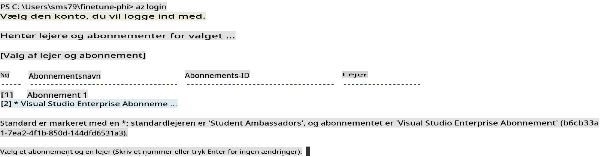

> [!TIP]
>
> Hvis du har problemer med at logge ind på Azure, kan du prøve at bruge en enhedskode. Åbn et terminalvindue, og skriv følgende kommando for at logge ind på din Azure-konto:
>
> ```console
> az login --use-device-code
> ```
>

### Finjustér Phi-3-modellen

I denne øvelse vil du finjustere Phi-3-modellen ved hjælp af det medfølgende datasæt. Først vil du definere finjusteringsprocessen i *fine_tune.py*-filen. Derefter vil du konfigurere Azure Machine Learning-miljøet og starte finjusteringsprocessen ved at køre *setup_ml.py*-filen. Dette script sikrer, at finjusteringen foregår i Azure Machine Learning-miljøet.

Ved at køre *setup_ml.py* vil du køre finjusteringsprocessen i Azure Machine Learning-miljøet.

#### Tilføj kode til *fine_tune.py*-filen

1. Gå til *finetuning_dir*-mappen, og åbn *fine_tune.py*-filen i Visual Studio Code.

1. Tilføj følgende kode til *fine_tune.py*.

    ```python
    import argparse
    import sys
    import logging
    import os
    from datasets import load_dataset
    import torch
    import mlflow
    from transformers import AutoModelForCausalLM, AutoTokenizer, TrainingArguments
    from trl import SFTTrainer

    # To avoid the INVALID_PARAMETER_VALUE error in MLflow, disable MLflow integration
    os.environ["DISABLE_MLFLOW_INTEGRATION"] = "True"

    # Logging setup
    logging.basicConfig(
        format="%(asctime)s - %(levelname)s - %(name)s - %(message)s",
        datefmt="%Y-%m-%d %H:%M:%S",
        handlers=[logging.StreamHandler(sys.stdout)],
        level=logging.WARNING
    )
    logger = logging.getLogger(__name__)

    def initialize_model_and_tokenizer(model_name, model_kwargs):
        """
        Initialize the model and tokenizer with the given pretrained model name and arguments.
        """
        model = AutoModelForCausalLM.from_pretrained(model_name, **model_kwargs)
        tokenizer = AutoTokenizer.from_pretrained(model_name)
        tokenizer.model_max_length = 2048
        tokenizer.pad_token = tokenizer.unk_token
        tokenizer.pad_token_id = tokenizer.convert_tokens_to_ids(tokenizer.pad_token)
        tokenizer.padding_side = 'right'
        return model, tokenizer

    def apply_chat_template(example, tokenizer):
        """
        Apply a chat template to tokenize messages in the example.
        """
        messages = example["messages"]
        if messages[0]["role"] != "system":
            messages.insert(0, {"role": "system", "content": ""})
        example["text"] = tokenizer.apply_chat_template(
            messages, tokenize=False, add_generation_prompt=False
        )
        return example

    def load_and_preprocess_data(train_filepath, test_filepath, tokenizer):
        """
        Load and preprocess the dataset.
        """
        train_dataset = load_dataset('json', data_files=train_filepath, split='train')
        test_dataset = load_dataset('json', data_files=test_filepath, split='train')
        column_names = list(train_dataset.features)

        train_dataset = train_dataset.map(
            apply_chat_template,
            fn_kwargs={"tokenizer": tokenizer},
            num_proc=10,
            remove_columns=column_names,
            desc="Applying chat template to train dataset",
        )

        test_dataset = test_dataset.map(
            apply_chat_template,
            fn_kwargs={"tokenizer": tokenizer},
            num_proc=10,
            remove_columns=column_names,
            desc="Applying chat template to test dataset",
        )

        return train_dataset, test_dataset

    def train_and_evaluate_model(train_dataset, test_dataset, model, tokenizer, output_dir):
        """
        Train and evaluate the model.
        """
        training_args = TrainingArguments(
            bf16=True,
            do_eval=True,
            output_dir=output_dir,
            eval_strategy="epoch",
            learning_rate=5.0e-06,
            logging_steps=20,
            lr_scheduler_type="cosine",
            num_train_epochs=3,
            overwrite_output_dir=True,
            per_device_eval_batch_size=4,
            per_device_train_batch_size=4,
            remove_unused_columns=True,
            save_steps=500,
            seed=0,
            gradient_checkpointing=True,
            gradient_accumulation_steps=1,
            warmup_ratio=0.2,
        )

        trainer = SFTTrainer(
            model=model,
            args=training_args,
            train_dataset=train_dataset,
            eval_dataset=test_dataset,
            max_seq_length=2048,
            dataset_text_field="text",
            tokenizer=tokenizer,
            packing=True
        )

        train_result = trainer.train()
        trainer.log_metrics("train", train_result.metrics)

        mlflow.transformers.log_model(
            transformers_model={"model": trainer.model, "tokenizer": tokenizer},
            artifact_path=output_dir,
        )

        tokenizer.padding_side = 'left'
        eval_metrics = trainer.evaluate()
        eval_metrics["eval_samples"] = len(test_dataset)
        trainer.log_metrics("eval", eval_metrics)

    def main(train_file, eval_file, model_output_dir):
        """
        Main function to fine-tune the model.
        """
        model_kwargs = {
            "use_cache": False,
            "trust_remote_code": True,
            "torch_dtype": torch.bfloat16,
            "device_map": None,
            "attn_implementation": "eager"
        }

        # pretrained_model_name = "microsoft/Phi-3-mini-4k-instruct"
        pretrained_model_name = "microsoft/Phi-3.5-mini-instruct"

        with mlflow.start_run():
            model, tokenizer = initialize_model_and_tokenizer(pretrained_model_name, model_kwargs)
            train_dataset, test_dataset = load_and_preprocess_data(train_file, eval_file, tokenizer)
            train_and_evaluate_model(train_dataset, test_dataset, model, tokenizer, model_output_dir)

    if __name__ == "__main__":
        parser = argparse.ArgumentParser()
        parser.add_argument("--train-file", type=str, required=True, help="Path to the training data")
        parser.add_argument("--eval-file", type=str, required=True, help="Path to the evaluation data")
        parser.add_argument("--model_output_dir", type=str, required=True, help="Directory to save the fine-tuned model")
        args = parser.parse_args()
        main(args.train_file, args.eval_file, args.model_output_dir)

    ```

1. Gem og luk *fine_tune.py*-filen.

> [!TIP]
> **Du kan finjustere Phi-3.5-modellen**
>
> I *fine_tune.py*-filen kan du ændre `pretrained_model_name` from `"microsoft/Phi-3-mini-4k-instruct"` to any model you want to fine-tune. For example, if you change it to `"microsoft/Phi-3.5-mini-instruct"`, you'll be using the Phi-3.5-mini-instruct model for fine-tuning. To find and use the model name you prefer, visit [Hugging Face](https://huggingface.co/), search for the model you're interested in, and then copy and paste its name into the `pretrained_model_name`-feltet i dit script.
>
> :::image type="content" source="../../imgs/03/FineTuning-PromptFlow/finetunephi3.5.png" alt-text="Fine tune Phi-3.5.":::
>

#### Tilføj kode til *setup_ml.py*-filen

1. Åbn *setup_ml.py*-filen i Visual Studio Code.

1. Tilføj følgende kode til *setup_ml.py*.

    ```python
    import logging
    from azure.ai.ml import MLClient, command, Input
    from azure.ai.ml.entities import Environment, AmlCompute
    from azure.identity import AzureCliCredential
    from config import (
        AZURE_SUBSCRIPTION_ID,
        AZURE_RESOURCE_GROUP_NAME,
        AZURE_ML_WORKSPACE_NAME,
        TRAIN_DATA_PATH,
        TEST_DATA_PATH
    )

    # Constants

    # Uncomment the following lines to use a CPU instance for training
    # COMPUTE_INSTANCE_TYPE = "Standard_E16s_v3" # cpu
    # COMPUTE_NAME = "cpu-e16s-v3"
    # DOCKER_IMAGE_NAME = "mcr.microsoft.com/azureml/openmpi4.1.0-ubuntu20.04:latest"

    # Uncomment the following lines to use a GPU instance for training
    COMPUTE_INSTANCE_TYPE = "Standard_NC24ads_A100_v4"
    COMPUTE_NAME = "gpu-nc24s-a100-v4"
    DOCKER_IMAGE_NAME = "mcr.microsoft.com/azureml/curated/acft-hf-nlp-gpu:59"

    CONDA_FILE = "conda.yml"
    LOCATION = "eastus2" # Replace with the location of your compute cluster
    FINETUNING_DIR = "./finetuning_dir" # Path to the fine-tuning script
    TRAINING_ENV_NAME = "phi-3-training-environment" # Name of the training environment
    MODEL_OUTPUT_DIR = "./model_output" # Path to the model output directory in azure ml

    # Logging setup to track the process
    logger = logging.getLogger(__name__)
    logging.basicConfig(
        format="%(asctime)s - %(levelname)s - %(name)s - %(message)s",
        datefmt="%Y-%m-%d %H:%M:%S",
        level=logging.WARNING
    )

    def get_ml_client():
        """
        Initialize the ML Client using Azure CLI credentials.
        """
        credential = AzureCliCredential()
        return MLClient(credential, AZURE_SUBSCRIPTION_ID, AZURE_RESOURCE_GROUP_NAME, AZURE_ML_WORKSPACE_NAME)

    def create_or_get_environment(ml_client):
        """
        Create or update the training environment in Azure ML.
        """
        env = Environment(
            image=DOCKER_IMAGE_NAME,  # Docker image for the environment
            conda_file=CONDA_FILE,  # Conda environment file
            name=TRAINING_ENV_NAME,  # Name of the environment
        )
        return ml_client.environments.create_or_update(env)

    def create_or_get_compute_cluster(ml_client, compute_name, COMPUTE_INSTANCE_TYPE, location):
        """
        Create or update the compute cluster in Azure ML.
        """
        try:
            compute_cluster = ml_client.compute.get(compute_name)
            logger.info(f"Compute cluster '{compute_name}' already exists. Reusing it for the current run.")
        except Exception:
            logger.info(f"Compute cluster '{compute_name}' does not exist. Creating a new one with size {COMPUTE_INSTANCE_TYPE}.")
            compute_cluster = AmlCompute(
                name=compute_name,
                size=COMPUTE_INSTANCE_TYPE,
                location=location,
                tier="Dedicated",  # Tier of the compute cluster
                min_instances=0,  # Minimum number of instances
                max_instances=1  # Maximum number of instances
            )
            ml_client.compute.begin_create_or_update(compute_cluster).wait()  # Wait for the cluster to be created
        return compute_cluster

    def create_fine_tuning_job(env, compute_name):
        """
        Set up the fine-tuning job in Azure ML.
        """
        return command(
            code=FINETUNING_DIR,  # Path to fine_tune.py
            command=(
                "python fine_tune.py "
                "--train-file ${{inputs.train_file}} "
                "--eval-file ${{inputs.eval_file}} "
                "--model_output_dir ${{inputs.model_output}}"
            ),
            environment=env,  # Training environment
            compute=compute_name,  # Compute cluster to use
            inputs={
                "train_file": Input(type="uri_file", path=TRAIN_DATA_PATH),  # Path to the training data file
                "eval_file": Input(type="uri_file", path=TEST_DATA_PATH),  # Path to the evaluation data file
                "model_output": MODEL_OUTPUT_DIR
            }
        )

    def main():
        """
        Main function to set up and run the fine-tuning job in Azure ML.
        """
        # Initialize ML Client
        ml_client = get_ml_client()

        # Create Environment
        env = create_or_get_environment(ml_client)
        
        # Create or get existing compute cluster
        create_or_get_compute_cluster(ml_client, COMPUTE_NAME, COMPUTE_INSTANCE_TYPE, LOCATION)

        # Create and Submit Fine-Tuning Job
        job = create_fine_tuning_job(env, COMPUTE_NAME)
        returned_job = ml_client.jobs.create_or_update(job)  # Submit the job
        ml_client.jobs.stream(returned_job.name)  # Stream the job logs
        
        # Capture the job name
        job_name = returned_job.name
        print(f"Job name: {job_name}")

    if __name__ == "__main__":
        main()

    ```

1. Erstat `COMPUTE_INSTANCE_TYPE`, `COMPUTE_NAME`, and `LOCATION` med dine specifikke oplysninger.

    ```python
   # Uncomment the following lines to use a GPU instance for training
    COMPUTE_INSTANCE_TYPE = "Standard_NC24ads_A100_v4"
    COMPUTE_NAME = "gpu-nc24s-a100-v4"
    ...
    LOCATION = "eastus2" # Replace with the location of your compute cluster
    ```

> [!TIP]
>
> **Vejledning til finjustering med et minimalt datasæt ved hjælp af en CPU**
>
> Hvis du ønsker at bruge en CPU til finjustering, er denne tilgang ideel for dem med abonnementsfordele (såsom Visual Studio Enterprise-abonnement) eller til hurtigt at teste finjusterings- og implementeringsprocessen.
>
> 1. Åbn *setup_ml*-filen.
> 1. Erstat `COMPUTE_INSTANCE_TYPE`, `COMPUTE_NAME`, and `DOCKER_IMAGE_NAME` with the following. If you do not have access to *Standard_E16s_v3*, you can use an equivalent CPU instance or request a new quota.
> 1. Replace `LOCATION` med dine specifikke oplysninger.
>
>    ```python
>    # Uncomment the following lines to use a CPU instance for training
>    COMPUTE_INSTANCE_TYPE = "Standard_E16s_v3" # cpu
>    COMPUTE_NAME = "cpu-e16s-v3"
>    DOCKER_IMAGE_NAME = "mcr.microsoft.com/azureml/openmpi4.1.0-ubuntu20.04:latest"
>    LOCATION = "eastus2" # Replace with the location of your compute cluster
>    ```
>

1. Skriv følgende kommando for at køre *setup_ml.py*-scriptet og starte finjusteringsprocessen i Azure Machine Learning.

    ```python
    python setup_ml.py
    ```

1. I denne øvelse har du med succes finjusteret Phi-3-modellen ved hjælp af Azure Machine Learning. Ved at køre *setup_ml.py*-scriptet har du opsat Azure Machine Learning-miljøet og startet finjusteringsprocessen defineret i *fine_tune.py*-filen. Bemærk, at finjusteringsprocessen kan tage en del tid. Efter at have kørt `python setup_ml.py` command, you need to wait for the process to complete. You can monitor the status of the fine-tuning job by following the link provided in the terminal to the Azure Machine Learning portal.

    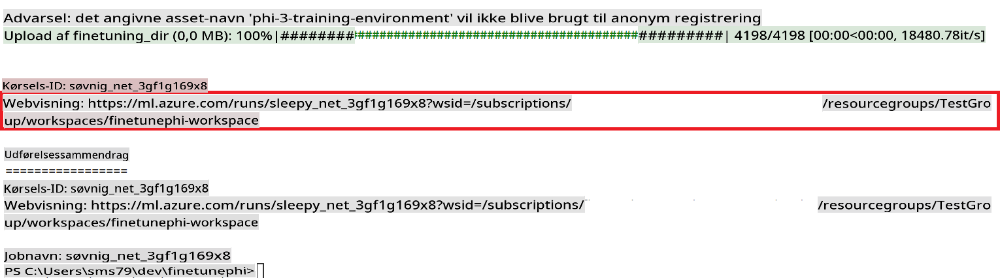

### Deploy the fine-tuned model

To integrate the fine-tuned Phi-3 model with Prompt Flow, you need to deploy the model to make it accessible for real-time inference. This process involves registering the model, creating an online endpoint, and deploying the model.

#### Set the model name, endpoint name, and deployment name for deployment

1. Open *config.py* file.

1. Replace `AZURE_MODEL_NAME = "your_fine_tuned_model_name"` with the desired name for your model.

1. Replace `AZURE_ENDPOINT_NAME = "your_fine_tuned_model_endpoint_name"` with the desired name for your endpoint.

1. Replace `AZURE_DEPLOYMENT_NAME = "your_fine_tuned_model_deployment_name"` med det ønskede navn til din implementering.

#### Tilføj kode til *deploy_model.py*-filen

Ved at køre *deploy_model.py*-filen automatiseres hele implementeringsprocessen. Det registrerer modellen, opretter et endpoint og udfører implementeringen baseret på indstillingerne specificeret i config.py-filen, som inkluderer modelnavn, endpoint-navn og implementeringsnavn.

1. Åbn *deploy_model.py*-filen i Visual Studio Code.

1. Tilføj følgende kode til *deploy_model.py*.

    ```python
    import logging
    from azure.identity import AzureCliCredential
    from azure.ai.ml import MLClient
    from azure.ai.ml.entities import Model, ProbeSettings, ManagedOnlineEndpoint, ManagedOnlineDeployment, IdentityConfiguration, ManagedIdentityConfiguration, OnlineRequestSettings
    from azure.ai.ml.constants import AssetTypes

    # Configuration imports
    from config import (
        AZURE_SUBSCRIPTION_ID,
        AZURE_RESOURCE_GROUP_NAME,
        AZURE_ML_WORKSPACE_NAME,
        AZURE_MANAGED_IDENTITY_RESOURCE_ID,
        AZURE_MANAGED_IDENTITY_CLIENT_ID,
        AZURE_MODEL_NAME,
        AZURE_ENDPOINT_NAME,
        AZURE_DEPLOYMENT_NAME
    )

    # Constants
    JOB_NAME = "your-job-name"
    COMPUTE_INSTANCE_TYPE = "Standard_E4s_v3"

    deployment_env_vars = {
        "SUBSCRIPTION_ID": AZURE_SUBSCRIPTION_ID,
        "RESOURCE_GROUP_NAME": AZURE_RESOURCE_GROUP_NAME,
        "UAI_CLIENT_ID": AZURE_MANAGED_IDENTITY_CLIENT_ID,
    }

    # Logging setup
    logging.basicConfig(
        format="%(asctime)s - %(levelname)s - %(name)s - %(message)s",
        datefmt="%Y-%m-%d %H:%M:%S",
        level=logging.DEBUG
    )
    logger = logging.getLogger(__name__)

    def get_ml_client():
        """Initialize and return the ML Client."""
        credential = AzureCliCredential()
        return MLClient(credential, AZURE_SUBSCRIPTION_ID, AZURE_RESOURCE_GROUP_NAME, AZURE_ML_WORKSPACE_NAME)

    def register_model(ml_client, model_name, job_name):
        """Register a new model."""
        model_path = f"azureml://jobs/{job_name}/outputs/artifacts/paths/model_output"
        logger.info(f"Registering model {model_name} from job {job_name} at path {model_path}.")
        run_model = Model(
            path=model_path,
            name=model_name,
            description="Model created from run.",
            type=AssetTypes.MLFLOW_MODEL,
        )
        model = ml_client.models.create_or_update(run_model)
        logger.info(f"Registered model ID: {model.id}")
        return model

    def delete_existing_endpoint(ml_client, endpoint_name):
        """Delete existing endpoint if it exists."""
        try:
            endpoint_result = ml_client.online_endpoints.get(name=endpoint_name)
            logger.info(f"Deleting existing endpoint {endpoint_name}.")
            ml_client.online_endpoints.begin_delete(name=endpoint_name).result()
            logger.info(f"Deleted existing endpoint {endpoint_name}.")
        except Exception as e:
            logger.info(f"No existing endpoint {endpoint_name} found to delete: {e}")

    def create_or_update_endpoint(ml_client, endpoint_name, description=""):
        """Create or update an endpoint."""
        delete_existing_endpoint(ml_client, endpoint_name)
        logger.info(f"Creating new endpoint {endpoint_name}.")
        endpoint = ManagedOnlineEndpoint(
            name=endpoint_name,
            description=description,
            identity=IdentityConfiguration(
                type="user_assigned",
                user_assigned_identities=[ManagedIdentityConfiguration(resource_id=AZURE_MANAGED_IDENTITY_RESOURCE_ID)]
            )
        )
        endpoint_result = ml_client.online_endpoints.begin_create_or_update(endpoint).result()
        logger.info(f"Created new endpoint {endpoint_name}.")
        return endpoint_result

    def create_or_update_deployment(ml_client, endpoint_name, deployment_name, model):
        """Create or update a deployment."""

        logger.info(f"Creating deployment {deployment_name} for endpoint {endpoint_name}.")
        deployment = ManagedOnlineDeployment(
            name=deployment_name,
            endpoint_name=endpoint_name,
            model=model.id,
            instance_type=COMPUTE_INSTANCE_TYPE,
            instance_count=1,
            environment_variables=deployment_env_vars,
            request_settings=OnlineRequestSettings(
                max_concurrent_requests_per_instance=3,
                request_timeout_ms=180000,
                max_queue_wait_ms=120000
            ),
            liveness_probe=ProbeSettings(
                failure_threshold=30,
                success_threshold=1,
                period=100,
                initial_delay=500,
            ),
            readiness_probe=ProbeSettings(
                failure_threshold=30,
                success_threshold=1,
                period=100,
                initial_delay=500,
            ),
        )
        deployment_result = ml_client.online_deployments.begin_create_or_update(deployment).result()
        logger.info(f"Created deployment {deployment.name} for endpoint {endpoint_name}.")
        return deployment_result

    def set_traffic_to_deployment(ml_client, endpoint_name, deployment_name):
        """Set traffic to the specified deployment."""
        try:
            # Fetch the current endpoint details
            endpoint = ml_client.online_endpoints.get(name=endpoint_name)
            
            # Log the current traffic allocation for debugging
            logger.info(f"Current traffic allocation: {endpoint.traffic}")
            
            # Set the traffic allocation for the deployment
            endpoint.traffic = {deployment_name: 100}
            
            # Update the endpoint with the new traffic allocation
            endpoint_poller = ml_client.online_endpoints.begin_create_or_update(endpoint)
            updated_endpoint = endpoint_poller.result()
            
            # Log the updated traffic allocation for debugging
            logger.info(f"Updated traffic allocation: {updated_endpoint.traffic}")
            logger.info(f"Set traffic to deployment {deployment_name} at endpoint {endpoint_name}.")
            return updated_endpoint
        except Exception as e:
            # Log any errors that occur during the process
            logger.error(f"Failed to set traffic to deployment: {e}")
            raise


    def main():
        ml_client = get_ml_client()

        registered_model = register_model(ml_client, AZURE_MODEL_NAME, JOB_NAME)
        logger.info(f"Registered model ID: {registered_model.id}")

        endpoint = create_or_update_endpoint(ml_client, AZURE_ENDPOINT_NAME, "Endpoint for finetuned Phi-3 model")
        logger.info(f"Endpoint {AZURE_ENDPOINT_NAME} is ready.")

        try:
            deployment = create_or_update_deployment(ml_client, AZURE_ENDPOINT_NAME, AZURE_DEPLOYMENT_NAME, registered_model)
            logger.info(f"Deployment {AZURE_DEPLOYMENT_NAME} is created for endpoint {AZURE_ENDPOINT_NAME}.")

            set_traffic_to_deployment(ml_client, AZURE_ENDPOINT_NAME, AZURE_DEPLOYMENT_NAME)
            logger.info(f"Traffic is set to deployment {AZURE_DEPLOYMENT_NAME} at endpoint {AZURE_ENDPOINT_NAME}.")
        except Exception as e:
            logger.error(f"Failed to create or update deployment: {e}")

    if __name__ == "__main__":
        main()

    ```

1. Udfør følgende trin for at få `JOB_NAME`:

    - Navigate to Azure Machine Learning resource that you created.
    - Select **Studio web URL** to open the Azure Machine Learning workspace.
    - Select **Jobs** from the left side tab.
    - Select the experiment for fine-tuning. For example, *finetunephi*.
    - Select the job that you created.
    - Copy and paste your job Name into the `JOB_NAME = "your-job-name"` in *deploy_model.py* file.

1. Replace `COMPUTE_INSTANCE_TYPE` med dine specifikke oplysninger.

1. Skriv følgende kommando for at køre *deploy_model.py*-scriptet og starte implementeringsprocessen i Azure Machine Learning.

    ```python
    python deploy_model.py
    ```

> [!WARNING]
> For at undgå yderligere omkostninger på din konto skal du sørge for at slette det oprettede endpoint i Azure Machine Learning-arbejdsområdet.
>

#### Tjek implementeringsstatus i Azure Machine Learning Workspace

1. Besøg [Azure ML Studio](https://ml.azure.com/home?wt.mc_id=studentamb_279723).

1. Naviger til det Azure Machine Learning-arbejdsområde, du har oprettet.

1. Vælg **Studio web URL** for at åbne Azure Machine Learning-arbejdsområdet.

1. Vælg **Endpoints** fra menuen til venstre.

    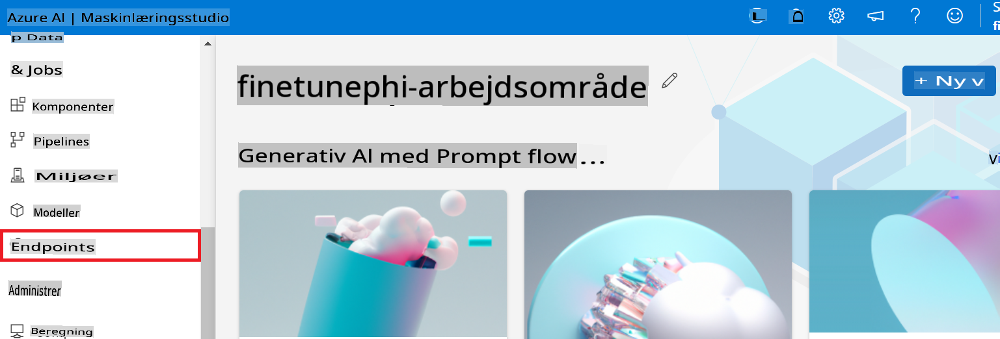

2. Vælg det endpoint, du har oprettet.

    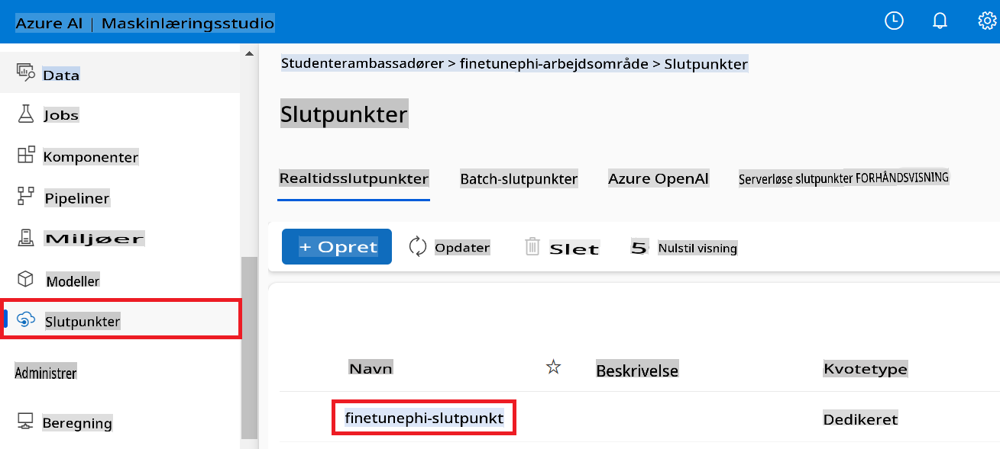

3. På denne side kan du administrere de endpoints, der blev oprettet under implementeringsprocessen.

## Scenario 3: Integrer med Prompt Flow og chat med din brugerdefinerede model

### Integrér den brugerdefinerede Phi-3-model med Prompt Flow

Efter at have implementeret din finjusterede model med succes kan du nu integrere den med Prompt Flow for at bruge din model i realtidsapplikationer, hvilket muliggør en række interaktive opgaver med din brugerdefinerede Phi-3-model.

#### Indstil API-nøgle og endpoint-URI for den finjusterede Phi-3-model

1. Naviger til det Azure Machine Learning-arbejdsområde, du har oprettet.
1. Vælg **Endpoints** fra menuen til venstre.
1. Vælg det endpoint, du har oprettet.
1. Vælg **Consume** fra navigationsmenuen.
1. Kopiér og indsæt din **REST endpoint** i *config.py*-filen, og erstat `AZURE_ML_ENDPOINT = "your_fine_tuned_model_endpoint_uri"` with your **REST endpoint**.
1. Copy and paste your **Primary key** into the *config.py* file, replacing `AZURE_ML_API_KEY = "your_fine_tuned_model_api_key"` med din **Primære nøgle**.

    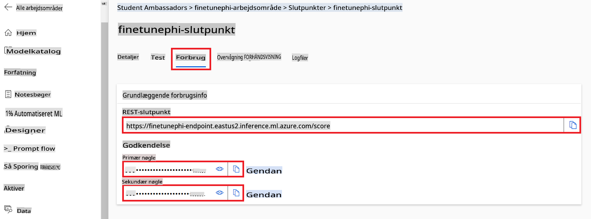

#### Tilføj kode til *flow.dag.yml*-filen

1. Åbn *flow.dag.yml*-filen i Visual Studio Code.

1. Tilføj følgende kode til *flow.dag.yml*.

    ```yml
    inputs:
      input_data:
        type: string
        default: "Who founded Microsoft?"

    outputs:
      answer:
        type: string
        reference: ${integrate_with_promptflow.output}

    nodes:
    - name: integrate_with_promptflow
      type: python
      source:
        type: code
        path: integrate_with_promptflow.py
      inputs:
        input_data: ${inputs.input_data}
    ```

#### Tilføj kode til *integrate_with_promptflow.py*-filen

1. Åbn *integrate_with_promptflow.py*-filen i Visual Studio Code.

1. Tilføj følgende kode til *integrate_with_promptflow.py*.

    ```python
    import logging
    import requests
    from promptflow.core import tool
    import asyncio
    import platform
    from config import (
        AZURE_ML_ENDPOINT,
        AZURE_ML_API_KEY
    )

    # Logging setup
    logging.basicConfig(
        format="%(asctime)s - %(levelname)s - %(name)s - %(message)s",
        datefmt="%Y-%m-%d %H:%M:%S",
        level=logging.DEBUG
    )
    logger = logging.getLogger(__name__)

    def query_azml_endpoint(input_data: list, endpoint_url: str, api_key: str) -> str:
        """
        Send a request to the Azure ML endpoint with the given input data.
        """
        headers = {
            "Content-Type": "application/json",
            "Authorization": f"Bearer {api_key}"
        }
        data = {
            "input_data": [input_data],
            "params": {
                "temperature": 0.7,
                "max_new_tokens": 128,
                "do_sample": True,
                "return_full_text": True
            }
        }
        try:
            response = requests.post(endpoint_url, json=data, headers=headers)
            response.raise_for_status()
            result = response.json()[0]
            logger.info("Successfully received response from Azure ML Endpoint.")
            return result
        except requests.exceptions.RequestException as e:
            logger.error(f"Error querying Azure ML Endpoint: {e}")
            raise

    def setup_asyncio_policy():
        """
        Setup asyncio event loop policy for Windows.
        """
        if platform.system() == 'Windows':
            asyncio.set_event_loop_policy(asyncio.WindowsSelectorEventLoopPolicy())
            logger.info("Set Windows asyncio event loop policy.")

    @tool
    def my_python_tool(input_data: str) -> str:
        """
        Tool function to process input data and query the Azure ML endpoint.
        """
        setup_asyncio_policy()
        return query_azml_endpoint(input_data, AZURE_ML_ENDPOINT, AZURE_ML_API_KEY)

    ```

### Chat med din brugerdefinerede model

1. Skriv følgende kommando for at køre *deploy_model.py*-scriptet og starte implementeringsprocessen i Azure Machine Learning.

    ```python
    pf flow serve --source ./ --port 8080 --host localhost
    ```

1. Her er et eksempel på resultaterne: Nu kan du chatte med din brugerdefinerede Phi-3-model. Det anbefales at stille spørgsmål baseret på de data, der blev brugt til finjusteringen.

    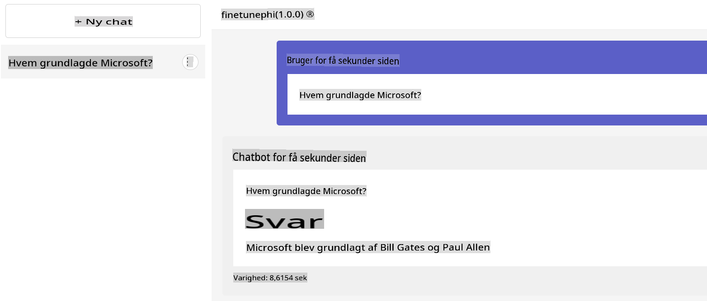

**Ansvarsfraskrivelse**:  
Dette dokument er blevet oversat ved hjælp af AI-baserede maskinoversættelsestjenester. Selvom vi bestræber os på at opnå nøjagtighed, skal det bemærkes, at automatiserede oversættelser kan indeholde fejl eller unøjagtigheder. Det originale dokument på dets oprindelige sprog bør betragtes som den autoritative kilde. For kritisk information anbefales professionel menneskelig oversættelse. Vi påtager os ikke ansvar for misforståelser eller fejltolkninger, der måtte opstå som følge af brugen af denne oversættelse.