# Finjuster og integrer tilpassede Phi-3-modeller med Prompt Flow i Azure AI Foundry

Dette end-to-end (E2E) eksempel er baseret på guiden "[Fine-Tune and Integrate Custom Phi-3 Models with Prompt Flow in Azure AI Foundry](https://techcommunity.microsoft.com/t5/educator-developer-blog/fine-tune-and-integrate-custom-phi-3-models-with-prompt-flow-in/ba-p/4191726?WT.mc_id=aiml-137032-kinfeylo)" fra Microsoft Tech Community. Det introducerer processerne for finjustering, udrulning og integration af tilpassede Phi-3-modeller med Prompt Flow i Azure AI Foundry.  
I modsætning til E2E-eksemplet, "[Fine-Tune and Integrate Custom Phi-3 Models with Prompt Flow](./E2E_Phi-3-FineTuning_PromptFlow_Integration.md)", som involverede lokal kørsel af kode, fokuserer denne vejledning udelukkende på finjustering og integration af din model inden for Azure AI / ML Studio.

## Oversigt

I dette E2E-eksempel lærer du, hvordan du finjusterer Phi-3-modellen og integrerer den med Prompt Flow i Azure AI Foundry. Ved at udnytte Azure AI / ML Studio vil du etablere en arbejdsgang til udrulning og brug af tilpassede AI-modeller. Dette E2E-eksempel er opdelt i tre scenarier:

**Scenario 1: Opsæt Azure-ressourcer og forbered dig på finjustering**

**Scenario 2: Finjuster Phi-3-modellen og udrul den i Azure Machine Learning Studio**

**Scenario 3: Integrer med Prompt Flow og chat med din tilpassede model i Azure AI Foundry**

Her er en oversigt over dette E2E-eksempel.

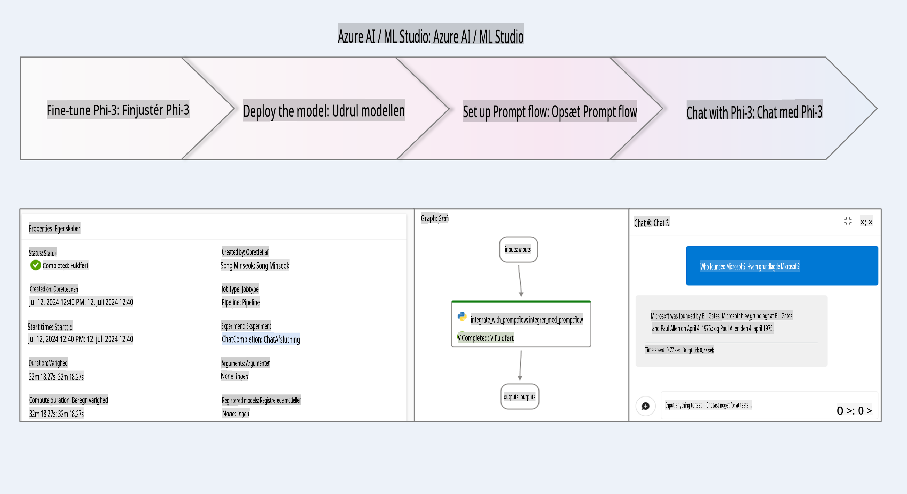

### Indholdsfortegnelse

1. **[Scenario 1: Opsæt Azure-ressourcer og forbered dig på finjustering](../../../../../../md/02.Application/01.TextAndChat/Phi3)**
    - [Opret et Azure Machine Learning Workspace](../../../../../../md/02.Application/01.TextAndChat/Phi3)
    - [Anmod om GPU-kvoter i Azure-abonnement](../../../../../../md/02.Application/01.TextAndChat/Phi3)
    - [Tilføj rollefordeling](../../../../../../md/02.Application/01.TextAndChat/Phi3)
    - [Opsæt projekt](../../../../../../md/02.Application/01.TextAndChat/Phi3)
    - [Forbered datasæt til finjustering](../../../../../../md/02.Application/01.TextAndChat/Phi3)

1. **[Scenario 2: Finjuster Phi-3-modellen og udrul den i Azure Machine Learning Studio](../../../../../../md/02.Application/01.TextAndChat/Phi3)**
    - [Finjuster Phi-3-modellen](../../../../../../md/02.Application/01.TextAndChat/Phi3)
    - [Udrul den finjusterede Phi-3-model](../../../../../../md/02.Application/01.TextAndChat/Phi3)

1. **[Scenario 3: Integrer med Prompt Flow og chat med din tilpassede model i Azure AI Foundry](../../../../../../md/02.Application/01.TextAndChat/Phi3)**
    - [Integrer den tilpassede Phi-3-model med Prompt Flow](../../../../../../md/02.Application/01.TextAndChat/Phi3)
    - [Chat med din tilpassede Phi-3-model](../../../../../../md/02.Application/01.TextAndChat/Phi3)

## Scenario 1: Opsæt Azure-ressourcer og forbered dig på finjustering

### Opret et Azure Machine Learning Workspace

1. Skriv *azure machine learning* i **søgefeltet** øverst på portalens side, og vælg **Azure Machine Learning** fra de viste muligheder.

    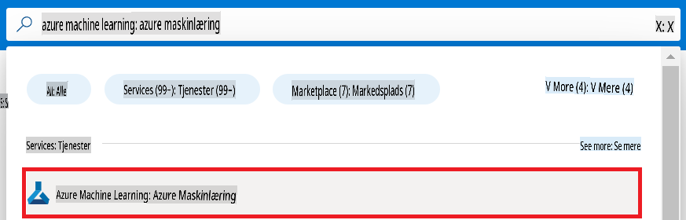

2. Vælg **+ Opret** fra navigationsmenuen.

3. Vælg **Nyt arbejdsområde** fra navigationsmenuen.

    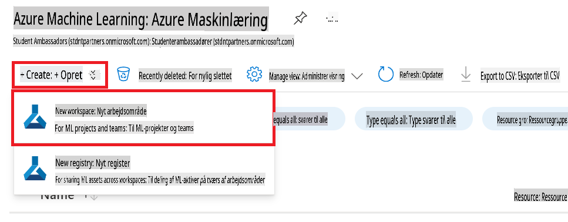

4. Udfør følgende opgaver:

    - Vælg dit Azure **Abonnement**.
    - Vælg den **Ressourcegruppe**, du vil bruge (opret en ny, hvis nødvendigt).
    - Indtast **Navn på arbejdsområde**. Det skal være en unik værdi.
    - Vælg den **Region**, du vil bruge.
    - Vælg den **Lagringskonto**, du vil bruge (opret en ny, hvis nødvendigt).
    - Vælg den **Nøglehvælving**, du vil bruge (opret en ny, hvis nødvendigt).
    - Vælg den **Applikationsindsigt**, du vil bruge (opret en ny, hvis nødvendigt).
    - Vælg det **Containerregister**, du vil bruge (opret en ny, hvis nødvendigt).

    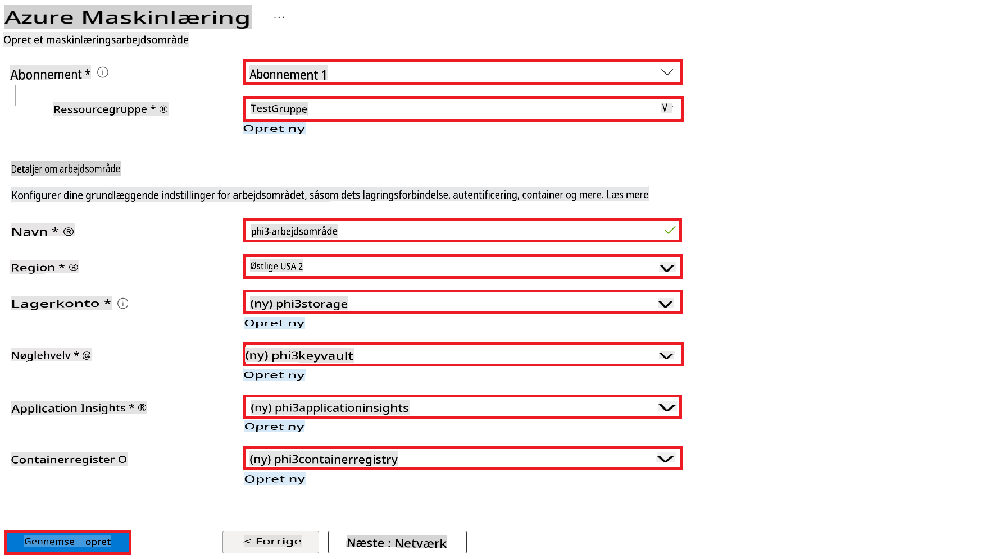

5. Vælg **Gennemse + Opret**.

6. Vælg **Opret**.

### Anmod om GPU-kvoter i Azure-abonnement

I denne vejledning lærer du, hvordan du finjusterer og udruller en Phi-3-model ved hjælp af GPU'er. Til finjustering vil du bruge GPU'en *Standard_NC24ads_A100_v4*, som kræver en kvoteanmodning. Til udrulning vil du bruge GPU'en *Standard_NC6s_v3*, som også kræver en kvoteanmodning.

> [!NOTE]
>
> Kun Pay-As-You-Go-abonnementer (standardtypen af abonnement) er berettiget til GPU-allokering; fordel-abonnementer understøttes i øjeblikket ikke.
>

1. Besøg [Azure ML Studio](https://ml.azure.com/home?wt.mc_id=studentamb_279723).

1. Udfør følgende opgaver for at anmode om kvote for *Standard NCADSA100v4 Family*:

    - Vælg **Kvote** fra venstre sidetab.
    - Vælg den **Virtuelle maskinfamilie**, du vil bruge. For eksempel **Standard NCADSA100v4 Family Cluster Dedicated vCPUs**, som inkluderer GPU'en *Standard_NC24ads_A100_v4*.
    - Vælg **Anmod om kvote** fra navigationsmenuen.

        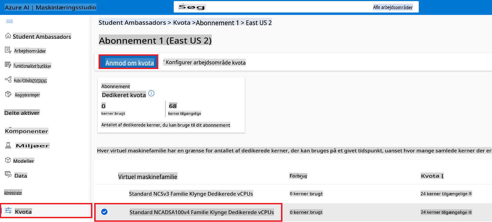

    - Inde på Anmod om kvote-siden skal du indtaste den **Nye kernegrænse**, du ønsker at bruge. For eksempel 24.
    - Inde på Anmod om kvote-siden skal du vælge **Indsend** for at anmode om GPU-kvoten.

1. Udfør følgende opgaver for at anmode om kvote for *Standard NCSv3 Family*:

    - Vælg **Kvote** fra venstre sidetab.
    - Vælg den **Virtuelle maskinfamilie**, du vil bruge. For eksempel **Standard NCSv3 Family Cluster Dedicated vCPUs**, som inkluderer GPU'en *Standard_NC6s_v3*.
    - Vælg **Anmod om kvote** fra navigationsmenuen.
    - Inde på Anmod om kvote-siden skal du indtaste den **Nye kernegrænse**, du ønsker at bruge. For eksempel 24.
    - Inde på Anmod om kvote-siden skal du vælge **Indsend** for at anmode om GPU-kvoten.

### Tilføj rollefordeling

For at finjustere og udrulle dine modeller skal du først oprette en User Assigned Managed Identity (UAI) og tildele den de relevante tilladelser. Denne UAI vil blive brugt til godkendelse under udrulning.

#### Opret User Assigned Managed Identity (UAI)

1. Skriv *managed identities* i **søgefeltet** øverst på portalens side, og vælg **Managed Identities** fra de viste muligheder.

    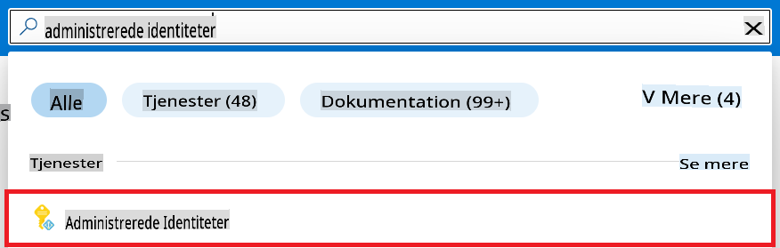

1. Vælg **+ Opret**.

    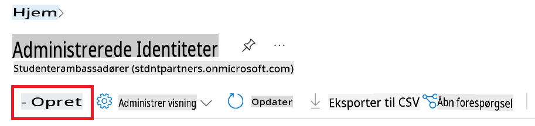

1. Udfør følgende opgaver:

    - Vælg dit Azure **Abonnement**.
    - Vælg den **Ressourcegruppe**, du vil bruge (opret en ny, hvis nødvendigt).
    - Vælg den **Region**, du vil bruge.
    - Indtast **Navn**. Det skal være en unik værdi.

    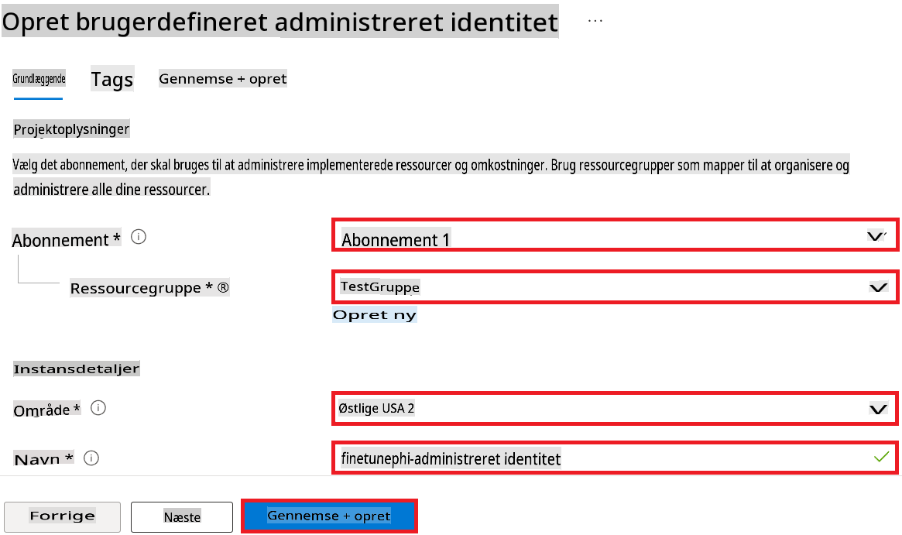

1. Vælg **Gennemse + opret**.

1. Vælg **+ Opret**.

#### Tilføj Contributor-rolle til Managed Identity

1. Naviger til den Managed Identity-ressource, du har oprettet.

1. Vælg **Azure rollefordelinger** fra venstre sidetab.

1. Vælg **+ Tilføj rollefordeling** fra navigationsmenuen.

1. Inde på Tilføj rollefordeling-siden skal du udføre følgende opgaver:
    - Vælg **Omfang** til **Ressourcegruppe**.
    - Vælg dit Azure **Abonnement**.
    - Vælg den **Ressourcegruppe**, du vil bruge.
    - Vælg **Rolle** til **Bidragyder**.

    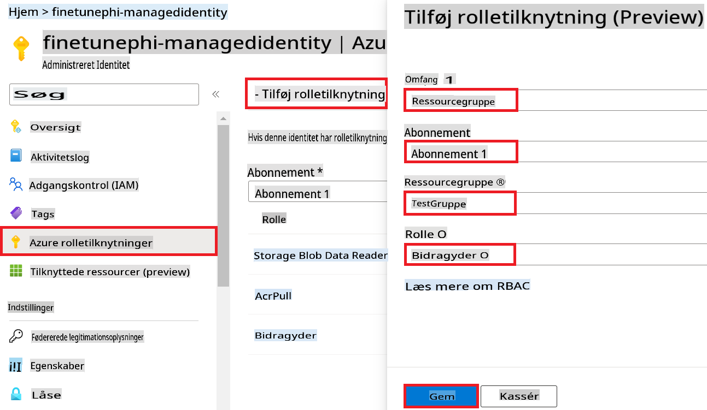

2. Vælg **Gem**.

#### Tilføj Storage Blob Data Reader-rolle til Managed Identity

1. Skriv *storage accounts* i **søgefeltet** øverst på portalens side, og vælg **Storage accounts** fra de viste muligheder.

    

1. Vælg den lagringskonto, der er knyttet til det Azure Machine Learning-arbejdsområde, du har oprettet. For eksempel *finetunephistorage*.

1. Udfør følgende opgaver for at navigere til Tilføj rollefordeling-siden:

    - Naviger til den Azure Storage-konto, du har oprettet.
    - Vælg **Adgangskontrol (IAM)** fra venstre sidetab.
    - Vælg **+ Tilføj** fra navigationsmenuen.
    - Vælg **Tilføj rollefordeling** fra navigationsmenuen.

    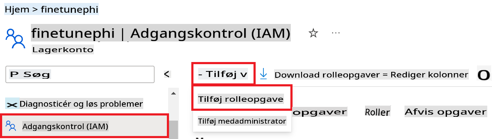

1. Inde på Tilføj rollefordeling-siden skal du udføre følgende opgaver:

    - Inde på Rolle-siden skal du skrive *Storage Blob Data Reader* i **søgefeltet** og vælge **Storage Blob Data Reader** fra de viste muligheder.
    - Inde på Rolle-siden skal du vælge **Næste**.
    - Inde på Medlemmer-siden skal du vælge **Tildel adgang til** **Managed identity**.
    - Inde på Medlemmer-siden skal du vælge **+ Vælg medlemmer**.
    - Inde på Vælg managed identities-siden skal du vælge dit Azure **Abonnement**.
    - Inde på Vælg managed identities-siden skal du vælge **Managed identity** til **Manage Identity**.
    - Inde på Vælg managed identities-siden skal du vælge den Managed Identity, du har oprettet. For eksempel *finetunephi-managedidentity*.
    - Inde på Vælg managed identities-siden skal du vælge **Vælg**.

    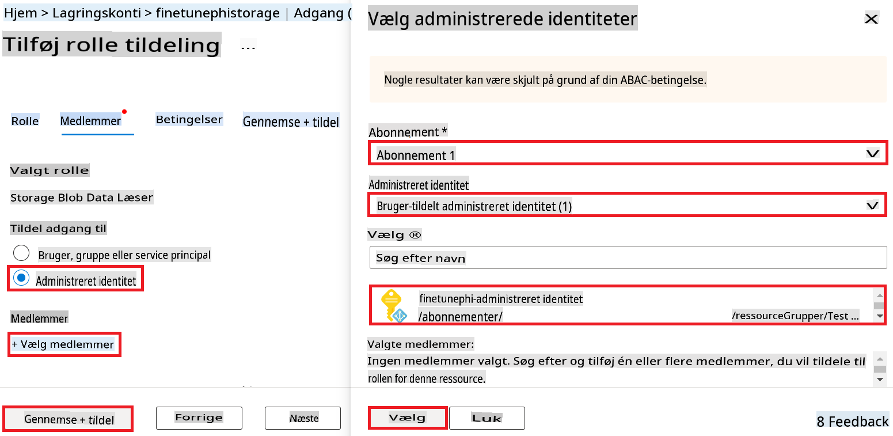

1. Vælg **Gennemse + tildel**.

#### Tilføj AcrPull-rolle til Managed Identity

1. Skriv *container registries* i **søgefeltet** øverst på portalens side, og vælg **Container registries** fra de viste muligheder.

    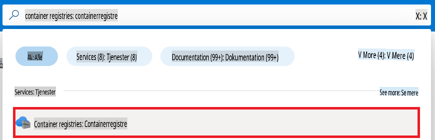

1. Vælg det containerregister, der er knyttet til Azure Machine Learning-arbejdsområdet. For eksempel *finetunephicontainerregistry*.

1. Udfør følgende opgaver for at navigere til Tilføj rollefordeling-siden:

    - Vælg **Adgangskontrol (IAM)** fra venstre sidetab.
    - Vælg **+ Tilføj** fra navigationsmenuen.
    - Vælg **Tilføj rollefordeling** fra navigationsmenuen.

1. Inde på Tilføj rollefordeling-siden skal du udføre følgende opgaver:

    - Inde på Rolle-siden skal du skrive *AcrPull* i **søgefeltet** og vælge **AcrPull** fra de viste muligheder.
    - Inde på Rolle-siden skal du vælge **Næste**.
    - Inde på Medlemmer-siden skal du vælge **Tildel adgang til** **Managed identity**.
    - Inde på Medlemmer-siden skal du vælge **+ Vælg medlemmer**.
    - Inde på Vælg managed identities-siden skal du vælge dit Azure **Abonnement**.
    - Inde på Vælg managed identities-siden skal du vælge **Managed identity** til **Manage Identity**.
    - Inde på Vælg managed identities-siden skal du vælge den Managed Identity, du har oprettet. For eksempel *finetunephi-managedidentity*.
    - Inde på Vælg managed identities-siden skal du vælge **Vælg**.
    - Vælg **Gennemse + tildel**.

### Opsæt projekt

For at downloade de datasæt, der er nødvendige for finjustering, skal du opsætte et lokalt miljø.

I denne øvelse vil du:

- Oprette en mappe til at arbejde i.
- Oprette et virtuelt miljø.
- Installere de nødvendige pakker.
- Oprette en *download_dataset.py*-fil til at downloade datasættet.

#### Opret en mappe til at arbejde i

1. Åbn et terminalvindue, og skriv følgende kommando for at oprette en mappe med navnet *finetune-phi* i standardstien.

    ```console
    mkdir finetune-phi
    ```

2. Skriv følgende kommando i terminalen for at navigere til *finetune-phi*-mappen, du oprettede.

    ```console
    cd finetune-phi
    ```

#### Opret et virtuelt miljø

1. Skriv følgende kommando i terminalen for at oprette et virtuelt miljø med navnet *.venv*.

    ```console
    python -m venv .venv
    ```

2. Skriv følgende kommando i terminalen for at aktivere det virtuelle miljø.

    ```console
    .venv\Scripts\activate.bat
    ```

> [!NOTE]
> Hvis det virker, bør du se *(.venv)* foran kommandoprompten.

#### Installer de nødvendige pakker

1. Skriv følgende kommandoer i terminalen for at installere de nødvendige pakker.

    ```console
    pip install datasets==2.19.1
    ```

#### Opret `download_dataset.py`

> [!NOTE]
> Komplet mappestruktur:
>
> ```text
> └── YourUserName
> .    └── finetune-phi
> .        └── download_dataset.py
> ```

1. Åbn **Visual Studio Code**.

1. Vælg **Fil** i menulinjen.

1. Vælg **Åbn mappe**.

1. Vælg *finetune-phi*-mappen, du oprettede, som er placeret på *C:\Users\ditBrugernavn\finetune-phi*.

    

1. I venstre side af Visual Studio Code, højreklik og vælg **Ny fil** for at oprette en ny fil med navnet *download_dataset.py*.

    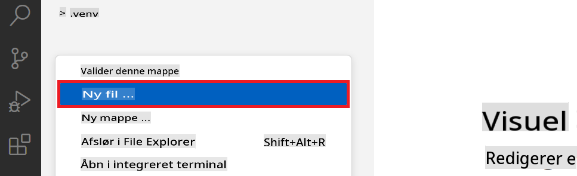

### Forbered datasæt til finjustering

I denne øvelse vil du køre *download_dataset.py*-filen for at downloade *ultrachat_200k*-datasættene til dit lokale miljø. Derefter vil du bruge disse datasæt til at finjustere Phi-3-modellen i Azure Machine Learning.

I denne øvelse vil du:

- Tilføje kode til *download_dataset.py*-filen for at downloade datasættene.
- Køre *download_dataset.py*-filen for at downloade datasættene til dit lokale miljø.

#### Download dit datasæt ved hjælp af *download_dataset.py*

1. Åbn *download_dataset.py*-filen i Visual Studio Code.

1. Tilføj følgende kode til *download_dataset.py*-filen.

    ```python
    import json
    import os
    from datasets import load_dataset

    def load_and_split_dataset(dataset_name, config_name, split_ratio):
        """
        Load and split a dataset.
        """
        # Load the dataset with the specified name, configuration, and split ratio
        dataset = load_dataset(dataset_name, config_name, split=split_ratio)
        print(f"Original dataset size: {len(dataset)}")
        
        # Split the dataset into train and test sets (80% train, 20% test)
        split_dataset = dataset.train_test_split(test_size=0.2)
        print(f"Train dataset size: {len(split_dataset['train'])}")
        print(f"Test dataset size: {len(split_dataset['test'])}")
        
        return split_dataset

    def save_dataset_to_jsonl(dataset, filepath):
        """
        Save a dataset to a JSONL file.
        """
        # Create the directory if it does not exist
        os.makedirs(os.path.dirname(filepath), exist_ok=True)
        
        # Open the file in write mode
        with open(filepath, 'w', encoding='utf-8') as f:
            # Iterate over each record in the dataset
            for record in dataset:
                # Dump the record as a JSON object and write it to the file
                json.dump(record, f)
                # Write a newline character to separate records
                f.write('\n')
        
        print(f"Dataset saved to {filepath}")

    def main():
        """
        Main function to load, split, and save the dataset.
        """
        # Load and split the ULTRACHAT_200k dataset with a specific configuration and split ratio
        dataset = load_and_split_dataset("HuggingFaceH4/ultrachat_200k", 'default', 'train_sft[:1%]')
        
        # Extract the train and test datasets from the split
        train_dataset = dataset['train']
        test_dataset = dataset['test']

        # Save the train dataset to a JSONL file
        save_dataset_to_jsonl(train_dataset, "data/train_data.jsonl")
        
        # Save the test dataset to a separate JSONL file
        save_dataset_to_jsonl(test_dataset, "data/test_data.jsonl")

    if __name__ == "__main__":
        main()

    ```

1. Skriv følgende kommando i terminalen for at køre scriptet og downloade datasættet til dit lokale miljø.

    ```console
    python download_dataset.py
    ```

1. Bekræft, at datasættene blev gemt korrekt i din lokale *finetune-phi/data*-mappe.

> [!NOTE]
>
> #### Bemærkning om datasætsstørrelse og finjusteringstid
>
> I denne vejledning bruger du kun 1% af datasættet (`split='train[:1%]'`). Dette reducerer betydeligt mængden af data, hvilket gør upload- og finjusteringsprocesserne hurt
1. Besøg [Azure ML Studio](https://ml.azure.com/home?wt.mc_id=studentamb_279723).

1. Vælg **Compute** fra menuen til venstre.

1. Vælg **Compute clusters** fra navigationsmenuen.

1. Vælg **+ New**.

    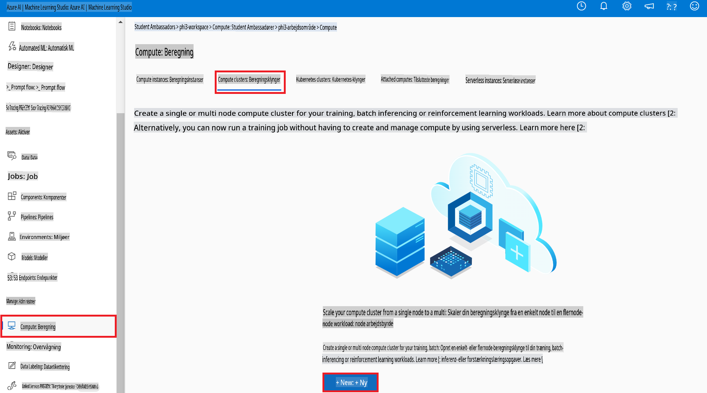

1. Udfør følgende opgaver:

    - Vælg den **Region**, du vil bruge.
    - Sæt **Virtual machine tier** til **Dedicated**.
    - Sæt **Virtual machine type** til **GPU**.
    - Filtrer **Virtual machine size** til **Select from all options**.
    - Vælg **Virtual machine size** til **Standard_NC24ads_A100_v4**.

    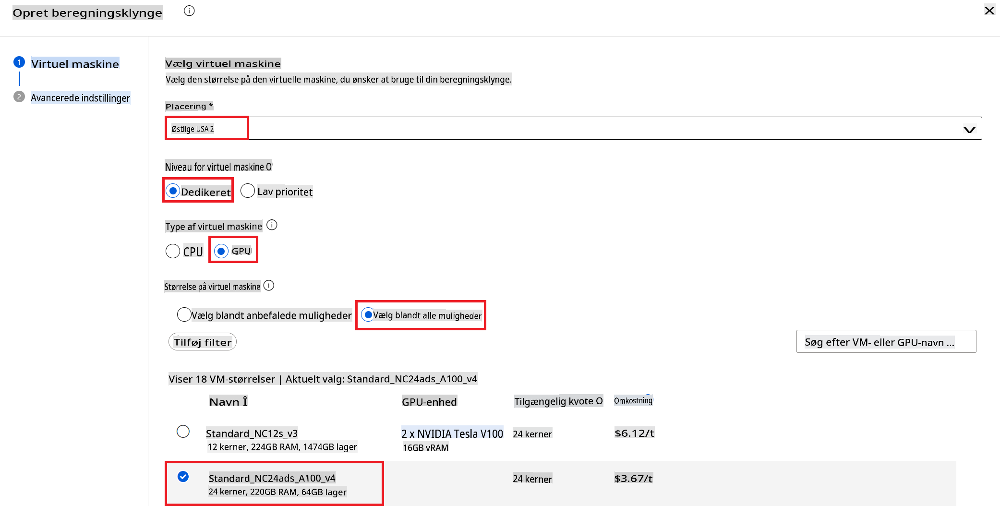

1. Vælg **Next**.

1. Udfør følgende opgaver:

    - Indtast **Compute name**. Det skal være en unik værdi.
    - Sæt **Minimum number of nodes** til **0**.
    - Sæt **Maximum number of nodes** til **1**.
    - Sæt **Idle seconds before scale down** til **120**.

    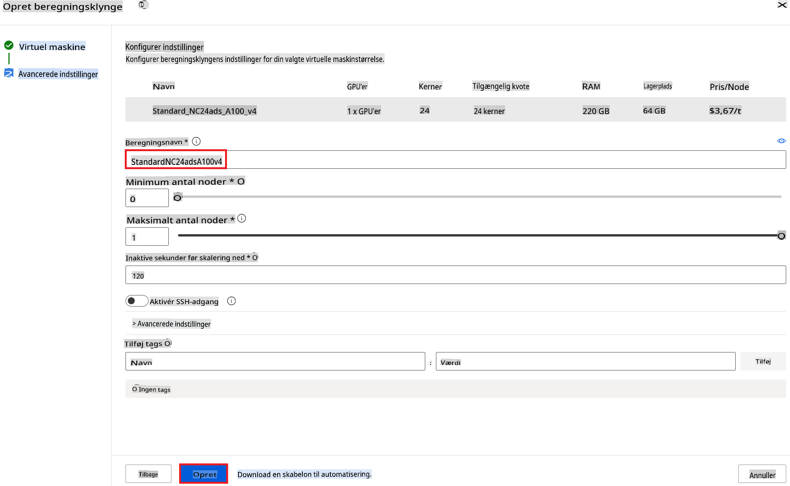

1. Vælg **Create**.

#### Finjuster Phi-3-modellen

1. Besøg [Azure ML Studio](https://ml.azure.com/home?wt.mc_id=studentamb_279723).

1. Vælg den Azure Machine Learning-arbejdsplads, du har oprettet.

    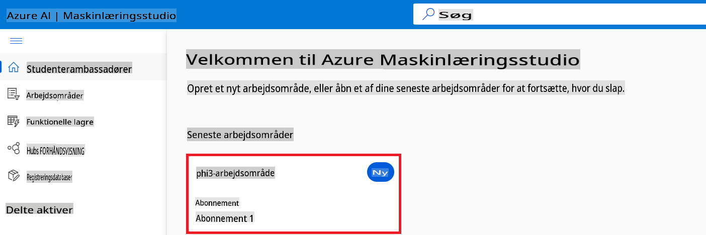

1. Udfør følgende opgaver:

    - Vælg **Model catalog** fra menuen til venstre.
    - Skriv *phi-3-mini-4k* i **søgefeltet**, og vælg **Phi-3-mini-4k-instruct** fra de viste muligheder.

    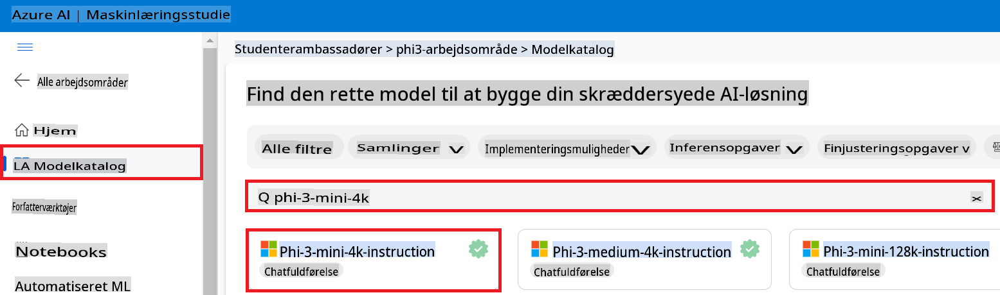

1. Vælg **Fine-tune** fra navigationsmenuen.

    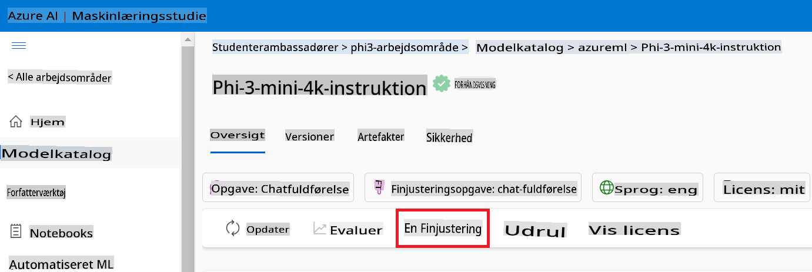

1. Udfør følgende opgaver:

    - Sæt **Select task type** til **Chat completion**.
    - Vælg **+ Select data** for at uploade **Træningsdata**.
    - Sæt uploadtypen for valideringsdata til **Provide different validation data**.
    - Vælg **+ Select data** for at uploade **Valideringsdata**.

    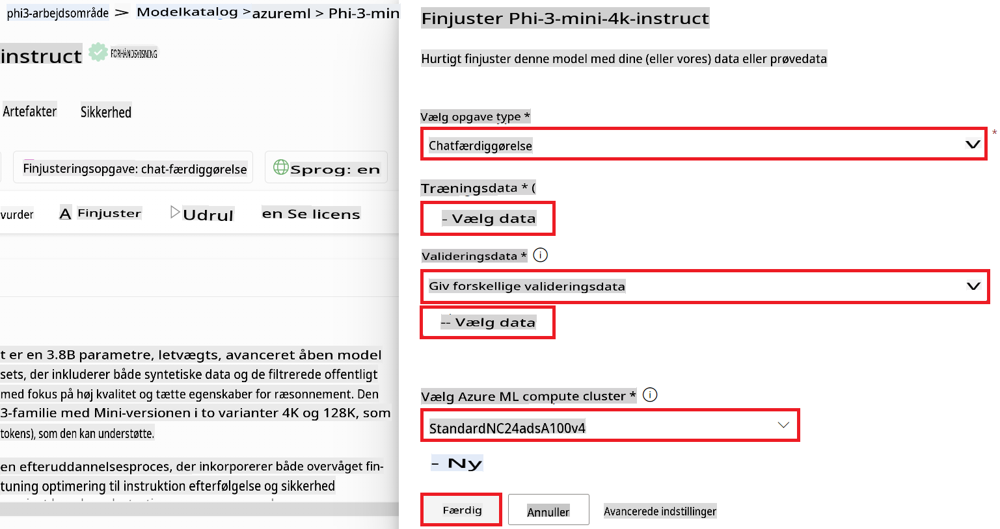

    > [!TIP]
    >
    > Du kan vælge **Advanced settings** for at tilpasse konfigurationer som **learning_rate** og **lr_scheduler_type** for at optimere finjusteringsprocessen efter dine specifikke behov.

1. Vælg **Finish**.

1. I denne øvelse har du med succes finjusteret Phi-3-modellen ved hjælp af Azure Machine Learning. Bemærk, at finjusteringsprocessen kan tage en del tid. Efter at have kørt finjusteringsjobbet, skal du vente, indtil det er færdigt. Du kan overvåge status for finjusteringsjobbet ved at navigere til fanen Jobs i venstre side af din Azure Machine Learning-arbejdsplads. I den næste serie vil du implementere den finjusterede model og integrere den med Prompt flow.

    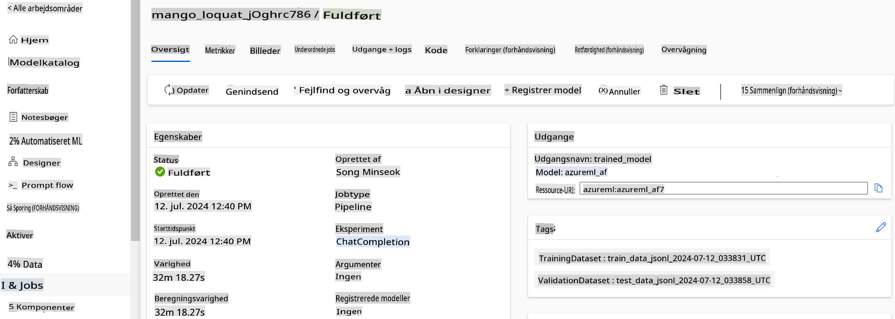

### Implementer den finjusterede Phi-3-model

For at integrere den finjusterede Phi-3-model med Prompt flow skal du implementere modellen, så den kan tilgås til realtidsforudsigelser. Denne proces indebærer registrering af modellen, oprettelse af en online endpoint og implementering af modellen.

I denne øvelse vil du:

- Registrere den finjusterede model i Azure Machine Learning-arbejdspladsen.
- Oprette en online endpoint.
- Implementere den registrerede finjusterede Phi-3-model.

#### Registrer den finjusterede model

1. Besøg [Azure ML Studio](https://ml.azure.com/home?wt.mc_id=studentamb_279723).

1. Vælg den Azure Machine Learning-arbejdsplads, du har oprettet.

    

1. Vælg **Models** fra menuen til venstre.  
1. Vælg **+ Register**.  
1. Vælg **From a job output**.

    

1. Vælg det job, du har oprettet.

    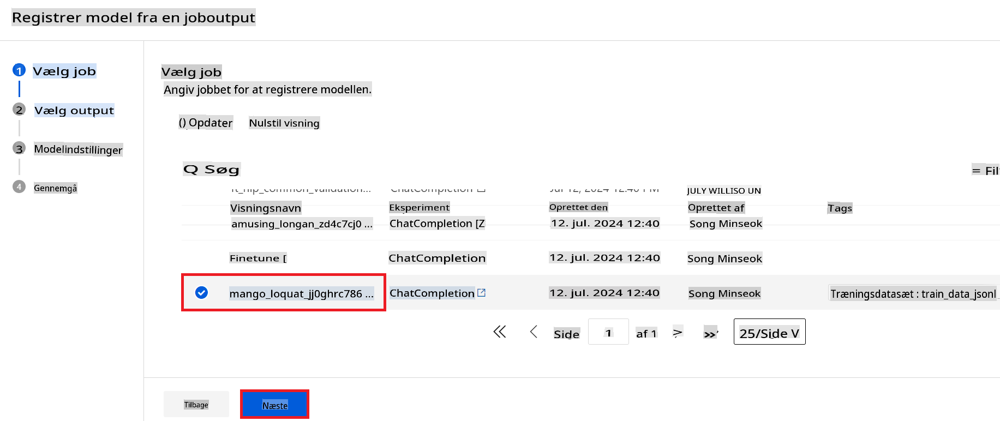

1. Vælg **Next**.

1. Sæt **Model type** til **MLflow**.

1. Sørg for, at **Job output** er valgt; det bør automatisk være valgt.

    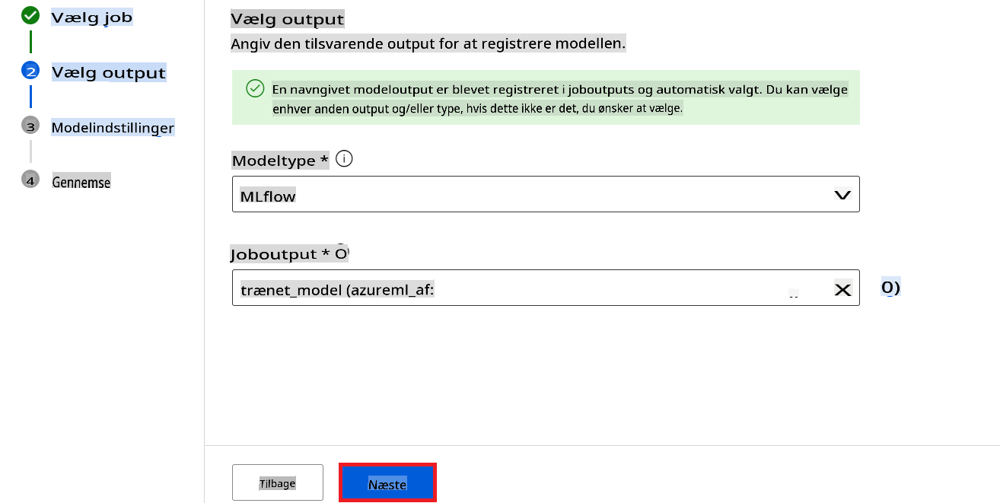

2. Vælg **Next**.

3. Vælg **Register**.

    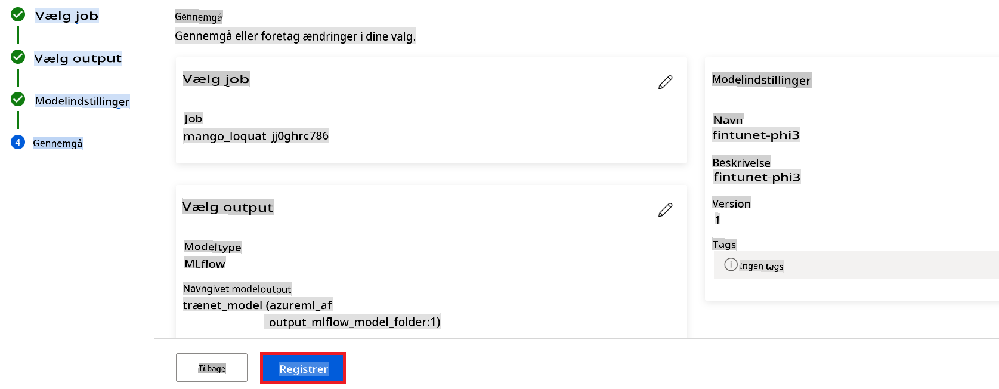

4. Du kan se din registrerede model ved at navigere til menuen **Models** fra venstre side.

    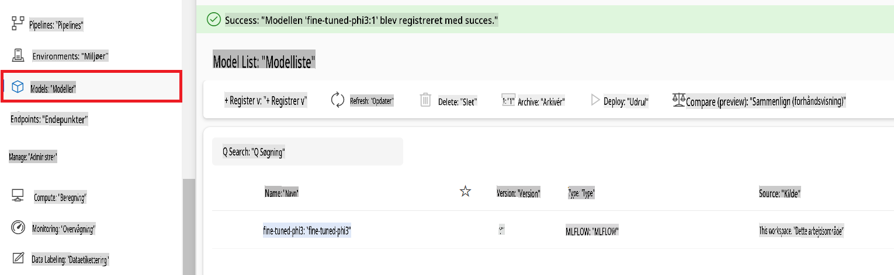

#### Implementer den finjusterede model

1. Gå til den Azure Machine Learning-arbejdsplads, du har oprettet.

1. Vælg **Endpoints** fra menuen til venstre.

1. Vælg **Real-time endpoints** fra navigationsmenuen.

    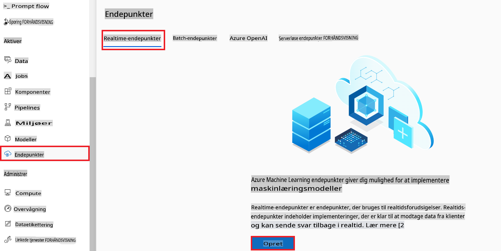

1. Vælg **Create**.

1. Vælg den registrerede model, du har oprettet.

    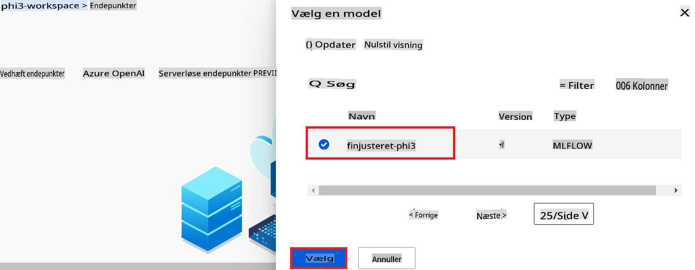

1. Vælg **Select**.

1. Udfør følgende opgaver:

    - Sæt **Virtual machine** til *Standard_NC6s_v3*.
    - Vælg det **Instance count**, du ønsker at bruge. For eksempel *1*.
    - Sæt **Endpoint** til **New** for at oprette en ny endpoint.
    - Indtast **Endpoint name**. Det skal være en unik værdi.
    - Indtast **Deployment name**. Det skal være en unik værdi.

    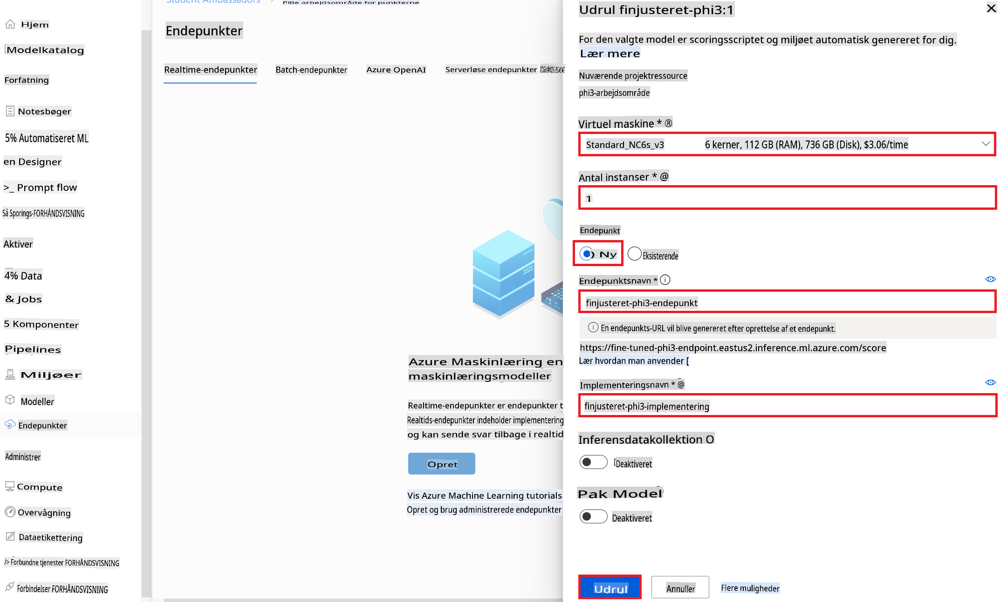

1. Vælg **Deploy**.

> [!WARNING]
> For at undgå yderligere omkostninger på din konto skal du sørge for at slette den oprettede endpoint i Azure Machine Learning-arbejdspladsen.
>

#### Kontroller implementeringsstatus i Azure Machine Learning Workspace

1. Naviger til den Azure Machine Learning-arbejdsplads, du har oprettet.

1. Vælg **Endpoints** fra menuen til venstre.

1. Vælg den endpoint, du har oprettet.

    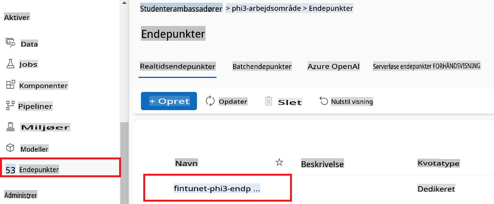

1. På denne side kan du administrere endpoints under implementeringsprocessen.

> [!NOTE]
> Når implementeringen er færdig, skal du sikre dig, at **Live traffic** er sat til **100%**. Hvis det ikke er tilfældet, skal du vælge **Update traffic** for at justere trafikindstillingerne. Bemærk, at du ikke kan teste modellen, hvis trafikken er sat til 0%.
>
> 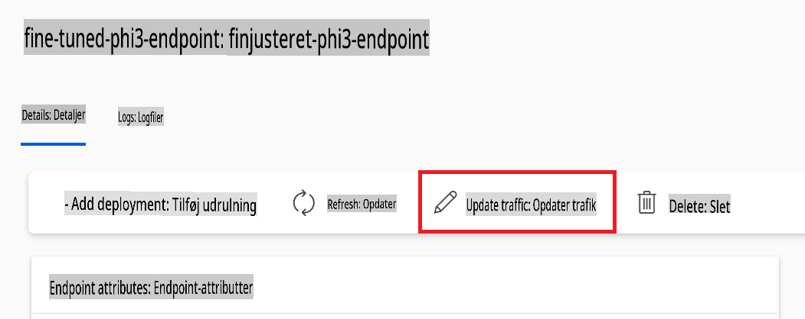
>

## Scenario 3: Integrer med Prompt flow og chat med din tilpassede model i Azure AI Foundry

### Integrer den tilpassede Phi-3-model med Prompt flow

Efter at have implementeret din finjusterede model kan du nu integrere den med Prompt Flow for at bruge din model i realtidsapplikationer, hvilket muliggør en række interaktive opgaver med din tilpassede Phi-3-model.

I denne øvelse vil du:

- Oprette Azure AI Foundry Hub.
- Oprette Azure AI Foundry Project.
- Oprette Prompt flow.
- Tilføje en tilpasset forbindelse til den finjusterede Phi-3-model.
- Opsætte Prompt flow til at chatte med din tilpassede Phi-3-model.

> [!NOTE]
> Du kan også integrere med Prompt flow ved hjælp af Azure ML Studio. Den samme integrationsproces kan anvendes på Azure ML Studio.

#### Opret Azure AI Foundry Hub

Du skal oprette en Hub, før du opretter projektet. En Hub fungerer som en Resource Group og giver dig mulighed for at organisere og administrere flere projekter i Azure AI Foundry.

1. Besøg [Azure AI Foundry](https://ai.azure.com/?WT.mc_id=aiml-137032-kinfeylo).

1. Vælg **All hubs** fra menuen til venstre.

1. Vælg **+ New hub** fra navigationsmenuen.

    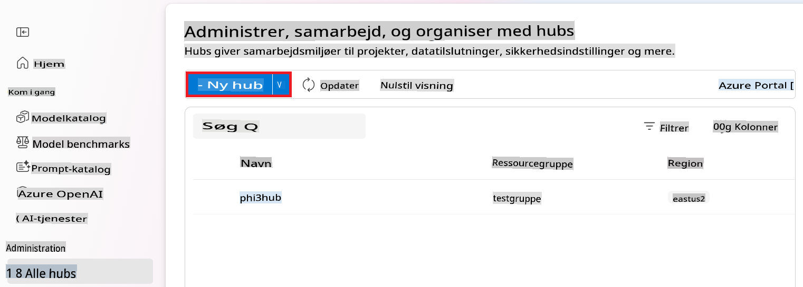

1. Udfør følgende opgaver:

    - Indtast **Hub name**. Det skal være en unik værdi.
    - Vælg din Azure **Subscription**.
    - Vælg den **Resource group**, du vil bruge (opret en ny, hvis nødvendigt).
    - Vælg den **Location**, du vil bruge.
    - Vælg **Connect Azure AI Services**, du vil bruge (opret en ny, hvis nødvendigt).
    - Sæt **Connect Azure AI Search** til **Skip connecting**.

    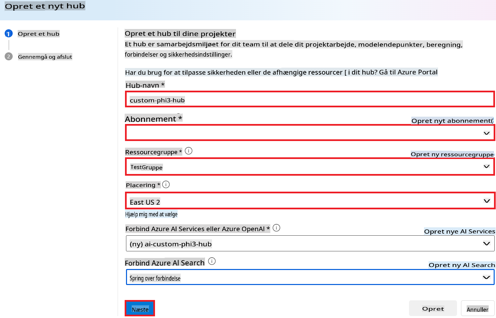

1. Vælg **Next**.

#### Opret Azure AI Foundry Project

1. I den hub, du har oprettet, skal du vælge **All projects** fra menuen til venstre.

1. Vælg **+ New project** fra navigationsmenuen.

    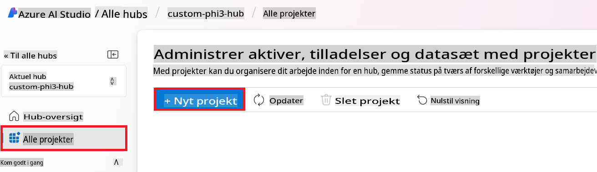

1. Indtast **Project name**. Det skal være en unik værdi.

    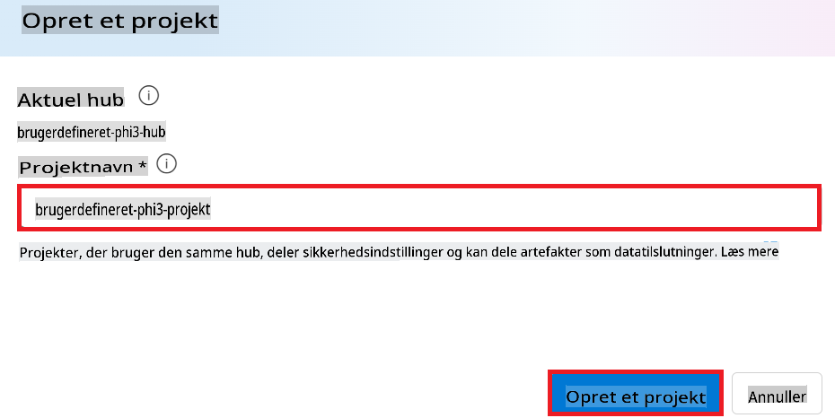

1. Vælg **Create a project**.

#### Tilføj en tilpasset forbindelse til den finjusterede Phi-3-model

For at integrere din tilpassede Phi-3-model med Prompt flow skal du gemme modellens endpoint og nøgle i en tilpasset forbindelse. Denne opsætning sikrer adgang til din tilpassede Phi-3-model i Prompt flow.

#### Sæt API-nøgle og endpoint-URI for den finjusterede Phi-3-model

1. Besøg [Azure ML Studio](https://ml.azure.com/home?WT.mc_id=aiml-137032-kinfeylo).

1. Naviger til den Azure Machine Learning-arbejdsplads, du har oprettet.

1. Vælg **Endpoints** fra menuen til venstre.

    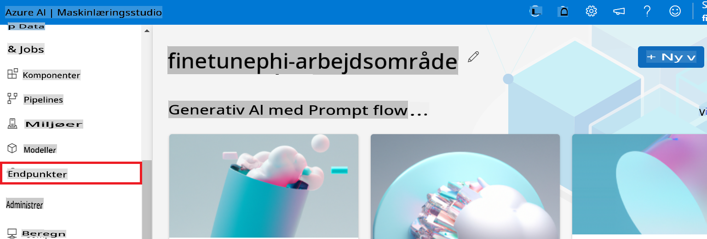

1. Vælg den endpoint, du har oprettet.

    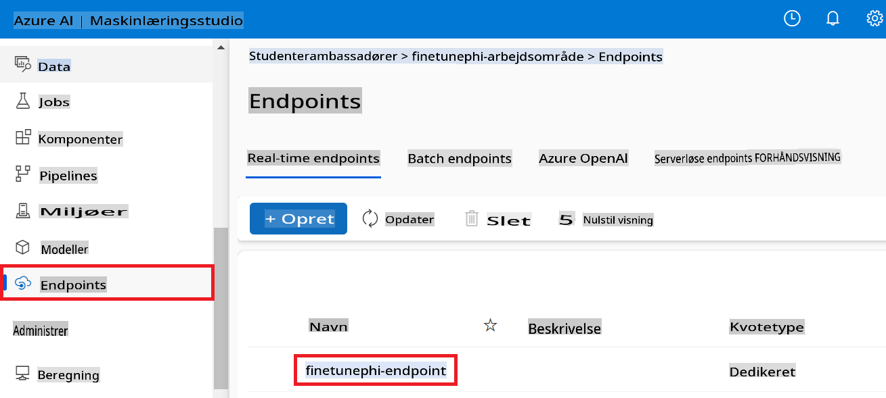

1. Vælg **Consume** fra navigationsmenuen.

1. Kopiér din **REST endpoint** og **Primary key**.
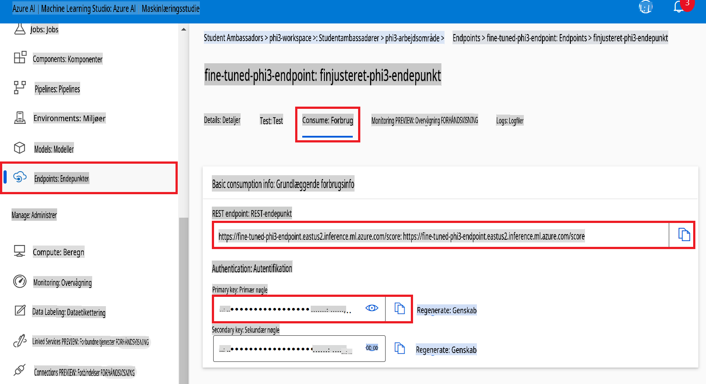

#### Tilføj den brugerdefinerede forbindelse

1. Besøg [Azure AI Foundry](https://ai.azure.com/?WT.mc_id=aiml-137032-kinfeylo).

1. Naviger til det Azure AI Foundry-projekt, du har oprettet.

1. I det projekt, du har oprettet, vælg **Indstillinger** i venstre sidepanel.

1. Vælg **+ Ny forbindelse**.

    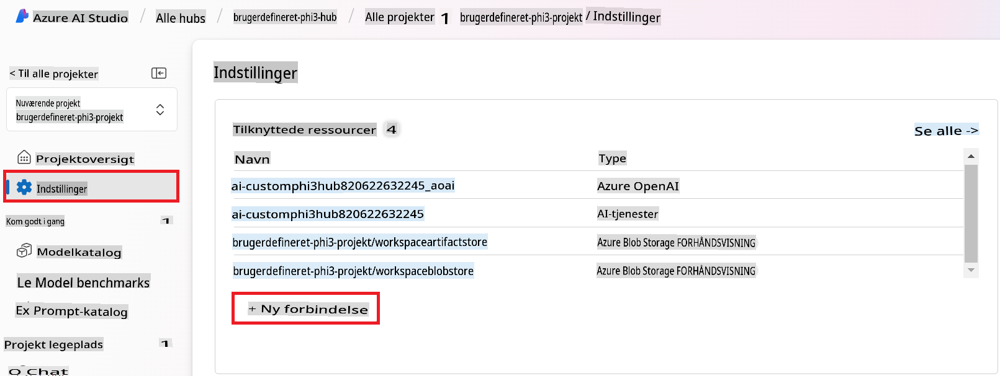

1. Vælg **Brugerdefinerede nøgler** fra navigationsmenuen.

    

1. Udfør følgende opgaver:

    - Vælg **+ Tilføj nøgle-værdi-par**.
    - For nøgle-navnet indtast **endpoint**, og indsæt endpointet, du kopierede fra Azure ML Studio, i værdifeltet.
    - Vælg **+ Tilføj nøgle-værdi-par** igen.
    - For nøgle-navnet indtast **key**, og indsæt nøglen, du kopierede fra Azure ML Studio, i værdifeltet.
    - Efter at have tilføjet nøglerne, vælg **is secret** for at forhindre, at nøglen bliver eksponeret.

    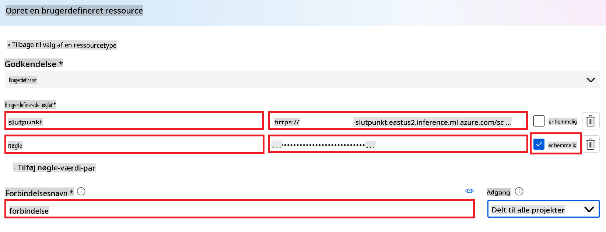

1. Vælg **Tilføj forbindelse**.

#### Opret Prompt flow

Du har tilføjet en brugerdefineret forbindelse i Azure AI Foundry. Lad os nu oprette et Prompt flow ved hjælp af følgende trin. Derefter vil du forbinde dette Prompt flow til den brugerdefinerede forbindelse, så du kan bruge den fintunede model i Prompt flow.

1. Naviger til det Azure AI Foundry-projekt, du har oprettet.

1. Vælg **Prompt flow** i venstre sidepanel.

1. Vælg **+ Opret** i navigationsmenuen.

    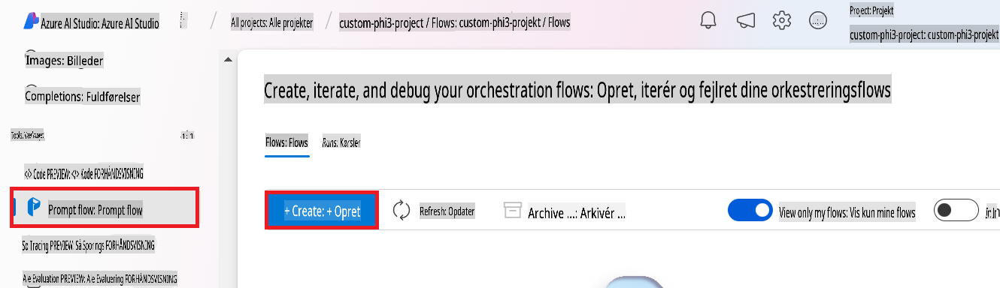

1. Vælg **Chat flow** i navigationsmenuen.

    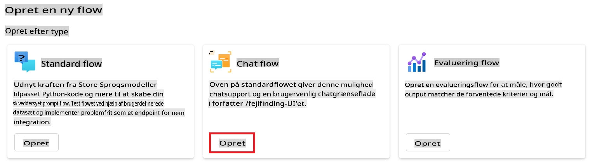

1. Indtast **Mappenavn**, der skal bruges.

    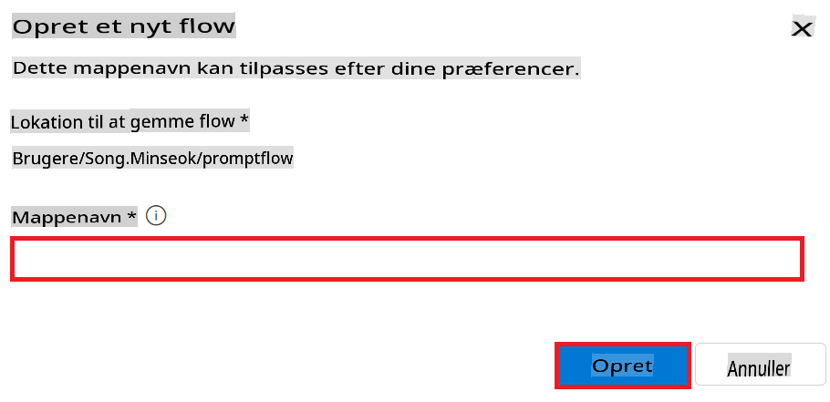

2. Vælg **Opret**.

#### Opsæt Prompt flow til at chatte med din brugerdefinerede Phi-3-model

Du skal integrere den fintunede Phi-3-model i et Prompt flow. Men det eksisterende Prompt flow, der er tilgængeligt, er ikke designet til dette formål. Derfor skal du redesigne Prompt flow for at muliggøre integrationen af den brugerdefinerede model.

1. I Prompt flow skal du udføre følgende opgaver for at genopbygge det eksisterende flow:

    - Vælg **Raw file mode**.
    - Slet al eksisterende kode i *flow.dag.yml*-filen.
    - Tilføj følgende kode til *flow.dag.yml*-filen.

        ```yml
        inputs:
          input_data:
            type: string
            default: "Who founded Microsoft?"

        outputs:
          answer:
            type: string
            reference: ${integrate_with_promptflow.output}

        nodes:
        - name: integrate_with_promptflow
          type: python
          source:
            type: code
            path: integrate_with_promptflow.py
          inputs:
            input_data: ${inputs.input_data}
        ```

    - Vælg **Gem**.

    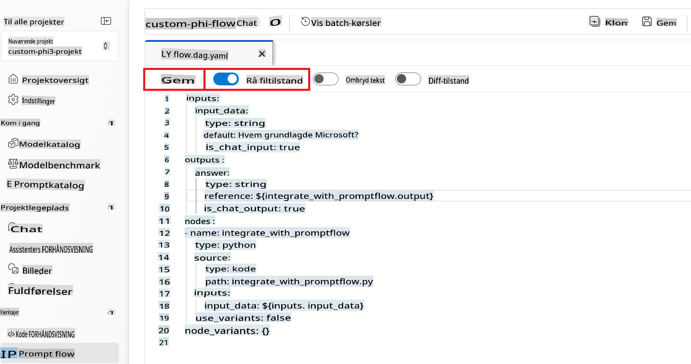

1. Tilføj følgende kode til *integrate_with_promptflow.py*-filen for at bruge den brugerdefinerede Phi-3-model i Prompt flow.

    ```python
    import logging
    import requests
    from promptflow import tool
    from promptflow.connections import CustomConnection

    # Logging setup
    logging.basicConfig(
        format="%(asctime)s - %(levelname)s - %(name)s - %(message)s",
        datefmt="%Y-%m-%d %H:%M:%S",
        level=logging.DEBUG
    )
    logger = logging.getLogger(__name__)

    def query_phi3_model(input_data: str, connection: CustomConnection) -> str:
        """
        Send a request to the Phi-3 model endpoint with the given input data using Custom Connection.
        """

        # "connection" is the name of the Custom Connection, "endpoint", "key" are the keys in the Custom Connection
        endpoint_url = connection.endpoint
        api_key = connection.key

        headers = {
            "Content-Type": "application/json",
            "Authorization": f"Bearer {api_key}"
        }
        data = {
            "input_data": {
                "input_string": [
                    {"role": "user", "content": input_data}
                ],
                "parameters": {
                    "temperature": 0.7,
                    "max_new_tokens": 128
                }
            }
        }
        try:
            response = requests.post(endpoint_url, json=data, headers=headers)
            response.raise_for_status()
            
            # Log the full JSON response
            logger.debug(f"Full JSON response: {response.json()}")

            result = response.json()["output"]
            logger.info("Successfully received response from Azure ML Endpoint.")
            return result
        except requests.exceptions.RequestException as e:
            logger.error(f"Error querying Azure ML Endpoint: {e}")
            raise

    @tool
    def my_python_tool(input_data: str, connection: CustomConnection) -> str:
        """
        Tool function to process input data and query the Phi-3 model.
        """
        return query_phi3_model(input_data, connection)

    ```

    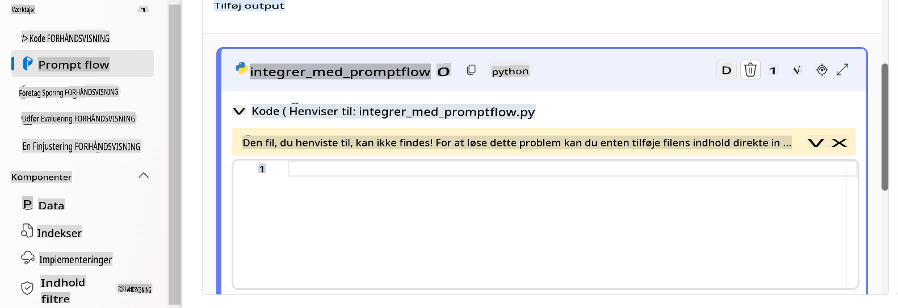

> [!NOTE]
> For mere detaljeret information om brug af Prompt flow i Azure AI Foundry, kan du se [Prompt flow i Azure AI Foundry](https://learn.microsoft.com/azure/ai-studio/how-to/prompt-flow).

1. Vælg **Chat input**, **Chat output** for at aktivere chat med din model.

    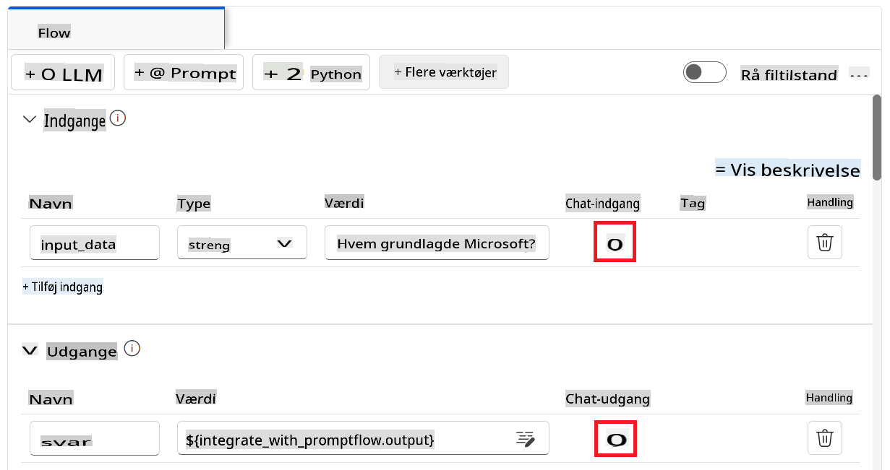

1. Nu er du klar til at chatte med din brugerdefinerede Phi-3-model. I den næste øvelse vil du lære, hvordan du starter Prompt flow og bruger det til at chatte med din fintunede Phi-3-model.

> [!NOTE]
>
> Det genopbyggede flow bør se ud som billedet nedenfor:
>
> 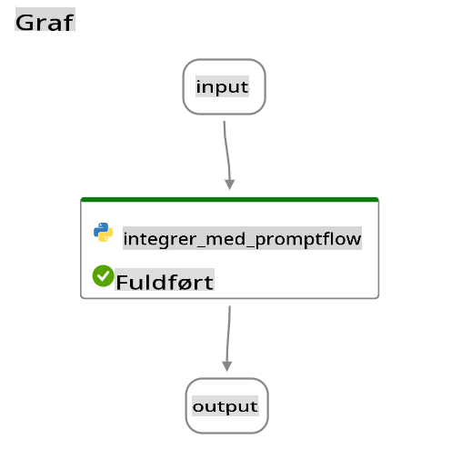
>

### Chat med din brugerdefinerede Phi-3-model

Nu hvor du har fintunet og integreret din brugerdefinerede Phi-3-model med Prompt flow, er du klar til at begynde at interagere med den. Denne øvelse vil guide dig gennem processen med at opsætte og starte en chat med din model ved hjælp af Prompt flow. Ved at følge disse trin vil du kunne udnytte din fintunede Phi-3-models fulde potentiale til forskellige opgaver og samtaler.

- Chat med din brugerdefinerede Phi-3-model ved hjælp af Prompt flow.

#### Start Prompt flow

1. Vælg **Start compute sessions** for at starte Prompt flow.

    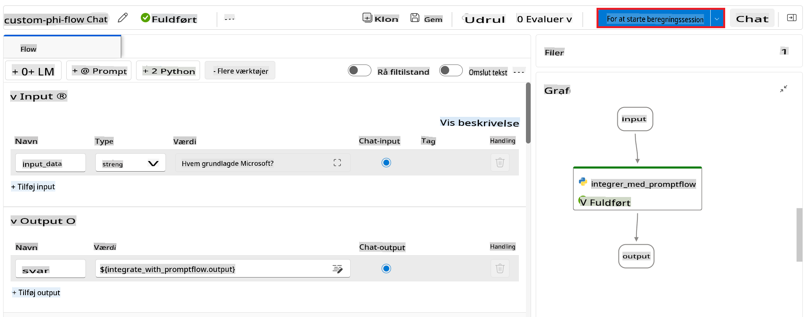

1. Vælg **Valider og parse input** for at forny parametre.

    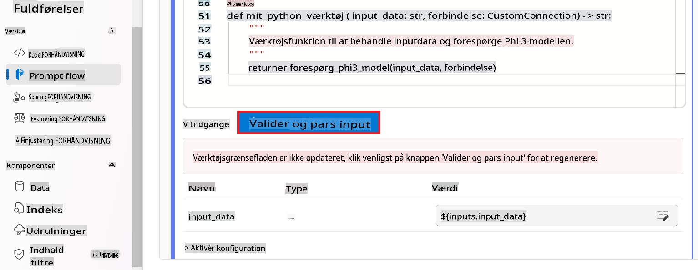

1. Vælg værdien af **connection** til den brugerdefinerede forbindelse, du oprettede. For eksempel *connection*.

    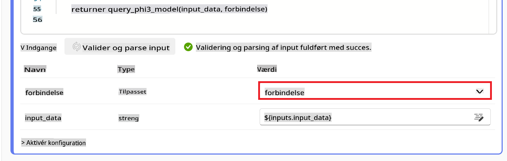

#### Chat med din brugerdefinerede model

1. Vælg **Chat**.

    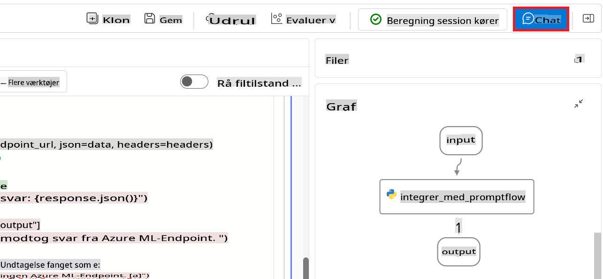

1. Her er et eksempel på resultaterne: Nu kan du chatte med din brugerdefinerede Phi-3-model. Det anbefales at stille spørgsmål baseret på de data, der blev brugt til fintuning.

    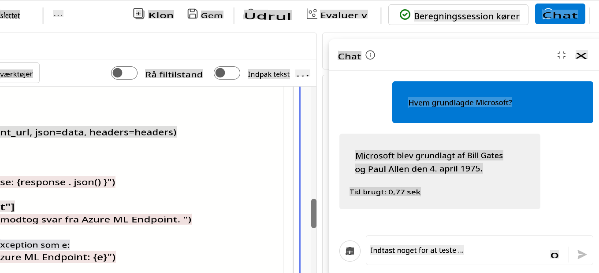

**Ansvarsfraskrivelse**:  
Dette dokument er blevet oversat ved hjælp af maskinbaserede AI-oversættelsestjenester. Selvom vi bestræber os på at opnå nøjagtighed, bedes du være opmærksom på, at automatiserede oversættelser kan indeholde fejl eller unøjagtigheder. Det originale dokument på dets oprindelige sprog bør betragtes som den autoritative kilde. For kritisk information anbefales professionel menneskelig oversættelse. Vi påtager os intet ansvar for misforståelser eller fejltolkninger, der måtte opstå som følge af brugen af denne oversættelse.