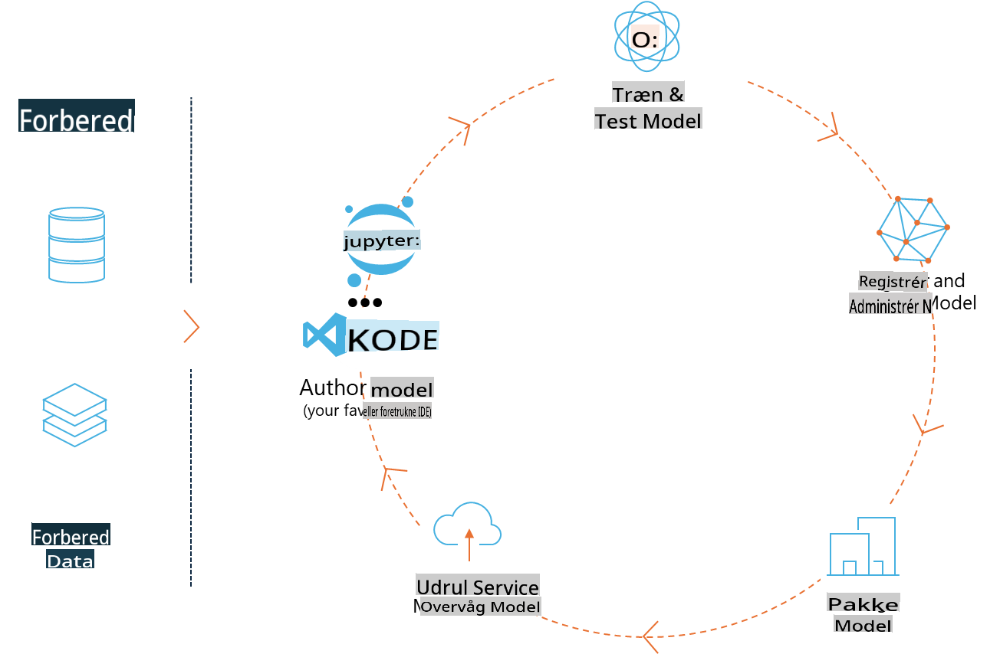
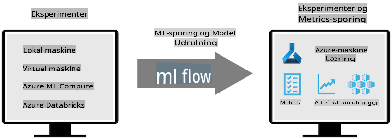
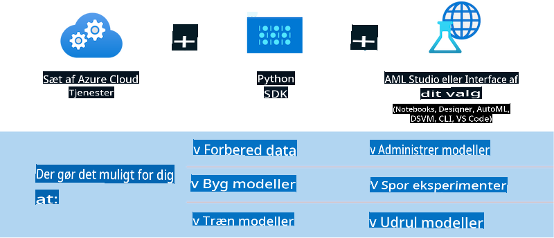

# MLflow

[MLflow](https://mlflow.org/) er en open-source platform designet til at håndtere hele livscyklussen for maskinlæring.



MLFlow bruges til at administrere ML-livscyklussen, herunder eksperimentering, reproducerbarhed, udrulning og en central modelregistrering. MLFlow tilbyder i øjeblikket fire komponenter:

- **MLflow Tracking:** Registrer og forespørg på eksperimenter, kode, datakonfiguration og resultater.
- **MLflow Projects:** Pak datavidenskabelig kode i et format, der kan reproducere kørsler på enhver platform.
- **MLflow Models:** Udrul maskinlæringsmodeller i forskellige miljøer.
- **Model Registry:** Gem, annotér og administrer modeller i et centralt lager.

Platformen inkluderer funktioner til at spore eksperimenter, pakke kode til reproducerbare kørsler og dele samt udrulle modeller. MLFlow er integreret i Databricks og understøtter en række ML-biblioteker, hvilket gør det bibliotek-uafhængigt. Det kan bruges med ethvert maskinlæringsbibliotek og i ethvert programmeringssprog, da det tilbyder en REST API og CLI for nemheds skyld.



Nøglefunktioner i MLFlow inkluderer:

- **Eksperimenttracking:** Registrer og sammenlign parametre og resultater.
- **Modelhåndtering:** Udrul modeller til forskellige platforme for betjening og inferens.
- **Modelregistrering:** Administrer livscyklussen for MLflow-modeller i fællesskab, inklusive versionering og annoteringer.
- **Projekter:** Pak ML-kode til deling eller produktionsbrug.

MLFlow understøtter også MLOps-processen, som inkluderer databehandling, registrering og håndtering af modeller, pakning af modeller til eksekvering, udrulning af tjenester og overvågning af modeller. Målet er at forenkle overgangen fra prototype til produktionsarbejdsgang, især i cloud- og edge-miljøer.

## E2E-scenarie – Bygge en wrapper og bruge Phi-3 som en MLFlow-model

I dette E2E-eksempel vil vi demonstrere to forskellige tilgange til at bygge en wrapper omkring Phi-3 small language model (SLM) og derefter køre den som en MLFlow-model enten lokalt eller i skyen, f.eks. i Azure Machine Learning workspace.



| Projekt | Beskrivelse | Placering |
| ------------ | ----------- | -------- |
| Transformer Pipeline | Transformer Pipeline er den nemmeste mulighed for at bygge en wrapper, hvis du vil bruge en HuggingFace-model med MLFlows eksperimentelle transformers-funktionalitet. | [**TransformerPipeline.ipynb**](../../../../../../code/06.E2E/E2E_Phi-3-MLflow_TransformerPipeline.ipynb) |
| Custom Python Wrapper | På tidspunktet for skrivning understøttede transformer-pipelinen ikke MLFlow-wrapper-generering for HuggingFace-modeller i ONNX-format, selv med det eksperimentelle Optimum Python-pakke. For sådanne tilfælde kan du bygge din egen brugerdefinerede Python-wrapper til MLFlow-modellen. | [**CustomPythonWrapper.ipynb**](../../../../../../code/06.E2E/E2E_Phi-3-MLflow_CustomPythonWrapper.ipynb) |

## Projekt: Transformer Pipeline

1. Du skal bruge relevante Python-pakker fra MLFlow og HuggingFace:

    ``` Python
    import mlflow
    import transformers
    ```

2. Dernæst skal du starte en transformer-pipeline ved at referere til den ønskede Phi-3-model i HuggingFace-registret. Som det fremgår af _Phi-3-mini-4k-instruct_’s modelkort, er dens opgave af typen "Text Generation":

    ``` Python
    pipeline = transformers.pipeline(
        task = "text-generation",
        model = "microsoft/Phi-3-mini-4k-instruct"
    )
    ```

3. Du kan nu gemme Phi-3-modellens transformer-pipeline i MLFlow-format og tilføje yderligere detaljer som den ønskede artefaktsti, specifikke modelkonfigurationsindstillinger og inferens-API-type:

    ``` Python
    model_info = mlflow.transformers.log_model(
        transformers_model = pipeline,
        artifact_path = "phi3-mlflow-model",
        model_config = model_config,
        task = "llm/v1/chat"
    )
    ```

## Projekt: Custom Python Wrapper

1. Her kan vi benytte Microsofts [ONNX Runtime generate() API](https://github.com/microsoft/onnxruntime-genai) til inferens af ONNX-modellen samt til kodning/afkodning af tokens. Du skal vælge _onnxruntime_genai_-pakken til din målplatform, med nedenstående eksempel rettet mod CPU:

    ``` Python
    import mlflow
    from mlflow.models import infer_signature
    import onnxruntime_genai as og
    ```

2. Vores brugerdefinerede klasse implementerer to metoder: _load_context()_ til at initialisere **ONNX-modellen** for Phi-3 Mini 4K Instruct, **generatorparametre** og **tokenizer**; samt _predict()_ til at generere outputtokens for den angivne prompt:

    ``` Python
    class Phi3Model(mlflow.pyfunc.PythonModel):
        def load_context(self, context):
            # Retrieving model from the artifacts
            model_path = context.artifacts["phi3-mini-onnx"]
            model_options = {
                 "max_length": 300,
                 "temperature": 0.2,         
            }
        
            # Defining the model
            self.phi3_model = og.Model(model_path)
            self.params = og.GeneratorParams(self.phi3_model)
            self.params.set_search_options(**model_options)
            
            # Defining the tokenizer
            self.tokenizer = og.Tokenizer(self.phi3_model)
    
        def predict(self, context, model_input):
            # Retrieving prompt from the input
            prompt = model_input["prompt"][0]
            self.params.input_ids = self.tokenizer.encode(prompt)
    
            # Generating the model's response
            response = self.phi3_model.generate(self.params)
    
            return self.tokenizer.decode(response[0][len(self.params.input_ids):])
    ```

3. Du kan nu bruge _mlflow.pyfunc.log_model()_-funktionen til at generere en brugerdefineret Python-wrapper (i pickle-format) for Phi-3-modellen sammen med den oprindelige ONNX-model og nødvendige afhængigheder:

    ``` Python
    model_info = mlflow.pyfunc.log_model(
        artifact_path = artifact_path,
        python_model = Phi3Model(),
        artifacts = {
            "phi3-mini-onnx": "cpu_and_mobile/cpu-int4-rtn-block-32-acc-level-4",
        },
        input_example = input_example,
        signature = infer_signature(input_example, ["Run"]),
        extra_pip_requirements = ["torch", "onnxruntime_genai", "numpy"],
    )
    ```

## Signaturer for genererede MLFlow-modeller

1. I trin 3 af Transformer Pipeline-projektet ovenfor satte vi MLFlow-modellens opgave til "_llm/v1/chat_". Denne instruktion genererer en API-wrapper til modellen, som er kompatibel med OpenAI’s Chat API, som vist nedenfor:

    ``` Python
    {inputs: 
      ['messages': Array({content: string (required), name: string (optional), role: string (required)}) (required), 'temperature': double (optional), 'max_tokens': long (optional), 'stop': Array(string) (optional), 'n': long (optional), 'stream': boolean (optional)],
    outputs: 
      ['id': string (required), 'object': string (required), 'created': long (required), 'model': string (required), 'choices': Array({finish_reason: string (required), index: long (required), message: {content: string (required), name: string (optional), role: string (required)} (required)}) (required), 'usage': {completion_tokens: long (required), prompt_tokens: long (required), total_tokens: long (required)} (required)],
    params: 
      None}
    ```

2. Som resultat kan du indsende din prompt i følgende format:

    ``` Python
    messages = [{"role": "user", "content": "What is the capital of Spain?"}]
    ```

3. Brug derefter OpenAI API-kompatibel efterbehandling, f.eks. _response[0][‘choices’][0][‘message’][‘content’]_, for at gøre output mere læsevenligt, som vist her:

    ``` JSON
    Question: What is the capital of Spain?
    
    Answer: The capital of Spain is Madrid. It is the largest city in Spain and serves as the political, economic, and cultural center of the country. Madrid is located in the center of the Iberian Peninsula and is known for its rich history, art, and architecture, including the Royal Palace, the Prado Museum, and the Plaza Mayor.
    
    Usage: {'prompt_tokens': 11, 'completion_tokens': 73, 'total_tokens': 84}
    ```

4. I trin 3 af Custom Python Wrapper-projektet ovenfor tillader vi MLFlow-pakken at generere modellens signatur baseret på et givet inputeksempel. Signaturen for vores MLFlow-wrapper vil se sådan ud:

    ``` Python
    {inputs: 
      ['prompt': string (required)],
    outputs: 
      [string (required)],
    params: 
      None}
    ```

5. Derfor skal vores prompt indeholde nøglen "prompt" i et dictionary-format, som dette:

    ``` Python
    {"prompt": "<|system|>You are a stand-up comedian.<|end|><|user|>Tell me a joke about atom<|end|><|assistant|>",}
    ```

6. Modellens output vil derefter blive leveret i strengformat:

    ``` JSON
    Alright, here's a little atom-related joke for you!
    
    Why don't electrons ever play hide and seek with protons?
    
    Because good luck finding them when they're always "sharing" their electrons!
    
    Remember, this is all in good fun, and we're just having a little atomic-level humor!
    ```

**Ansvarsfraskrivelse**:  
Dette dokument er blevet oversat ved hjælp af AI-baserede maskinoversættelsestjenester. Selvom vi bestræber os på at opnå nøjagtighed, skal du være opmærksom på, at automatiserede oversættelser kan indeholde fejl eller unøjagtigheder. Det originale dokument på dets oprindelige sprog bør betragtes som den autoritative kilde. For kritisk information anbefales professionel menneskelig oversættelse. Vi påtager os intet ansvar for misforståelser eller fejltolkninger, der måtte opstå ved brug af denne oversættelse.