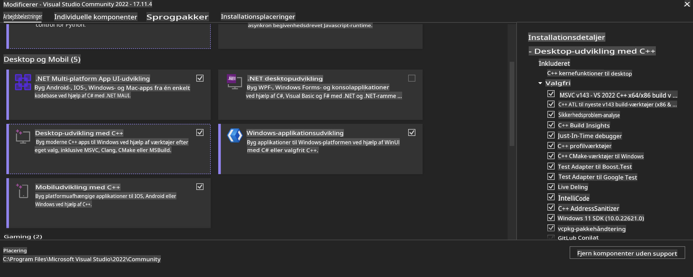
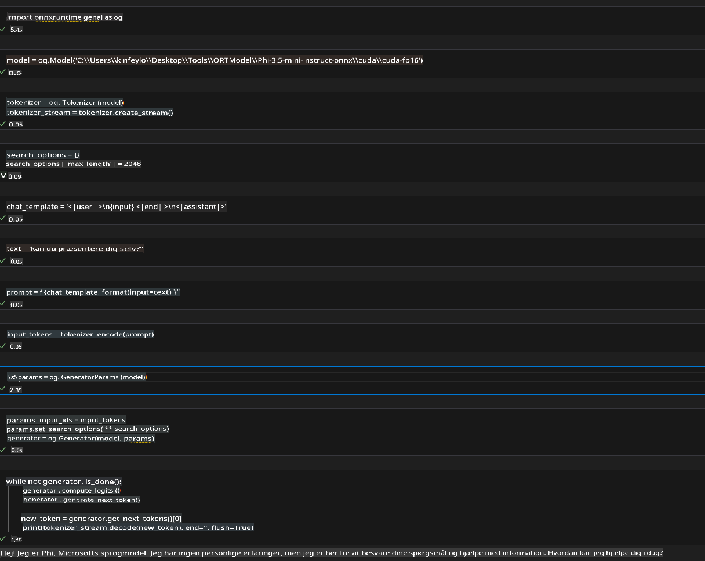
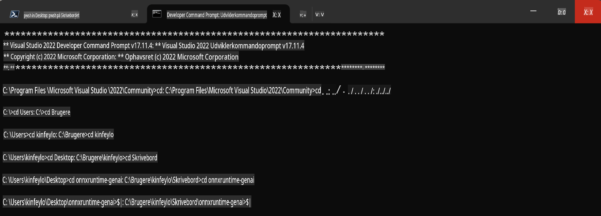

# **Vejledning til OnnxRuntime GenAI Windows GPU**

Denne vejledning beskriver trin til opsætning og brug af ONNX Runtime (ORT) med GPU'er på Windows. Den er designet til at hjælpe dig med at udnytte GPU-acceleration til dine modeller og forbedre ydeevne og effektivitet.

Dokumentet indeholder vejledning om:

- Opsætning af miljø: Instruktioner til installation af nødvendige afhængigheder som CUDA, cuDNN og ONNX Runtime.
- Konfiguration: Sådan konfigureres miljøet og ONNX Runtime til effektivt at udnytte GPU-ressourcer.
- Optimeringstips: Råd om, hvordan du finjusterer dine GPU-indstillinger for optimal ydeevne.

### **1. Python 3.10.x / 3.11.8**

   ***Bemærk*** Det anbefales at bruge [miniforge](https://github.com/conda-forge/miniforge/releases/latest/download/Miniforge3-Windows-x86_64.exe) som dit Python-miljø.

   ```bash

   conda create -n pydev python==3.11.8

   conda activate pydev

   ```

   ***Påmindelse*** Hvis du allerede har installeret en ONNX-bibliotekspakke til Python, skal du afinstallere den.

### **2. Installer CMake med winget**

   ```bash

   winget install -e --id Kitware.CMake

   ```

### **3. Installer Visual Studio 2022 - Desktopudvikling med C++**

   ***Bemærk*** Hvis du ikke ønsker at kompilere, kan du springe dette trin over.



### **4. Installer NVIDIA-driver**

1. **NVIDIA GPU-driver** [https://www.nvidia.com/en-us/drivers/](https://www.nvidia.com/en-us/drivers/)

2. **NVIDIA CUDA 12.4** [https://developer.nvidia.com/cuda-12-4-0-download-archive](https://developer.nvidia.com/cuda-12-4-0-download-archive)

3. **NVIDIA CUDNN 9.4** [https://developer.nvidia.com/cudnn-downloads](https://developer.nvidia.com/cudnn-downloads)

***Påmindelse*** Brug standardindstillinger under installationsprocessen.

### **5. Konfigurer NVIDIA-miljø**

Kopiér NVIDIA CUDNN 9.4's lib-, bin- og include-mapper til de tilsvarende mapper i NVIDIA CUDA 12.4.

- Kopiér filer fra *'C:\Program Files\NVIDIA\CUDNN\v9.4\bin\12.6'* til *'C:\Program Files\NVIDIA GPU Computing Toolkit\CUDA\v12.4\bin'*.

- Kopiér filer fra *'C:\Program Files\NVIDIA\CUDNN\v9.4\include\12.6'* til *'C:\Program Files\NVIDIA GPU Computing Toolkit\CUDA\v12.4\include'*.

- Kopiér filer fra *'C:\Program Files\NVIDIA\CUDNN\v9.4\lib\12.6'* til *'C:\Program Files\NVIDIA GPU Computing Toolkit\CUDA\v12.4\lib\x64'*.

### **6. Download Phi-3.5-mini-instruct-onnx**

   ```bash

   winget install -e --id Git.Git

   winget install -e --id GitHub.GitLFS

   git lfs install

   git clone https://huggingface.co/microsoft/Phi-3.5-mini-instruct-onnx

   ```

### **7. Kør InferencePhi35Instruct.ipynb**

   Åbn [Notebook](../../../../../../code/09.UpdateSamples/Aug/ortgpu-phi35-instruct.ipynb) og udfør det.



### **8. Kompilér ORT GenAI GPU**

   ***Bemærk***

   1. Afinstaller først alle ONNX-, ONNX Runtime- og ONNX Runtime GenAI-biblioteker.

   ```bash

   pip list 
   
   ```

   Derefter afinstalleres alle ONNX Runtime-biblioteker, dvs.:

   ```bash

   pip uninstall onnxruntime

   pip uninstall onnxruntime-genai

   pip uninstall onnxruntume-genai-cuda
   
   ```

   2. Kontroller Visual Studio-udvidelsessupport.

   Gå til C:\Program Files\NVIDIA GPU Computing Toolkit\CUDA\v12.4\extras for at sikre, at mappen C:\Program Files\NVIDIA GPU Computing Toolkit\CUDA\v12.4\extras\visual_studio_integration findes.

   Hvis den ikke findes, skal du kontrollere andre CUDA Toolkit-driver-mapper og kopiere mappen visual_studio_integration og dens indhold til C:\Program Files\NVIDIA GPU Computing Toolkit\CUDA\v12.4\extras\visual_studio_integration.

   - Hvis du ikke ønsker at kompilere, kan du springe dette trin over.

   ```bash

   git clone https://github.com/microsoft/onnxruntime-genai

   ```

   - Download [https://github.com/microsoft/onnxruntime/releases/download/v1.19.2/onnxruntime-win-x64-gpu-1.19.2.zip](https://github.com/microsoft/onnxruntime/releases/download/v1.19.2/onnxruntime-win-x64-gpu-1.19.2.zip)

   - Udpak onnxruntime-win-x64-gpu-1.19.2.zip, omdøb den til **ort**, og kopier ort-mappen til onnxruntime-genai.

   - Brug Windows Terminal, gå til Developer Command Prompt for VS 2022, og naviger til onnxruntime-genai.



   - Kompilér det med dit Python-miljø.

   ```bash

   cd onnxruntime-genai

   python build.py --use_cuda  --cuda_home "C:\Program Files\NVIDIA GPU Computing Toolkit\CUDA\v12.4" --config Release
 

   cd build/Windows/Release/Wheel

   pip install .whl

   ```

**Ansvarsfraskrivelse**:  
Dette dokument er blevet oversat ved hjælp af maskinbaserede AI-oversættelsestjenester. Selvom vi bestræber os på nøjagtighed, skal du være opmærksom på, at automatiserede oversættelser kan indeholde fejl eller unøjagtigheder. Det originale dokument på dets oprindelige sprog bør betragtes som den autoritative kilde. For kritisk information anbefales professionel menneskelig oversættelse. Vi påtager os intet ansvar for misforståelser eller fejltolkninger, der måtte opstå som følge af brugen af denne oversættelse.