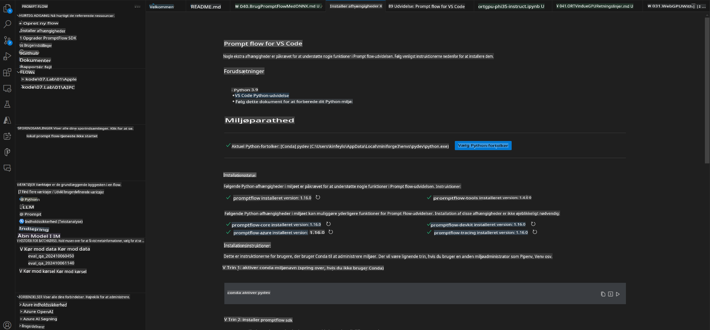
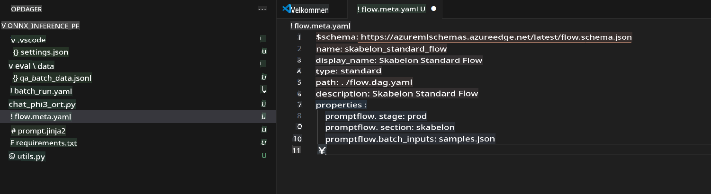
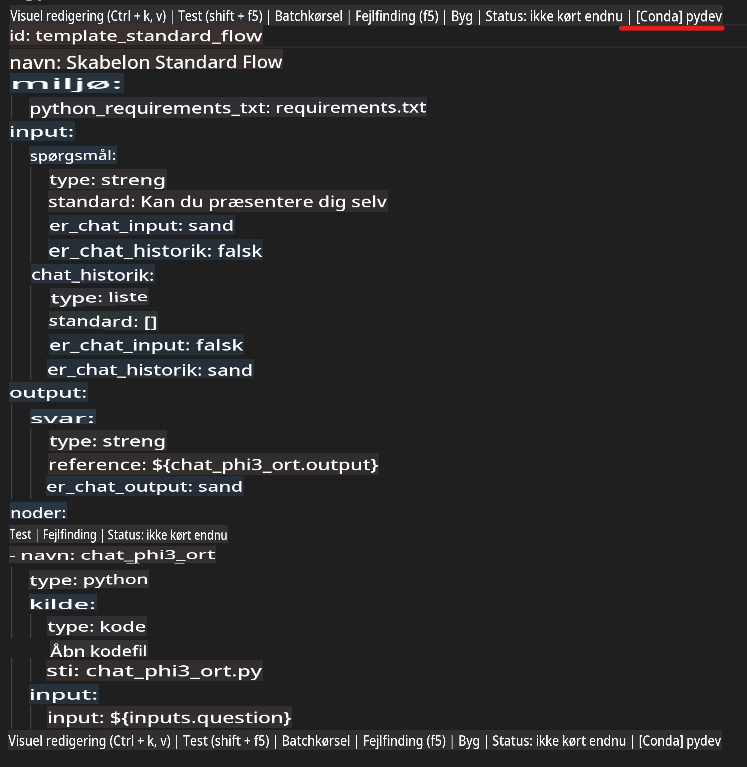
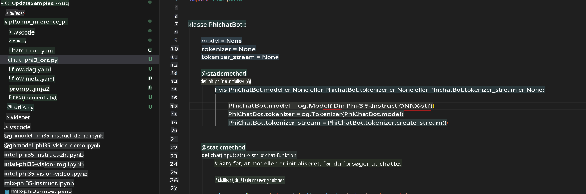
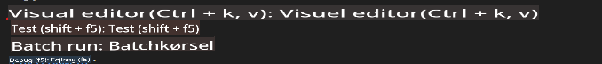
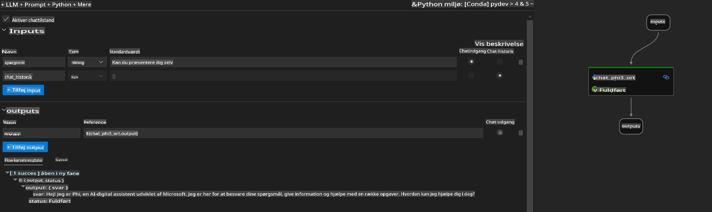
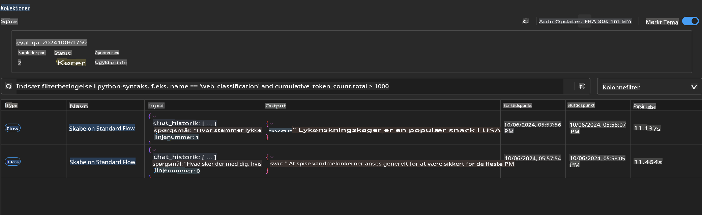

# Brug af Windows GPU til at skabe Prompt Flow-løsning med Phi-3.5-Instruct ONNX

Dette dokument er et eksempel på, hvordan man bruger PromptFlow med ONNX (Open Neural Network Exchange) til at udvikle AI-applikationer baseret på Phi-3-modeller.

PromptFlow er en samling udviklingsværktøjer designet til at forenkle hele udviklingscyklussen for AI-applikationer baseret på store sprogmodeller (LLM), fra idéudvikling og prototyper til test og evaluering.

Ved at integrere PromptFlow med ONNX kan udviklere:

- **Optimere modelydelse**: Udnyt ONNX til effektiv modelinference og implementering.
- **Forenkle udvikling**: Brug PromptFlow til at styre arbejdsgangen og automatisere gentagne opgaver.
- **Forbedre samarbejde**: Skab bedre samarbejde mellem teammedlemmer ved at tilbyde et samlet udviklingsmiljø.

**Prompt flow** er en samling udviklingsværktøjer designet til at forenkle hele udviklingscyklussen for AI-applikationer baseret på LLM, fra idéudvikling, prototyper, test og evaluering til produktion og overvågning. Det gør prompt engineering meget nemmere og giver dig mulighed for at bygge LLM-applikationer med produktionskvalitet.

Prompt flow kan forbindes til OpenAI, Azure OpenAI Service og tilpassede modeller (Huggingface, lokale LLM/SLM). Vi håber at kunne implementere Phi-3.5's kvantiserede ONNX-model i lokale applikationer. Prompt flow kan hjælpe os med bedre at planlægge vores forretning og fuldføre lokale løsninger baseret på Phi-3.5. I dette eksempel vil vi kombinere ONNX Runtime GenAI Library for at fuldføre Prompt flow-løsningen baseret på Windows GPU.

## **Installation**

### **ONNX Runtime GenAI til Windows GPU**

Læs denne vejledning for at opsætte ONNX Runtime GenAI til Windows GPU [klik her](./ORTWindowGPUGuideline.md)

### **Opsæt Prompt flow i VSCode**

1. Installer Prompt flow VS Code Extension


2. Efter installation af Prompt flow VS Code Extension, klik på udvidelsen, og vælg **Installation dependencies**. Følg denne vejledning for at installere Prompt flow SDK i dit miljø.



3. Download [Sample Code](../../../../../../code/09.UpdateSamples/Aug/pf/onnx_inference_pf) og åbn dette eksempel i VS Code.



4. Åbn **flow.dag.yaml** for at vælge dit Python-miljø.



   Åbn **chat_phi3_ort.py** for at ændre placeringen af din Phi-3.5-instruct ONNX-model.



5. Kør dit Prompt flow for at teste.

Åbn **flow.dag.yaml**, og klik på visual editor.



Klik herefter på denne, og kør for at teste.



1. Du kan køre batch i terminalen for at tjekke flere resultater.

```bash

pf run create --file batch_run.yaml --stream --name 'Your eval qa name'    

```

Du kan tjekke resultaterne i din standardbrowser.



**Ansvarsfraskrivelse**:  
Dette dokument er blevet oversat ved hjælp af maskinbaserede AI-oversættelsestjenester. Selvom vi bestræber os på nøjagtighed, skal det bemærkes, at automatiserede oversættelser kan indeholde fejl eller unøjagtigheder. Det originale dokument på dets oprindelige sprog bør betragtes som den autoritative kilde. For kritisk information anbefales professionel menneskelig oversættelse. Vi påtager os intet ansvar for misforståelser eller fejltolkninger, der måtte opstå som følge af brugen af denne oversættelse.