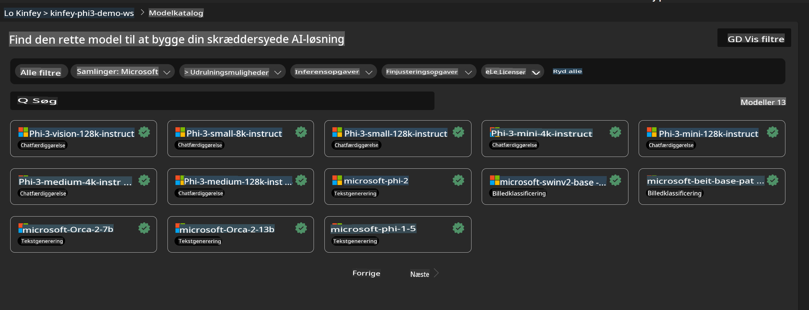
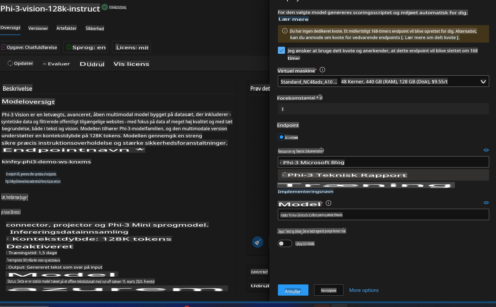
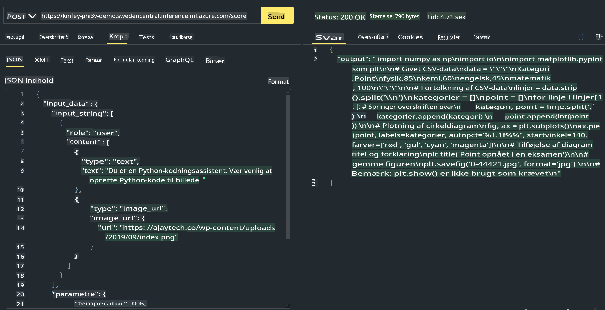

# **Lab 3 - Udrul Phi-3-vision på Azure Machine Learning Service**

Vi bruger NPU til at fuldføre produktionsudrulningen af lokal kode, og derefter ønsker vi at introducere evnen til at bruge PHI-3-VISION til at generere kode ud fra billeder.

I denne introduktion kan vi hurtigt opbygge en Model As Service Phi-3 Vision-tjeneste i Azure Machine Learning Service.

***Bemærk***: Phi-3 Vision kræver beregningskraft for at generere indhold hurtigere. Vi har brug for cloud-beregningskraft for at hjælpe os med at opnå dette.


### **1. Opret Azure Machine Learning Service**

Vi skal oprette en Azure Machine Learning Service i Azure-portalen. Hvis du vil lære hvordan, kan du besøge dette link [https://learn.microsoft.com/azure/machine-learning/quickstart-create-resources?view=azureml-api-2](https://learn.microsoft.com/azure/machine-learning/quickstart-create-resources?view=azureml-api-2)


### **2. Vælg Phi-3 Vision i Azure Machine Learning Service**




### **3. Udrul Phi-3-Vision i Azure**





### **4. Test Endpoint i Postman**





***Bemærk***

1. De parametre, der skal sendes, skal inkludere Authorization, azureml-model-deployment og Content-Type. Du skal tjekke udrulningsinformationen for at få disse.

2. For at sende parametre skal Phi-3-Vision sende et billedlink. Se venligst GPT-4-Vision-metoden for at sende parametre, som f.eks.

```json

{
  "input_data":{
    "input_string":[
      {
        "role":"user",
        "content":[ 
          {
            "type": "text",
            "text": "You are a Python coding assistant.Please create Python code for image "
          },
          {
              "type": "image_url",
              "image_url": {
                "url": "https://ajaytech.co/wp-content/uploads/2019/09/index.png"
              }
          }
        ]
      }
    ],
    "parameters":{
          "temperature": 0.6,
          "top_p": 0.9,
          "do_sample": false,
          "max_new_tokens": 2048
    }
  }
}

```

3. Brug Post-metoden til at kalde **/score**

**Tillykke**! Du har fuldført den hurtige PHI-3-VISION-udrulning og prøvet, hvordan man bruger billeder til at generere kode. Næste skridt er at bygge applikationer i kombination med NPU'er og cloud-tjenester.

**Ansvarsfraskrivelse**:  
Dette dokument er blevet oversat ved hjælp af maskinbaserede AI-oversættelsestjenester. Selvom vi bestræber os på at opnå nøjagtighed, bedes du være opmærksom på, at automatiserede oversættelser kan indeholde fejl eller unøjagtigheder. Det originale dokument på dets oprindelige sprog bør betragtes som den autoritative kilde. For kritisk information anbefales professionel menneskelig oversættelse. Vi påtager os ikke ansvaret for misforståelser eller fejltolkninger, der opstår som følge af brugen af denne oversættelse.