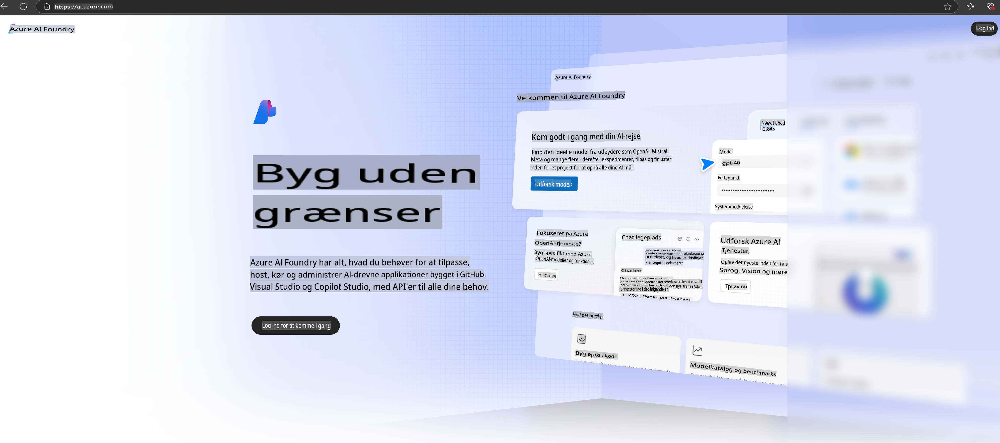

# **Brug af Phi-3 i Azure AI Foundry**

Med udviklingen af Generativ AI håber vi at kunne bruge en samlet platform til at håndtere forskellige LLM og SLM, integration af virksomhedsdata, finjustering/RAG-operationer og evaluering af forskellige virksomhedsforretninger efter integration af LLM og SLM osv., så generativ AI kan implementeres bedre i smarte applikationer. [Azure AI Foundry](https://ai.azure.com) er en virksomhedsniveau platform for generative AI-applikationer.

Med Azure AI Foundry kan du evaluere svar fra store sprogmodeller (LLM) og orkestrere prompt-applikationskomponenter med prompt flow for bedre ydeevne. Platformen muliggør skalering fra proof of concept til fuld produktion med lethed. Kontinuerlig overvågning og forbedring understøtter langsigtet succes.

Vi kan hurtigt implementere Phi-3-modellen på Azure AI Foundry gennem enkle trin og derefter bruge Azure AI Foundry til at udføre Phi-3 relaterede opgaver som Playground/Chat, finjustering, evaluering og andre relaterede aktiviteter.

## **1. Forberedelse**

Hvis du allerede har [Azure Developer CLI](https://learn.microsoft.com/azure/developer/azure-developer-cli/overview?WT.mc_id=aiml-138114-kinfeylo) installeret på din maskine, er det lige så enkelt som at køre denne kommando i en ny mappe for at bruge denne skabelon.

## Manuel Oprettelse

At oprette et Microsoft Azure AI Foundry-projekt og -hub er en fantastisk måde at organisere og administrere dit AI-arbejde på. Her er en trin-for-trin vejledning til at komme i gang:

### Oprettelse af et Projekt i Azure AI Foundry

1. **Gå til Azure AI Foundry**: Log ind på Azure AI Foundry-portalen.
2. **Opret et Projekt**:
   - Hvis du er i et projekt, vælg "Azure AI Foundry" øverst til venstre på siden for at gå til startsiden.
   - Vælg "+ Opret projekt".
   - Indtast et navn til projektet.
   - Hvis du har en hub, vil den være valgt som standard. Hvis du har adgang til mere end én hub, kan du vælge en anden fra dropdown-menuen. Hvis du vil oprette en ny hub, vælg "Opret ny hub" og angiv et navn.
   - Vælg "Opret".

### Oprettelse af en Hub i Azure AI Foundry

1. **Gå til Azure AI Foundry**: Log ind med din Azure-konto.
2. **Opret en Hub**:
   - Vælg Administrationscenter fra menuen til venstre.
   - Vælg "Alle ressourcer", klik derefter på pilen ved siden af "+ Nyt projekt" og vælg "+ Ny hub".
   - I dialogboksen "Opret en ny hub", indtast et navn til din hub (f.eks. contoso-hub) og juster de andre felter efter behov.
   - Vælg "Næste", gennemgå oplysningerne, og vælg derefter "Opret".

For mere detaljerede instruktioner kan du henvise til den officielle [Microsoft-dokumentation](https://learn.microsoft.com/azure/ai-studio/how-to/create-projects).

Efter vellykket oprettelse kan du få adgang til det studio, du har oprettet, gennem [ai.azure.com](https://ai.azure.com/)

Der kan være flere projekter på én AI Foundry. Opret et projekt i AI Foundry for at forberede.

Opret Azure AI Foundry [QuickStarts](https://learn.microsoft.com/azure/ai-studio/quickstarts/get-started-code)

## **2. Implementer en Phi-model i Azure AI Foundry**

Klik på Udforsk-indstillingen i projektet for at komme ind i Modelkataloget og vælg Phi-3

Vælg Phi-3-mini-4k-instruct

Klik på 'Implementer' for at implementere Phi-3-mini-4k-instruct-modellen

> [!NOTE]
>
> Du kan vælge computerkraft under implementeringen

## **3. Playground Chat Phi i Azure AI Foundry**

Gå til implementeringssiden, vælg Playground, og chat med Phi-3 i Azure AI Foundry

## **4. Implementering af Modellen fra Azure AI Foundry**

For at implementere en model fra Azure Model Catalog kan du følge disse trin:

- Log ind på Azure AI Foundry.
- Vælg den model, du vil implementere, fra Azure AI Foundry modelkataloget.
- På modellens Detaljeside, vælg Implementer og derefter Serverless API med Azure AI Content Safety.
- Vælg det projekt, hvor du vil implementere dine modeller. For at bruge Serverless API-tilbuddet skal dit arbejdsområde tilhøre East US 2 eller Sweden Central-regionen. Du kan tilpasse implementeringsnavnet.
- I implementeringsguiden, vælg Priser og vilkår for at lære om priser og brugsvilkår.
- Vælg Implementer. Vent, indtil implementeringen er klar, og du bliver omdirigeret til Implementeringssiden.
- Vælg Åbn i playground for at begynde at interagere med modellen.
- Du kan altid vende tilbage til Implementeringssiden, vælge implementeringen og notere endpointets Måladresse og den Hemmelige Nøgle, som du kan bruge til at kalde implementeringen og generere svar.
- Du kan altid finde detaljer om endpoint, URL og adgangsnøgler ved at navigere til fanen Build og vælge Implementeringer fra Komponentsektionen.

> [!NOTE]
> Bemærk, at din konto skal have Azure AI Developer-rolle tilladelser på Ressourcegruppen for at udføre disse trin.

## **5. Brug af Phi API i Azure AI Foundry**

Du kan få adgang til https://{Dit projekt navn}.region.inference.ml.azure.com/swagger.json gennem Postman GET og kombinere det med Nøgle for at lære om de tilgængelige grænseflader.

Du kan nemt få adgang til forespørgselsparametre samt svarparametre.

**Ansvarsfraskrivelse**:  
Dette dokument er blevet oversat ved hjælp af maskinbaserede AI-oversættelsestjenester. Selvom vi bestræber os på nøjagtighed, skal du være opmærksom på, at automatiserede oversættelser kan indeholde fejl eller unøjagtigheder. Det originale dokument på dets oprindelige sprog bør betragtes som den autoritative kilde. For kritisk information anbefales professionel menneskelig oversættelse. Vi påtager os intet ansvar for misforståelser eller fejltolkninger, der måtte opstå ved brugen af denne oversættelse.