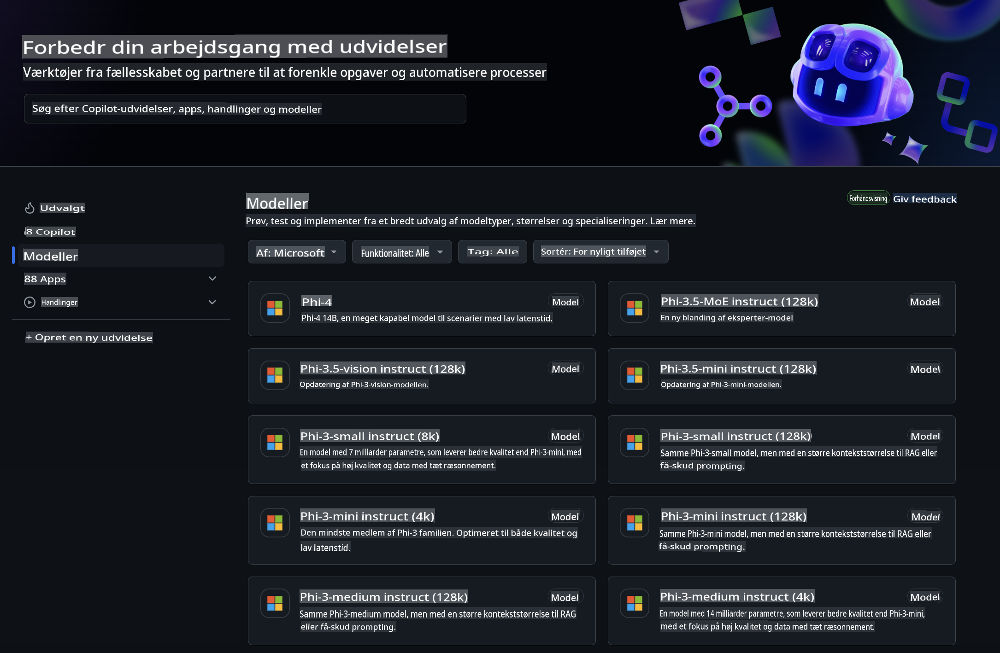
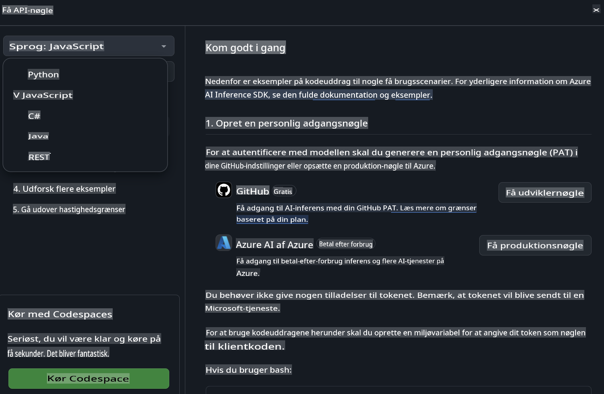
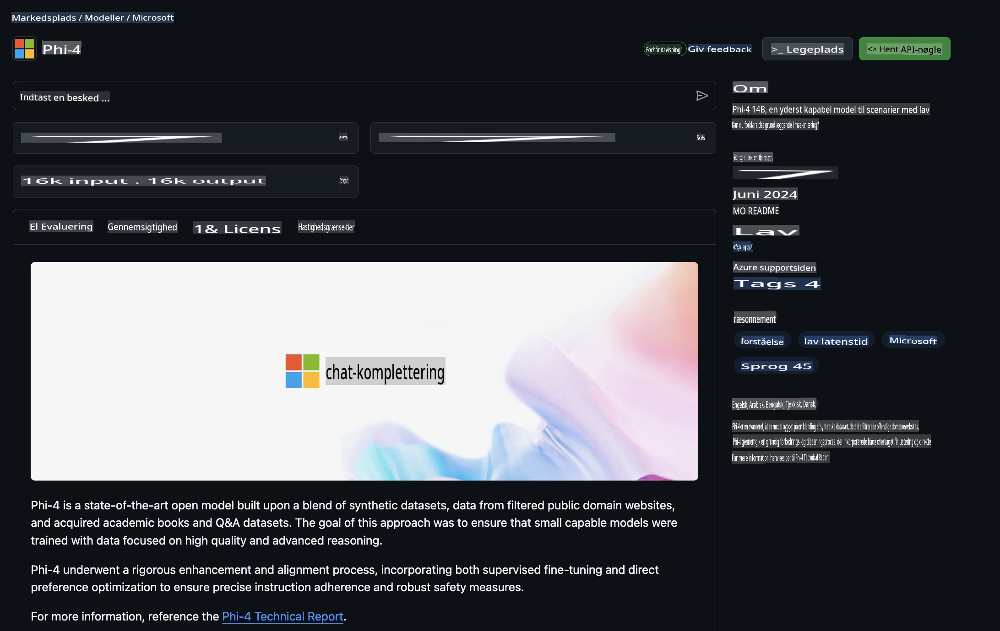

## GitHub-modeller - Begrænset offentlig beta

Velkommen til [GitHub-modeller](https://github.com/marketplace/models)! Vi har gjort alt klar, så du kan udforske AI-modeller hostet på Azure AI.



For mere information om de modeller, der er tilgængelige på GitHub-modeller, kan du besøge [GitHub Model Marketplace](https://github.com/marketplace/models).

## Tilgængelige modeller

Hver model har sin egen dedikerede playground og eksempelkode.


### Phi-3-modeller i GitHub Model-kataloget

[Phi-3-Medium-128k-Instruct](https://github.com/marketplace/models/azureml/Phi-3-medium-128k-instruct)

[Phi-3-medium-4k-instruct](https://github.com/marketplace/models/azureml/Phi-3-medium-4k-instruct)

[Phi-3-mini-128k-instruct](https://github.com/marketplace/models/azureml/Phi-3-mini-128k-instruct)

[Phi-3-mini-4k-instruct](https://github.com/marketplace/models/azureml/Phi-3-mini-4k-instruct)

[Phi-3-small-128k-instruct](https://github.com/marketplace/models/azureml/Phi-3-small-128k-instruct)

[Phi-3-small-8k-instruct](https://github.com/marketplace/models/azureml/Phi-3-small-8k-instruct)

## Kom godt i gang

Der er nogle grundlæggende eksempler, som er klar til at blive kørt. Du kan finde dem i samples-mappen. Hvis du vil springe direkte til dit foretrukne programmeringssprog, kan du finde eksemplerne på følgende sprog:

- Python  
- JavaScript  
- cURL  

Der er også et dedikeret Codespaces-miljø til at køre eksemplerne og modellerne.



## Eksempelkode 

Nedenfor er kodeeksempler for nogle få anvendelsestilfælde. For yderligere information om Azure AI Inference SDK, se den fulde dokumentation og eksempler.

## Opsætning 

1. Opret en personlig adgangstoken  
Du behøver ikke give nogen tilladelser til tokenet. Bemærk, at tokenet vil blive sendt til en Microsoft-tjeneste.

For at bruge kodeeksemplerne nedenfor skal du oprette en miljøvariabel for at indstille din token som nøgle til klientkoden.

Hvis du bruger bash:  
```
export GITHUB_TOKEN="<your-github-token-goes-here>"
```  
Hvis du bruger powershell:  

```
$Env:GITHUB_TOKEN="<your-github-token-goes-here>"
```  

Hvis du bruger Windows kommandoprompt:  

```
set GITHUB_TOKEN=<your-github-token-goes-here>
```  

## Python-eksempel

### Installer afhængigheder  
Installer Azure AI Inference SDK med pip (Kræver: Python >=3.8):  

```
pip install azure-ai-inference
```  

### Kør et grundlæggende kodeeksempel  

Dette eksempel demonstrerer et grundlæggende kald til chat completion API'et. Det bruger GitHub AI-modelinference-endpointet og din GitHub-token. Kaldet er synkront.  

```
import os
from azure.ai.inference import ChatCompletionsClient
from azure.ai.inference.models import SystemMessage, UserMessage
from azure.core.credentials import AzureKeyCredential

endpoint = "https://models.inference.ai.azure.com"
# Replace Model_Name 
model_name = "Phi-3-small-8k-instruct"
token = os.environ["GITHUB_TOKEN"]

client = ChatCompletionsClient(
    endpoint=endpoint,
    credential=AzureKeyCredential(token),
)

response = client.complete(
    messages=[
        SystemMessage(content="You are a helpful assistant."),
        UserMessage(content="What is the capital of France?"),
    ],
    model=model_name,
    temperature=1.,
    max_tokens=1000,
    top_p=1.
)

print(response.choices[0].message.content)
```  

### Kør en samtale med flere runder  

Dette eksempel demonstrerer en samtale med flere runder med chat completion API'et. Når du bruger modellen til en chatapplikation, skal du administrere historikken for samtalen og sende de nyeste beskeder til modellen.  

```
import os
from azure.ai.inference import ChatCompletionsClient
from azure.ai.inference.models import AssistantMessage, SystemMessage, UserMessage
from azure.core.credentials import AzureKeyCredential

token = os.environ["GITHUB_TOKEN"]
endpoint = "https://models.inference.ai.azure.com"
# Replace Model_Name
model_name = "Phi-3-small-8k-instruct"

client = ChatCompletionsClient(
    endpoint=endpoint,
    credential=AzureKeyCredential(token),
)

messages = [
    SystemMessage(content="You are a helpful assistant."),
    UserMessage(content="What is the capital of France?"),
    AssistantMessage(content="The capital of France is Paris."),
    UserMessage(content="What about Spain?"),
]

response = client.complete(messages=messages, model=model_name)

print(response.choices[0].message.content)
```  

### Stream outputtet  

For en bedre brugeroplevelse vil du gerne streame modellens svar, så det første token vises hurtigt, og du undgår ventetid på lange svar.  

```
import os
from azure.ai.inference import ChatCompletionsClient
from azure.ai.inference.models import SystemMessage, UserMessage
from azure.core.credentials import AzureKeyCredential

token = os.environ["GITHUB_TOKEN"]
endpoint = "https://models.inference.ai.azure.com"
# Replace Model_Name
model_name = "Phi-3-small-8k-instruct"

client = ChatCompletionsClient(
    endpoint=endpoint,
    credential=AzureKeyCredential(token),
)

response = client.complete(
    stream=True,
    messages=[
        SystemMessage(content="You are a helpful assistant."),
        UserMessage(content="Give me 5 good reasons why I should exercise every day."),
    ],
    model=model_name,
)

for update in response:
    if update.choices:
        print(update.choices[0].delta.content or "", end="")

client.close()
```  

## JavaScript 

### Installer afhængigheder  

Installer Node.js.  

Kopiér følgende tekstlinjer og gem dem som en fil med navnet package.json i din mappe.  

```
{
  "type": "module",
  "dependencies": {
    "@azure-rest/ai-inference": "latest",
    "@azure/core-auth": "latest",
    "@azure/core-sse": "latest"
  }
}
```  

Bemærk: @azure/core-sse er kun nødvendig, når du streamer chat completion-svar.  

Åbn et terminalvindue i denne mappe, og kør npm install.  

For hvert af kodeeksemplerne nedenfor skal du kopiere indholdet til en fil med navnet sample.js og køre den med node sample.js.  

### Kør et grundlæggende kodeeksempel  

Dette eksempel demonstrerer et grundlæggende kald til chat completion API'et. Det bruger GitHub AI-modelinference-endpointet og din GitHub-token. Kaldet er synkront.  

```
import ModelClient from "@azure-rest/ai-inference";
import { AzureKeyCredential } from "@azure/core-auth";

const token = process.env["GITHUB_TOKEN"];
const endpoint = "https://models.inference.ai.azure.com";
// Update your modelname
const modelName = "Phi-3-small-8k-instruct";

export async function main() {

  const client = new ModelClient(endpoint, new AzureKeyCredential(token));

  const response = await client.path("/chat/completions").post({
    body: {
      messages: [
        { role:"system", content: "You are a helpful assistant." },
        { role:"user", content: "What is the capital of France?" }
      ],
      model: modelName,
      temperature: 1.,
      max_tokens: 1000,
      top_p: 1.
    }
  });

  if (response.status !== "200") {
    throw response.body.error;
  }
  console.log(response.body.choices[0].message.content);
}

main().catch((err) => {
  console.error("The sample encountered an error:", err);
});
```  

### Kør en samtale med flere runder  

Dette eksempel demonstrerer en samtale med flere runder med chat completion API'et. Når du bruger modellen til en chatapplikation, skal du administrere historikken for samtalen og sende de nyeste beskeder til modellen.  

```
import ModelClient from "@azure-rest/ai-inference";
import { AzureKeyCredential } from "@azure/core-auth";

const token = process.env["GITHUB_TOKEN"];
const endpoint = "https://models.inference.ai.azure.com";
// Update your modelname
const modelName = "Phi-3-small-8k-instruct";

export async function main() {

  const client = new ModelClient(endpoint, new AzureKeyCredential(token));

  const response = await client.path("/chat/completions").post({
    body: {
      messages: [
        { role: "system", content: "You are a helpful assistant." },
        { role: "user", content: "What is the capital of France?" },
        { role: "assistant", content: "The capital of France is Paris." },
        { role: "user", content: "What about Spain?" },
      ],
      model: modelName,
    }
  });

  if (response.status !== "200") {
    throw response.body.error;
  }

  for (const choice of response.body.choices) {
    console.log(choice.message.content);
  }
}

main().catch((err) => {
  console.error("The sample encountered an error:", err);
});
```  

### Stream outputtet  
For en bedre brugeroplevelse vil du gerne streame modellens svar, så det første token vises hurtigt, og du undgår ventetid på lange svar.  

```
import ModelClient from "@azure-rest/ai-inference";
import { AzureKeyCredential } from "@azure/core-auth";
import { createSseStream } from "@azure/core-sse";

const token = process.env["GITHUB_TOKEN"];
const endpoint = "https://models.inference.ai.azure.com";
// Update your modelname
const modelName = "Phi-3-small-8k-instruct";

export async function main() {

  const client = new ModelClient(endpoint, new AzureKeyCredential(token));

  const response = await client.path("/chat/completions").post({
    body: {
      messages: [
        { role: "system", content: "You are a helpful assistant." },
        { role: "user", content: "Give me 5 good reasons why I should exercise every day." },
      ],
      model: modelName,
      stream: true
    }
  }).asNodeStream();

  const stream = response.body;
  if (!stream) {
    throw new Error("The response stream is undefined");
  }

  if (response.status !== "200") {
    stream.destroy();
    throw new Error(`Failed to get chat completions, http operation failed with ${response.status} code`);
  }

  const sseStream = createSseStream(stream);

  for await (const event of sseStream) {
    if (event.data === "[DONE]") {
      return;
    }
    for (const choice of (JSON.parse(event.data)).choices) {
        process.stdout.write(choice.delta?.content ?? ``);
    }
  }
}

main().catch((err) => {
  console.error("The sample encountered an error:", err);
});
```  

## REST  

### Kør et grundlæggende kodeeksempel  

Indsæt følgende i en shell:  

```
curl -X POST "https://models.inference.ai.azure.com/chat/completions" \
    -H "Content-Type: application/json" \
    -H "Authorization: Bearer $GITHUB_TOKEN" \
    -d '{
        "messages": [
            {
                "role": "system",
                "content": "You are a helpful assistant."
            },
            {
                "role": "user",
                "content": "What is the capital of France?"
            }
        ],
        "model": "Phi-3-small-8k-instruct"
    }'
```  

### Kør en samtale med flere runder  

Kald chat completion API'et og send chat-historikken:  

```
curl -X POST "https://models.inference.ai.azure.com/chat/completions" \
    -H "Content-Type: application/json" \
    -H "Authorization: Bearer $GITHUB_TOKEN" \
    -d '{
        "messages": [
            {
                "role": "system",
                "content": "You are a helpful assistant."
            },
            {
                "role": "user",
                "content": "What is the capital of France?"
            },
            {
                "role": "assistant",
                "content": "The capital of France is Paris."
            },
            {
                "role": "user",
                "content": "What about Spain?"
            }
        ],
        "model": "Phi-3-small-8k-instruct"
    }'
```  

### Stream outputtet  

Dette er et eksempel på at kalde endpointet og streame svaret.  

```
curl -X POST "https://models.inference.ai.azure.com/chat/completions" \
    -H "Content-Type: application/json" \
    -H "Authorization: Bearer $GITHUB_TOKEN" \
    -d '{
        "messages": [
            {
                "role": "system",
                "content": "You are a helpful assistant."
            },
            {
                "role": "user",
                "content": "Give me 5 good reasons why I should exercise every day."
            }
        ],
        "stream": true,
        "model": "Phi-3-small-8k-instruct"
    }'
```  

## GRATIS brug og grænser for GitHub-modeller  

  

[Grænserne for playground og gratis API-brug](https://docs.github.com/en/github-models/prototyping-with-ai-models#rate-limits) er designet til at hjælpe dig med at eksperimentere med modeller og prototype din AI-applikation. For brug ud over disse grænser og for at skalere din applikation skal du provisionere ressourcer fra en Azure-konto og autentificere derfra i stedet for med din GitHub personlige adgangstoken. Du behøver ikke ændre noget andet i din kode. Brug dette link til at lære, hvordan du kan gå ud over de gratis grænser i Azure AI.

### Ansvarsfraskrivelser  

Husk, at når du interagerer med en model, eksperimenterer du med AI, så fejl i indholdet kan forekomme.  

Funktionen er underlagt forskellige grænser (inklusive forespørgsler pr. minut, forespørgsler pr. dag, tokens pr. forespørgsel og samtidige forespørgsler) og er ikke designet til produktionsbrug.  

GitHub-modeller bruger Azure AI Content Safety. Disse filtre kan ikke slås fra som en del af GitHub Models-oplevelsen. Hvis du beslutter dig for at anvende modeller gennem en betalt tjeneste, kan du konfigurere dine indholdsfiltre, så de opfylder dine krav.  

Denne tjeneste er underlagt GitHubs Pre-release Terms.  

**Ansvarsfraskrivelse**:  
Dette dokument er blevet oversat ved hjælp af maskinbaserede AI-oversættelsestjenester. Selvom vi bestræber os på at opnå nøjagtighed, bedes du være opmærksom på, at automatiserede oversættelser kan indeholde fejl eller unøjagtigheder. Det originale dokument på dets oprindelige sprog bør betragtes som den autoritative kilde. For kritisk information anbefales professionel menneskelig oversættelse. Vi påtager os ikke ansvaret for misforståelser eller fejltolkninger, der måtte opstå som følge af brugen af denne oversættelse.