# Finjustering af Phi-3 med Azure AI Foundry

Lad os undersøge, hvordan man finjusterer Microsofts Phi-3 Mini sprogmodel ved hjælp af Azure AI Foundry. Finjustering gør det muligt at tilpasse Phi-3 Mini til specifikke opgaver, hvilket gør den endnu mere kraftfuld og kontekstbevidst.

## Overvejelser

- **Kapaciteter:** Hvilke modeller kan finjusteres? Hvad kan basis-modellen finjusteres til at gøre?
- **Omkostninger:** Hvad er prismodellen for finjustering?
- **Tilpasning:** Hvor meget kan jeg ændre basis-modellen – og på hvilke måder?
- **Bekvemmelighed:** Hvordan foregår finjustering i praksis – skal jeg skrive brugerdefineret kode? Skal jeg selv medbringe beregningskraft?
- **Sikkerhed:** Finjusterede modeller kan have sikkerhedsrisici – er der sikkerhedsforanstaltninger for at beskytte mod utilsigtede skader?

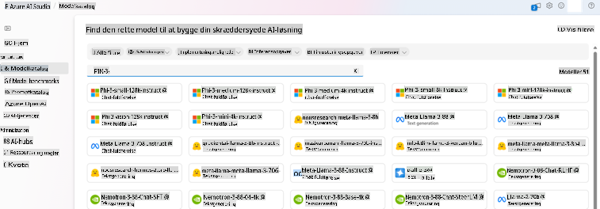

## Forberedelse til finjustering

### Forudsætninger

> [!NOTE]  
> For Phi-3 familierne er finjustering med pay-as-you-go kun tilgængelig for hubs oprettet i **East US 2** regioner.

- Et Azure-abonnement. Hvis du ikke har et Azure-abonnement, kan du oprette en [betalt Azure-konto](https://azure.microsoft.com/pricing/purchase-options/pay-as-you-go) for at komme i gang.

- Et [AI Foundry-projekt](https://ai.azure.com?WT.mc_id=aiml-138114-kinfeylo).  
- Azure rollebaserede adgangskontroller (Azure RBAC) bruges til at give adgang til operationer i Azure AI Foundry. For at udføre trinnene i denne artikel skal din brugerkonto være tildelt rollen __Azure AI Developer__ på ressourcergruppen.

### Registrering af abonnementstjenesteudbyder

Bekræft, at abonnementet er registreret til `Microsoft.Network`-tjenesteudbyderen.

1. Log ind på [Azure-portalen](https://portal.azure.com).  
1. Vælg **Abonnementer** fra venstre menu.  
1. Vælg det abonnement, du vil bruge.  
1. Vælg **AI projektindstillinger** > **Ressourceudbydere** fra venstre menu.  
1. Bekræft, at **Microsoft.Network** er på listen over ressourceudbydere. Tilføj det ellers.  

### Dataklargøring

Forbered dine trænings- og valideringsdata for at finjustere din model. Dine trænings- og valideringsdatasæt består af input- og outputeksempler, der viser, hvordan du ønsker, at modellen skal præstere.

Sørg for, at alle træningseksempler følger det forventede format for inferens. For at finjustere modeller effektivt skal du sikre et balanceret og varieret datasæt.

Dette indebærer at opretholde databalance, inkludere forskellige scenarier og periodisk forfine træningsdata for at afspejle forventninger fra den virkelige verden. Dette fører til mere præcise og balancerede modelresultater.

Forskellige typer modeller kræver forskellige formater for træningsdata.

### Chat Completion

De trænings- og valideringsdata, du bruger, **skal** være formateret som et JSON Lines (JSONL)-dokument. For `Phi-3-mini-128k-instruct` skal finjusteringsdatasættet være formateret i det samtaleformat, der bruges af Chat completions API.

### Eksempel på filformat

```json
    {"messages": [{"role": "system", "content": "You are an Xbox customer support agent whose primary goal is to help users with issues they are experiencing with their Xbox devices. You are friendly and concise. You only provide factual answers to queries, and do not provide answers that are not related to Xbox."}, {"role": "user", "content": "Is Xbox better than PlayStation?"}, {"role": "assistant", "content": "I apologize, but I cannot provide personal opinions. My primary job is to assist you with any issues related to your Xbox device. Do you have any Xbox-related issues that need addressing?"}]}
    {"messages": [{"role": "system", "content": "You are an Xbox customer support agent whose primary goal is to help users with issues they are experiencing with their Xbox devices. You are friendly and concise. You only provide factual answers to queries, and do not provide answers that are not related to Xbox."}, {"role": "user", "content": "Can I play PC games on my Xbox?"}, {"role": "assistant", "content": "While Xbox consoles don't natively support PC games, they can play an array of Xbox games, many of which are also available on PC. Can I assist you with finding games compatible with your Xbox device?"}]}
    {"messages": [{"role": "system", "content": "You are an Xbox customer support agent whose primary goal is to help users with issues they are experiencing with their Xbox devices. You are friendly and concise. You only provide factual answers to queries, and do not provide answers that are not related to Xbox."}, {"role": "user", "content": "I'm having trouble connecting my Xbox to the Wi-Fi."}, {"role": "assistant", "content": "No worries, let's go through the network settings on your Xbox. Can you please tell me what happens when you try to connect it to the Wi-Fi?"}]}
```

Den understøttede filtype er JSON Lines. Filer uploades til standarddatabutikken og gøres tilgængelige i dit projekt.

## Finjustering af Phi-3 med Azure AI Foundry

Azure AI Foundry giver dig mulighed for at tilpasse store sprogmodeller til dine egne datasæt ved hjælp af en proces kendt som finjustering. Finjustering giver betydelig værdi ved at muliggøre tilpasning og optimering til specifikke opgaver og applikationer. Det fører til forbedret ydeevne, omkostningseffektivitet, reduceret latenstid og skræddersyede output.

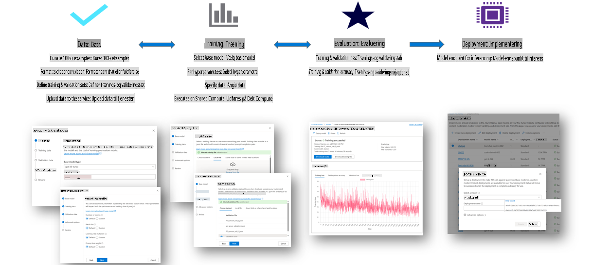

### Opret et nyt projekt

1. Log ind på [Azure AI Foundry](https://ai.azure.com).  

1. Vælg **+Nyt projekt** for at oprette et nyt projekt i Azure AI Foundry.  

    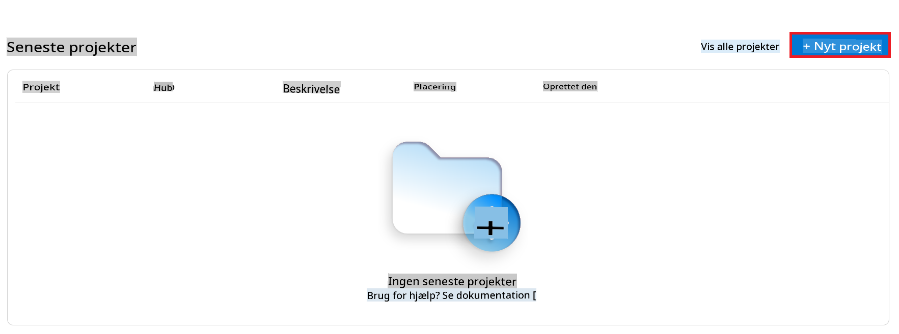  

1. Udfør følgende opgaver:  

    - Projektets **Hubnavn**. Det skal være en unik værdi.  
    - Vælg den **Hub**, der skal bruges (opret en ny, hvis nødvendigt).  

    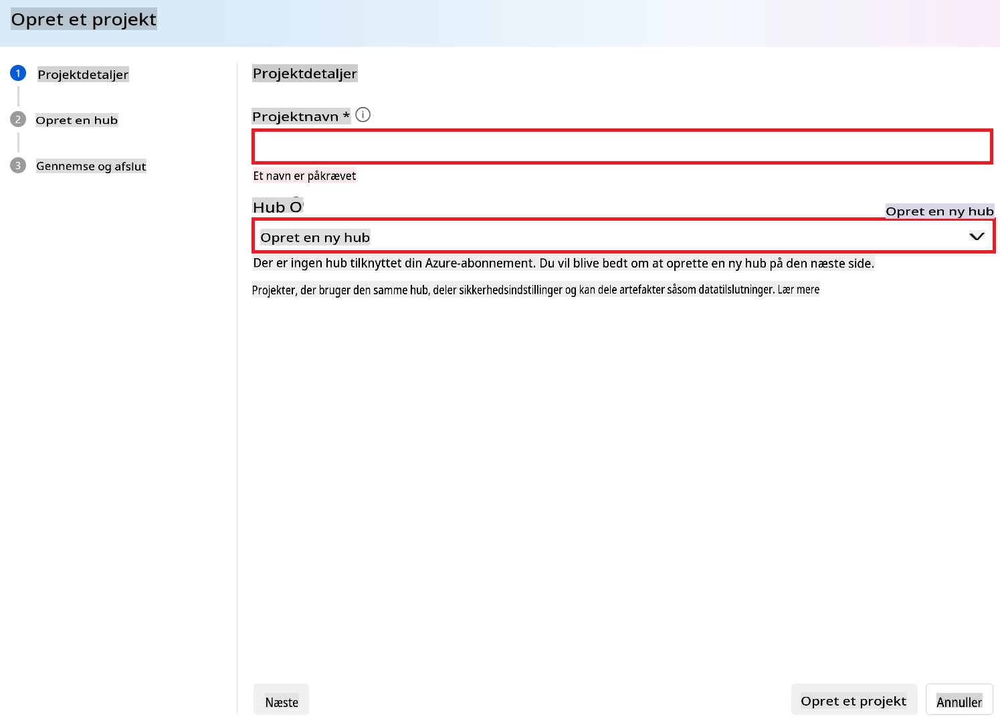  

1. Udfør følgende opgaver for at oprette en ny hub:  

    - Indtast **Hubnavn**. Det skal være en unik værdi.  
    - Vælg dit Azure **Abonnement**.  
    - Vælg den **Ressourcegruppe**, der skal bruges (opret en ny, hvis nødvendigt).  
    - Vælg den **Lokation**, du vil bruge.  
    - Vælg **Forbind Azure AI-tjenester**, der skal bruges (opret en ny, hvis nødvendigt).  
    - Vælg **Forbind Azure AI-søgning** til **Spring over forbindelse**.  

    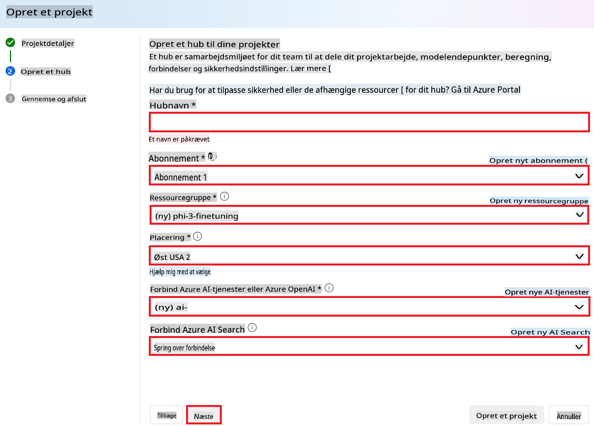  

1. Vælg **Næste**.  
1. Vælg **Opret et projekt**.  

### Dataklargøring

Inden finjustering skal du indsamle eller oprette et datasæt, der er relevant for din opgave, såsom samtaleinstruktioner, spørgsmål-svar-par eller anden relevant tekstdata. Rens og forbehandl disse data ved at fjerne støj, håndtere manglende værdier og tokenisere teksten.

### Finjustering af Phi-3 modeller i Azure AI Foundry

> [!NOTE]  
> Finjustering af Phi-3 modeller understøttes i øjeblikket kun i projekter placeret i East US 2.

1. Vælg **Modelkatalog** fra venstre sidemenu.  

1. Indtast *phi-3* i **søgefeltet**, og vælg den phi-3 model, du vil bruge.  

    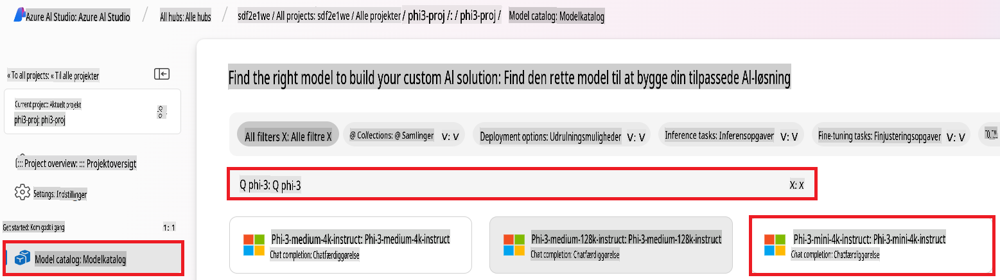  

1. Vælg **Finjuster**.  

    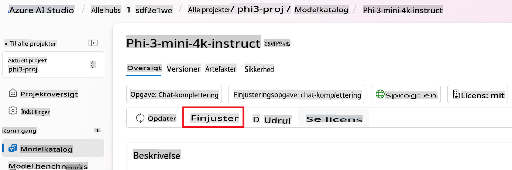  

1. Indtast navnet på den **Finjusterede model**.  

    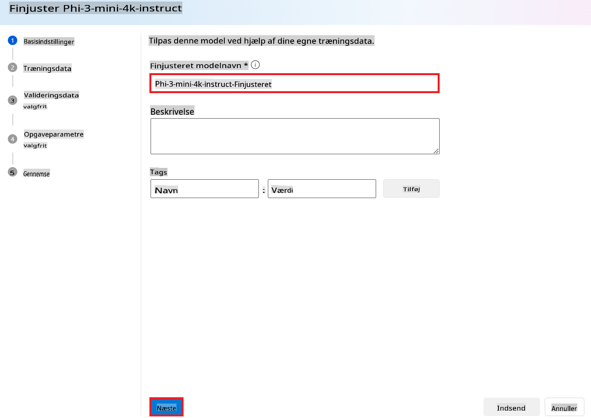  

1. Vælg **Næste**.  

1. Udfør følgende opgaver:  

    - Vælg **Opgavetype** som **Chat completion**.  
    - Vælg de **Træningsdata**, du vil bruge. Du kan uploade dem via Azure AI Foundry's data eller fra dit lokale miljø.  

    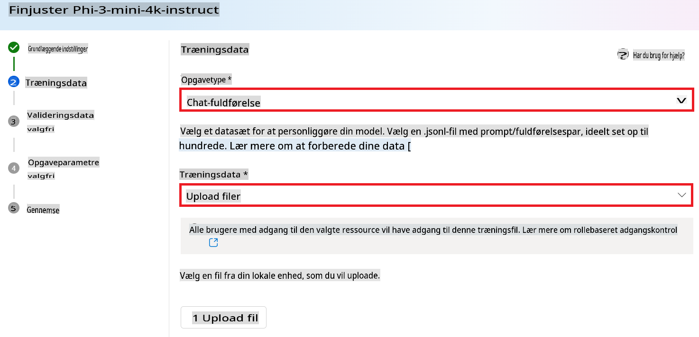  

1. Vælg **Næste**.  

1. Upload de **Valideringsdata**, du vil bruge, eller vælg **Automatisk opdeling af træningsdata**.  

    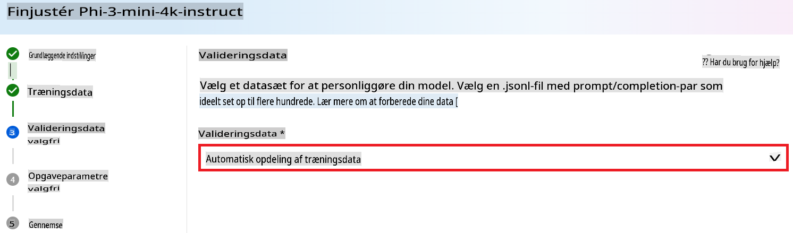  

1. Vælg **Næste**.  

1. Udfør følgende opgaver:  

    - Vælg den **Batchstørrelses-multiplikator**, du vil bruge.  
    - Vælg den **Læringsrate**, du vil bruge.  
    - Vælg det antal **Epochs**, du vil bruge.  

    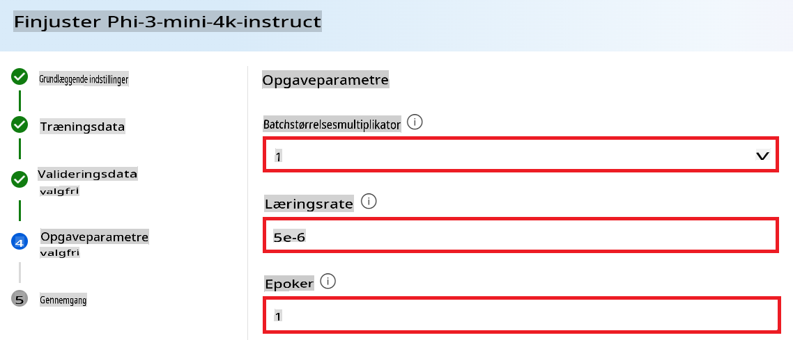  

1. Vælg **Indsend** for at starte finjusteringsprocessen.  

    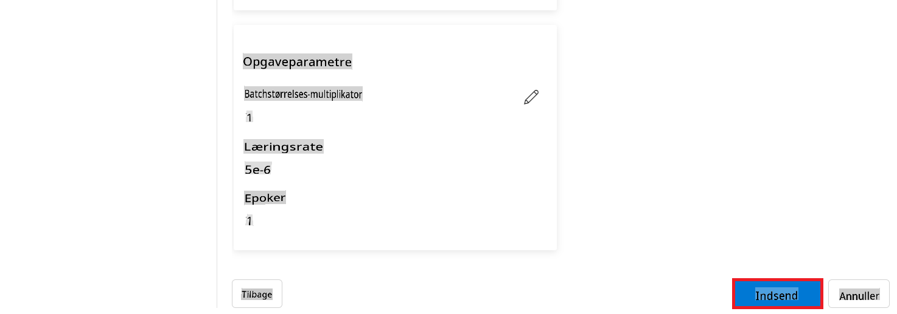  

1. Når din model er finjusteret, vil status blive vist som **Fuldført**, som vist på billedet nedenfor. Nu kan du implementere modellen og bruge den i din egen applikation, i playground eller i prompt flow. For mere information, se [Sådan implementeres Phi-3 familien af små sprogmodeller med Azure AI Foundry](https://learn.microsoft.com/azure/ai-studio/how-to/deploy-models-phi-3?tabs=phi-3-5&pivots=programming-language-python).  

    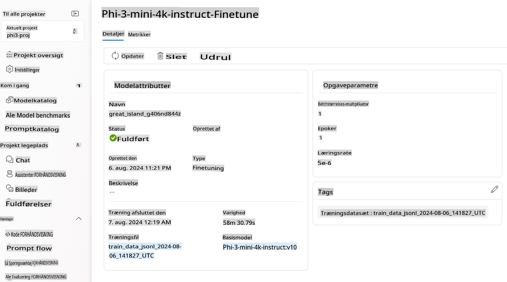  

> [!NOTE]  
> For mere detaljeret information om finjustering af Phi-3, besøg venligst [Finjuster Phi-3 modeller i Azure AI Foundry](https://learn.microsoft.com/azure/ai-studio/how-to/fine-tune-phi-3?tabs=phi-3-mini).  

## Oprydning af dine finjusterede modeller

Du kan slette en finjusteret model fra listen over finjusteringsmodeller i [Azure AI Foundry](https://ai.azure.com) eller fra modellens detaljeside. Vælg den finjusterede model, der skal slettes, fra siden for finjustering, og vælg derefter knappen Slet for at fjerne modellen.  

> [!NOTE]  
> Du kan ikke slette en brugerdefineret model, hvis den har en eksisterende implementering. Du skal først slette din modelimplementering, før du kan slette din brugerdefinerede model.  

## Omkostninger og kvoter

### Omkostnings- og kvoteovervejelser for Phi-3 modeller finjusteret som en tjeneste

Phi-modeller, der er finjusteret som en tjeneste, tilbydes af Microsoft og integreres med Azure AI Foundry til brug. Du kan finde prisen, når du [implementerer](https://learn.microsoft.com/azure/ai-studio/how-to/deploy-models-phi-3?tabs=phi-3-5&pivots=programming-language-python) eller finjusterer modellerne under fanen Priser og vilkår i implementeringsguiden.

## Indholdsfiltrering

Modeller implementeret som en tjeneste med pay-as-you-go er beskyttet af Azure AI Content Safety. Når de implementeres til realtidsendepunkter, kan du vælge at fravælge denne funktion. Med Azure AI Content Safety aktiveret passerer både prompt og completion gennem en samling af klassifikationsmodeller, der sigter mod at opdage og forhindre output af skadeligt indhold. Indholdsfiltreringssystemet registrerer og griber ind over for specifikke kategorier af potentielt skadeligt indhold i både input-prompter og output-completions. Læs mere om [Azure AI Content Safety](https://learn.microsoft.com/azure/ai-studio/concepts/content-filtering).  

**Finjusteringskonfiguration**

Hyperparametre: Definer hyperparametre som læringsrate, batchstørrelse og antal trænings-epochs.

**Tabsfunktion**

Vælg en passende tabsfunktion til din opgave (f.eks. krydsentropi).

**Optimeringsmetode**

Vælg en optimeringsmetode (f.eks. Adam) til gradientopdateringer under træning.

**Finjusteringsproces**

- Indlæs fortrænet model: Indlæs Phi-3 Mini checkpoint.  
- Tilføj brugerdefinerede lag: Tilføj opgavespecifikke lag (f.eks. klassifikationshoved til samtaleinstruktioner).  

**Træn modellen**  
Finjuster modellen ved hjælp af dit forberedte datasæt. Overvåg træningsforløbet og juster hyperparametrene efter behov.  

**Evaluering og validering**

Valideringssæt: Opdel dine data i trænings- og valideringssæt.  

**Evaluer ydeevne**

Brug metrics som nøjagtighed, F1-score eller perplexity til at vurdere modellens ydeevne.  

## Gem finjusteret model

**Checkpoint**  
Gem checkpoint for den finjusterede model til fremtidig brug.  

## Implementering

- Implementer som en webtjeneste: Implementer din finjusterede model som en webtjeneste i Azure AI Foundry.  
- Test endepunktet: Send testforespørgsler til det implementerede endepunkt for at verificere dets funktionalitet.  

## Iterer og forbedr

Iterer: Hvis ydeevnen ikke er tilfredsstillende, iterer ved at justere hyperparametre, tilføje flere data eller finjustere i flere epochs.  

## Overvåg og forfin

Overvåg kontinuerligt modellens adfærd og forfin efter behov.  

## Tilpas og udvid

Brugerdefinerede opgaver: Phi-3 Mini kan finjusteres til forskellige opgaver ud over samtaleinstruktioner. Udforsk andre anvendelsesområder!  
Eksperimentér: Prøv forskellige arkitekturer, lagkombinationer og teknikker for at forbedre ydeevnen.  

> [!NOTE]  
> Finjustering er en iterativ proces. Eksperimentér, lær og tilpas din model for at opnå de bedste resultater til din specifikke opgave!  

**Ansvarsfraskrivelse**:  
Dette dokument er blevet oversat ved hjælp af maskinbaserede AI-oversættelsestjenester. Selvom vi bestræber os på nøjagtighed, skal det bemærkes, at automatiserede oversættelser kan indeholde fejl eller unøjagtigheder. Det originale dokument på dets oprindelige sprog bør betragtes som den autoritative kilde. For kritisk information anbefales professionel menneskelig oversættelse. Vi påtager os ikke ansvar for eventuelle misforståelser eller fejltolkninger, der måtte opstå som følge af brugen af denne oversættelse.