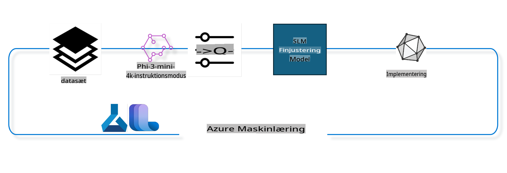

## Sådan bruges chat-completion-komponenter fra Azure ML-systemregistret til at finjustere en model

I dette eksempel vil vi udføre finjustering af modellen Phi-3-mini-4k-instruct for at fuldføre en samtale mellem 2 personer ved hjælp af ultrachat_200k-datasættet.



Eksemplet viser, hvordan du kan udføre finjustering ved hjælp af Azure ML SDK og Python og derefter implementere den finjusterede model til et online endpoint for realtidsinference.

### Træningsdata

Vi bruger datasættet ultrachat_200k. Dette er en stærkt filtreret version af UltraChat-datasættet og blev brugt til at træne Zephyr-7B-β, en avanceret 7b chatmodel.

### Model

Vi vil bruge modellen Phi-3-mini-4k-instruct for at demonstrere, hvordan man kan finjustere en model til chat-completion-opgaver. Hvis du har åbnet denne notebook fra et specifikt modelkort, skal du huske at erstatte det specifikke modelnavn.

### Opgaver

- Vælg en model til finjustering.
- Vælg og udforsk træningsdata.
- Konfigurer finjusteringsjobbet.
- Kør finjusteringsjobbet.
- Gennemgå trænings- og evalueringsmetrikker.
- Registrer den finjusterede model.
- Implementer den finjusterede model til realtidsinference.
- Ryd op i ressourcer.

## 1. Opsætning af forudsætninger

- Installer afhængigheder.
- Opret forbindelse til AzureML Workspace. Lær mere på set up SDK authentication. Erstat <WORKSPACE_NAME>, <RESOURCE_GROUP> og <SUBSCRIPTION_ID> nedenfor.
- Opret forbindelse til AzureML-systemregistret.
- Angiv et valgfrit eksperimentnavn.
- Kontroller eller opret beregningsressourcer.

> [!NOTE]
> Krav: En enkelt GPU-node kan have flere GPU-kort. For eksempel har en node af typen Standard_NC24rs_v3 4 NVIDIA V100 GPU'er, mens Standard_NC12s_v3 har 2 NVIDIA V100 GPU'er. Se dokumentationen for yderligere information. Antallet af GPU-kort pr. node indstilles i parameteren gpus_per_node nedenfor. Hvis denne værdi indstilles korrekt, sikres optimal udnyttelse af alle GPU'er i noden. De anbefalede GPU-compute SKUs kan findes her og her.

### Python-biblioteker

Installer afhængigheder ved at køre nedenstående celle. Dette er ikke et valgfrit trin, hvis du kører i et nyt miljø.

```bash
pip install azure-ai-ml
pip install azure-identity
pip install datasets==2.9.0
pip install mlflow
pip install azureml-mlflow
```

### Interaktion med Azure ML

1. Dette Python-script bruges til at interagere med Azure Machine Learning (Azure ML)-tjenesten. Her er en oversigt over, hvad det gør:

    - Importerer nødvendige moduler fra azure.ai.ml, azure.identity og azure.ai.ml.entities-pakkerne. Importerer også modulet time.

    - Forsøger at autentificere ved hjælp af DefaultAzureCredential(), som giver en forenklet autentificeringsoplevelse til hurtigt at starte udviklingen af applikationer i Azure-skyen. Hvis dette fejler, falder det tilbage til InteractiveBrowserCredential(), som giver en interaktiv login-prompt.

    - Forsøger derefter at oprette en MLClient-instans ved hjælp af from_config-metoden, som læser konfigurationen fra standardkonfigurationsfilen (config.json). Hvis dette fejler, oprettes en MLClient-instans manuelt ved at angive subscription_id, resource_group_name og workspace_name.

    - Opretter en anden MLClient-instans, denne gang for Azure ML-registret med navnet "azureml". Dette register er, hvor modeller, finjusteringspipelines og miljøer opbevares.

    - Sætter eksperimentnavnet til "chat_completion_Phi-3-mini-4k-instruct".

    - Genererer en unik tidsstempel ved at konvertere den aktuelle tid (i sekunder siden epoken som et flydende punkt-nummer) til et heltal og derefter til en streng. Dette tidsstempel kan bruges til at oprette unikke navne og versioner.

    ```python
    # Import necessary modules from Azure ML and Azure Identity
    from azure.ai.ml import MLClient
    from azure.identity import (
        DefaultAzureCredential,
        InteractiveBrowserCredential,
    )
    from azure.ai.ml.entities import AmlCompute
    import time  # Import time module
    
    # Try to authenticate using DefaultAzureCredential
    try:
        credential = DefaultAzureCredential()
        credential.get_token("https://management.azure.com/.default")
    except Exception as ex:  # If DefaultAzureCredential fails, use InteractiveBrowserCredential
        credential = InteractiveBrowserCredential()
    
    # Try to create an MLClient instance using the default config file
    try:
        workspace_ml_client = MLClient.from_config(credential=credential)
    except:  # If that fails, create an MLClient instance by manually providing the details
        workspace_ml_client = MLClient(
            credential,
            subscription_id="<SUBSCRIPTION_ID>",
            resource_group_name="<RESOURCE_GROUP>",
            workspace_name="<WORKSPACE_NAME>",
        )
    
    # Create another MLClient instance for the Azure ML registry named "azureml"
    # This registry is where models, fine-tuning pipelines, and environments are stored
    registry_ml_client = MLClient(credential, registry_name="azureml")
    
    # Set the experiment name
    experiment_name = "chat_completion_Phi-3-mini-4k-instruct"
    
    # Generate a unique timestamp that can be used for names and versions that need to be unique
    timestamp = str(int(time.time()))
    ```

## 2. Vælg en grundmodel til finjustering

1. Phi-3-mini-4k-instruct er en åben model med 3.8B parametre, letvægts og avanceret, bygget på datasæt brugt til Phi-2. Modellen tilhører Phi-3-modelfamilien, og Mini-versionen kommer i to varianter: 4K og 128K, som er den kontekstlængde (i tokens), den kan understøtte. Vi skal finjustere modellen til vores specifikke formål for at kunne bruge den. Du kan gennemse disse modeller i Model Catalog i AzureML Studio ved at filtrere efter chat-completion-opgaven. I dette eksempel bruger vi modellen Phi-3-mini-4k-instruct. Hvis du har åbnet denne notebook for en anden model, skal du erstatte modelnavnet og versionen i overensstemmelse hermed.

    > [!NOTE]
    > Model-id-egenskaben for modellen. Dette vil blive videregivet som input til finjusteringsjobbet. Det er også tilgængeligt som feltet Asset ID på modelsiden i AzureML Studio Model Catalog.

2. Dette Python-script interagerer med Azure Machine Learning (Azure ML)-tjenesten. Her er en oversigt over, hvad det gør:

    - Sætter model_name til "Phi-3-mini-4k-instruct".

    - Bruger get-metoden på models-egenskaben for registry_ml_client-objektet til at hente den nyeste version af modellen med det specificerede navn fra Azure ML-registret. Get-metoden kaldes med to argumenter: navnet på modellen og en label, der specificerer, at den nyeste version af modellen skal hentes.

    - Udskriver en besked til konsollen, der angiver navnet, versionen og id'et på modellen, der vil blive brugt til finjustering. Format-metoden for strengen bruges til at indsætte modellens navn, version og id i beskeden. Modellens navn, version og id tilgås som egenskaber på foundation_model-objektet.

    ```python
    # Set the model name
    model_name = "Phi-3-mini-4k-instruct"
    
    # Get the latest version of the model from the Azure ML registry
    foundation_model = registry_ml_client.models.get(model_name, label="latest")
    
    # Print the model name, version, and id
    # This information is useful for tracking and debugging
    print(
        "\n\nUsing model name: {0}, version: {1}, id: {2} for fine tuning".format(
            foundation_model.name, foundation_model.version, foundation_model.id
        )
    )
    ```

## 3. Opret en beregning til brug med jobbet

Finjusteringsjobbet fungerer KUN med GPU-compute. Størrelsen på computen afhænger af, hvor stor modellen er, og i de fleste tilfælde kan det være vanskeligt at identificere den rette compute til jobbet. I denne celle guider vi brugeren til at vælge den rette compute til jobbet.

> [!NOTE]
> De nedenfor nævnte computere fungerer med den mest optimerede konfiguration. Enhver ændring i konfigurationen kan føre til en Cuda Out Of Memory-fejl. I sådanne tilfælde skal du forsøge at opgradere computen til en større størrelse.

> [!NOTE]
> Når du vælger compute_cluster_size nedenfor, skal du sikre dig, at computen er tilgængelig i din ressourcergruppe. Hvis en bestemt compute ikke er tilgængelig, kan du anmode om adgang til compute-ressourcerne.

### Kontrol af model for finjusteringsstøtte

1. Dette Python-script interagerer med en Azure Machine Learning (Azure ML)-model. Her er en oversigt over, hvad det gør:

    - Importerer ast-modulet, som giver funktioner til at bearbejde træer i Pythons abstrakte syntaksgrammatik.

    - Kontrollerer, om foundation_model-objektet (som repræsenterer en model i Azure ML) har et tag med navnet finetune_compute_allow_list. Tags i Azure ML er nøgle-værdi-par, som du kan oprette og bruge til at filtrere og sortere modeller.

    - Hvis finetune_compute_allow_list-tagget er til stede, bruger det ast.literal_eval-funktionen til sikkert at analysere taggets værdi (en streng) til en Python-liste. Denne liste tildeles derefter til variablen computes_allow_list. Derefter udskrives en besked, der angiver, at en beregning skal oprettes fra listen.

    - Hvis finetune_compute_allow_list-tagget ikke er til stede, sættes computes_allow_list til None, og en besked udskrives, der angiver, at finetune_compute_allow_list-tagget ikke er en del af modellens tags.

    - Kort sagt, dette script kontrollerer for et specifikt tag i modellens metadata, konverterer taggets værdi til en liste, hvis det eksisterer, og giver feedback til brugeren i overensstemmelse hermed.

    ```python
    # Import the ast module, which provides functions to process trees of the Python abstract syntax grammar
    import ast
    
    # Check if the 'finetune_compute_allow_list' tag is present in the model's tags
    if "finetune_compute_allow_list" in foundation_model.tags:
        # If the tag is present, use ast.literal_eval to safely parse the tag's value (a string) into a Python list
        computes_allow_list = ast.literal_eval(
            foundation_model.tags["finetune_compute_allow_list"]
        )  # convert string to python list
        # Print a message indicating that a compute should be created from the list
        print(f"Please create a compute from the above list - {computes_allow_list}")
    else:
        # If the tag is not present, set computes_allow_list to None
        computes_allow_list = None
        # Print a message indicating that the 'finetune_compute_allow_list' tag is not part of the model's tags
        print("`finetune_compute_allow_list` is not part of model tags")
    ```

### Kontrol af beregningsinstans

1. Dette Python-script interagerer med Azure Machine Learning (Azure ML)-tjenesten og udfører flere kontrolpunkter på en beregningsinstans. Her er en oversigt over, hvad det gør:

    - Forsøger at hente beregningsinstansen med navnet lagret i compute_cluster fra Azure ML-arbejdsområdet. Hvis beregningsinstansens provisioning state er "failed", rejser det en ValueError.

    - Kontrollerer, om computes_allow_list ikke er None. Hvis ikke, konverteres alle computestørrelser på listen til små bogstaver, og det kontrolleres, om størrelsen af den aktuelle beregningsinstans er på listen. Hvis ikke, rejser det en ValueError.

    - Hvis computes_allow_list er None, kontrolleres det, om størrelsen af beregningsinstansen er på en liste over ikke-understøttede GPU VM-størrelser. Hvis den er det, rejser det en ValueError.

    - Henter en liste over alle tilgængelige computestørrelser i arbejdsområdet. Itererer derefter over denne liste, og for hver computestørrelse kontrolleres det, om dens navn matcher størrelsen af den aktuelle beregningsinstans. Hvis det gør, hentes antallet af GPU'er for den computestørrelse, og gpu_count_found sættes til True.

    - Hvis gpu_count_found er True, udskrives antallet af GPU'er i beregningsinstansen. Hvis gpu_count_found er False, rejser det en ValueError.

    - Kort sagt, dette script udfører flere kontrolpunkter på en beregningsinstans i et Azure ML-arbejdsområde, herunder kontrol af dens provisioning state, dens størrelse mod en tilladelses- eller afvisningsliste og antallet af GPU'er, den har.

    ```python
    # Print the exception message
    print(e)
    # Raise a ValueError if the compute size is not available in the workspace
    raise ValueError(
        f"WARNING! Compute size {compute_cluster_size} not available in workspace"
    )
    
    # Retrieve the compute instance from the Azure ML workspace
    compute = workspace_ml_client.compute.get(compute_cluster)
    # Check if the provisioning state of the compute instance is "failed"
    if compute.provisioning_state.lower() == "failed":
        # Raise a ValueError if the provisioning state is "failed"
        raise ValueError(
            f"Provisioning failed, Compute '{compute_cluster}' is in failed state. "
            f"please try creating a different compute"
        )
    
    # Check if computes_allow_list is not None
    if computes_allow_list is not None:
        # Convert all compute sizes in computes_allow_list to lowercase
        computes_allow_list_lower_case = [x.lower() for x in computes_allow_list]
        # Check if the size of the compute instance is in computes_allow_list_lower_case
        if compute.size.lower() not in computes_allow_list_lower_case:
            # Raise a ValueError if the size of the compute instance is not in computes_allow_list_lower_case
            raise ValueError(
                f"VM size {compute.size} is not in the allow-listed computes for finetuning"
            )
    else:
        # Define a list of unsupported GPU VM sizes
        unsupported_gpu_vm_list = [
            "standard_nc6",
            "standard_nc12",
            "standard_nc24",
            "standard_nc24r",
        ]
        # Check if the size of the compute instance is in unsupported_gpu_vm_list
        if compute.size.lower() in unsupported_gpu_vm_list:
            # Raise a ValueError if the size of the compute instance is in unsupported_gpu_vm_list
            raise ValueError(
                f"VM size {compute.size} is currently not supported for finetuning"
            )
    
    # Initialize a flag to check if the number of GPUs in the compute instance has been found
    gpu_count_found = False
    # Retrieve a list of all available compute sizes in the workspace
    workspace_compute_sku_list = workspace_ml_client.compute.list_sizes()
    available_sku_sizes = []
    # Iterate over the list of available compute sizes
    for compute_sku in workspace_compute_sku_list:
        available_sku_sizes.append(compute_sku.name)
        # Check if the name of the compute size matches the size of the compute instance
        if compute_sku.name.lower() == compute.size.lower():
            # If it does, retrieve the number of GPUs for that compute size and set gpu_count_found to True
            gpus_per_node = compute_sku.gpus
            gpu_count_found = True
    # If gpu_count_found is True, print the number of GPUs in the compute instance
    if gpu_count_found:
        print(f"Number of GPU's in compute {compute.size}: {gpus_per_node}")
    else:
        # If gpu_count_found is False, raise a ValueError
        raise ValueError(
            f"Number of GPU's in compute {compute.size} not found. Available skus are: {available_sku_sizes}."
            f"This should not happen. Please check the selected compute cluster: {compute_cluster} and try again."
        )
    ```

## 4. Vælg datasættet til finjustering af modellen

1. Vi bruger datasættet ultrachat_200k. Datasættet har fire opdelinger, der er velegnede til superviseret finjustering (sft) og generation ranking (gen). Antallet af eksempler pr. opdeling vises som følger:

    ```bash
    train_sft test_sft  train_gen  test_gen
    207865  23110  256032  28304
    ```

1. De næste få celler viser grundlæggende databehandling til finjustering:

### Visualisering af nogle data

Vi ønsker, at denne prøve skal køre hurtigt, så vi gemmer train_sft- og test_sft-filer, der indeholder 5% af de allerede trimmede rækker. Det betyder, at den finjusterede model vil have lavere nøjagtighed og derfor ikke bør bruges i den virkelige verden.  
Download-dataset.py bruges til at hente datasættet ultrachat_200k og transformere datasættet til et format, der kan bruges af finjusteringspipeline-komponenten. Da datasættet er stort, har vi her kun en del af datasættet.

1. Ved at køre nedenstående script downloades kun 5% af dataene. Dette kan øges ved at ændre parameteren dataset_split_pc til den ønskede procentdel.

    > [!NOTE]
    > Nogle sprogmodeller har forskellige sprogkoder, og derfor skal kolonnenavnene i datasættet afspejle dette.

1. Her er et eksempel på, hvordan dataene skal se ud.  
Chat-completion-datasættet gemmes i parquet-format, hvor hver post bruger følgende skema:

    - Dette er et JSON-dokument (JavaScript Object Notation), som er et populært dataudvekslingsformat. Det er ikke eksekverbar kode, men en måde at gemme og transportere data på. Her er en oversigt over dets struktur:

    - "prompt": Denne nøgle indeholder en strengværdi, der repræsenterer en opgave eller et spørgsmål stillet til en AI-assistent.

    - "messages": Denne nøgle indeholder en liste af objekter. Hvert objekt repræsenterer en besked i en samtale mellem en bruger og en AI-assistent. Hvert beskedobjekt har to nøgler:

    - "content": Denne nøgle indeholder en strengværdi, der repræsenterer indholdet af beskeden.
    - "role": Denne nøgle indeholder en strengværdi, der repræsenterer rollen for den enhed, der sendte beskeden. Det kan enten være "user" eller "assistant".
    - "prompt_id": Denne nøgle indeholder en strengværdi, der repræsenterer en unik identifikator for prompten.

1. I dette specifikke JSON-dokument repræsenteres en samtale, hvor en bruger beder en AI-assistent om at skabe en hovedperson til en dystopisk historie. Assistenten svarer, og brugeren beder derefter om flere detaljer. Assistenten accepterer at give flere detaljer. Hele samtalen er knyttet til et specifikt prompt-id.

    ```python
    {
        // The task or question posed to an AI assistant
        "prompt": "Create a fully-developed protagonist who is challenged to survive within a dystopian society under the rule of a tyrant. ...",
        
        // An array of objects, each representing a message in a conversation between a user and an AI assistant
        "messages":[
            {
                // The content of the user's message
                "content": "Create a fully-developed protagonist who is challenged to survive within a dystopian society under the rule of a tyrant. ...",
                // The role of the entity that sent the message
                "role": "user"
            },
            {
                // The content of the assistant's message
                "content": "Name: Ava\n\n Ava was just 16 years old when the world as she knew it came crashing down. The government had collapsed, leaving behind a chaotic and lawless society. ...",
                // The role of the entity that sent the message
                "role": "assistant"
            },
            {
                // The content of the user's message
                "content": "Wow, Ava's story is so intense and inspiring! Can you provide me with more details.  ...",
                // The role of the entity that sent the message
                "role": "user"
            }, 
            {
                // The content of the assistant's message
                "content": "Certainly! ....",
                // The role of the entity that sent the message
                "role": "assistant"
            }
        ],
        
        // A unique identifier for the prompt
        "prompt_id": "d938b65dfe31f05f80eb8572964c6673eddbd68eff3db6bd234d7f1e3b86c2af"
    }
    ```

### Download data

1. Dette Python-script bruges til at hente et datasæt ved hjælp af et hjælpescript med navnet download-dataset.py. Her er en oversigt over, hvad det gør:

    - Importerer os-modulet, som giver en bærbar måde at bruge operativsystemafhængige funktioner på.

    - Bruger funktionen os.system til at køre scriptet download-dataset.py i shellen med specifikke kommandolinjeargumenter. Argumenterne specificerer datasættet, der skal downloades (HuggingFaceH4/ultrachat_200k), den mappe, det skal downloades til (ultrachat_200k_dataset), og procentdelen af datasættet, der skal opdeles (5). Funktionen os.system returnerer exit-statussen for den udførte kommando; denne status gemmes i variablen exit_status.

    - Kontrollerer, om exit_status ikke er 0. I Unix-lignende operativsystemer indikerer en exit-status på 0 normalt, at en kommando er lykkedes, mens ethvert andet nummer indikerer en fejl. Hvis exit_status ikke er 0, rejser det en Exception med en besked, der angiver, at der opstod en fejl under download af datasættet.

    - Kort sagt, dette script kører en kommando for at hente et datasæt ved hjælp af et hjælpescript og rejser en undtagelse, hvis kommandoen fejler.

    ```python
    # Import the os module, which provides a way of using operating system dependent functionality
    import os
    
    # Use the os.system function to run the download-dataset.py script in the shell with specific command-line arguments
    # The arguments specify the dataset to download (HuggingFaceH4/ultrachat_200k), the directory to download it to (ultrachat_200k_dataset), and the percentage of the dataset to split (5)
    # The os.system function returns the exit status of the command it executed; this status is stored in the exit_status variable
    exit_status = os.system(
        "python ./download-dataset.py --dataset HuggingFaceH4/ultrachat_200k --download_dir ultrachat_200k_dataset --dataset_split_pc 5"
    )
    
    # Check if exit_status is not 0
    # In Unix-like operating systems, an exit status of 0 usually indicates that a command has succeeded, while any other number indicates an error
    # If exit_status is not 0, raise an Exception with a message indicating that there was an error downloading the dataset
    if exit_status != 0:
        raise Exception("Error downloading dataset")
    ```

### Indlæsning af data i en DataFrame

1. Dette Python-script indlæser en JSON Lines-fil i en pandas DataFrame og viser de første 5 rækker. Her er en oversigt over, hvad det gør:

    - Importerer pandas-biblioteket, som er et kraftfuldt bibliotek til datamanipulation og analyse.

    - Indstiller den maksimale kolonnebredde for pandas' visningsindstillinger til 0. Dette betyder, at hele teksten i hver kolonne vises uden afkortning, når DataFrame udskrives.

    - Bruger funktionen pd.read_json til at indlæse filen train_sft.jsonl fra mappen ultrachat_200k_dataset i en DataFrame. Argumentet lines=True angiver, at filen er i JSON Lines-format, hvor hver linje er et separat JSON-objekt.

    - Bruger metoden head til at vise de første 5 rækker i DataFrame. Hvis DataFrame har færre end 5 rækker, vises alle.

    - Kort sagt, dette script indlæser en JSON Lines-fil i en DataFrame og viser de første 5 rækker med fuld kolonne tekst.

    ```python
    # Import the pandas library, which is a powerful data manipulation and analysis library
    import pandas as pd
    
    # Set the maximum column width for pandas' display options to 0
    # This means that the full text of each column will be displayed without truncation when the DataFrame is printed
    pd.set_option("display.max_colwidth", 0)
    
    # Use the pd.read_json function to load the train_sft.jsonl file from the ultrachat_200k_dataset directory into a DataFrame
    # The lines=True argument indicates that the file is in JSON Lines format, where each line is a separate JSON object
    df = pd.read_json("./ultrachat_200k_dataset/train_sft.jsonl", lines=True)
    
    # Use the head method to display the first 5 rows of the DataFrame
    # If the DataFrame has less than 5 rows, it will display all of them
    df.head()
    ```

## 5. Indsend finjusteringsjobbet ved at bruge modellen og dataene som input

Opret jobbet, der bruger chat-completion pipeline-komponenten. Lær mere om alle de parametre, der understøttes til finjustering.

### Definer finjusteringsparametre

1. Finjusteringsparametre kan opdeles i 2 kategorier: træningsparametre og optimeringsparametre.

1. Træningsparametre definerer træningsaspekter som:

    - Den optimizer og scheduler, der skal bruges.
    - Den metrik, der skal optimeres under finjusteringen.
    - Antallet af træningstrin, batchstørrelser osv.
    - Optimeringsparametre hjælper med at optimere GPU-hukommelsen og effektivt bruge beregningsressourcerne.

1. Nedenfor er nogle af de parametre, der hører til denne kategori. Optimeringsparametrene varierer for hver model og er pakket med modellen for at håndtere disse variationer.

    - Aktiver deepspeed og LoRA.
    - Aktiver mixed precision træning.
    - Aktiver multi-node træning.

> [!NOTE]
> Superviseret finjustering kan resultere i tab af alignment eller katastrofal glemsel. Vi anbefaler at kontrollere for dette problem og køre en alignment-fase efter finjusteringen.

### Finjusteringsparametre

1. Dette Python-script opsætter parametre til finjustering af en maskinlæringsmodel. Her er en oversigt over, hvad det gør:

    - Opsætter standard træningsparametre som antallet af træningsepochs, batchstørrelser til træning og evaluering, læringsrate og typen af læringsrate-scheduler.

    - Opsætter standard optimeringsparametre som, hvorvidt Layer-wise Relevance Propagation (LoRa) og DeepSpeed skal anvendes, samt DeepSpeed-stadiet.

    - Kombinerer trænings- og optimeringsparametrene i en enkelt ordbog kaldet finetune_parameters.

    - Kontroller
### Træningspipeline baseret på forskellige parametre og derefter udskrive dette visningsnavn. ```python
    # Define a function to generate a display name for the training pipeline
    def get_pipeline_display_name():
        # Calculate the total batch size by multiplying the per-device batch size, the number of gradient accumulation steps, the number of GPUs per node, and the number of nodes used for fine-tuning
        batch_size = (
            int(finetune_parameters.get("per_device_train_batch_size", 1))
            * int(finetune_parameters.get("gradient_accumulation_steps", 1))
            * int(gpus_per_node)
            * int(finetune_parameters.get("num_nodes_finetune", 1))
        )
        # Retrieve the learning rate scheduler type
        scheduler = finetune_parameters.get("lr_scheduler_type", "linear")
        # Retrieve whether DeepSpeed is applied
        deepspeed = finetune_parameters.get("apply_deepspeed", "false")
        # Retrieve the DeepSpeed stage
        ds_stage = finetune_parameters.get("deepspeed_stage", "2")
        # If DeepSpeed is applied, include "ds" followed by the DeepSpeed stage in the display name; if not, include "nods"
        if deepspeed == "true":
            ds_string = f"ds{ds_stage}"
        else:
            ds_string = "nods"
        # Retrieve whether Layer-wise Relevance Propagation (LoRa) is applied
        lora = finetune_parameters.get("apply_lora", "false")
        # If LoRa is applied, include "lora" in the display name; if not, include "nolora"
        if lora == "true":
            lora_string = "lora"
        else:
            lora_string = "nolora"
        # Retrieve the limit on the number of model checkpoints to keep
        save_limit = finetune_parameters.get("save_total_limit", -1)
        # Retrieve the maximum sequence length
        seq_len = finetune_parameters.get("max_seq_length", -1)
        # Construct the display name by concatenating all these parameters, separated by hyphens
        return (
            model_name
            + "-"
            + "ultrachat"
            + "-"
            + f"bs{batch_size}"
            + "-"
            + f"{scheduler}"
            + "-"
            + ds_string
            + "-"
            + lora_string
            + f"-save_limit{save_limit}"
            + f"-seqlen{seq_len}"
        )
    
    # Call the function to generate the display name
    pipeline_display_name = get_pipeline_display_name()
    # Print the display name
    print(f"Display name used for the run: {pipeline_display_name}")
    ```

### Konfiguration af Pipeline

Dette Python-script definerer og konfigurerer en maskinlæringspipeline ved hjælp af Azure Machine Learning SDK. Her er en oversigt over, hvad det gør:

1. Det importerer nødvendige moduler fra Azure AI ML SDK.  
1. Det henter en pipelinekomponent ved navn "chat_completion_pipeline" fra registreringsdatabasen.  
1. Det definerer et pipelinejob ved hjælp af `@pipeline` decorator and the function `create_pipeline`. The name of the pipeline is set to `pipeline_display_name`.

1. Inside the `create_pipeline` function, it initializes the fetched pipeline component with various parameters, including the model path, compute clusters for different stages, dataset splits for training and testing, the number of GPUs to use for fine-tuning, and other fine-tuning parameters.

1. It maps the output of the fine-tuning job to the output of the pipeline job. This is done so that the fine-tuned model can be easily registered, which is required to deploy the model to an online or batch endpoint.

1. It creates an instance of the pipeline by calling the `create_pipeline` function.

1. It sets the `force_rerun` setting of the pipeline to `True`, meaning that cached results from previous jobs will not be used.

1. It sets the `continue_on_step_failure` setting of the pipeline to `False`, hvilket betyder, at pipelinen stopper, hvis et trin fejler.  
1. Sammenfattende definerer og konfigurerer dette script en maskinlæringspipeline til en chat completion-opgave ved hjælp af Azure Machine Learning SDK.  

```python
    # Import necessary modules from the Azure AI ML SDK
    from azure.ai.ml.dsl import pipeline
    from azure.ai.ml import Input
    
    # Fetch the pipeline component named "chat_completion_pipeline" from the registry
    pipeline_component_func = registry_ml_client.components.get(
        name="chat_completion_pipeline", label="latest"
    )
    
    # Define the pipeline job using the @pipeline decorator and the function create_pipeline
    # The name of the pipeline is set to pipeline_display_name
    @pipeline(name=pipeline_display_name)
    def create_pipeline():
        # Initialize the fetched pipeline component with various parameters
        # These include the model path, compute clusters for different stages, dataset splits for training and testing, the number of GPUs to use for fine-tuning, and other fine-tuning parameters
        chat_completion_pipeline = pipeline_component_func(
            mlflow_model_path=foundation_model.id,
            compute_model_import=compute_cluster,
            compute_preprocess=compute_cluster,
            compute_finetune=compute_cluster,
            compute_model_evaluation=compute_cluster,
            # Map the dataset splits to parameters
            train_file_path=Input(
                type="uri_file", path="./ultrachat_200k_dataset/train_sft.jsonl"
            ),
            test_file_path=Input(
                type="uri_file", path="./ultrachat_200k_dataset/test_sft.jsonl"
            ),
            # Training settings
            number_of_gpu_to_use_finetuning=gpus_per_node,  # Set to the number of GPUs available in the compute
            **finetune_parameters
        )
        return {
            # Map the output of the fine tuning job to the output of pipeline job
            # This is done so that we can easily register the fine tuned model
            # Registering the model is required to deploy the model to an online or batch endpoint
            "trained_model": chat_completion_pipeline.outputs.mlflow_model_folder
        }
    
    # Create an instance of the pipeline by calling the create_pipeline function
    pipeline_object = create_pipeline()
    
    # Don't use cached results from previous jobs
    pipeline_object.settings.force_rerun = True
    
    # Set continue on step failure to False
    # This means that the pipeline will stop if any step fails
    pipeline_object.settings.continue_on_step_failure = False
    ```

### Indsend job

1. Dette Python-script indsender et maskinlæringspipelinejob til et Azure Machine Learning-arbejdsområde og venter derefter på, at jobbet afsluttes. Her er en oversigt over, hvad det gør:  

   - Det kalder metoden create_or_update på jobs-objektet i workspace_ml_client for at indsende pipelinejobbet. Den pipeline, der skal køres, angives af pipeline_object, og eksperimentet, som jobbet køres under, angives af experiment_name.  
   - Det kalder derefter stream-metoden på jobs-objektet i workspace_ml_client for at vente på, at pipelinejobbet afsluttes. Det job, der skal ventes på, angives af name-attributten i pipeline_job-objektet.  

1. Sammenfattende indsender dette script et maskinlæringspipelinejob til et Azure Machine Learning-arbejdsområde og venter derefter på, at jobbet afsluttes.  

```python
    # Submit the pipeline job to the Azure Machine Learning workspace
    # The pipeline to be run is specified by pipeline_object
    # The experiment under which the job is run is specified by experiment_name
    pipeline_job = workspace_ml_client.jobs.create_or_update(
        pipeline_object, experiment_name=experiment_name
    )
    
    # Wait for the pipeline job to complete
    # The job to wait for is specified by the name attribute of the pipeline_job object
    workspace_ml_client.jobs.stream(pipeline_job.name)
    ```

## 6. Registrér den fintunede model i arbejdsområdet

Vi registrerer modellen fra outputtet af fintuningsjobbet. Dette vil spore relationen mellem den fintunede model og fintuningsjobbet. Fintuningsjobbet sporer desuden relationen til grundmodellen, dataene og træningskoden.  

### Registrering af ML-modellen

1. Dette Python-script registrerer en maskinlæringsmodel, der blev trænet i en Azure Machine Learning-pipeline. Her er en oversigt over, hvad det gør:  

   - Det importerer nødvendige moduler fra Azure AI ML SDK.  
   - Det kontrollerer, om trained_model-outputtet er tilgængeligt fra pipelinejobbet ved at kalde get-metoden på jobs-objektet i workspace_ml_client og få adgang til dets outputs-attribut.  
   - Det konstruerer en sti til den trænede model ved at formatere en streng med navnet på pipelinejobbet og navnet på outputtet ("trained_model").  
   - Det definerer et navn til den fintunede model ved at tilføje "-ultrachat-200k" til det oprindelige modelnavn og erstatte eventuelle skråstreger med bindestreger.  
   - Det forbereder registreringen af modellen ved at oprette et Model-objekt med forskellige parametre, inklusive stien til modellen, typen af modellen (MLflow-model), modelnavnet og versionen samt en beskrivelse af modellen.  
   - Det registrerer modellen ved at kalde metoden create_or_update på models-objektet i workspace_ml_client med Model-objektet som argument.  
   - Det udskriver den registrerede model.  

1. Sammenfattende registrerer dette script en maskinlæringsmodel, der blev trænet i en Azure Machine Learning-pipeline.  

```python
    # Import necessary modules from the Azure AI ML SDK
    from azure.ai.ml.entities import Model
    from azure.ai.ml.constants import AssetTypes
    
    # Check if the `trained_model` output is available from the pipeline job
    print("pipeline job outputs: ", workspace_ml_client.jobs.get(pipeline_job.name).outputs)
    
    # Construct a path to the trained model by formatting a string with the name of the pipeline job and the name of the output ("trained_model")
    model_path_from_job = "azureml://jobs/{0}/outputs/{1}".format(
        pipeline_job.name, "trained_model"
    )
    
    # Define a name for the fine-tuned model by appending "-ultrachat-200k" to the original model name and replacing any slashes with hyphens
    finetuned_model_name = model_name + "-ultrachat-200k"
    finetuned_model_name = finetuned_model_name.replace("/", "-")
    
    print("path to register model: ", model_path_from_job)
    
    # Prepare to register the model by creating a Model object with various parameters
    # These include the path to the model, the type of the model (MLflow model), the name and version of the model, and a description of the model
    prepare_to_register_model = Model(
        path=model_path_from_job,
        type=AssetTypes.MLFLOW_MODEL,
        name=finetuned_model_name,
        version=timestamp,  # Use timestamp as version to avoid version conflict
        description=model_name + " fine tuned model for ultrachat 200k chat-completion",
    )
    
    print("prepare to register model: \n", prepare_to_register_model)
    
    # Register the model by calling the create_or_update method of the models object in the workspace_ml_client with the Model object as the argument
    registered_model = workspace_ml_client.models.create_or_update(
        prepare_to_register_model
    )
    
    # Print the registered model
    print("registered model: \n", registered_model)
    ```

## 7. Udrul den fintunede model til et online endpoint

Online endpoints giver en stabil REST API, der kan bruges til at integrere med applikationer, der skal bruge modellen.  

### Administrer Endpoint

1. Dette Python-script opretter et administreret online endpoint i Azure Machine Learning for en registreret model. Her er en oversigt over, hvad det gør:  

   - Det importerer nødvendige moduler fra Azure AI ML SDK.  
   - Det definerer et unikt navn til det online endpoint ved at tilføje et tidsstempel til strengen "ultrachat-completion-".  
   - Det forbereder oprettelsen af det online endpoint ved at oprette et ManagedOnlineEndpoint-objekt med forskellige parametre, inklusive navnet på endpointet, en beskrivelse af endpointet og autentificeringstilstanden ("key").  
   - Det opretter det online endpoint ved at kalde metoden begin_create_or_update på workspace_ml_client med ManagedOnlineEndpoint-objektet som argument. Det venter derefter på, at oprettelsesoperationen afsluttes ved at kalde wait-metoden.  

1. Sammenfattende opretter dette script et administreret online endpoint i Azure Machine Learning for en registreret model.  

```python
    # Import necessary modules from the Azure AI ML SDK
    from azure.ai.ml.entities import (
        ManagedOnlineEndpoint,
        ManagedOnlineDeployment,
        ProbeSettings,
        OnlineRequestSettings,
    )
    
    # Define a unique name for the online endpoint by appending a timestamp to the string "ultrachat-completion-"
    online_endpoint_name = "ultrachat-completion-" + timestamp
    
    # Prepare to create the online endpoint by creating a ManagedOnlineEndpoint object with various parameters
    # These include the name of the endpoint, a description of the endpoint, and the authentication mode ("key")
    endpoint = ManagedOnlineEndpoint(
        name=online_endpoint_name,
        description="Online endpoint for "
        + registered_model.name
        + ", fine tuned model for ultrachat-200k-chat-completion",
        auth_mode="key",
    )
    
    # Create the online endpoint by calling the begin_create_or_update method of the workspace_ml_client with the ManagedOnlineEndpoint object as the argument
    # Then wait for the creation operation to complete by calling the wait method
    workspace_ml_client.begin_create_or_update(endpoint).wait()
    ```  

> [!NOTE]  
> Du kan finde listen over SKU'er, der understøttes til udrulning, her - [Managed online endpoints SKU list](https://learn.microsoft.com/azure/machine-learning/reference-managed-online-endpoints-vm-sku-list)  

### Udrulning af ML-model

1. Dette Python-script udruller en registreret maskinlæringsmodel til et administreret online endpoint i Azure Machine Learning. Her er en oversigt over, hvad det gør:  

   - Det importerer ast-modulet, som giver funktioner til at behandle træer af Pythons abstrakte syntaksgrammatik.  
   - Det sætter instanstypen for udrulningen til "Standard_NC6s_v3".  
   - Det kontrollerer, om tagget inference_compute_allow_list er til stede i grundmodellen. Hvis det er, konverteres tagværdien fra en streng til en Python-liste og tildeles inference_computes_allow_list. Hvis ikke, sættes inference_computes_allow_list til None.  
   - Det kontrollerer, om den angivne instanstype er på tilladelseslisten. Hvis ikke, udskrives en besked, der beder brugeren om at vælge en instanstype fra tilladelseslisten.  
   - Det forbereder oprettelsen af udrulningen ved at oprette et ManagedOnlineDeployment-objekt med forskellige parametre, inklusive navnet på udrulningen, navnet på endpointet, ID'et på modellen, instanstypen og antallet, liveness probe-indstillingerne og forespørgselsindstillingerne.  
   - Det opretter udrulningen ved at kalde metoden begin_create_or_update på workspace_ml_client med ManagedOnlineDeployment-objektet som argument. Det venter derefter på, at oprettelsesoperationen afsluttes ved at kalde wait-metoden.  
   - Det sætter endpointets trafik til at dirigere 100 % af trafikken til "demo"-udrulningen.  
   - Det opdaterer endpointet ved at kalde metoden begin_create_or_update på workspace_ml_client med endpoint-objektet som argument. Det venter derefter på, at opdateringsoperationen afsluttes ved at kalde result-metoden.  

1. Sammenfattende udruller dette script en registreret maskinlæringsmodel til et administreret online endpoint i Azure Machine Learning.  

```python
    # Import the ast module, which provides functions to process trees of the Python abstract syntax grammar
    import ast
    
    # Set the instance type for the deployment
    instance_type = "Standard_NC6s_v3"
    
    # Check if the `inference_compute_allow_list` tag is present in the foundation model
    if "inference_compute_allow_list" in foundation_model.tags:
        # If it is, convert the tag value from a string to a Python list and assign it to `inference_computes_allow_list`
        inference_computes_allow_list = ast.literal_eval(
            foundation_model.tags["inference_compute_allow_list"]
        )
        print(f"Please create a compute from the above list - {computes_allow_list}")
    else:
        # If it's not, set `inference_computes_allow_list` to `None`
        inference_computes_allow_list = None
        print("`inference_compute_allow_list` is not part of model tags")
    
    # Check if the specified instance type is in the allow list
    if (
        inference_computes_allow_list is not None
        and instance_type not in inference_computes_allow_list
    ):
        print(
            f"`instance_type` is not in the allow listed compute. Please select a value from {inference_computes_allow_list}"
        )
    
    # Prepare to create the deployment by creating a `ManagedOnlineDeployment` object with various parameters
    demo_deployment = ManagedOnlineDeployment(
        name="demo",
        endpoint_name=online_endpoint_name,
        model=registered_model.id,
        instance_type=instance_type,
        instance_count=1,
        liveness_probe=ProbeSettings(initial_delay=600),
        request_settings=OnlineRequestSettings(request_timeout_ms=90000),
    )
    
    # Create the deployment by calling the `begin_create_or_update` method of the `workspace_ml_client` with the `ManagedOnlineDeployment` object as the argument
    # Then wait for the creation operation to complete by calling the `wait` method
    workspace_ml_client.online_deployments.begin_create_or_update(demo_deployment).wait()
    
    # Set the traffic of the endpoint to direct 100% of the traffic to the "demo" deployment
    endpoint.traffic = {"demo": 100}
    
    # Update the endpoint by calling the `begin_create_or_update` method of the `workspace_ml_client` with the `endpoint` object as the argument
    # Then wait for the update operation to complete by calling the `result` method
    workspace_ml_client.begin_create_or_update(endpoint).result()
    ```  

## 8. Test endpointet med eksempledata  

Vi henter nogle eksempledata fra testdatasættet og indsender dem til online endpointet for inferens. Vi viser derefter de vurderede labels sammen med de faktiske labels.  

### Læse resultaterne

1. Dette Python-script læser en JSON Lines-fil ind i en pandas DataFrame, tager en tilfældig prøve og nulstiller indekset. Her er en oversigt over, hvad det gør:  

   - Det læser filen ./ultrachat_200k_dataset/test_gen.jsonl ind i en pandas DataFrame. Funktionen read_json bruges med argumentet lines=True, da filen er i JSON Lines-format, hvor hver linje er et separat JSON-objekt.  
   - Det tager en tilfældig prøve på 1 række fra DataFrame. Funktionen sample bruges med argumentet n=1 for at angive antallet af tilfældige rækker, der skal vælges.  
   - Det nulstiller indekset for DataFrame. Funktionen reset_index bruges med argumentet drop=True for at fjerne det oprindelige indeks og erstatte det med et nyt indeks med standard heltalsværdier.  
   - Det viser de første 2 rækker af DataFrame ved hjælp af funktionen head med argumentet 2. Men da DataFrame kun indeholder én række efter udvælgelsen, vil det kun vise denne ene række.  

1. Sammenfattende læser dette script en JSON Lines-fil ind i en pandas DataFrame, tager en tilfældig prøve på 1 række, nulstiller indekset og viser den første række.  

```python
    # Import pandas library
    import pandas as pd
    
    # Read the JSON Lines file './ultrachat_200k_dataset/test_gen.jsonl' into a pandas DataFrame
    # The 'lines=True' argument indicates that the file is in JSON Lines format, where each line is a separate JSON object
    test_df = pd.read_json("./ultrachat_200k_dataset/test_gen.jsonl", lines=True)
    
    # Take a random sample of 1 row from the DataFrame
    # The 'n=1' argument specifies the number of random rows to select
    test_df = test_df.sample(n=1)
    
    # Reset the index of the DataFrame
    # The 'drop=True' argument indicates that the original index should be dropped and replaced with a new index of default integer values
    # The 'inplace=True' argument indicates that the DataFrame should be modified in place (without creating a new object)
    test_df.reset_index(drop=True, inplace=True)
    
    # Display the first 2 rows of the DataFrame
    # However, since the DataFrame only contains one row after the sampling, this will only display that one row
    test_df.head(2)
    ```  

### Opret JSON-objekt

1. Dette Python-script opretter et JSON-objekt med specifikke parametre og gemmer det i en fil. Her er en oversigt over, hvad det gør:  

   - Det importerer json-modulet, som giver funktioner til at arbejde med JSON-data.  
   - Det opretter en ordbog parameters med nøgler og værdier, der repræsenterer parametre for en maskinlæringsmodel. Nøglerne er "temperature", "top_p", "do_sample" og "max_new_tokens", og deres tilsvarende værdier er henholdsvis 0.6, 0.9, True og 200.  
   - Det opretter en anden ordbog test_json med to nøgler: "input_data" og "params". Værdien af "input_data" er en anden ordbog med nøglerne "input_string" og "parameters". Værdien af "input_string" er en liste, der indeholder den første besked fra test_df DataFrame. Værdien af "parameters" er ordbogen parameters, der blev oprettet tidligere. Værdien af "params" er en tom ordbog.  
   - Det åbner en fil ved navn sample_score.json  

```python
    # Import the json module, which provides functions to work with JSON data
    import json
    
    # Create a dictionary `parameters` with keys and values that represent parameters for a machine learning model
    # The keys are "temperature", "top_p", "do_sample", and "max_new_tokens", and their corresponding values are 0.6, 0.9, True, and 200 respectively
    parameters = {
        "temperature": 0.6,
        "top_p": 0.9,
        "do_sample": True,
        "max_new_tokens": 200,
    }
    
    # Create another dictionary `test_json` with two keys: "input_data" and "params"
    # The value of "input_data" is another dictionary with keys "input_string" and "parameters"
    # The value of "input_string" is a list containing the first message from the `test_df` DataFrame
    # The value of "parameters" is the `parameters` dictionary created earlier
    # The value of "params" is an empty dictionary
    test_json = {
        "input_data": {
            "input_string": [test_df["messages"][0]],
            "parameters": parameters,
        },
        "params": {},
    }
    
    # Open a file named `sample_score.json` in the `./ultrachat_200k_dataset` directory in write mode
    with open("./ultrachat_200k_dataset/sample_score.json", "w") as f:
        # Write the `test_json` dictionary to the file in JSON format using the `json.dump` function
        json.dump(test_json, f)
    ```  

### Kald af Endpoint

1. Dette Python-script kalder et online endpoint i Azure Machine Learning for at score en JSON-fil. Her er en oversigt over, hvad det gør:  

   - Det kalder invoke-metoden på online_endpoints-egenskaben i workspace_ml_client-objektet. Denne metode bruges til at sende en anmodning til et online endpoint og få et svar.  
   - Det angiver navnet på endpointet og udrulningen med argumenterne endpoint_name og deployment_name. I dette tilfælde er endpoint-navnet gemt i variablen online_endpoint_name, og udrulningsnavnet er "demo".  
   - Det angiver stien til JSON-filen, der skal scores, med argumentet request_file. I dette tilfælde er filen ./ultrachat_200k_dataset/sample_score.json.  
   - Det gemmer svaret fra endpointet i variablen response.  
   - Det udskriver det rå svar.  

1. Sammenfattende kalder dette script et online endpoint i Azure Machine Learning for at score en JSON-fil og udskriver svaret.  

```python
    # Invoke the online endpoint in Azure Machine Learning to score the `sample_score.json` file
    # The `invoke` method of the `online_endpoints` property of the `workspace_ml_client` object is used to send a request to an online endpoint and get a response
    # The `endpoint_name` argument specifies the name of the endpoint, which is stored in the `online_endpoint_name` variable
    # The `deployment_name` argument specifies the name of the deployment, which is "demo"
    # The `request_file` argument specifies the path to the JSON file to be scored, which is `./ultrachat_200k_dataset/sample_score.json`
    response = workspace_ml_client.online_endpoints.invoke(
        endpoint_name=online_endpoint_name,
        deployment_name="demo",
        request_file="./ultrachat_200k_dataset/sample_score.json",
    )
    
    # Print the raw response from the endpoint
    print("raw response: \n", response, "\n")
    ```  

## 9. Slet det online endpoint

1. Husk at slette det online endpoint, ellers vil du efterlade afregningsmåleren kørende for den beregning, som endpointet bruger. Denne linje Python-kode sletter et online endpoint i Azure Machine Learning. Her er en oversigt over, hvad det gør:  

   - Det kalder metoden begin_delete på online_endpoints-egenskaben i workspace_ml_client-objektet. Denne metode bruges til at starte sletningen af et online endpoint.  
   - Det angiver navnet på endpointet, der skal slettes, med argumentet name. I dette tilfælde er endpoint-navnet gemt i variablen online_endpoint_name.  
   - Det kalder metoden wait for at vente på, at sletningsoperationen afsluttes. Dette er en blokerende operation, hvilket betyder, at det forhindrer scriptet i at fortsætte, indtil sletningen er færdig.  

1. Sammenfattende starter denne linje kode sletningen af et online endpoint i Azure Machine Learning og venter på, at operationen afsluttes.  

```python
    # Delete the online endpoint in Azure Machine Learning
    # The `begin_delete` method of the `online_endpoints` property of the `workspace_ml_client` object is used to start the deletion of an online endpoint
    # The `name` argument specifies the name of the endpoint to be deleted, which is stored in the `online_endpoint_name` variable
    # The `wait` method is called to wait for the deletion operation to complete. This is a blocking operation, meaning that it will prevent the script from continuing until the deletion is finished
    workspace_ml_client.online_endpoints.begin_delete(name=online_endpoint_name).wait()
    ```  

**Ansvarsfraskrivelse**:  
Dette dokument er blevet oversat ved hjælp af maskinbaserede AI-oversættelsestjenester. Selvom vi bestræber os på nøjagtighed, bedes du være opmærksom på, at automatiserede oversættelser kan indeholde fejl eller unøjagtigheder. Det originale dokument på dets oprindelige sprog bør betragtes som den autoritative kilde. For kritisk information anbefales professionel menneskelig oversættelse. Vi påtager os intet ansvar for misforståelser eller fejltolkninger, der måtte opstå som følge af brugen af denne oversættelse.