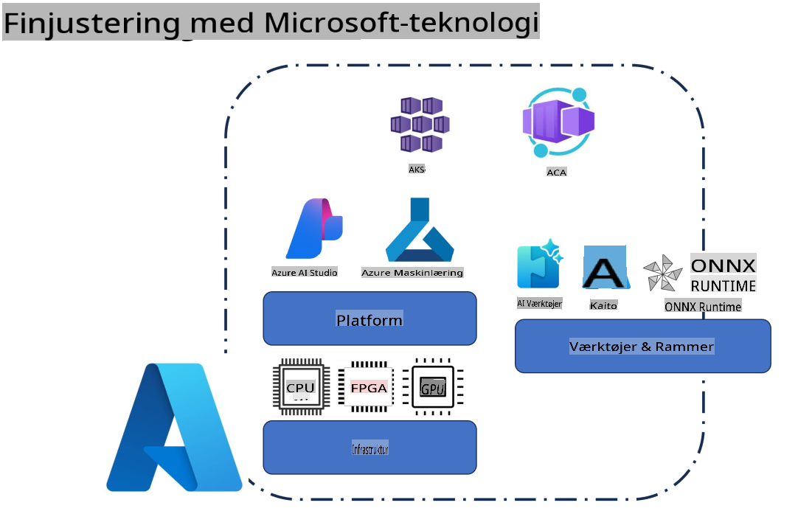
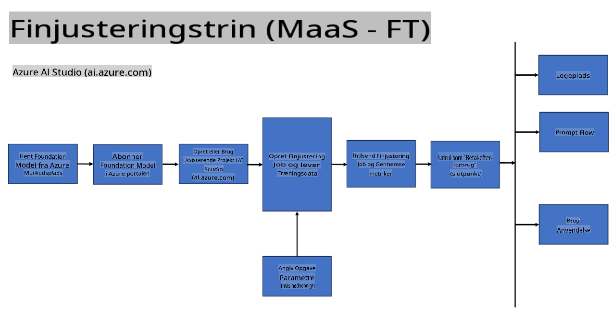
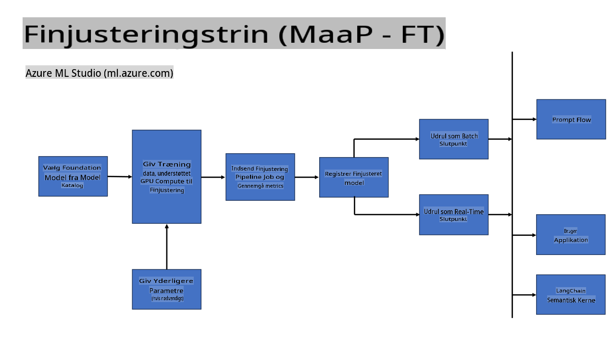
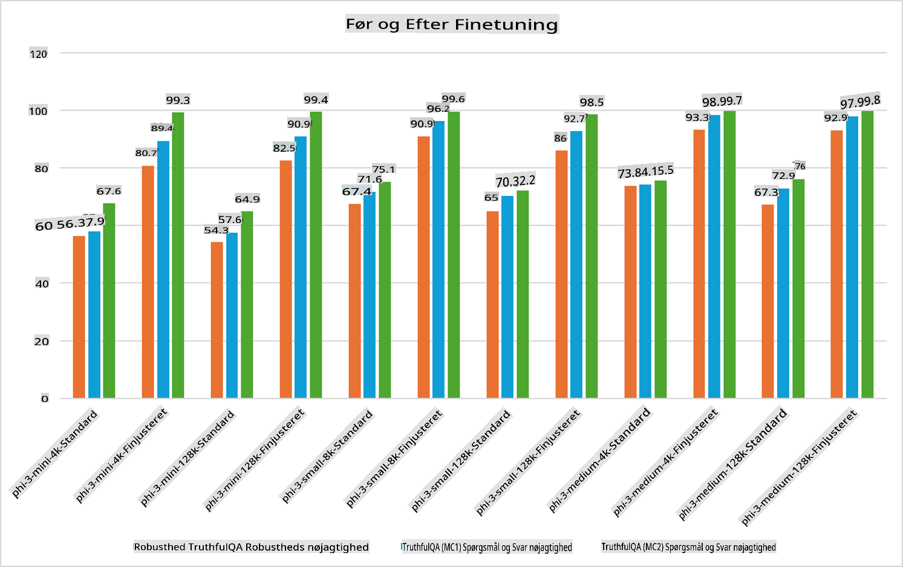

## Finjusteringsscenarier

**Platform** Dette inkluderer forskellige teknologier som Azure AI Foundry, Azure Machine Learning, AI Tools, Kaito og ONNX Runtime.

**Infrastruktur** Dette omfatter CPU og FPGA, som er essentielle for finjusteringsprocessen. Lad mig vise dig ikonerne for hver af disse teknologier.

**Værktøjer & Rammeværk** Dette inkluderer ONNX Runtime og ONNX Runtime. Lad mig vise dig ikonerne for hver af disse teknologier.  
[Indsæt ikoner for ONNX Runtime og ONNX Runtime]

Finjusteringsprocessen med Microsoft-teknologier involverer forskellige komponenter og værktøjer. Ved at forstå og anvende disse teknologier kan vi effektivt finjustere vores applikationer og skabe bedre løsninger.

## Model som en Service

Finjuster modellen ved hjælp af hostet finjustering, uden behov for at oprette og administrere beregningsressourcer.

Serverløs finjustering er tilgængelig for Phi-3-mini og Phi-3-medium modeller, hvilket gør det muligt for udviklere hurtigt og nemt at tilpasse modellerne til cloud- og edge-scenarier uden at skulle arrangere beregningsressourcer. Vi har også annonceret, at Phi-3-small nu er tilgængelig via vores Models-as-a-Service-tilbud, så udviklere hurtigt og nemt kan komme i gang med AI-udvikling uden at skulle administrere underliggende infrastruktur.

## Model som en Platform

Brugere administrerer deres egne beregningsressourcer for at finjustere deres modeller.

[Finjusterings-eksempel](https://github.com/Azure/azureml-examples/blob/main/sdk/python/foundation-models/system/finetune/chat-completion/chat-completion.ipynb)

## Finjusteringsscenarier

| | | | | | | |
|-|-|-|-|-|-|-|
|Scenarie|LoRA|QLoRA|PEFT|DeepSpeed|ZeRO|DORA|
|Tilpasning af forudtrænede LLM'er til specifikke opgaver eller domæner|Ja|Ja|Ja|Ja|Ja|Ja|
|Finjustering til NLP-opgaver som tekstklassificering, navngiven enhedsgenkendelse og maskinoversættelse|Ja|Ja|Ja|Ja|Ja|Ja|
|Finjustering til QA-opgaver|Ja|Ja|Ja|Ja|Ja|Ja|
|Finjustering til generering af menneskelignende svar i chatbots|Ja|Ja|Ja|Ja|Ja|Ja|
|Finjustering til generering af musik, kunst eller andre former for kreativitet|Ja|Ja|Ja|Ja|Ja|Ja|
|Reducerer beregnings- og økonomiske omkostninger|Ja|Ja|Nej|Ja|Ja|Nej|
|Reducerer hukommelsesforbrug|Nej|Ja|Nej|Ja|Ja|Ja|
|Brug af færre parametre til effektiv finjustering|Nej|Ja|Ja|Nej|Nej|Ja|
|Hukommelseseffektiv form for data-parallelisme, der giver adgang til den samlede GPU-hukommelse på alle tilgængelige GPU-enheder|Nej|Nej|Nej|Ja|Ja|Ja|

## Eksempler på finjusteringsydelse

**Ansvarsfraskrivelse**:  
Dette dokument er blevet oversat ved hjælp af maskinbaserede AI-oversættelsestjenester. Selvom vi bestræber os på nøjagtighed, skal du være opmærksom på, at automatiserede oversættelser kan indeholde fejl eller unøjagtigheder. Det originale dokument på dets oprindelige sprog bør betragtes som den autoritative kilde. For kritisk information anbefales professionel menneskelig oversættelse. Vi påtager os ikke ansvar for misforståelser eller fejltolkninger, der måtte opstå som følge af brugen af denne oversættelse.