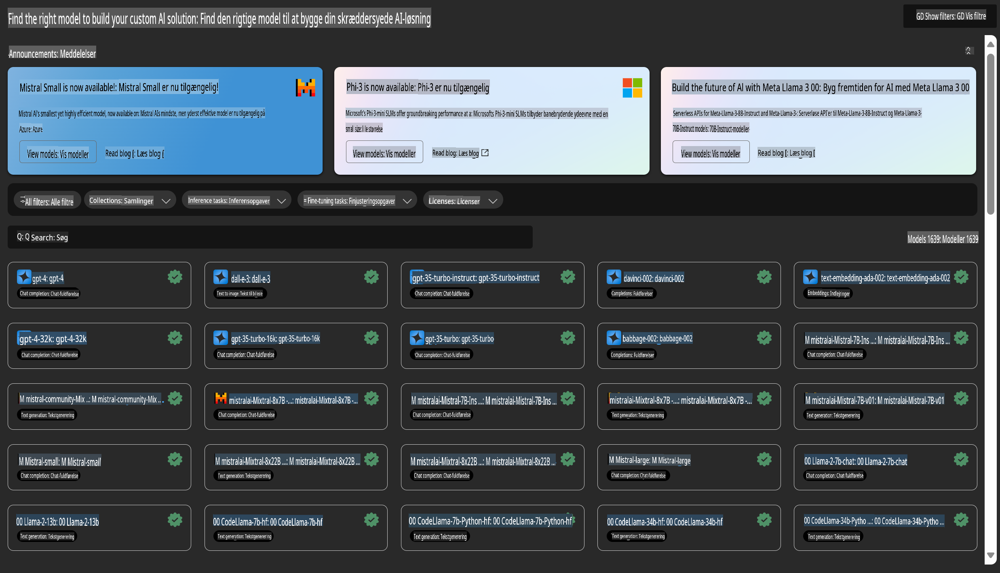

# **Introduktion til Azure Machine Learning Service**

[Azure Machine Learning](https://ml.azure.com?WT.mc_id=aiml-138114-kinfeylo) er en cloud-tjeneste, der accelererer og håndterer livscyklussen for maskinlæringsprojekter (ML).

ML-professionelle, dataforskere og ingeniører kan bruge det i deres daglige arbejdsgange til at:

- Træne og implementere modeller.  
Administrere maskinlæringsoperationer (MLOps).  
- Du kan oprette en model i Azure Machine Learning eller bruge en model, der er bygget på en open-source platform som PyTorch, TensorFlow eller scikit-learn.  
- MLOps-værktøjer hjælper dig med at overvåge, genoptræne og genimplementere modeller.  

## Hvem er Azure Machine Learning til?

**Dataforskere og ML-ingeniører**  

De kan bruge værktøjer til at accelerere og automatisere deres daglige arbejdsgange.  
Azure ML tilbyder funktioner som retfærdighed, forklarbarhed, sporing og revisionsmuligheder.  

**Applikationsudviklere**  

De kan nemt integrere modeller i applikationer eller tjenester.  

**Platformudviklere**  

De har adgang til et robust sæt værktøjer understøttet af holdbare Azure Resource Manager API'er.  
Disse værktøjer gør det muligt at bygge avancerede ML-værktøjer.  

**Virksomheder**  

Ved at arbejde i Microsoft Azure-cloud får virksomheder fordel af velkendt sikkerhed og rollebaseret adgangskontrol.  
Opsæt projekter for at kontrollere adgangen til beskyttede data og specifikke operationer.  

## Produktivitet for alle på teamet  

ML-projekter kræver ofte et team med forskellige kompetencer for at bygge og vedligeholde.  

Azure ML tilbyder værktøjer, der gør det muligt for dig at:  
- Samarbejde med dit team via delte notebooks, beregningsressourcer, serverfri beregning, data og miljøer.  
- Udvikle modeller med retfærdighed, forklarbarhed, sporing og revisionsmuligheder for at opfylde krav til sporbarhed og revision.  
- Implementere ML-modeller hurtigt og nemt i stor skala og administrere og styre dem effektivt med MLOps.  
- Køre maskinlæringsarbejdsbelastninger hvor som helst med indbygget styring, sikkerhed og compliance.  

## Platformværktøjer med krydskompatibilitet  

Alle på et ML-team kan bruge deres foretrukne værktøjer til at udføre arbejdet.  
Uanset om du kører hurtige eksperimenter, hyperparameter-tuning, bygger pipelines eller administrerer inferenser, kan du bruge velkendte grænseflader som:  
- Azure Machine Learning Studio  
- Python SDK (v2)  
- Azure CLI (v2)  
- Azure Resource Manager REST API'er  

Når du forfiner modeller og samarbejder gennem udviklingscyklussen, kan du dele og finde aktiver, ressourcer og målinger i Azure Machine Learning Studio UI.  

## **LLM/SLM i Azure ML**  

Azure ML har tilføjet mange LLM/SLM-relaterede funktioner, der kombinerer LLMOps og SLMOps for at skabe en virksomhedsplatform til generativ kunstig intelligens.  

### **Modelkatalog**  

Virksomhedsbrugere kan implementere forskellige modeller afhængigt af forretningsscenarier via Modelkataloget og levere tjenester som Model as Service, så virksomhedsudviklere eller brugere kan få adgang.  

  

Modelkataloget i Azure Machine Learning Studio er knudepunktet for at opdage og bruge et bredt udvalg af modeller, der gør det muligt at bygge generative AI-applikationer. Modelkataloget indeholder hundredvis af modeller fra udbydere som Azure OpenAI Service, Mistral, Meta, Cohere, Nvidia, Hugging Face samt modeller trænet af Microsoft. Modeller fra andre udbydere end Microsoft er ikke-Microsoft-produkter, som defineret i Microsofts produktspecifikationer, og er underlagt de vilkår, der følger med modellen.  

### **Jobpipeline**  

Kernen i en maskinlæringspipeline er at opdele en komplet maskinlæringsopgave i en workflow med flere trin. Hvert trin er en håndterbar komponent, der kan udvikles, optimeres, konfigureres og automatiseres individuelt. Trinene er forbundet gennem veldefinerede grænseflader. Azure Machine Learning Pipeline-tjenesten orkestrerer automatisk alle afhængigheder mellem pipelinetrin.  

Ved finjustering af SLM/LLM kan vi administrere vores data, trænings- og genereringsprocesser gennem Pipeline.  

  

### **Prompt flow**  

**Fordele ved at bruge Azure Machine Learning Prompt Flow**  
Azure Machine Learning Prompt Flow tilbyder en række fordele, der hjælper brugerne med at gå fra idé til eksperimentering og i sidste ende til produktionsklare LLM-baserede applikationer:  

**Smidighed i prompt engineering**  

Interaktiv forfatteroplevelse: Azure Machine Learning Prompt Flow giver en visuel repræsentation af flowets struktur, så brugerne nemt kan forstå og navigere i deres projekter. Det tilbyder også en notebook-lignende kodningsoplevelse for effektiv flowudvikling og fejlfinding.  
Varianter til prompt-tuning: Brugere kan oprette og sammenligne flere prompt-varianter, hvilket muliggør en iterativ forfiningsproces.  

Evaluering: Indbyggede evalueringsflows gør det muligt for brugerne at vurdere kvaliteten og effektiviteten af deres prompts og flows.  

Omfattende ressourcer: Azure Machine Learning Prompt Flow inkluderer et bibliotek med indbyggede værktøjer, eksempler og skabeloner, der fungerer som udgangspunkt for udvikling, inspirerer kreativitet og fremskynder processen.  

**Klar til virksomheder med LLM-baserede applikationer**  

Samarbejde: Azure Machine Learning Prompt Flow understøtter teamsamarbejde, så flere brugere kan arbejde sammen om prompt engineering-projekter, dele viden og opretholde versionskontrol.  

Alt-i-en platform: Azure Machine Learning Prompt Flow strømliner hele prompt engineering-processen fra udvikling og evaluering til implementering og overvågning. Brugere kan nemt implementere deres flows som Azure Machine Learning-endpoints og overvåge deres ydeevne i realtid, hvilket sikrer optimal drift og løbende forbedring.  

Azure Machine Learning Enterprise Readiness-løsninger: Prompt Flow udnytter Azure Machine Learnings robuste løsninger til virksomhedsklarhed, der giver et sikkert, skalerbart og pålideligt fundament for udvikling, eksperimentering og implementering af flows.  

Med Azure Machine Learning Prompt Flow kan brugere udnytte deres smidighed i prompt engineering, samarbejde effektivt og drage fordel af løsninger i virksomhedsklasse til succesfuld udvikling og implementering af LLM-baserede applikationer.  

Ved at kombinere computerkraft, data og forskellige komponenter i Azure ML kan virksomhedsudviklere nemt bygge deres egne kunstige intelligensapplikationer.  

**Ansvarsfraskrivelse**:  
Dette dokument er blevet oversat ved hjælp af AI-baserede maskinoversættelsestjenester. Selvom vi bestræber os på nøjagtighed, skal det bemærkes, at automatiserede oversættelser kan indeholde fejl eller unøjagtigheder. Det originale dokument på dets oprindelige sprog bør betragtes som den autoritative kilde. For kritisk information anbefales professionel menneskelig oversættelse. Vi påtager os intet ansvar for misforståelser eller fejltolkninger, der måtte opstå som følge af brugen af denne oversættelse.