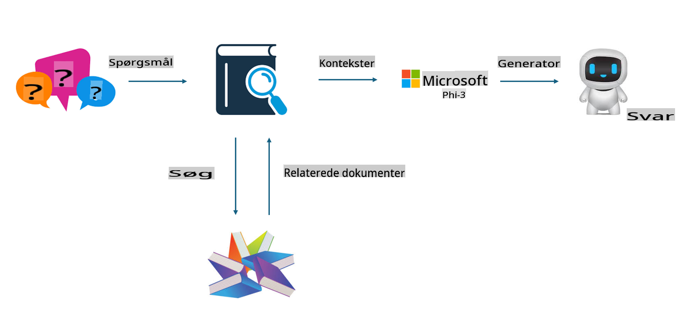
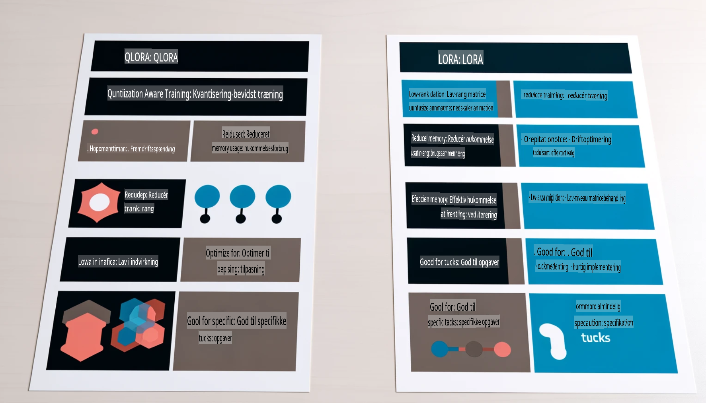

# **Lad Phi-3 blive en brancheekspert**

For at implementere Phi-3-modellen i en branche skal du tilføje branchespecifikke data til Phi-3-modellen. Vi har to forskellige muligheder: RAG (Retrieval Augmented Generation) og Fine-Tuning.

## **RAG vs Fine-Tuning**

### **Retrieval Augmented Generation**

RAG kombinerer datahentning og tekstgenerering. Virksomhedens strukturerede og ustrukturerede data gemmes i en vektordatabase. Når der søges efter relevant indhold, findes de relevante resuméer og indhold for at skabe en kontekst, og derefter kombineres det med LLM/SLM’s tekstgenereringskapacitet for at skabe indhold.

### **Fine-Tuning**

Fine-tuning bygger videre på forbedringen af en eksisterende model. Det kræver ikke, at man starter med modelalgoritmen, men det kræver, at data kontinuerligt akkumuleres. Hvis du ønsker mere præcise fagudtryk og sprogbrug i branchespecifikke applikationer, er fine-tuning det bedste valg. Men hvis dine data ændrer sig ofte, kan fine-tuning blive komplekst.

### **Hvordan vælger man?**

1. Hvis vores svar kræver introduktion af eksterne data, er RAG det bedste valg.

2. Hvis du har brug for at levere stabil og præcis branchespecifik viden, vil fine-tuning være et godt valg. RAG prioriterer at trække relevant indhold, men det rammer måske ikke altid de specialiserede nuancer.

3. Fine-tuning kræver et datasæt af høj kvalitet, og hvis det kun dækker et lille område, vil det ikke gøre den store forskel. RAG er mere fleksibelt.

4. Fine-tuning er en slags "black box" og kan være svær at forstå indeni. RAG gør det lettere at finde kilden til dataene og dermed effektivt justere hallucinationer eller fejl i indholdet, hvilket giver bedre gennemsigtighed.

### **Scenarier**

1. Vertikale industrier, der kræver specifik fagterminologi og udtryk: ***Fine-tuning*** vil være det bedste valg.

2. QA-systemer, der involverer syntese af forskellige videnspunkter: ***RAG*** vil være det bedste valg.

3. Kombinationen af automatiserede forretningsprocesser: ***RAG + Fine-tuning*** er det bedste valg.

## **Sådan bruger du RAG**

En vektordatabase er en samling af data gemt i matematisk form. Vektordatabaser gør det lettere for maskinlæringsmodeller at huske tidligere input, hvilket muliggør brugen af maskinlæring til at understøtte anvendelser som søgning, anbefalinger og tekstgenerering. Data kan identificeres baseret på lighedsmålinger frem for eksakte match, hvilket gør det muligt for computermodeller at forstå dataenes kontekst.

Vektordatabasen er nøglen til at realisere RAG. Vi kan konvertere data til vektorlagring gennem vektormodeller som text-embedding-3, jina-ai-embedding osv.

Læs mere om, hvordan du opretter en RAG-applikation [https://github.com/microsoft/Phi-3CookBook](https://github.com/microsoft/Phi-3CookBook?WT.mc_id=aiml-138114-kinfeylo)

## **Sådan bruger du Fine-Tuning**

De mest anvendte algoritmer i Fine-Tuning er Lora og QLora. Hvordan vælger man?
- [Lær mere med denne eksempel-notebook](../../../../code/04.Finetuning/Phi_3_Inference_Finetuning.ipynb)
- [Eksempel på Python Fine-Tuning Script](../../../../code/04.Finetuning/FineTrainingScript.py)

### **Lora og QLora**

LoRA (Low-Rank Adaptation) og QLoRA (Quantized Low-Rank Adaptation) er begge teknikker, der bruges til at finjustere store sprogmodeller (LLMs) ved hjælp af Parameter Efficient Fine Tuning (PEFT). PEFT-teknikker er designet til at træne modeller mere effektivt end traditionelle metoder.  
LoRA er en selvstændig finjusteringsteknik, der reducerer hukommelsesforbruget ved at anvende en lav-rang-tilnærmelse på vægtopdateringsmatricen. Det tilbyder hurtige træningstider og opretholder ydeevne tæt på traditionelle finjusteringsmetoder.  

QLoRA er en udvidet version af LoRA, der inkorporerer kvantiseringsteknikker for yderligere at reducere hukommelsesforbruget. QLoRA kvantiserer præcisionen af vægtparametrene i den fortrænede LLM til 4-bit præcision, hvilket er mere hukommelseseffektivt end LoRA. Dog er QLoRA-træning omkring 30 % langsommere end LoRA-træning på grund af de ekstra kvantiserings- og dekvantiseringsprocesser.  

QLoRA bruger LoRA som et supplement til at rette de fejl, der opstår under kvantiseringen. QLoRA muliggør finjustering af massive modeller med milliarder af parametre på relativt små, let tilgængelige GPU'er. For eksempel kan QLoRA finjustere en model med 70B parametre, der kræver 36 GPU'er, med kun 2.

**Ansvarsfraskrivelse**:  
Dette dokument er blevet oversat ved hjælp af maskinbaserede AI-oversættelsestjenester. Selvom vi bestræber os på nøjagtighed, skal du være opmærksom på, at automatiserede oversættelser kan indeholde fejl eller unøjagtigheder. Det originale dokument på dets oprindelige sprog bør betragtes som den autoritative kilde. For kritisk information anbefales professionel menneskelig oversættelse. Vi er ikke ansvarlige for misforståelser eller fejltolkninger, der måtte opstå som følge af brugen af denne oversættelse.