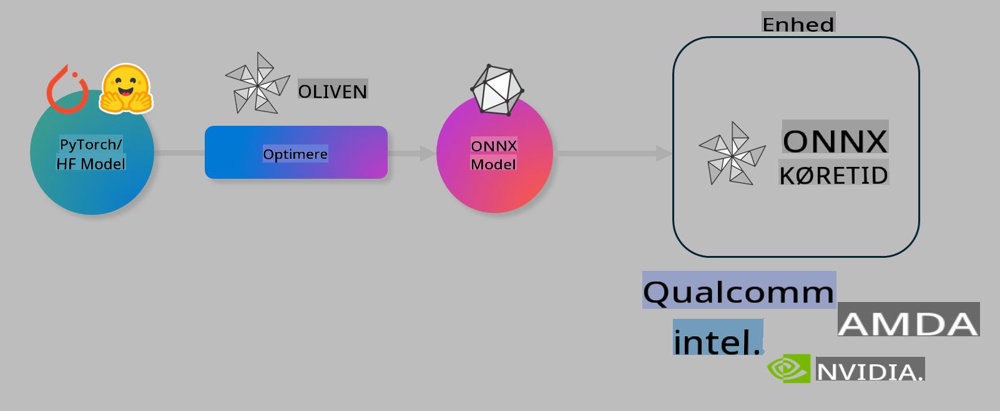

# Lab. Optimer AI-modeller til inference på enheder

## Introduktion 

> [!IMPORTANT]
> Dette lab kræver en **Nvidia A10 eller A100 GPU** med tilhørende drivere og CUDA toolkit (version 12+) installeret.

> [!NOTE]
> Dette er et **35-minutters** lab, der giver dig en praktisk introduktion til kernekoncepterne i at optimere modeller til inference på enheder ved hjælp af OLIVE.

## Læringsmål

Efter dette lab vil du kunne bruge OLIVE til at:

- Kvantisere en AI-model ved hjælp af AWQ-kvantiseringsmetoden.
- Finjustere en AI-model til en specifik opgave.
- Generere LoRA-adaptere (finjusteret model) til effektiv inference på enheder ved hjælp af ONNX Runtime.

### Hvad er Olive

Olive (*O*NNX *live*) er et værktøj til modeloptimering med en tilhørende CLI, der gør det muligt at levere modeller til ONNX runtime +++https://onnxruntime.ai+++ med høj kvalitet og ydeevne.



Input til Olive er typisk en PyTorch- eller Hugging Face-model, og outputtet er en optimeret ONNX-model, der kan køres på en enhed (implementeringsmål) med ONNX runtime. Olive optimerer modellen til implementeringsmålets AI-accelerator (NPU, GPU, CPU) leveret af en hardwareproducent som Qualcomm, AMD, Nvidia eller Intel.

Olive udfører en *workflow*, som er en ordnet sekvens af individuelle modeloptimeringsopgaver kaldet *passes*. Eksempler på passes inkluderer: modelkomprimering, grafoptagelse, kvantisering, grafoptimering. Hver pass har et sæt parametre, der kan justeres for at opnå de bedste metrics, såsom nøjagtighed og latenstid, som evalueres af den respektive evaluator. Olive bruger en søgestrategi med en søgealgoritme til automatisk at justere hver pass enkeltvis eller i grupper.

#### Fordele ved Olive

- **Reducer frustration og tid** ved manuel forsøg-og-fejl-eksperimentering med forskellige teknikker til grafoptimering, komprimering og kvantisering. Definer dine kvalitets- og ydeevnekrav, og lad Olive automatisk finde den bedste model for dig.
- **40+ indbyggede modeloptimeringskomponenter**, der dækker de nyeste teknikker inden for kvantisering, komprimering, grafoptimering og finjustering.
- **Brugervenlig CLI** til almindelige modeloptimeringsopgaver. For eksempel olive quantize, olive auto-opt, olive finetune.
- Indbygget modelpakning og implementering.
- Understøtter generering af modeller til **Multi LoRA serving**.
- Konstruér workflows ved hjælp af YAML/JSON til at orkestrere modeloptimerings- og implementeringsopgaver.
- Integration med **Hugging Face** og **Azure AI**.
- Indbygget **cachemekanisme** til at **spare omkostninger**.

## Lab-instruktioner
> [!NOTE]
> Sørg for, at du har oprettet din Azure AI Hub og projekt samt opsat din A100-compute som beskrevet i Lab 1.

### Trin 0: Forbind til din Azure AI Compute

Du vil forbinde til Azure AI-computen ved hjælp af fjernfunktionen i **VS Code.** 

1. Åbn din **VS Code** desktop-applikation:
1. Åbn **kommandopaletten** ved hjælp af **Shift+Ctrl+P**
1. Søg i kommandopaletten efter **AzureML - remote: Connect to compute instance in New Window**.
1. Følg vejledningen på skærmen for at forbinde til computen. Dette indebærer at vælge dit Azure-abonnement, ressourcegruppe, projekt og computenavn, som du opsatte i Lab 1.
1. Når du er forbundet til din Azure ML Compute-node, vises dette i **nederste venstre hjørne af Visual Code** `><Azure ML: Compute Name`

### Trin 1: Klon dette repo

I VS Code kan du åbne en ny terminal med **Ctrl+J** og klone dette repo:

I terminalen bør du se prompten

```
azureuser@computername:~/cloudfiles/code$ 
```
Klon løsningen 

```bash
cd ~/localfiles
git clone https://github.com/microsoft/phi-3cookbook.git
```

### Trin 2: Åbn mappe i VS Code

For at åbne VS Code i den relevante mappe, udfør følgende kommando i terminalen, som vil åbne et nyt vindue:

```bash
code phi-3cookbook/code/04.Finetuning/Olive-lab
```

Alternativt kan du åbne mappen ved at vælge **File** > **Open Folder**. 

### Trin 3: Afhængigheder

Åbn et terminalvindue i VS Code på din Azure AI Compute Instance (tip: **Ctrl+J**) og udfør følgende kommandoer for at installere afhængighederne:

```bash
conda create -n olive-ai python=3.11 -y
conda activate olive-ai
pip install -r requirements.txt
az extension remove -n azure-cli-ml
az extension add -n ml
```

> [!NOTE]
> Det tager ca. **5 minutter** at installere alle afhængighederne.

I dette lab vil du downloade og uploade modeller til Azure AI Model-kataloget. For at få adgang til modelkataloget skal du logge ind på Azure ved hjælp af:

```bash
az login
```

> [!NOTE]
> Ved login vil du blive bedt om at vælge dit abonnement. Sørg for at vælge det abonnement, der er angivet til dette lab.

### Trin 4: Udfør Olive-kommandoer 

Åbn et terminalvindue i VS Code på din Azure AI Compute Instance (tip: **Ctrl+J**) og sørg for, at `olive-ai` conda-miljøet er aktiveret:

```bash
conda activate olive-ai
```

Udfør derefter følgende Olive-kommandoer i kommandolinjen.

1. **Undersøg dataene:** I dette eksempel vil du finjustere Phi-3.5-Mini-modellen, så den er specialiseret i at besvare rejserelaterede spørgsmål. Koden nedenfor viser de første par poster i datasættet, som er i JSON-linjer-format:
   
    ```bash
    head data/data_sample_travel.jsonl
    ```
1. **Kvantiser modellen:** Før du træner modellen, kvantiserer du den først med følgende kommando, der bruger en teknik kaldet Active Aware Quantization (AWQ) +++https://arxiv.org/abs/2306.00978+++. AWQ kvantiserer vægtene af en model ved at tage højde for de aktiveringer, der produceres under inferencen. Dette betyder, at kvantiseringsprocessen tager højde for den faktiske datadistribution i aktiveringerne, hvilket fører til bedre bevarelse af modellens nøjagtighed sammenlignet med traditionelle vægtkvantiseringsmetoder.
    
    ```bash
    olive quantize \
       --model_name_or_path microsoft/Phi-3.5-mini-instruct \
       --trust_remote_code \
       --algorithm awq \
       --output_path models/phi/awq \
       --log_level 1
    ```
    
    Det tager ca. **8 minutter** at gennemføre AWQ-kvantiseringen, hvilket vil **reducere modellens størrelse fra ca. 7,5 GB til ca. 2,5 GB**.
   
   I dette lab viser vi dig, hvordan du indlæser modeller fra Hugging Face (for eksempel: `microsoft/Phi-3.5-mini-instruct`). However, Olive also allows you to input models from the Azure AI catalog by updating the `model_name_or_path` argument to an Azure AI asset ID (for example:  `azureml://registries/azureml/models/Phi-3.5-mini-instruct/versions/4`). 

1. **Train the model:** Next, the `olive finetune`-kommandoen finjusterer den kvantiserede model. At kvantisere modellen *før* finjustering i stedet for efter giver bedre nøjagtighed, da finjusteringsprocessen genvinder noget af tabet fra kvantiseringen.
    
    ```bash
    olive finetune \
        --method lora \
        --model_name_or_path models/phi/awq \
        --data_files "data/data_sample_travel.jsonl" \
        --data_name "json" \
        --text_template "<|user|>\n{prompt}<|end|>\n<|assistant|>\n{response}<|end|>" \
        --max_steps 100 \
        --output_path ./models/phi/ft \
        --log_level 1
    ```
    
    Det tager ca. **6 minutter** at gennemføre finjusteringen (med 100 trin).

1. **Optimer:** Når modellen er trænet, optimerer du nu modellen ved hjælp af Olives `auto-opt` command, which will capture the ONNX graph and automatically perform a number of optimizations to improve the model performance for CPU by compressing the model and doing fusions. It should be noted, that you can also optimize for other devices such as NPU or GPU by just updating the `--device` and `--provider`-argumenter - men til formålet med dette lab bruger vi CPU.

    ```bash
    olive auto-opt \
       --model_name_or_path models/phi/ft/model \
       --adapter_path models/phi/ft/adapter \
       --device cpu \
       --provider CPUExecutionProvider \
       --use_ort_genai \
       --output_path models/phi/onnx-ao \
       --log_level 1
    ```
    
    Det tager ca. **5 minutter** at gennemføre optimeringen.

### Trin 5: Hurtig test af model-inference

For at teste modellens inference skal du oprette en Python-fil i din mappe kaldet **app.py** og kopiere og indsætte følgende kode:

```python
import onnxruntime_genai as og
import numpy as np

print("loading model and adapters...", end="", flush=True)
model = og.Model("models/phi/onnx-ao/model")
adapters = og.Adapters(model)
adapters.load("models/phi/onnx-ao/model/adapter_weights.onnx_adapter", "travel")
print("DONE!")

tokenizer = og.Tokenizer(model)
tokenizer_stream = tokenizer.create_stream()

params = og.GeneratorParams(model)
params.set_search_options(max_length=100, past_present_share_buffer=False)
user_input = "what is the best thing to see in chicago"
params.input_ids = tokenizer.encode(f"<|user|>\n{user_input}<|end|>\n<|assistant|>\n")

generator = og.Generator(model, params)

generator.set_active_adapter(adapters, "travel")

print(f"{user_input}")

while not generator.is_done():
    generator.compute_logits()
    generator.generate_next_token()

    new_token = generator.get_next_tokens()[0]
    print(tokenizer_stream.decode(new_token), end='', flush=True)

print("\n")
```

Udfør koden ved hjælp af:

```bash
python app.py
```

### Trin 6: Upload model til Azure AI

Ved at uploade modellen til et Azure AI-modelkatalog gør du modellen delbar med andre medlemmer af dit udviklingsteam og håndterer også versionsstyring af modellen. For at uploade modellen skal du udføre følgende kommando:

> [!NOTE]
> Opdater `{}` placeholders with the name of your resource group and Azure AI Project Name. 

To find your resource group `"resourceGroup"og Azure AI Project name, og kør følgende kommando 

```
az ml workspace show
```

Eller ved at gå til +++ai.azure.com+++ og vælge **management center** **project** **overview**

Opdater `{}`-pladsholderne med navnet på din ressourcegruppe og Azure AI-projektnavn.

```bash
az ml model create \
    --name ft-for-travel \
    --version 1 \
    --path ./models/phi/onnx-ao \
    --resource-group {RESOURCE_GROUP_NAME} \
    --workspace-name {PROJECT_NAME}
```
Du kan derefter se din uploadede model og implementere din model på https://ml.azure.com/model/list

**Ansvarsfraskrivelse**:  
Dette dokument er blevet oversat ved hjælp af AI-baserede maskinoversættelsestjenester. Selvom vi bestræber os på nøjagtighed, bedes du være opmærksom på, at automatiserede oversættelser kan indeholde fejl eller unøjagtigheder. Det originale dokument på dets oprindelige sprog bør betragtes som den autoritative kilde. For kritisk information anbefales professionel menneskelig oversættelse. Vi påtager os intet ansvar for eventuelle misforståelser eller fejltolkninger, der måtte opstå som følge af brugen af denne oversættelse.