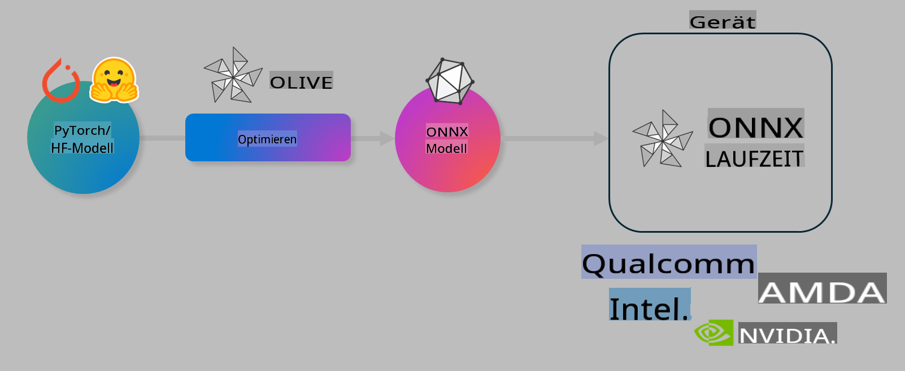

# Lab. KI-Modelle für On-Device-Inferenz optimieren

## Einführung

> [!IMPORTANT]
> Für dieses Lab wird eine **Nvidia A10 oder A100 GPU** mit den zugehörigen Treibern und dem CUDA-Toolkit (Version 12+) benötigt.

> [!NOTE]
> Dieses Lab dauert **35 Minuten** und bietet eine praktische Einführung in die Kernkonzepte der Modelloptimierung für On-Device-Inferenz mit OLIVE.

## Lernziele

Am Ende dieses Labs können Sie OLIVE verwenden, um:

- Ein KI-Modell mit der AWQ-Quantisierungsmethode zu quantisieren.
- Ein KI-Modell für eine spezifische Aufgabe zu fine-tunen.
- LoRA-Adapter (fine-getunte Modelle) für eine effiziente On-Device-Inferenz mit ONNX Runtime zu generieren.

### Was ist Olive?

Olive (*O*NNX *live*) ist ein Toolkit zur Modelloptimierung mit einer begleitenden CLI, das Ihnen ermöglicht, Modelle für die ONNX Runtime bereitzustellen +++https://onnxruntime.ai+++ mit hoher Qualität und Leistung.



Der Input für Olive ist typischerweise ein PyTorch- oder Hugging Face-Modell, und der Output ist ein optimiertes ONNX-Modell, das auf einem Gerät (Bereitstellungsziel) mit ONNX Runtime ausgeführt wird. Olive optimiert das Modell für den KI-Beschleuniger (NPU, GPU, CPU) des Bereitstellungsziels, der von Hardwareanbietern wie Qualcomm, AMD, Nvidia oder Intel bereitgestellt wird.

Olive führt einen *Workflow* aus, der eine geordnete Abfolge von einzelnen Modelloptimierungsaufgaben, sogenannte *Passes*, darstellt – Beispiel-Passes umfassen: Modellkomprimierung, Graph-Capture, Quantisierung, Graph-Optimierung. Jeder Pass hat eine Reihe von Parametern, die abgestimmt werden können, um die besten Metriken wie Genauigkeit und Latenz zu erreichen, die vom jeweiligen Evaluator bewertet werden. Olive verwendet eine Suchstrategie, die einen Suchalgorithmus einsetzt, um jeden Pass einzeln oder mehrere Passes zusammen automatisch zu optimieren.

#### Vorteile von Olive

- **Reduziert Frustration und Zeit** durch manuelle Trial-and-Error-Experimente mit verschiedenen Techniken zur Graph-Optimierung, Komprimierung und Quantisierung. Definieren Sie Ihre Qualitäts- und Leistungsanforderungen, und Olive findet automatisch das beste Modell für Sie.
- **Über 40 eingebaute Modelloptimierungskomponenten**, die modernste Techniken in Quantisierung, Komprimierung, Graph-Optimierung und Fine-Tuning abdecken.
- **Einfache CLI** für gängige Modelloptimierungsaufgaben, z. B. olive quantize, olive auto-opt, olive finetune.
- Modellpaketierung und Bereitstellung integriert.
- Unterstützt die Generierung von Modellen für **Multi-LoRA-Serving**.
- Workflows mit YAML/JSON erstellen, um Modelloptimierungs- und Bereitstellungsaufgaben zu orchestrieren.
- Integration von **Hugging Face** und **Azure AI**.
- Eingebauter **Caching-Mechanismus**, um **Kosten zu sparen**.

## Lab-Anweisungen
> [!NOTE]
> Stellen Sie sicher, dass Sie Ihren Azure AI Hub und Ihr Projekt bereitgestellt und Ihre A100-Compute-Instanz gemäß Lab 1 eingerichtet haben.

### Schritt 0: Verbindung zu Ihrem Azure AI Compute herstellen

Verbinden Sie sich mit der Azure AI Compute-Instanz über die Remote-Funktion in **VS Code.**

1. Öffnen Sie Ihre **VS Code** Desktop-Anwendung:
1. Öffnen Sie die **Befehlspalette** mit **Shift+Ctrl+P**.
1. Suchen Sie in der Befehlspalette nach **AzureML - remote: Connect to compute instance in New Window**.
1. Folgen Sie den Anweisungen auf dem Bildschirm, um eine Verbindung zur Compute-Instanz herzustellen. Dies beinhaltet die Auswahl Ihres Azure-Abonnements, der Ressourcengruppe, des Projekts und des Compute-Namens, die Sie in Lab 1 eingerichtet haben.
1. Sobald Sie mit Ihrem Azure ML Compute-Knoten verbunden sind, wird dies **unten links in Visual Code** angezeigt `><Azure ML: Compute Name`.

### Schritt 1: Dieses Repository klonen

In VS Code können Sie ein neues Terminal mit **Ctrl+J** öffnen und dieses Repository klonen:

Im Terminal sollten Sie die Eingabeaufforderung sehen:

```
azureuser@computername:~/cloudfiles/code$ 
```
Klonen Sie die Lösung:

```bash
cd ~/localfiles
git clone https://github.com/microsoft/phi-3cookbook.git
```

### Schritt 2: Ordner in VS Code öffnen

Um VS Code im relevanten Ordner zu öffnen, führen Sie den folgenden Befehl im Terminal aus. Dadurch wird ein neues Fenster geöffnet:

```bash
code phi-3cookbook/code/04.Finetuning/Olive-lab
```

Alternativ können Sie den Ordner über **Datei** > **Ordner öffnen** auswählen.

### Schritt 3: Abhängigkeiten installieren

Öffnen Sie ein Terminalfenster in VS Code auf Ihrer Azure AI Compute-Instanz (Tipp: **Ctrl+J**) und führen Sie die folgenden Befehle aus, um die Abhängigkeiten zu installieren:

```bash
conda create -n olive-ai python=3.11 -y
conda activate olive-ai
pip install -r requirements.txt
az extension remove -n azure-cli-ml
az extension add -n ml
```

> [!NOTE]
> Es dauert ~5 Minuten, um alle Abhängigkeiten zu installieren.

In diesem Lab werden Sie Modelle in den Azure AI Model-Katalog herunterladen und hochladen. Um auf den Modellkatalog zugreifen zu können, müssen Sie sich bei Azure anmelden:

```bash
az login
```

> [!NOTE]
> Beim Anmelden werden Sie aufgefordert, Ihr Abonnement auszuwählen. Stellen Sie sicher, dass Sie das für dieses Lab bereitgestellte Abonnement auswählen.

### Schritt 4: Olive-Befehle ausführen

Öffnen Sie ein Terminalfenster in VS Code auf Ihrer Azure AI Compute-Instanz (Tipp: **Ctrl+J**) und stellen Sie sicher, dass die `olive-ai` Conda-Umgebung aktiviert ist:

```bash
conda activate olive-ai
```

Führen Sie anschließend die folgenden Olive-Befehle in der Befehlszeile aus.

1. **Daten inspizieren:** In diesem Beispiel werden Sie das Phi-3.5-Mini-Modell so fine-tunen, dass es sich auf die Beantwortung von reisebezogenen Fragen spezialisiert. Der folgende Code zeigt die ersten Einträge des Datensatzes an, die im JSON-Lines-Format vorliegen:
   
    ```bash
    head data/data_sample_travel.jsonl
    ```
1. **Modell quantisieren:** Bevor das Modell trainiert wird, quantisieren Sie es mit dem folgenden Befehl, der eine Technik namens Active Aware Quantization (AWQ) verwendet +++https://arxiv.org/abs/2306.00978+++. AWQ quantisiert die Gewichte eines Modells, indem die während der Inferenz erzeugten Aktivierungen berücksichtigt werden. Dadurch wird die tatsächliche Datenverteilung in den Aktivierungen einbezogen, was zu einer besseren Erhaltung der Modellgenauigkeit im Vergleich zu herkömmlichen Gewichtquantisierungsmethoden führt.
    
    ```bash
    olive quantize \
       --model_name_or_path microsoft/Phi-3.5-mini-instruct \
       --trust_remote_code \
       --algorithm awq \
       --output_path models/phi/awq \
       --log_level 1
    ```
    
    Die AWQ-Quantisierung dauert **~8 Minuten** und reduziert die Modellgröße von **~7,5 GB auf ~2,5 GB**.
   
   In diesem Lab wird gezeigt, wie Modelle von Hugging Face eingebunden werden können (zum Beispiel: `microsoft/Phi-3.5-mini-instruct`). However, Olive also allows you to input models from the Azure AI catalog by updating the `model_name_or_path` argument to an Azure AI asset ID (for example:  `azureml://registries/azureml/models/Phi-3.5-mini-instruct/versions/4`). 

1. **Train the model:** Next, the `olive finetune`-Befehl das quantisierte Modell fine-tuned. Die Quantisierung des Modells *vor* dem Fine-Tuning statt danach liefert bessere Genauigkeit, da der Fine-Tuning-Prozess einige der Verluste durch die Quantisierung ausgleicht.
    
    ```bash
    olive finetune \
        --method lora \
        --model_name_or_path models/phi/awq \
        --data_files "data/data_sample_travel.jsonl" \
        --data_name "json" \
        --text_template "<|user|>\n{prompt}<|end|>\n<|assistant|>\n{response}<|end|>" \
        --max_steps 100 \
        --output_path ./models/phi/ft \
        --log_level 1
    ```
    
    Das Fine-Tuning dauert **~6 Minuten** (mit 100 Schritten).

1. **Optimieren:** Nachdem das Modell trainiert wurde, optimieren Sie es mit dem Olive-Befehl `auto-opt` command, which will capture the ONNX graph and automatically perform a number of optimizations to improve the model performance for CPU by compressing the model and doing fusions. It should be noted, that you can also optimize for other devices such as NPU or GPU by just updating the `--device` and `--provider` - in diesem Lab verwenden wir jedoch die CPU.

    ```bash
    olive auto-opt \
       --model_name_or_path models/phi/ft/model \
       --adapter_path models/phi/ft/adapter \
       --device cpu \
       --provider CPUExecutionProvider \
       --use_ort_genai \
       --output_path models/phi/onnx-ao \
       --log_level 1
    ```
    
    Die Optimierung dauert **~5 Minuten**.

### Schritt 5: Schneller Modell-Inferenztest

Um die Inferenz des Modells zu testen, erstellen Sie eine Python-Datei in Ihrem Ordner namens **app.py** und kopieren Sie den folgenden Code hinein:

```python
import onnxruntime_genai as og
import numpy as np

print("loading model and adapters...", end="", flush=True)
model = og.Model("models/phi/onnx-ao/model")
adapters = og.Adapters(model)
adapters.load("models/phi/onnx-ao/model/adapter_weights.onnx_adapter", "travel")
print("DONE!")

tokenizer = og.Tokenizer(model)
tokenizer_stream = tokenizer.create_stream()

params = og.GeneratorParams(model)
params.set_search_options(max_length=100, past_present_share_buffer=False)
user_input = "what is the best thing to see in chicago"
params.input_ids = tokenizer.encode(f"<|user|>\n{user_input}<|end|>\n<|assistant|>\n")

generator = og.Generator(model, params)

generator.set_active_adapter(adapters, "travel")

print(f"{user_input}")

while not generator.is_done():
    generator.compute_logits()
    generator.generate_next_token()

    new_token = generator.get_next_tokens()[0]
    print(tokenizer_stream.decode(new_token), end='', flush=True)

print("\n")
```

Führen Sie den Code aus mit:

```bash
python app.py
```

### Schritt 6: Modell in Azure AI hochladen

Das Hochladen des Modells in ein Azure AI Modell-Repository macht es für andere Mitglieder Ihres Entwicklungsteams teilbar und ermöglicht auch die Versionskontrolle des Modells. Um das Modell hochzuladen, führen Sie den folgenden Befehl aus:

> [!NOTE]
> Aktualisieren Sie die `{}` placeholders with the name of your resource group and Azure AI Project Name. 

To find your resource group `"resourceGroup"und den Namen des Azure AI-Projekts und führen Sie den folgenden Befehl aus:

```
az ml workspace show
```

Oder gehen Sie zu +++ai.azure.com+++ und wählen Sie **Verwaltungscenter** > **Projekt** > **Übersicht**.

Aktualisieren Sie die `{}` Platzhalter mit dem Namen Ihrer Ressourcengruppe und des Azure AI-Projekts.

```bash
az ml model create \
    --name ft-for-travel \
    --version 1 \
    --path ./models/phi/onnx-ao \
    --resource-group {RESOURCE_GROUP_NAME} \
    --workspace-name {PROJECT_NAME}
```
Sie können dann Ihr hochgeladenes Modell sehen und es unter https://ml.azure.com/model/list bereitstellen.

**Haftungsausschluss**:  
Dieses Dokument wurde mithilfe von KI-gestützten maschinellen Übersetzungsdiensten übersetzt. Obwohl wir uns um Genauigkeit bemühen, weisen wir darauf hin, dass automatisierte Übersetzungen Fehler oder Ungenauigkeiten enthalten können. Das Originaldokument in seiner ursprünglichen Sprache sollte als maßgebliche Quelle betrachtet werden. Für kritische Informationen wird eine professionelle menschliche Übersetzung empfohlen. Wir haften nicht für Missverständnisse oder Fehlinterpretationen, die durch die Nutzung dieser Übersetzung entstehen.