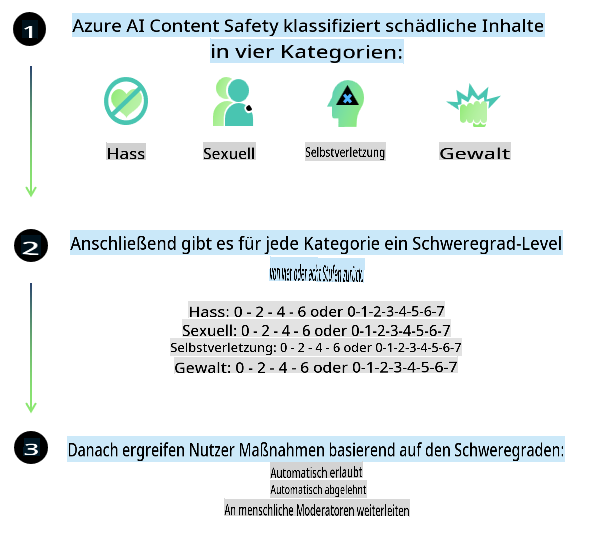
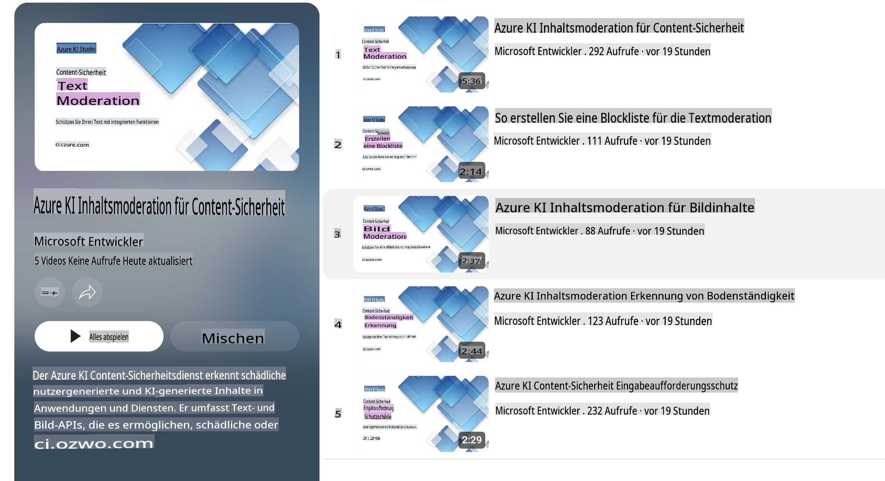

# KI-Sicherheit für Phi-Modelle

Die Phi-Modellfamilie wurde in Übereinstimmung mit dem [Microsoft Responsible AI Standard](https://query.prod.cms.rt.microsoft.com/cms/api/am/binary/RE5cmFl) entwickelt, einem unternehmensweiten Satz von Anforderungen, der auf den folgenden sechs Prinzipien basiert: Verantwortlichkeit, Transparenz, Fairness, Zuverlässigkeit und Sicherheit, Datenschutz und Sicherheit sowie Inklusivität, die [Microsofts Prinzipien für verantwortungsvolle KI](https://www.microsoft.com/ai/responsible-ai) bilden.

Wie bei den vorherigen Phi-Modellen wurde ein facettenreiches Sicherheitsbewertungs- und Sicherheits-Nachtrainingsverfahren angewendet, wobei zusätzliche Maßnahmen ergriffen wurden, um die mehrsprachigen Fähigkeiten dieser Version zu berücksichtigen. Unser Ansatz für Sicherheitstraining und -bewertungen, einschließlich Tests in mehreren Sprachen und Risikokategorien, wird im [Phi Safety Post-Training Paper](https://arxiv.org/abs/2407.13833) beschrieben. Obwohl die Phi-Modelle von diesem Ansatz profitieren, sollten Entwickler bewährte Praktiken für verantwortungsvolle KI anwenden, einschließlich der Identifizierung, Messung und Minderung von Risiken, die mit ihrem spezifischen Anwendungsfall sowie dem kulturellen und sprachlichen Kontext verbunden sind.

## Beste Praktiken

Wie andere Modelle können die Phi-Modelle potenziell Verhaltensweisen aufweisen, die unfair, unzuverlässig oder beleidigend sind.

Einige der Einschränkungen von SLM und LLM, die Sie beachten sollten, umfassen:

- **Dienstleistungsqualität:** Die Phi-Modelle wurden primär mit englischen Texten trainiert. Sprachen, die nicht Englisch sind, werden eine schlechtere Leistung erfahren. Englisch-Varianten, die in den Trainingsdaten weniger vertreten sind, könnten eine schlechtere Leistung zeigen als Standardamerikanisches Englisch.
- **Darstellung von Schäden & Verstärkung von Stereotypen:** Diese Modelle können Gruppen von Menschen über- oder unterrepräsentieren, die Repräsentation bestimmter Gruppen auslöschen oder abwertende oder negative Stereotypen verstärken. Trotz Sicherheits-Nachtrainings können diese Einschränkungen aufgrund unterschiedlicher Repräsentationsniveaus verschiedener Gruppen oder der Häufigkeit negativer Stereotypen in den Trainingsdaten, die reale Muster und gesellschaftliche Vorurteile widerspiegeln, weiterhin vorhanden sein.
- **Unangemessener oder beleidigender Inhalt:** Diese Modelle können andere Arten von unangemessenen oder beleidigenden Inhalten erzeugen, was es unangebracht machen kann, sie in sensiblen Kontexten ohne zusätzliche, anwendungsfallspezifische Minderungsmaßnahmen einzusetzen.
- **Informationszuverlässigkeit:** Sprachmodelle können unsinnige Inhalte erzeugen oder Inhalte erfinden, die vernünftig klingen, aber ungenau oder veraltet sind.
- **Eingeschränkter Umfang für Code:** Ein Großteil der Phi-3-Trainingsdaten basiert auf Python und verwendet gängige Pakete wie "typing, math, random, collections, datetime, itertools". Wenn das Modell Python-Skripte generiert, die andere Pakete oder Skripte in anderen Programmiersprachen verwenden, empfehlen wir dringend, dass Benutzer alle API-Nutzungen manuell überprüfen.

Entwickler sollten bewährte Praktiken für verantwortungsvolle KI anwenden und sicherstellen, dass ein spezifischer Anwendungsfall den geltenden Gesetzen und Vorschriften entspricht (z. B. Datenschutz, Handel usw.).

## Überlegungen zu verantwortungsvoller KI

Wie andere Sprachmodelle können die Phi-Modelle potenziell Verhaltensweisen aufweisen, die unfair, unzuverlässig oder beleidigend sind. Einige der Einschränkungen, die zu beachten sind, umfassen:

**Dienstleistungsqualität:** Die Phi-Modelle wurden primär mit englischen Texten trainiert. Sprachen, die nicht Englisch sind, werden eine schlechtere Leistung erfahren. Englisch-Varianten, die in den Trainingsdaten weniger vertreten sind, könnten eine schlechtere Leistung zeigen als Standardamerikanisches Englisch.

**Darstellung von Schäden & Verstärkung von Stereotypen:** Diese Modelle können Gruppen von Menschen über- oder unterrepräsentieren, die Repräsentation bestimmter Gruppen auslöschen oder abwertende oder negative Stereotypen verstärken. Trotz Sicherheits-Nachtrainings können diese Einschränkungen aufgrund unterschiedlicher Repräsentationsniveaus verschiedener Gruppen oder der Häufigkeit negativer Stereotypen in den Trainingsdaten, die reale Muster und gesellschaftliche Vorurteile widerspiegeln, weiterhin vorhanden sein.

**Unangemessener oder beleidigender Inhalt:** Diese Modelle können andere Arten von unangemessenen oder beleidigenden Inhalten erzeugen, was es unangebracht machen kann, sie in sensiblen Kontexten ohne zusätzliche, anwendungsfallspezifische Minderungsmaßnahmen einzusetzen.

**Informationszuverlässigkeit:** Sprachmodelle können unsinnige Inhalte erzeugen oder Inhalte erfinden, die vernünftig klingen, aber ungenau oder veraltet sind.

**Eingeschränkter Umfang für Code:** Ein Großteil der Phi-3-Trainingsdaten basiert auf Python und verwendet gängige Pakete wie "typing, math, random, collections, datetime, itertools". Wenn das Modell Python-Skripte generiert, die andere Pakete oder Skripte in anderen Programmiersprachen verwenden, empfehlen wir dringend, dass Benutzer alle API-Nutzungen manuell überprüfen.

Entwickler sollten bewährte Praktiken für verantwortungsvolle KI anwenden und sicherstellen, dass ein spezifischer Anwendungsfall den geltenden Gesetzen und Vorschriften entspricht (z. B. Datenschutz, Handel usw.). Wichtige Überlegungen umfassen:

**Zuweisung:** Modelle sind möglicherweise nicht geeignet für Szenarien, die erhebliche Auswirkungen auf den rechtlichen Status oder die Zuweisung von Ressourcen oder Lebenschancen haben könnten (z. B. Wohnen, Beschäftigung, Kredite usw.), ohne weitere Bewertungen und zusätzliche Techniken zur Reduzierung von Verzerrungen.

**Hochrisikoszenarien:** Entwickler sollten die Eignung der Nutzung von Modellen in Hochrisikoszenarien bewerten, in denen unfaire, unzuverlässige oder beleidigende Ausgaben äußerst kostspielig oder schädlich sein könnten. Dies schließt die Bereitstellung von Ratschlägen in sensiblen oder fachlichen Bereichen ein, in denen Genauigkeit und Zuverlässigkeit entscheidend sind (z. B. Rechts- oder Gesundheitsberatung). Zusätzliche Schutzmaßnahmen sollten auf Anwendungsebene entsprechend dem Einsatzkontext implementiert werden.

**Fehlinformationen:** Modelle können ungenaue Informationen erzeugen. Entwickler sollten bewährte Transparenzpraktiken befolgen und Endbenutzer darüber informieren, dass sie mit einem KI-System interagieren. Auf Anwendungsebene können Entwickler Feedback-Mechanismen und Pipelines erstellen, um Antworten in anwendungsspezifischen, kontextbezogenen Informationen zu verankern, eine Technik, die als Retrieval Augmented Generation (RAG) bekannt ist.

**Erzeugung schädlicher Inhalte:** Entwickler sollten Ausgaben auf ihren Kontext hin bewerten und verfügbare Sicherheitsklassifizierer oder benutzerdefinierte Lösungen verwenden, die für ihren Anwendungsfall geeignet sind.

**Missbrauch:** Andere Formen des Missbrauchs wie Betrug, Spam oder Malware-Produktion könnten möglich sein, und Entwickler sollten sicherstellen, dass ihre Anwendungen keine geltenden Gesetze und Vorschriften verletzen.

### Feinabstimmung und KI-Inhaltssicherheit

Nach der Feinabstimmung eines Modells empfehlen wir dringend, [Azure AI Content Safety](https://learn.microsoft.com/azure/ai-services/content-safety/overview)-Maßnahmen zu nutzen, um die von den Modellen generierten Inhalte zu überwachen, potenzielle Risiken, Bedrohungen und Qualitätsprobleme zu identifizieren und zu blockieren.

[Azure AI Content Safety](https://learn.microsoft.com/azure/ai-services/content-safety/overview) unterstützt sowohl Text- als auch Bildinhalte. Es kann in der Cloud, in getrennten Containern und auf Edge-/Embedded-Geräten eingesetzt werden.

## Überblick über Azure AI Content Safety

Azure AI Content Safety ist keine Einheitslösung; es kann angepasst werden, um den spezifischen Richtlinien eines Unternehmens zu entsprechen. Darüber hinaus ermöglichen seine mehrsprachigen Modelle das gleichzeitige Verstehen mehrerer Sprachen.

- **Azure AI Content Safety**
- **Microsoft Developer**
- **5 Videos**

Der Azure AI Content Safety-Dienst erkennt schädliche, von Benutzern oder KI generierte Inhalte in Anwendungen und Diensten. Er enthält Text- und Bild-APIs, die es ermöglichen, schädliches oder unangemessenes Material zu erkennen.

[AI Content Safety Playlist](https://www.youtube.com/playlist?list=PLlrxD0HtieHjaQ9bJjyp1T7FeCbmVcPkQ)

**Haftungsausschluss**:  
Dieses Dokument wurde mithilfe von KI-basierten maschinellen Übersetzungsdiensten übersetzt. Obwohl wir uns um Genauigkeit bemühen, weisen wir darauf hin, dass automatisierte Übersetzungen Fehler oder Ungenauigkeiten enthalten können. Das Originaldokument in seiner ursprünglichen Sprache sollte als maßgebliche Quelle betrachtet werden. Für kritische Informationen wird eine professionelle menschliche Übersetzung empfohlen. Wir übernehmen keine Haftung für Missverständnisse oder Fehlinterpretationen, die sich aus der Nutzung dieser Übersetzung ergeben.