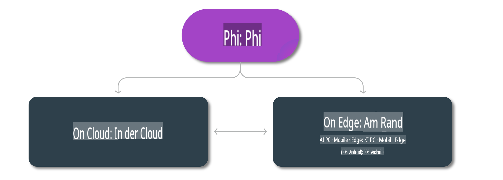

# Phi-Modelle & Verfügbarkeit auf verschiedenen Plattformen

## Edge- und Cloud-Szenarien

## Modellverfügbarkeit und Ressourcen

| | | | | | | | | |
|-|-|-|-|-|-|-|-|-|
|Modell|Eingabe|Inhaltslänge|Azure AI (MaaS)|Azure ML (MaaP)|ONNX|Hugging Face|Ollama|Nvidia NIM|
|Phi-3-vision-128k-instruct|Text+Bild|128k|[Playground & Bereitstellung](https://ai.azure.com/explore/models/Phi-3-vision-128k-instruct/version/2/registry/azureml)|[Playground, Bereitstellung & Feinabstimmung](https://ml.azure.com/registries/azureml/models/Phi-3-vision-128k-instruct/version/2)|[CUDA](https://huggingface.co/microsoft/Phi-3-vision-128k-instruct-onnx-cuda/tree/main),[CPU](https://huggingface.co/microsoft/Phi-3-vision-128k-instruct-onnx-cpu/tree/main), [DirectML](https://huggingface.co/microsoft/Phi-3-vision-128k-instruct-onnx-directml/tree/main)|[Download](https://huggingface.co/microsoft/Phi-3-vision-128k-instruct)|-NA-|[NIM APIs](https://build.nvidia.com/microsoft/phi-3-vision-128k-instruct)|
|Phi-3-mini-4k-instruct|Text|4k|[Playground & Bereitstellung](https://aka.ms/phi3-mini-4k-azure-ml)|[Playground, Bereitstellung](https://aka.ms/phi3-mini-4k-azure-ml) & Feinabstimmung|[CUDA](https://huggingface.co/microsoft/Phi-3-mini-4k-instruct-onnx), [Web](https://huggingface.co/microsoft/Phi-3-mini-4k-instruct-onnx)|[Playground & Download](https://huggingface.co/chat/models/microsoft/Phi-3-mini-4k-instruct)|[GGUF](https://huggingface.co/microsoft/Phi-3-mini-4k-instruct-gguf)|[NIM APIs](https://build.nvidia.com/microsoft/phi-3-mini-4k)|
|Phi-3-mini-128k-instruct|Text|128k|[Playground & Bereitstellung](https://ai.azure.com/explore/models/Phi-3-mini-128k-instruct/version/9/registry/azureml)|[Playground, Bereitstellung](https://ai.azure.com/explore/models/Phi-3-mini-128k-instruct/version/9/registry/azureml) & Feinabstimmung|[CUDA](https://huggingface.co/microsoft/Phi-3-mini-128k-instruct-onnx)|[Download](https://huggingface.co/microsoft/Phi-3-mini-128k-instruct-onnx)|-NA-|[NIM APIs](https://build.nvidia.com/microsoft/phi-3-mini)|
|Phi-3-small-8k-instruct|Text|8k|[Playground & Bereitstellung](https://ml.azure.com/registries/azureml/models/Phi-3-small-8k-instruct/version/2)|[Playground, Bereitstellung](https://ai.azure.com/explore/models/Phi-3-small-8k-instruct/version/2/registry/azureml) & Feinabstimmung|[CUDA](https://huggingface.co/microsoft/Phi-3-small-8k-instruct-onnx-cuda)|[Download](https://huggingface.co/microsoft/Phi-3-small-8k-instruct-onnx-cuda)|-NA-|[NIM APIs](https://build.nvidia.com/microsoft/phi-3-small-8k-instruct?docker=false)|
|Phi-3-small-128k-instruct|Text|128k|[Playground & Bereitstellung](https://ai.azure.com/explore/models/Phi-3-small-128k-instruct/version/2/registry/azureml)|[Playground, Bereitstellung](https://ml.azure.com/registries/azureml/models/Phi-3-small-128k-instruct/version/2) & Feinabstimmung|[CUDA](https://huggingface.co/microsoft/Phi-3-medium-128k-instruct-onnx-cuda)|[Download](https://huggingface.co/microsoft/Phi-3-small-128k-instruct)|-NA-|[NIM APIs](https://build.nvidia.com/microsoft/phi-3-small-128k-instruct?docker=false)|
|Phi-3-medium-4k-instruct|Text|4k|[Playground & Bereitstellung](https://huggingface.co/microsoft/Phi-3-medium-4k-instruct)|[Playground, Bereitstellung](https://ml.azure.com/registries/azureml/models/Phi-3-medium-4k-instruct/version/2) & Feinabstimmung|[CUDA](https://huggingface.co/microsoft/Phi-3-medium-4k-instruct-onnx-cuda/tree/main), [CPU](https://huggingface.co/microsoft/Phi-3-medium-4k-instruct-onnx-cpu/tree/main), [DirectML](https://huggingface.co/microsoft/Phi-3-medium-4k-instruct-onnx-directml/tree/main)|[Herunterladen](https://huggingface.co/microsoft/Phi-3-medium-4k-instruct)|-NA-|[NIM APIs](https://build.nvidia.com/microsoft/phi-3-medium-4k-instruct?docker=false)|
|Phi-3-medium-128k-instruct|Text|128k|[Playground & Bereitstellung](https://ai.azure.com/explore/models/Phi-3-medium-128k-instruct/version/2)|[Playground, Bereitstellung](https://ml.azure.com/registries/azureml/models/Phi-3-medium-128k-instruct/version/2) & Feinabstimmung|[CUDA](https://huggingface.co/microsoft/Phi-3-medium-128k-instruct-onnx-cuda/tree/main), [CPU](https://huggingface.co/microsoft/Phi-3-medium-128k-instruct-onnx-cpu/tree/main), [DirectML](https://huggingface.co/microsoft/Phi-3-medium-128k-instruct-onnx-directml/tree/main)|[Herunterladen](https://huggingface.co/microsoft/Phi-3-medium-128k-instruct)|-NA-|-NA-|

**Haftungsausschluss**:  
Dieses Dokument wurde mithilfe von KI-gestützten maschinellen Übersetzungsdiensten übersetzt. Obwohl wir uns um Genauigkeit bemühen, weisen wir darauf hin, dass automatisierte Übersetzungen Fehler oder Ungenauigkeiten enthalten können. Das Originaldokument in seiner ursprünglichen Sprache sollte als maßgebliche Quelle betrachtet werden. Für kritische Informationen wird eine professionelle menschliche Übersetzung empfohlen. Wir übernehmen keine Haftung für Missverständnisse oder Fehlinterpretationen, die sich aus der Nutzung dieser Übersetzung ergeben.