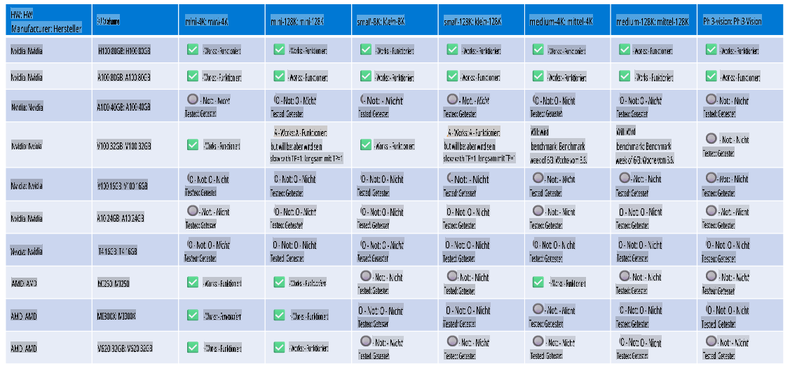

# Phi Hardware-Unterstützung

Microsoft Phi wurde für ONNX Runtime optimiert und unterstützt Windows DirectML. Es funktioniert gut auf verschiedenen Hardwaretypen, einschließlich GPUs, CPUs und sogar mobilen Geräten.

## Geräte-Hardware
Die unterstützte Hardware umfasst speziell:

- GPU SKU: RTX 4090 (DirectML)
- GPU SKU: 1 A100 80GB (CUDA)
- CPU SKU: Standard F64s v2 (64 vCPUs, 128 GiB Speicher)

## Mobile SKU

- Android - Samsung Galaxy S21
- Apple iPhone 14 oder höher mit A16/A17 Prozessor

## Phi Hardware-Spezifikation

- Minimale erforderliche Konfiguration.
- Windows: DirectX 12-fähige GPU und mindestens 4 GB kombinierter RAM

CUDA: NVIDIA GPU mit Compute Capability >= 7.02



## Ausführung von onnxruntime auf mehreren GPUs

Die derzeit verfügbaren Phi ONNX-Modelle sind nur für 1 GPU vorgesehen. Es ist möglich, Multi-GPU-Unterstützung für Phi-Modelle zu implementieren, jedoch garantiert ORT mit 2 GPUs nicht, dass es mehr Durchsatz bietet als 2 Instanzen von ORT. Bitte besuchen Sie [ONNX Runtime](https://onnxruntime.ai/) für die neuesten Updates.

Bei der [Build 2024 hat das GenAI ONNX-Team](https://youtu.be/WLW4SE8M9i8?si=EtG04UwDvcjunyfC) angekündigt, dass sie Multi-Instanzen anstelle von Multi-GPU für Phi-Modelle aktiviert haben.

Derzeit ermöglicht dies, eine onnxruntime- oder onnxruntime-genai-Instanz mit der CUDA_VISIBLE_DEVICES-Umgebungsvariable wie folgt auszuführen:

```Python
CUDA_VISIBLE_DEVICES=0 python infer.py
CUDA_VISIBLE_DEVICES=1 python infer.py
```

Entdecken Sie Phi gerne weiter in der [Azure AI Foundry](https://ai.azure.com).

**Haftungsausschluss**:  
Dieses Dokument wurde mithilfe von KI-basierten maschinellen Übersetzungsdiensten übersetzt. Obwohl wir uns um Genauigkeit bemühen, weisen wir darauf hin, dass automatisierte Übersetzungen Fehler oder Ungenauigkeiten enthalten können. Das Originaldokument in seiner ursprünglichen Sprache sollte als maßgebliche Quelle betrachtet werden. Für kritische Informationen wird eine professionelle menschliche Übersetzung empfohlen. Wir übernehmen keine Haftung für Missverständnisse oder Fehlinterpretationen, die aus der Nutzung dieser Übersetzung entstehen.