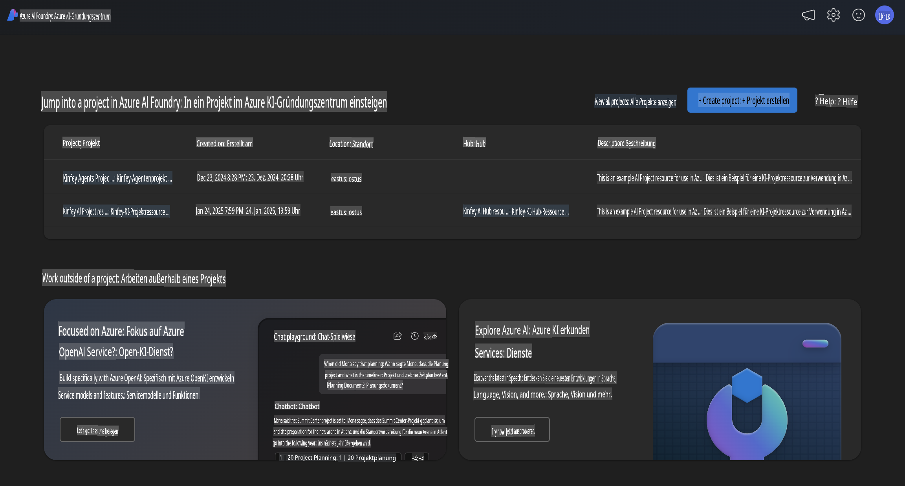
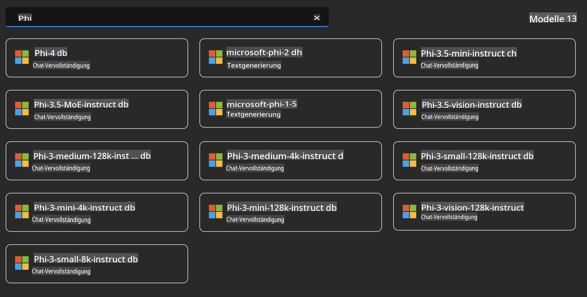
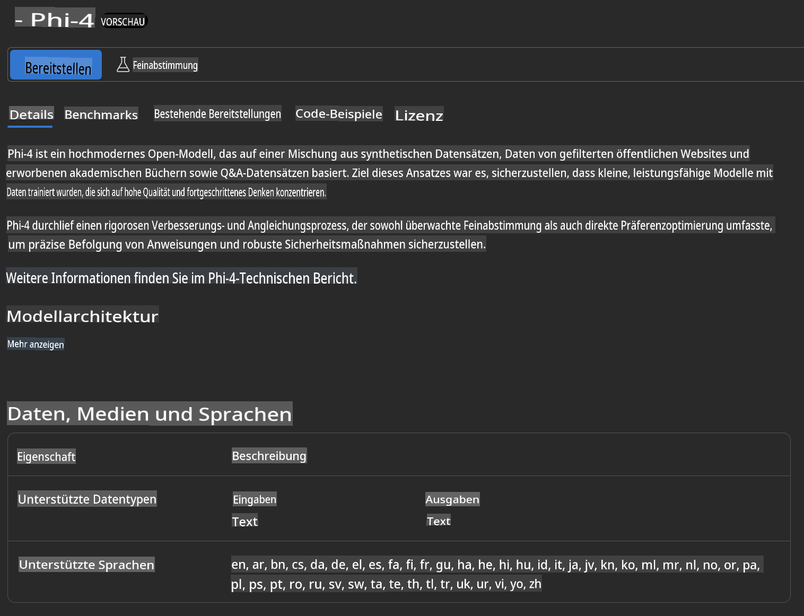
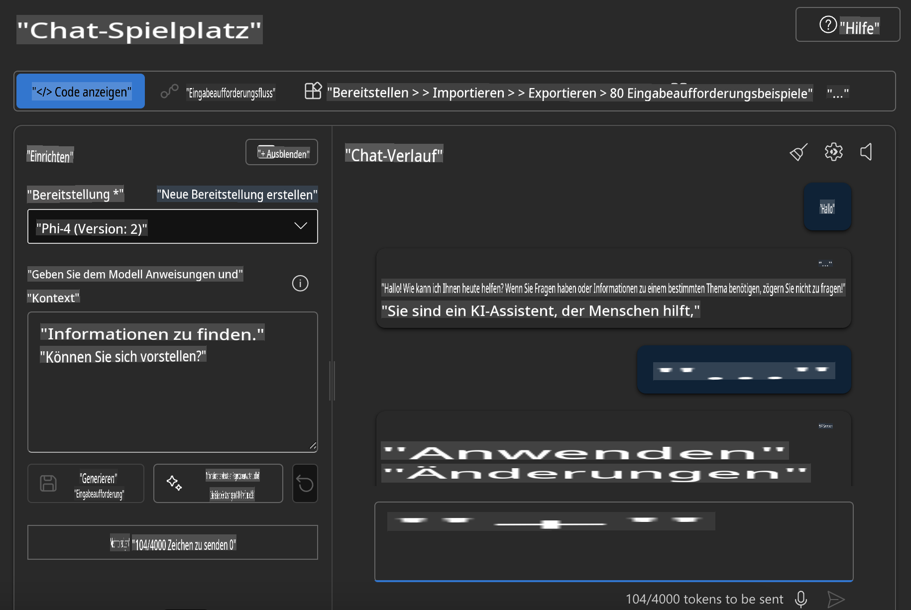

## Phi-Familie in Azure AI Foundry

[Azure AI Foundry](https://ai.azure.com) ist eine vertrauenswürdige Plattform, die Entwicklern ermöglicht, Innovationen voranzutreiben und die Zukunft mit KI auf eine sichere, geschützte und verantwortungsvolle Weise zu gestalten.

[Azure AI Foundry](https://ai.azure.com) wurde für Entwickler konzipiert, um:

- Generative KI-Anwendungen auf einer Unternehmensplattform zu erstellen.  
- Mithilfe modernster KI-Tools und ML-Modelle Anwendungen zu erkunden, zu entwickeln, zu testen und bereitzustellen – basierend auf verantwortungsvollen KI-Praktiken.  
- Mit einem Team über den gesamten Lebenszyklus der Anwendungsentwicklung zusammenzuarbeiten.  

Mit Azure AI Foundry können Sie eine breite Palette von Modellen, Diensten und Funktionen erkunden und KI-Anwendungen entwickeln, die Ihre Ziele bestmöglich unterstützen. Die Azure AI Foundry-Plattform erleichtert die Skalierung, um Proof of Concepts mühelos in vollwertige Produktionsanwendungen zu verwandeln. Kontinuierliche Überwachung und Optimierung fördern den langfristigen Erfolg.



Zusätzlich zur Nutzung des Azure AOAI Service in Azure AI Foundry können Sie auch Drittanbieter-Modelle im Azure AI Foundry Model Catalog verwenden. Dies ist eine gute Wahl, wenn Sie Azure AI Foundry als Ihre Plattform für KI-Lösungen nutzen möchten.

Wir können Phi-Familien-Modelle schnell über den Model Catalog in Azure AI Foundry bereitstellen.



### **Phi-4 in Azure AI Foundry bereitstellen**



### **Phi-4 im Azure AI Foundry Playground testen**



### **Python-Code ausführen, um Azure AI Foundry Phi-4 aufzurufen**

```python

import os  
import base64
from openai import AzureOpenAI  
from azure.identity import DefaultAzureCredential, get_bearer_token_provider  
        
endpoint = os.getenv("ENDPOINT_URL", "Your Azure AOAI Service Endpoint")  
deployment = os.getenv("DEPLOYMENT_NAME", "Phi-4")  
      
token_provider = get_bearer_token_provider(  
    DefaultAzureCredential(),  
    "https://cognitiveservices.azure.com/.default"  
)  
  
client = AzureOpenAI(  
    azure_endpoint=endpoint,  
    azure_ad_token_provider=token_provider,  
    api_version="2024-05-01-preview",  
)  
  

chat_prompt = [
    {
        "role": "system",
        "content": "You are an AI assistant that helps people find information."
    },
    {
        "role": "user",
        "content": "can you introduce yourself"
    }
] 
    
# Include speech result if speech is enabled  
messages = chat_prompt 

completion = client.chat.completions.create(  
    model=deployment,  
    messages=messages,
    max_tokens=800,  
    temperature=0.7,  
    top_p=0.95,  
    frequency_penalty=0,  
    presence_penalty=0,
    stop=None,  
    stream=False  
)  
  
print(completion.to_json())  

```

**Haftungsausschluss**:  
Dieses Dokument wurde mit KI-gestützten maschinellen Übersetzungsdiensten übersetzt. Obwohl wir uns um Genauigkeit bemühen, weisen wir darauf hin, dass automatisierte Übersetzungen Fehler oder Ungenauigkeiten enthalten können. Das Originaldokument in seiner ursprünglichen Sprache sollte als maßgebliche Quelle betrachtet werden. Für kritische Informationen wird eine professionelle menschliche Übersetzung empfohlen. Wir übernehmen keine Haftung für Missverständnisse oder Fehlinterpretationen, die sich aus der Nutzung dieser Übersetzung ergeben.