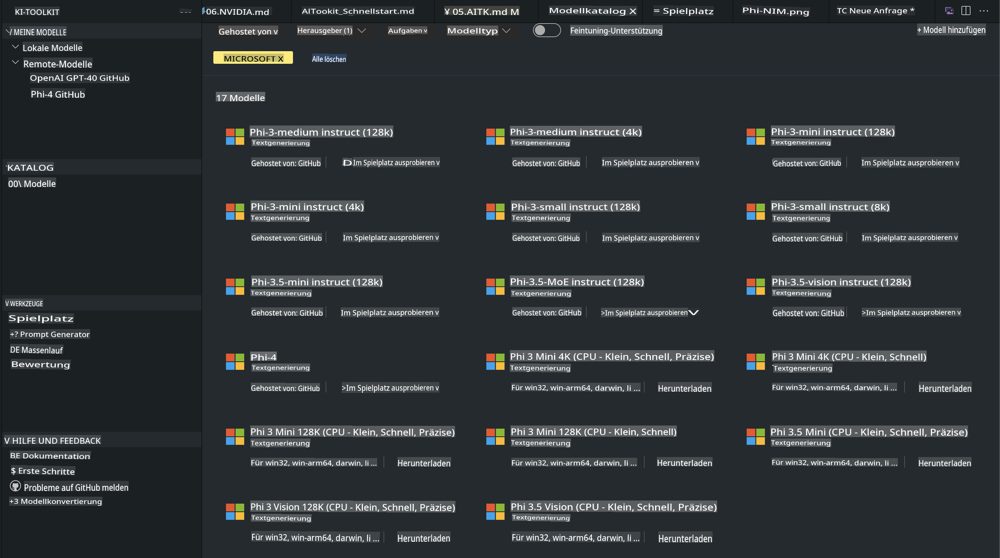
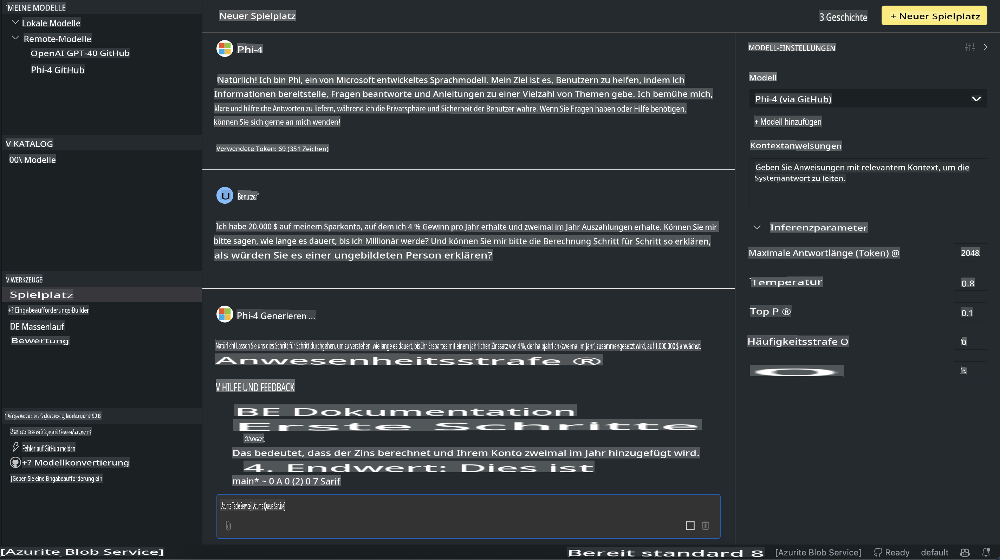

# Phi-Familie in AITK

[AI Toolkit für VS Code](https://marketplace.visualstudio.com/items?itemName=ms-windows-ai-studio.windows-ai-studio) vereinfacht die Entwicklung generativer KI-Anwendungen, indem es modernste KI-Entwicklungstools und Modelle aus dem Azure AI Foundry-Katalog sowie anderen Katalogen wie Hugging Face zusammenführt. Sie können den KI-Modellkatalog durchsuchen, der von GitHub Models und Azure AI Foundry Model Catalogs unterstützt wird, diese lokal oder remote herunterladen, feinabstimmen, testen und in Ihrer Anwendung verwenden.

Die Vorschau des AI Toolkits läuft lokal. Lokale Inferenz oder Feinabstimmung hängt von dem ausgewählten Modell ab, und möglicherweise benötigen Sie eine GPU wie z. B. eine NVIDIA CUDA GPU. Sie können GitHub-Modelle auch direkt mit AITK ausführen.

## Erste Schritte

[Erfahren Sie mehr über die Installation des Windows-Subsystems für Linux](https://learn.microsoft.com/windows/wsl/install?WT.mc_id=aiml-137032-kinfeylo)

und [wie Sie die Standarddistribution ändern](https://learn.microsoft.com/windows/wsl/install#change-the-default-linux-distribution-installed).

[AI Toolkit GitHub Repo](https://github.com/microsoft/vscode-ai-toolkit/)

- Windows, Linux, macOS
  
- Für die Feinabstimmung auf Windows und Linux benötigen Sie eine Nvidia GPU. Zusätzlich benötigt **Windows** ein Subsystem für Linux mit der Ubuntu-Distribution 18.4 oder höher. [Erfahren Sie mehr über die Installation des Windows-Subsystems für Linux](https://learn.microsoft.com/windows/wsl/install) und [wie Sie die Standarddistribution ändern](https://learn.microsoft.com/windows/wsl/install#change-the-default-linux-distribution-installed).

### Installation des AI Toolkits

Das AI Toolkit wird als [Visual Studio Code-Erweiterung](https://code.visualstudio.com/docs/setup/additional-components#_vs-code-extensions) bereitgestellt. Daher müssen Sie zunächst [VS Code](https://code.visualstudio.com/docs/setup/windows?WT.mc_id=aiml-137032-kinfeylo) installieren und dann das AI Toolkit aus dem [VS Marketplace](https://marketplace.visualstudio.com/items?itemName=ms-windows-ai-studio.windows-ai-studio) herunterladen.  
Das [AI Toolkit ist im Visual Studio Marketplace verfügbar](https://marketplace.visualstudio.com/items?itemName=ms-windows-ai-studio.windows-ai-studio) und kann wie jede andere VS Code-Erweiterung installiert werden.  

Falls Sie mit der Installation von VS Code-Erweiterungen nicht vertraut sind, folgen Sie diesen Schritten:

### Anmeldung

1. Wählen Sie in der Aktivitätsleiste in VS Code **Erweiterungen** aus.
2. Geben Sie in der Suchleiste der Erweiterungen "AI Toolkit" ein.
3. Wählen Sie "AI Toolkit for Visual Studio Code".
4. Wählen Sie **Installieren**.

Nun sind Sie bereit, die Erweiterung zu verwenden!

Sie werden aufgefordert, sich bei GitHub anzumelden. Bitte klicken Sie auf "Zulassen", um fortzufahren. Sie werden zur GitHub-Anmeldeseite weitergeleitet.

Melden Sie sich an und folgen Sie den Anweisungen. Nach erfolgreicher Anmeldung werden Sie zu VS Code zurückgeleitet.

Sobald die Erweiterung installiert ist, erscheint das AI Toolkit-Symbol in Ihrer Aktivitätsleiste.

Lassen Sie uns die verfügbaren Aktionen erkunden!

### Verfügbare Aktionen

Die primäre Seitenleiste des AI Toolkits ist in folgende Abschnitte unterteilt:  

- **Modelle**
- **Ressourcen**
- **Playground**  
- **Feinabstimmung**
- **Auswertung**

Im Bereich "Ressourcen" stehen diese Optionen zur Verfügung. Um zu beginnen, wählen Sie **Modellkatalog**.

### Ein Modell aus dem Katalog herunterladen

Nachdem Sie das AI Toolkit aus der VS Code-Seitenleiste gestartet haben, können Sie aus den folgenden Optionen wählen:



- Finden Sie ein unterstütztes Modell im **Modellkatalog** und laden Sie es lokal herunter.
- Testen Sie die Modellausgabe im **Model Playground**.
- Feinabstimmung des Modells lokal oder remote im Bereich **Model Fine-tuning**.
- Bereitstellung feinabgestimmter Modelle in der Cloud über die Befehlspalette des AI Toolkits.
- Auswertung von Modellen.

> [!NOTE]
>
> **GPU vs CPU**
>
> Sie werden feststellen, dass die Modellkarten die Modellgröße, die Plattform und den Beschleunigertyp (CPU, GPU) anzeigen. Für eine optimierte Leistung auf **Windows-Geräten mit mindestens einer GPU** sollten Sie Modellversionen auswählen, die nur Windows unterstützen.
>
> Dies stellt sicher, dass Sie ein Modell haben, das für den DirectML-Beschleuniger optimiert ist.
>
> Die Modellnamen haben das Format
>
> - `{model_name}-{accelerator}-{quantization}-{format}`.
>
>Um zu überprüfen, ob Ihr Windows-Gerät über eine GPU verfügt, öffnen Sie den **Task-Manager** und wählen Sie den **Leistung**-Tab. Wenn Sie GPUs haben, werden diese unter Namen wie "GPU 0" oder "GPU 1" aufgelistet.

### Modell im Playground ausführen

Nachdem alle Parameter eingestellt sind, klicken Sie auf **Projekt generieren**.

Sobald Ihr Modell heruntergeladen wurde, wählen Sie **Im Playground laden** auf der Modellkarte im Katalog:

- Starten Sie den Modell-Download.
- Installieren Sie alle erforderlichen Voraussetzungen und Abhängigkeiten.
- Erstellen Sie einen VS Code-Arbeitsbereich.



### Die REST-API in Ihrer Anwendung nutzen 

Das AI Toolkit wird mit einem lokalen REST-API-Webserver **auf Port 5272** geliefert, der das [OpenAI-Chat-Komplettierungsformat](https://platform.openai.com/docs/api-reference/chat/create) verwendet.

Damit können Sie Ihre Anwendung lokal testen, ohne auf einen Cloud-KI-Modellservice angewiesen zu sein. Zum Beispiel zeigt die folgende JSON-Datei, wie der Anfragetext konfiguriert werden kann:

```json
{
    "model": "Phi-4",
    "messages": [
        {
            "role": "user",
            "content": "what is the golden ratio?"
        }
    ],
    "temperature": 0.7,
    "top_p": 1,
    "top_k": 10,
    "max_tokens": 100,
    "stream": true
}
```

Sie können die REST-API mit Tools wie [Postman](https://www.postman.com/) oder dem CURL-Dienstprogramm testen:

```bash
curl -vX POST http://127.0.0.1:5272/v1/chat/completions -H 'Content-Type: application/json' -d @body.json
```

### Verwendung der OpenAI-Clientbibliothek für Python

```python
from openai import OpenAI

client = OpenAI(
    base_url="http://127.0.0.1:5272/v1/", 
    api_key="x" # required for the API but not used
)

chat_completion = client.chat.completions.create(
    messages=[
        {
            "role": "user",
            "content": "what is the golden ratio?",
        }
    ],
    model="Phi-4",
)

print(chat_completion.choices[0].message.content)
```

### Verwendung der Azure OpenAI-Clientbibliothek für .NET

Fügen Sie die [Azure OpenAI-Clientbibliothek für .NET](https://www.nuget.org/packages/Azure.AI.OpenAI/) mit NuGet zu Ihrem Projekt hinzu:

```bash
dotnet add {project_name} package Azure.AI.OpenAI --version 1.0.0-beta.17
```

Fügen Sie eine C#-Datei namens **OverridePolicy.cs** zu Ihrem Projekt hinzu und fügen Sie den folgenden Code ein:

```csharp
// OverridePolicy.cs
using Azure.Core.Pipeline;
using Azure.Core;

internal partial class OverrideRequestUriPolicy(Uri overrideUri)
    : HttpPipelineSynchronousPolicy
{
    private readonly Uri _overrideUri = overrideUri;

    public override void OnSendingRequest(HttpMessage message)
    {
        message.Request.Uri.Reset(_overrideUri);
    }
}
```

Fügen Sie anschließend den folgenden Code in Ihre **Program.cs**-Datei ein:

```csharp
// Program.cs
using Azure.AI.OpenAI;

Uri localhostUri = new("http://localhost:5272/v1/chat/completions");

OpenAIClientOptions clientOptions = new();
clientOptions.AddPolicy(
    new OverrideRequestUriPolicy(localhostUri),
    Azure.Core.HttpPipelinePosition.BeforeTransport);
OpenAIClient client = new(openAIApiKey: "unused", clientOptions);

ChatCompletionsOptions options = new()
{
    DeploymentName = "Phi-4",
    Messages =
    {
        new ChatRequestSystemMessage("You are a helpful assistant. Be brief and succinct."),
        new ChatRequestUserMessage("What is the golden ratio?"),
    }
};

StreamingResponse<StreamingChatCompletionsUpdate> streamingChatResponse
    = await client.GetChatCompletionsStreamingAsync(options);

await foreach (StreamingChatCompletionsUpdate chatChunk in streamingChatResponse)
{
    Console.Write(chatChunk.ContentUpdate);
}
```

## Feinabstimmung mit dem AI Toolkit

- Einstieg in die Modellentdeckung und den Playground.
- Feinabstimmung und Inferenz von Modellen mit lokalen Rechenressourcen.
- Remote-Feinabstimmung und Inferenz mit Azure-Ressourcen.

[Feinabstimmung mit dem AI Toolkit](../../03.FineTuning/Finetuning_VSCodeaitoolkit.md)

## Ressourcen für Fragen und Antworten zum AI Toolkit

Bitte besuchen Sie unsere [Fragen-und-Antworten-Seite](https://github.com/microsoft/vscode-ai-toolkit/blob/main/archive/QA.md) für häufige Probleme und Lösungen.

**Haftungsausschluss**:  
Dieses Dokument wurde mithilfe von KI-gestützten maschinellen Übersetzungsdiensten übersetzt. Obwohl wir uns um Genauigkeit bemühen, weisen wir darauf hin, dass automatisierte Übersetzungen Fehler oder Ungenauigkeiten enthalten können. Das Originaldokument in seiner ursprünglichen Sprache sollte als maßgebliche Quelle betrachtet werden. Für kritische Informationen wird eine professionelle menschliche Übersetzung empfohlen. Wir übernehmen keine Haftung für Missverständnisse oder Fehlinterpretationen, die aus der Nutzung dieser Übersetzung entstehen.