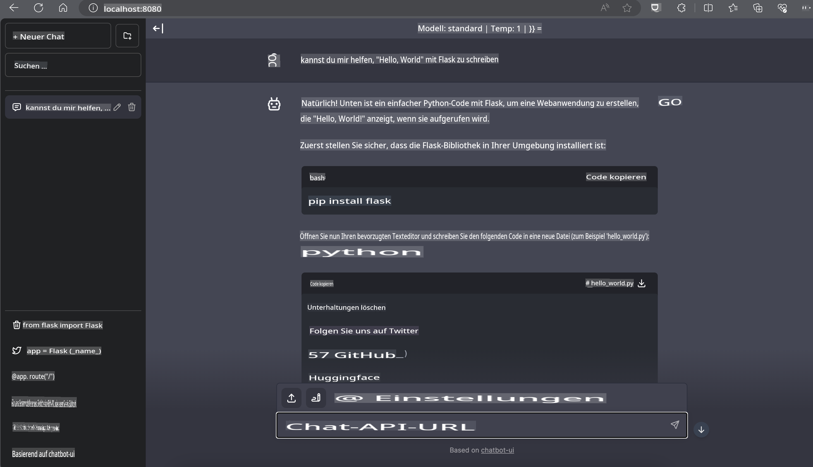

# **Inference Phi-3 auf Nvidia Jetson**

Nvidia Jetson ist eine Serie von eingebetteten Computerboards von Nvidia. Die Modelle Jetson TK1, TX1 und TX2 enthalten alle einen Tegra-Prozessor (oder SoC) von Nvidia, der eine zentrale Verarbeitungseinheit (CPU) mit ARM-Architektur integriert. Jetson ist ein stromsparendes System und wurde entwickelt, um Anwendungen des maschinellen Lernens zu beschleunigen. Nvidia Jetson wird von professionellen Entwicklern genutzt, um bahnbrechende KI-Produkte in allen Branchen zu entwickeln, sowie von Studenten und Enthusiasten, um praktische Erfahrungen mit KI zu sammeln und beeindruckende Projekte zu realisieren. SLM wird in Edge-Geräten wie Jetson eingesetzt, was eine bessere Implementierung von industriellen generativen KI-Anwendungsszenarien ermöglicht.

## Bereitstellung auf NVIDIA Jetson:
Entwickler, die an autonomen Robotern und eingebetteten Geräten arbeiten, können Phi-3 Mini nutzen. Die relativ kleine Größe von Phi-3 macht es ideal für den Einsatz am Edge. Die Parameter wurden während des Trainings sorgfältig abgestimmt, um eine hohe Genauigkeit der Antworten sicherzustellen.

### TensorRT-LLM-Optimierung:
Die [TensorRT-LLM-Bibliothek](https://github.com/NVIDIA/TensorRT-LLM?WT.mc_id=aiml-138114-kinfeylo) von NVIDIA optimiert die Inferenz großer Sprachmodelle. Sie unterstützt das lange Kontextfenster von Phi-3 Mini und verbessert sowohl den Durchsatz als auch die Latenz. Zu den Optimierungen gehören Techniken wie LongRoPE, FP8 und inflight batching.

### Verfügbarkeit und Bereitstellung:
Entwickler können Phi-3 Mini mit dem 128K-Kontextfenster auf [NVIDIA's AI](https://www.nvidia.com/en-us/ai-data-science/generative-ai/) erkunden. Es wird als NVIDIA NIM geliefert, ein Mikrodienst mit einer standardisierten API, der überall bereitgestellt werden kann. Außerdem sind die [TensorRT-LLM-Implementierungen auf GitHub](https://github.com/NVIDIA/TensorRT-LLM) verfügbar.

## **1. Vorbereitung**

a. Jetson Orin NX / Jetson NX

b. JetPack 5.1.2+

c. Cuda 11.8

d. Python 3.8+

## **2. Ausführen von Phi-3 auf Jetson**

Wir können [Ollama](https://ollama.com) oder [LlamaEdge](https://llamaedge.com) verwenden.

Wenn Sie gguf gleichzeitig in der Cloud und auf Edge-Geräten nutzen möchten, kann LlamaEdge als WasmEdge verstanden werden (WasmEdge ist eine leichtgewichtige, leistungsstarke und skalierbare WebAssembly-Laufzeitumgebung, die für Cloud-native, Edge- und dezentrale Anwendungen geeignet ist. Sie unterstützt serverlose Anwendungen, eingebettete Funktionen, Mikrodienste, Smart Contracts und IoT-Geräte). Sie können das quantitative Modell von gguf über LlamaEdge auf Edge-Geräten und in der Cloud bereitstellen.


Hier sind die Schritte zur Nutzung:

1. Installieren und Herunterladen der zugehörigen Bibliotheken und Dateien

```bash

curl -sSf https://raw.githubusercontent.com/WasmEdge/WasmEdge/master/utils/install.sh | bash -s -- --plugin wasi_nn-ggml

curl -LO https://github.com/LlamaEdge/LlamaEdge/releases/latest/download/llama-api-server.wasm

curl -LO https://github.com/LlamaEdge/chatbot-ui/releases/latest/download/chatbot-ui.tar.gz

tar xzf chatbot-ui.tar.gz

```

**Hinweis**: llama-api-server.wasm und chatbot-ui müssen sich im selben Verzeichnis befinden.

2. Skripte im Terminal ausführen

```bash

wasmedge --dir .:. --nn-preload default:GGML:AUTO:{Your gguf path} llama-api-server.wasm -p phi-3-chat

```

Hier ist das Ausführungsergebnis:



***Beispielcode*** [Phi-3 Mini WASM Notebook Sample](https://github.com/Azure-Samples/Phi-3MiniSamples/tree/main/wasm)

Zusammenfassend stellt Phi-3 Mini einen großen Fortschritt in der Sprachmodellierung dar, indem es Effizienz, Kontextbewusstsein und die Optimierungskompetenz von NVIDIA kombiniert. Egal, ob Sie Roboter oder Edge-Anwendungen entwickeln, Phi-3 Mini ist ein leistungsstarkes Werkzeug, das Sie kennen sollten.

**Haftungsausschluss**:  
Dieses Dokument wurde mithilfe von KI-gestützten maschinellen Übersetzungsdiensten übersetzt. Obwohl wir uns um Genauigkeit bemühen, beachten Sie bitte, dass automatisierte Übersetzungen Fehler oder Ungenauigkeiten enthalten können. Das Originaldokument in seiner ursprünglichen Sprache sollte als maßgebliche Quelle betrachtet werden. Für kritische Informationen wird eine professionelle menschliche Übersetzung empfohlen. Wir übernehmen keine Haftung für Missverständnisse oder Fehlinterpretationen, die sich aus der Nutzung dieser Übersetzung ergeben.