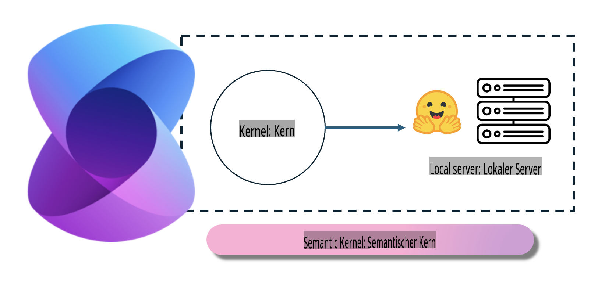
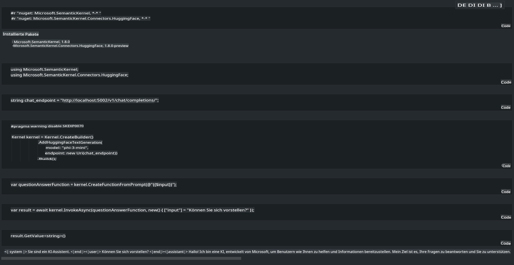

# **Inference Phi-3 auf einem lokalen Server**

Wir können Phi-3 auf einem lokalen Server bereitstellen. Nutzer können zwischen [Ollama](https://ollama.com) oder [LM Studio](https://llamaedge.com) Lösungen wählen, oder sie können ihren eigenen Code schreiben. Sie können die lokalen Dienste von Phi-3 über [Semantic Kernel](https://github.com/microsoft/semantic-kernel?WT.mc_id=aiml-138114-kinfeylo) oder [Langchain](https://www.langchain.com/) verbinden, um Copilot-Anwendungen zu erstellen.

## **Verwendung von Semantic Kernel, um auf Phi-3-mini zuzugreifen**

In der Copilot-Anwendung erstellen wir Anwendungen mithilfe von Semantic Kernel / LangChain. Dieses Anwendungsframework ist in der Regel mit Azure OpenAI Service / OpenAI-Modellen kompatibel und unterstützt auch Open-Source-Modelle auf Hugging Face sowie lokale Modelle. Was tun wir, wenn wir Semantic Kernel verwenden möchten, um auf Phi-3-mini zuzugreifen? Am Beispiel von .NET können wir es mit dem Hugging Face Connector in Semantic Kernel kombinieren. Standardmäßig kann es mit der Modell-ID auf Hugging Face verknüpft werden (beim ersten Gebrauch wird das Modell von Hugging Face heruntergeladen, was lange dauern kann). Alternativ können Sie auch den selbst eingerichteten lokalen Dienst verbinden. Im Vergleich der beiden empfehlen wir die zweite Option, da sie einen höheren Grad an Autonomie bietet, insbesondere bei Unternehmensanwendungen.

Aus der Abbildung wird ersichtlich, dass der Zugriff auf lokale Dienste über Semantic Kernel eine einfache Verbindung zum selbst aufgebauten Phi-3-mini-Modellserver ermöglicht. Hier ist das Ergebnis der Ausführung:

***Beispielcode*** https://github.com/kinfey/Phi3MiniSamples/tree/main/semantickernel

**Haftungsausschluss**:  
Dieses Dokument wurde mit KI-gestützten maschinellen Übersetzungsdiensten übersetzt. Obwohl wir uns um Genauigkeit bemühen, beachten Sie bitte, dass automatisierte Übersetzungen Fehler oder Ungenauigkeiten enthalten können. Das Originaldokument in seiner ursprünglichen Sprache sollte als maßgebliche Quelle betrachtet werden. Für kritische Informationen wird eine professionelle menschliche Übersetzung empfohlen. Wir übernehmen keine Haftung für Missverständnisse oder Fehlinterpretationen, die sich aus der Nutzung dieser Übersetzung ergeben.