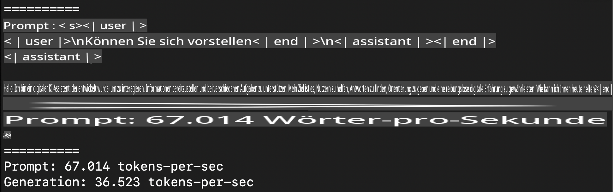
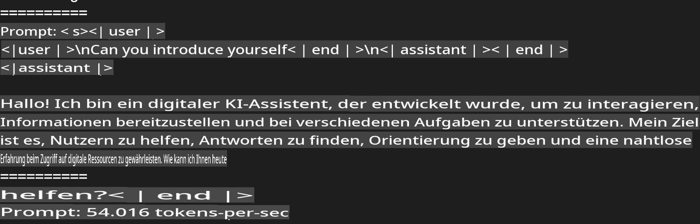

# **Inference Phi-3 mit dem Apple MLX Framework**

## **Was ist das MLX Framework**

MLX ist ein Framework für maschinelles Lernen auf Apple Silicon, entwickelt von der Apple Machine Learning Forschung.

MLX wurde von Forschern im Bereich maschinelles Lernen für Forschende konzipiert. Das Framework ist benutzerfreundlich, aber dennoch effizient für das Trainieren und Bereitstellen von Modellen. Das Design des Frameworks ist bewusst einfach gehalten, um Forschenden die Möglichkeit zu geben, MLX leicht zu erweitern und zu verbessern, mit dem Ziel, neue Ideen schnell zu erforschen.

LLMs können auf Apple-Silicon-Geräten mithilfe von MLX beschleunigt werden, und Modelle können bequem lokal ausgeführt werden.

## **Phi-3-mini mit MLX ausführen**

### **1. Einrichten der MLX-Umgebung**

1. Python 3.11.x
2. MLX-Bibliothek installieren

```bash

pip install mlx-lm

```

### **2. Phi-3-mini im Terminal mit MLX ausführen**

```bash

python -m mlx_lm.generate --model microsoft/Phi-3-mini-4k-instruct --max-token 2048 --prompt  "<|user|>\nCan you introduce yourself<|end|>\n<|assistant|>"

```

Das Ergebnis (mein System: Apple M1 Max, 64 GB) ist:



### **3. Phi-3-mini mit MLX im Terminal quantisieren**

```bash

python -m mlx_lm.convert --hf-path microsoft/Phi-3-mini-4k-instruct

```

***Hinweis:*** Das Modell kann mit `mlx_lm.convert` quantisiert werden, wobei die Standard-Quantisierung INT4 ist. Dieses Beispiel quantisiert Phi-3-mini auf INT4.

Das Modell kann mit `mlx_lm.convert` quantisiert werden, wobei die Standard-Quantisierung INT4 ist. Dieses Beispiel zeigt, wie Phi-3-mini auf INT4 quantisiert wird. Nach der Quantisierung wird es im Standardverzeichnis `./mlx_model` gespeichert.

Wir können das mit MLX quantisierte Modell im Terminal testen:

```bash

python -m mlx_lm.generate --model ./mlx_model/ --max-token 2048 --prompt  "<|user|>\nCan you introduce yourself<|end|>\n<|assistant|>"

```

Das Ergebnis ist:



### **4. Phi-3-mini mit MLX im Jupyter Notebook ausführen**


***Hinweis:*** Bitte lesen Sie dieses Beispiel [klicken Sie auf diesen Link](../../../../../code/03.Inference/MLX/MLX_DEMO.ipynb)

## **Ressourcen**

1. Erfahren Sie mehr über das Apple MLX Framework [https://ml-explore.github.io](https://ml-explore.github.io/mlx/build/html/index.html)

2. Apple MLX GitHub-Repo [https://github.com/ml-explore](https://github.com/ml-explore)

**Haftungsausschluss**:  
Dieses Dokument wurde mit KI-basierten maschinellen Übersetzungsdiensten übersetzt. Obwohl wir uns um Genauigkeit bemühen, weisen wir darauf hin, dass automatisierte Übersetzungen Fehler oder Ungenauigkeiten enthalten können. Das Originaldokument in seiner ursprünglichen Sprache sollte als maßgebliche Quelle betrachtet werden. Für kritische Informationen wird eine professionelle menschliche Übersetzung empfohlen. Wir übernehmen keine Haftung für Missverständnisse oder Fehlinterpretationen, die sich aus der Nutzung dieser Übersetzung ergeben.