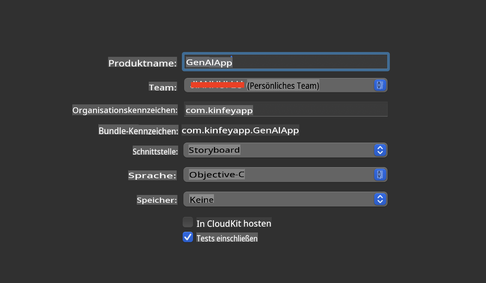
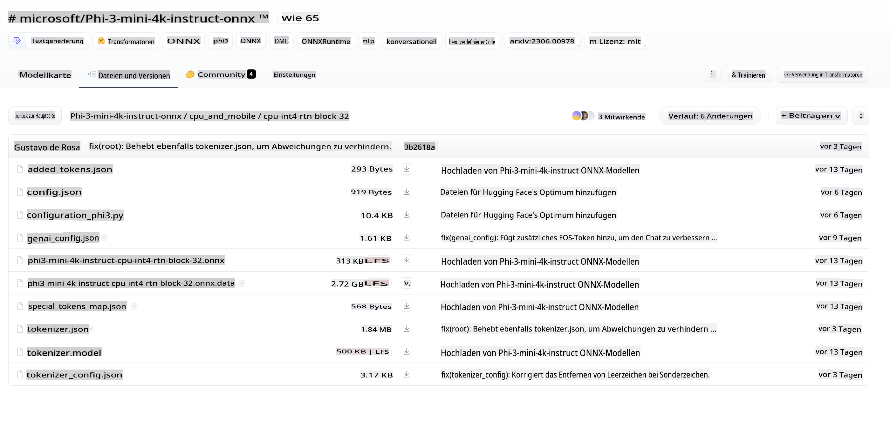
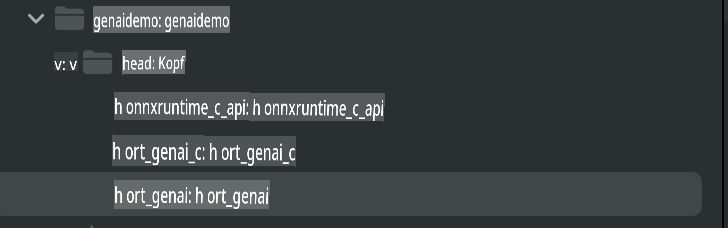
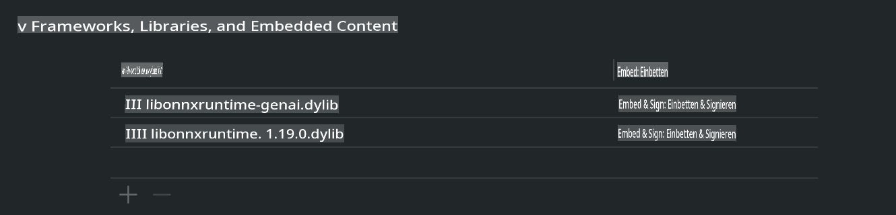
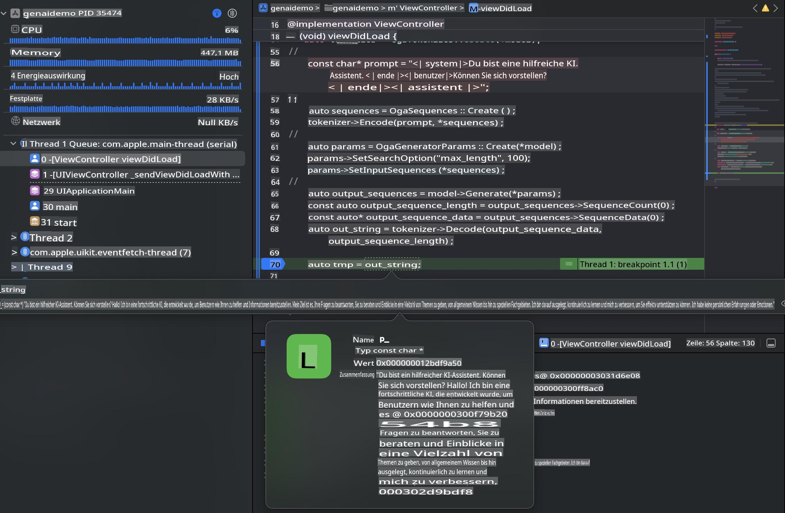

# **Inference Phi-3 auf iOS**

Phi-3-mini ist eine neue Modellreihe von Microsoft, die den Einsatz von großen Sprachmodellen (LLMs) auf Edge-Geräten und IoT-Geräten ermöglicht. Phi-3-mini ist für iOS, Android und Edge-Geräte verfügbar, wodurch generative KI in BYOD-Umgebungen eingesetzt werden kann. Das folgende Beispiel zeigt, wie Phi-3-mini auf iOS implementiert wird.

## **1. Vorbereitung**

- **a.** macOS 14+
- **b.** Xcode 15+
- **c.** iOS SDK 17.x (iPhone 14 A16 oder höher)
- **d.** Python 3.10+ installieren (Conda wird empfohlen)
- **e.** Python-Bibliothek installieren: `python-flatbuffers`
- **f.** CMake installieren

### Semantic Kernel und Inferenz

Semantic Kernel ist ein Anwendungsframework, das es ermöglicht, Anwendungen zu erstellen, die mit dem Azure OpenAI Service, OpenAI-Modellen und sogar lokalen Modellen kompatibel sind. Durch den Zugriff auf lokale Dienste über Semantic Kernel wird die Integration mit Ihrem selbst gehosteten Phi-3-mini-Modellserver erleichtert.

### Aufruf quantisierter Modelle mit Ollama oder LlamaEdge

Viele Nutzer bevorzugen es, quantisierte Modelle lokal auszuführen. [Ollama](https://ollama.com) und [LlamaEdge](https://llamaedge.com) ermöglichen den Aufruf verschiedener quantisierter Modelle:

#### **Ollama**

Sie können `ollama run phi3` direkt ausführen oder offline konfigurieren. Erstellen Sie eine Modelfile mit dem Pfad zu Ihrer `gguf`-Datei. Beispielcode für die Ausführung des quantisierten Phi-3-mini-Modells:

```gguf
FROM {Add your gguf file path}
TEMPLATE \"\"\"<|user|> .Prompt<|end|> <|assistant|>\"\"\"
PARAMETER stop <|end|>
PARAMETER num_ctx 4096
```

#### **LlamaEdge**

Wenn Sie `gguf` sowohl in der Cloud als auch auf Edge-Geräten gleichzeitig nutzen möchten, ist LlamaEdge eine ausgezeichnete Wahl.

## **2. Kompilierung von ONNX Runtime für iOS**

```bash

git clone https://github.com/microsoft/onnxruntime.git

cd onnxruntime

./build.sh --build_shared_lib --ios --skip_tests --parallel --build_dir ./build_ios --ios --apple_sysroot iphoneos --osx_arch arm64 --apple_deploy_target 17.5 --cmake_generator Xcode --config Release

cd ../

```

### **Hinweis**

- **a.** Stellen Sie vor der Kompilierung sicher, dass Xcode ordnungsgemäß konfiguriert ist, und setzen Sie es als aktives Entwicklerverzeichnis im Terminal:

    ```bash
    sudo xcode-select -switch /Applications/Xcode.app/Contents/Developer
    ```

- **b.** ONNX Runtime muss für verschiedene Plattformen kompiliert werden. Für iOS können Sie für `arm64` or `x86_64` kompilieren.

- **c.** Es wird empfohlen, die neueste iOS SDK-Version für die Kompilierung zu verwenden. Sie können jedoch auch eine ältere Version nutzen, wenn Sie Kompatibilität mit früheren SDKs benötigen.

## **3. Kompilierung von Generative AI mit ONNX Runtime für iOS**

> **Hinweis:** Da Generative AI mit ONNX Runtime sich noch in der Vorschau befindet, beachten Sie bitte mögliche Änderungen.

```bash

git clone https://github.com/microsoft/onnxruntime-genai
 
cd onnxruntime-genai
 
mkdir ort
 
cd ort
 
mkdir include
 
mkdir lib
 
cd ../
 
cp ../onnxruntime/include/onnxruntime/core/session/onnxruntime_c_api.h ort/include
 
cp ../onnxruntime/build_ios/Release/Release-iphoneos/libonnxruntime*.dylib* ort/lib
 
export OPENCV_SKIP_XCODEBUILD_FORCE_TRYCOMPILE_DEBUG=1
 
python3 build.py --parallel --build_dir ./build_ios --ios --ios_sysroot iphoneos --ios_arch arm64 --ios_deployment_target 17.5 --cmake_generator Xcode --cmake_extra_defines CMAKE_XCODE_ATTRIBUTE_CODE_SIGNING_ALLOWED=NO

```

## **4. Erstellen einer App-Anwendung in Xcode**

Ich habe Objective-C als Methode für die App-Entwicklung gewählt, da Objective-C besser mit der Generative AI ONNX Runtime C++ API kompatibel ist. Natürlich können Sie auch über Swift-Bridging die entsprechenden Aufrufe durchführen.



## **5. Kopieren des ONNX quantisierten INT4-Modells in das App-Projekt**

Wir müssen das INT4-Quantisierungsmodell im ONNX-Format importieren, das zuerst heruntergeladen werden muss.



Nach dem Herunterladen müssen Sie es in das Verzeichnis „Resources“ des Projekts in Xcode hinzufügen.


## **6. Hinzufügen der C++ API in ViewControllers**

> **Hinweis:**

- **a.** Fügen Sie die entsprechenden C++-Header-Dateien zum Projekt hinzu.

  

- **b.** Binden Sie `onnxruntime-genai` dynamic library in Xcode.

  

- **c.** Use the C Samples code for testing. You can also add additional features like ChatUI for more functionality.

- **d.** Since you need to use C++ in your project, rename `ViewController.m` to `ViewController.mm`, um Objective-C++-Unterstützung zu aktivieren.

```objc

    NSString *llmPath = [[NSBundle mainBundle] resourcePath];
    char const *modelPath = llmPath.cString;

    auto model =  OgaModel::Create(modelPath);

    auto tokenizer = OgaTokenizer::Create(*model);

    const char* prompt = "<|system|>You are a helpful AI assistant.<|end|><|user|>Can you introduce yourself?<|end|><|assistant|>";

    auto sequences = OgaSequences::Create();
    tokenizer->Encode(prompt, *sequences);

    auto params = OgaGeneratorParams::Create(*model);
    params->SetSearchOption("max_length", 100);
    params->SetInputSequences(*sequences);

    auto output_sequences = model->Generate(*params);
    const auto output_sequence_length = output_sequences->SequenceCount(0);
    const auto* output_sequence_data = output_sequences->SequenceData(0);
    auto out_string = tokenizer->Decode(output_sequence_data, output_sequence_length);
    
    auto tmp = out_string;

```

## **7. Ausführen der Anwendung**

Sobald die Einrichtung abgeschlossen ist, können Sie die Anwendung ausführen, um die Ergebnisse der Phi-3-mini-Modellinferenz zu sehen.



Für weiteren Beispielcode und detaillierte Anleitungen besuchen Sie das [Phi-3 Mini Samples Repository](https://github.com/Azure-Samples/Phi-3MiniSamples/tree/main/ios).

**Haftungsausschluss**:  
Dieses Dokument wurde mithilfe von KI-gestützten maschinellen Übersetzungsdiensten übersetzt. Obwohl wir uns um Genauigkeit bemühen, beachten Sie bitte, dass automatisierte Übersetzungen Fehler oder Ungenauigkeiten enthalten können. Das Originaldokument in seiner ursprünglichen Sprache sollte als maßgebliche Quelle betrachtet werden. Für kritische Informationen wird eine professionelle menschliche Übersetzung empfohlen. Wir übernehmen keine Haftung für Missverständnisse oder Fehlinterpretationen, die sich aus der Nutzung dieser Übersetzung ergeben.