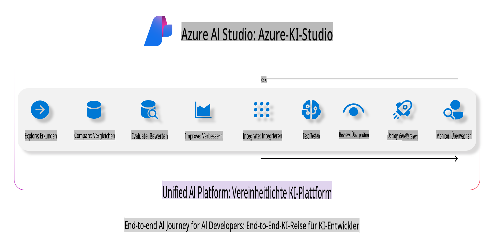
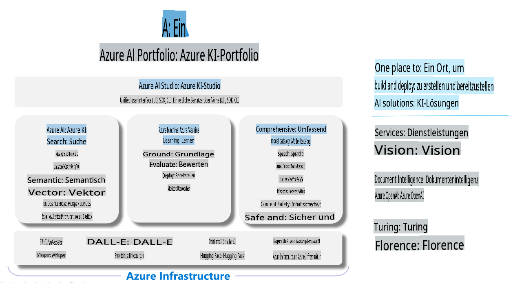

# **Verwendung von Azure AI Foundry zur Bewertung**

So bewerten Sie Ihre generative KI-Anwendung mit [Azure AI Foundry](https://ai.azure.com?WT.mc_id=aiml-138114-kinfeylo). Egal, ob Sie Einzelinteraktionen oder mehrstufige Gespräche bewerten – Azure AI Foundry bietet Tools zur Bewertung der Modellleistung und -sicherheit.

## So bewerten Sie generative KI-Apps mit Azure AI Foundry
Für detaillierte Anweisungen lesen Sie die [Azure AI Foundry-Dokumentation](https://learn.microsoft.com/azure/ai-studio/how-to/evaluate-generative-ai-app?WT.mc_id=aiml-138114-kinfeylo).

Hier sind die Schritte, um loszulegen:

## Bewertung generativer KI-Modelle in Azure AI Foundry

**Voraussetzungen**

- Ein Testdatensatz im CSV- oder JSON-Format.
- Ein bereitgestelltes generatives KI-Modell (wie Phi-3, GPT 3.5, GPT 4 oder Davinci-Modelle).
- Eine Laufzeit mit einer Compute-Instanz, um die Bewertung auszuführen.

## Eingebaute Bewertungsmetriken

Azure AI Foundry ermöglicht die Bewertung sowohl von Einzelinteraktionen als auch von komplexen, mehrstufigen Gesprächen.  
Für Retrieval Augmented Generation (RAG)-Szenarien, bei denen das Modell auf spezifischen Daten basiert, können Sie die Leistung mit integrierten Bewertungsmetriken beurteilen.  
Zusätzlich können Sie allgemeine Szenarien für die Beantwortung von Einzelinteraktionsfragen (nicht-RAG) bewerten.

## Erstellen eines Bewertungsdurchlaufs

Navigieren Sie in der Azure AI Foundry-Benutzeroberfläche zur Seite "Evaluate" oder "Prompt Flow".  
Folgen Sie dem Assistenten zur Erstellung der Bewertung, um einen Bewertungsdurchlauf einzurichten. Geben Sie optional einen Namen für Ihre Bewertung an.  
Wählen Sie das Szenario, das mit den Zielen Ihrer Anwendung übereinstimmt.  
Wählen Sie eine oder mehrere Bewertungsmetriken aus, um die Modellausgabe zu beurteilen.

## Benutzerdefinierter Bewertungsablauf (Optional)

Für mehr Flexibilität können Sie einen benutzerdefinierten Bewertungsablauf erstellen. Passen Sie den Bewertungsprozess an Ihre spezifischen Anforderungen an.

## Ergebnisse anzeigen

Nach der Durchführung der Bewertung können Sie detaillierte Bewertungsmetriken in Azure AI Foundry protokollieren, anzeigen und analysieren.  
Gewinnen Sie Einblicke in die Fähigkeiten und Grenzen Ihrer Anwendung.

**Hinweis** Azure AI Foundry befindet sich derzeit in der öffentlichen Vorschau. Verwenden Sie es daher für Experimente und Entwicklungszwecke. Für produktive Workloads sollten Sie andere Optionen in Betracht ziehen. Weitere Informationen und Schritt-für-Schritt-Anleitungen finden Sie in der offiziellen [AI Foundry-Dokumentation](https://learn.microsoft.com/azure/ai-studio/?WT.mc_id=aiml-138114-kinfeylo).

**Haftungsausschluss**:  
Dieses Dokument wurde mithilfe von KI-gestützten maschinellen Übersetzungsdiensten übersetzt. Obwohl wir uns um Genauigkeit bemühen, beachten Sie bitte, dass automatisierte Übersetzungen Fehler oder Ungenauigkeiten enthalten können. Das Originaldokument in seiner ursprünglichen Sprache sollte als maßgebliche Quelle betrachtet werden. Für kritische Informationen wird eine professionelle menschliche Übersetzung empfohlen. Wir übernehmen keine Haftung für Missverständnisse oder Fehlinterpretationen, die aus der Nutzung dieser Übersetzung resultieren.