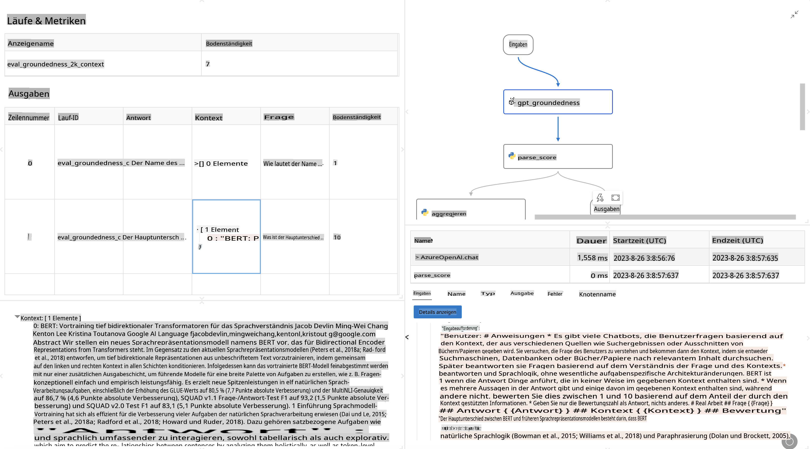

# **Einführung in Promptflow**

[Microsoft Prompt Flow](https://microsoft.github.io/promptflow/index.html?WT.mc_id=aiml-138114-kinfeylo) ist ein visuelles Workflow-Automatisierungstool, das es Benutzern ermöglicht, automatisierte Workflows mithilfe vorgefertigter Vorlagen und benutzerdefinierter Konnektoren zu erstellen. Es wurde entwickelt, um Entwicklern und Business-Analysten zu helfen, schnell automatisierte Prozesse für Aufgaben wie Datenverwaltung, Zusammenarbeit und Prozessoptimierung zu erstellen. Mit Prompt Flow können Benutzer verschiedene Dienste, Anwendungen und Systeme einfach verbinden und komplexe Geschäftsprozesse automatisieren.

Microsoft Prompt Flow ist darauf ausgelegt, den gesamten Entwicklungszyklus von KI-Anwendungen, die auf großen Sprachmodellen (LLMs) basieren, zu vereinfachen. Egal, ob Sie Ideen entwickeln, Prototypen erstellen, testen, bewerten oder LLM-basierte Anwendungen bereitstellen – Prompt Flow macht den Prozess einfacher und ermöglicht die Erstellung von LLM-Anwendungen in Produktionsqualität.

## Hier sind die wichtigsten Funktionen und Vorteile von Microsoft Prompt Flow:

**Interaktive Autorenerfahrung**

Prompt Flow bietet eine visuelle Darstellung der Struktur Ihres Workflows, wodurch Projekte leicht verständlich und navigierbar werden.  
Es ermöglicht eine Notebook-ähnliche Codiererfahrung für eine effiziente Workflow-Entwicklung und Debugging.

**Prompt-Varianten und Feinabstimmung**

Erstellen und vergleichen Sie mehrere Prompt-Varianten, um einen iterativen Verfeinerungsprozess zu erleichtern.  
Bewerten Sie die Leistung verschiedener Prompts und wählen Sie die effektivsten aus.

**Eingebaute Bewertungs-Workflows**

Bewerten Sie die Qualität und Effektivität Ihrer Prompts und Workflows mit integrierten Bewertungstools.  
Verstehen Sie, wie gut Ihre LLM-basierten Anwendungen funktionieren.

**Umfassende Ressourcen**

Prompt Flow enthält eine Bibliothek mit integrierten Tools, Beispielen und Vorlagen.  
Diese Ressourcen dienen als Ausgangspunkt für die Entwicklung, fördern die Kreativität und beschleunigen den Prozess.

**Zusammenarbeit und Unternehmensbereitschaft**

Unterstützen Sie die Teamarbeit, indem Sie mehreren Benutzern ermöglichen, gemeinsam an Prompt-Engineering-Projekten zu arbeiten.  
Behalten Sie die Versionskontrolle bei und teilen Sie Wissen effektiv.  
Optimieren Sie den gesamten Prompt-Engineering-Prozess – von der Entwicklung und Bewertung bis hin zur Bereitstellung und Überwachung.

## Bewertung in Prompt Flow

In Microsoft Prompt Flow spielt die Bewertung eine entscheidende Rolle bei der Beurteilung der Leistung Ihrer KI-Modelle. Lassen Sie uns erkunden, wie Sie Bewertungs-Workflows und Metriken in Prompt Flow anpassen können:

**Bewertung in Prompt Flow verstehen**

In Prompt Flow stellt ein Workflow eine Abfolge von Knoten dar, die Eingaben verarbeiten und Ausgaben generieren. Bewertungs-Workflows sind spezielle Arten von Workflows, die entwickelt wurden, um die Leistung eines Durchlaufs basierend auf spezifischen Kriterien und Zielen zu bewerten.

**Wichtige Merkmale von Bewertungs-Workflows**

Sie laufen typischerweise nach dem getesteten Workflow und verwenden dessen Ausgaben.  
Sie berechnen Scores oder Metriken, um die Leistung des getesteten Workflows zu messen.  
Metriken können Genauigkeit, Relevanz-Scores oder andere relevante Maße umfassen.

### Anpassung von Bewertungs-Workflows

**Definition von Eingaben**

Bewertungs-Workflows müssen die Ausgaben des getesteten Durchlaufs übernehmen. Definieren Sie Eingaben ähnlich wie bei Standard-Workflows.  
Beispielsweise können Sie bei der Bewertung eines QnA-Workflows eine Eingabe als „Antwort“ benennen. Bei der Bewertung eines Klassifizierungs-Workflows können Sie eine Eingabe als „Kategorie“ benennen. Auch Ground-Truth-Eingaben (z. B. tatsächliche Labels) können erforderlich sein.

**Ausgaben und Metriken**

Bewertungs-Workflows liefern Ergebnisse, die die Leistung des getesteten Workflows messen.  
Metriken können mithilfe von Python oder LLM (Large Language Models) berechnet werden. Verwenden Sie die Funktion log_metric(), um relevante Metriken zu protokollieren.

**Verwendung angepasster Bewertungs-Workflows**

Entwickeln Sie Ihren eigenen Bewertungs-Workflow, der auf Ihre spezifischen Aufgaben und Ziele zugeschnitten ist.  
Passen Sie Metriken basierend auf Ihren Bewertungszielen an.  
Wenden Sie diesen angepassten Bewertungs-Workflow auf Batch-Durchläufe für umfangreiche Tests an.

## Eingebaute Bewertungsmethoden

Prompt Flow bietet auch eingebaute Bewertungsmethoden.  
Sie können Batch-Durchläufe einreichen und diese Methoden verwenden, um zu bewerten, wie gut Ihr Workflow mit großen Datensätzen funktioniert.  
Betrachten Sie die Bewertungsergebnisse, vergleichen Sie Metriken und iterieren Sie bei Bedarf.  
Denken Sie daran, dass die Bewertung entscheidend ist, um sicherzustellen, dass Ihre KI-Modelle die gewünschten Kriterien und Ziele erfüllen. Schauen Sie sich die offizielle Dokumentation an, um detaillierte Anleitungen zur Entwicklung und Verwendung von Bewertungs-Workflows in Microsoft Prompt Flow zu erhalten.

Zusammenfassend lässt sich sagen, dass Microsoft Prompt Flow Entwicklern ermöglicht, hochwertige LLM-Anwendungen zu erstellen, indem es das Prompt-Engineering vereinfacht und eine robuste Entwicklungsumgebung bietet. Wenn Sie mit LLMs arbeiten, ist Prompt Flow ein wertvolles Tool, das Sie erkunden sollten. Schauen Sie sich die [Prompt Flow Bewertungsdokumente](https://learn.microsoft.com/azure/machine-learning/prompt-flow/how-to-develop-an-evaluation-flow?view=azureml-api-2?WT.mc_id=aiml-138114-kinfeylo) an, um detaillierte Anleitungen zur Entwicklung und Verwendung von Bewertungs-Workflows in Microsoft Prompt Flow zu erhalten.

**Haftungsausschluss**:  
Dieses Dokument wurde mithilfe von KI-gestützten maschinellen Übersetzungsdiensten übersetzt. Obwohl wir uns um Genauigkeit bemühen, weisen wir darauf hin, dass automatisierte Übersetzungen Fehler oder Ungenauigkeiten enthalten können. Das Originaldokument in seiner jeweiligen Originalsprache sollte als maßgebliche Quelle betrachtet werden. Für kritische Informationen wird eine professionelle menschliche Übersetzung empfohlen. Wir übernehmen keine Haftung für Missverständnisse oder Fehlinterpretationen, die sich aus der Nutzung dieser Übersetzung ergeben.