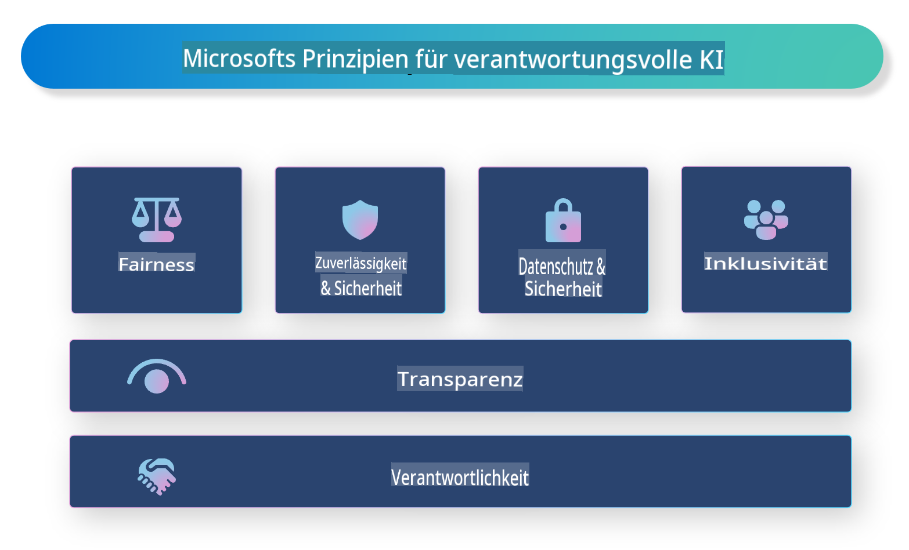

# **Einführung in Verantwortungsvolle KI**

[Microsoft Responsible AI](https://www.microsoft.com/ai/responsible-ai?WT.mc_id=aiml-138114-kinfeylo) ist eine Initiative, die Entwicklern und Organisationen helfen soll, KI-Systeme zu entwickeln, die transparent, vertrauenswürdig und verantwortungsvoll sind. Die Initiative bietet Leitlinien und Ressourcen für die Entwicklung verantwortungsvoller KI-Lösungen, die mit ethischen Prinzipien wie Datenschutz, Fairness und Transparenz im Einklang stehen. Wir werden auch einige Herausforderungen und bewährte Praktiken im Zusammenhang mit dem Aufbau verantwortungsvoller KI-Systeme untersuchen.

## Überblick über Microsoft Responsible AI

**Ethische Prinzipien**

Microsoft Responsible AI orientiert sich an einer Reihe ethischer Prinzipien wie Datenschutz, Fairness, Transparenz, Verantwortlichkeit und Sicherheit. Diese Prinzipien sollen sicherstellen, dass KI-Systeme auf ethische und verantwortungsvolle Weise entwickelt werden.

**Transparente KI**

Microsoft Responsible AI betont die Bedeutung von Transparenz in KI-Systemen. Dazu gehört, klare Erklärungen darüber zu liefern, wie KI-Modelle funktionieren, sowie sicherzustellen, dass Datenquellen und Algorithmen öffentlich zugänglich sind.

**Verantwortungsvolle KI**

[Microsoft Responsible AI](https://www.microsoft.com/ai/responsible-ai?WT.mc_id=aiml-138114-kinfeylo) fördert die Entwicklung von verantwortungsvollen KI-Systemen, die Einblicke in die Entscheidungsfindung von KI-Modellen bieten können. Dies hilft den Nutzern, die Ergebnisse von KI-Systemen zu verstehen und ihnen zu vertrauen.

**Inklusivität**

KI-Systeme sollten so gestaltet sein, dass sie allen zugutekommen. Microsoft strebt an, inklusive KI zu schaffen, die unterschiedliche Perspektiven berücksichtigt und Vorurteile oder Diskriminierung vermeidet.

**Zuverlässigkeit und Sicherheit**

Es ist entscheidend, dass KI-Systeme zuverlässig und sicher sind. Microsoft legt den Fokus auf den Aufbau robuster Modelle, die konsistent arbeiten und schädliche Ergebnisse vermeiden.

**Fairness in der KI**

Microsoft Responsible AI erkennt an, dass KI-Systeme Vorurteile verstärken können, wenn sie auf voreingenommenen Daten oder Algorithmen basieren. Die Initiative bietet Leitlinien zur Entwicklung fairer KI-Systeme, die nicht aufgrund von Faktoren wie Rasse, Geschlecht oder Alter diskriminieren.

**Datenschutz und Sicherheit**

Microsoft Responsible AI hebt die Bedeutung des Schutzes der Privatsphäre und der Datensicherheit der Nutzer in KI-Systemen hervor. Dazu gehören die Implementierung starker Datenverschlüsselung und Zugriffskontrollen sowie regelmäßige Prüfungen von KI-Systemen auf Schwachstellen.

**Verantwortung und Rechenschaftspflicht**

Microsoft Responsible AI fördert Verantwortung und Rechenschaftspflicht in der Entwicklung und Implementierung von KI. Dies beinhaltet, dass Entwickler und Organisationen sich der potenziellen Risiken von KI-Systemen bewusst sind und Maßnahmen ergreifen, um diese Risiken zu minimieren.

## Bewährte Praktiken für den Aufbau verantwortungsvoller KI-Systeme

**Entwicklung von KI-Modellen mit vielfältigen Datensätzen**

Um Vorurteile in KI-Systemen zu vermeiden, ist es wichtig, vielfältige Datensätze zu verwenden, die eine breite Palette von Perspektiven und Erfahrungen repräsentieren.

**Verwendung von erklärbaren KI-Techniken**

Erklärbare KI-Techniken können den Nutzern helfen zu verstehen, wie KI-Modelle Entscheidungen treffen, was das Vertrauen in das System erhöhen kann.

**Regelmäßige Überprüfung von KI-Systemen auf Schwachstellen**

Regelmäßige Prüfungen von KI-Systemen können potenzielle Risiken und Schwachstellen aufdecken, die behoben werden müssen.

**Implementierung starker Datenverschlüsselung und Zugriffskontrollen**

Datenverschlüsselung und Zugriffskontrollen können dazu beitragen, die Privatsphäre und Sicherheit der Nutzer in KI-Systemen zu schützen.

**Befolgung ethischer Prinzipien bei der KI-Entwicklung**

Die Befolgung ethischer Prinzipien wie Fairness, Transparenz und Verantwortlichkeit kann dazu beitragen, Vertrauen in KI-Systeme aufzubauen und sicherzustellen, dass sie verantwortungsvoll entwickelt werden.

## Verwendung von AI Foundry für verantwortungsvolle KI

[Azure AI Foundry](https://ai.azure.com?WT.mc_id=aiml-138114-kinfeylo) ist eine leistungsstarke Plattform, die es Entwicklern und Organisationen ermöglicht, schnell intelligente, fortschrittliche, marktreife und verantwortungsvolle Anwendungen zu erstellen. Hier sind einige der wichtigsten Funktionen und Möglichkeiten von Azure AI Foundry:

**Vorgefertigte APIs und Modelle**

Azure AI Foundry bietet vorgefertigte und anpassbare APIs und Modelle. Diese decken eine breite Palette von KI-Aufgaben ab, darunter generative KI, natürliche Sprachverarbeitung für Konversationen, Suche, Überwachung, Übersetzung, Sprache, Vision und Entscheidungsfindung.

**Prompt Flow**

Prompt Flow in Azure AI Foundry ermöglicht die Erstellung von KI-Erlebnissen für Konversationen. Es erlaubt das Design und Management von Gesprächsabläufen, was die Entwicklung von Chatbots, virtuellen Assistenten und anderen interaktiven Anwendungen erleichtert.

**Retrieval Augmented Generation (RAG)**

RAG ist eine Technik, die ansatzbasierte Abruf- und Generierungsverfahren kombiniert. Sie verbessert die Qualität der generierten Antworten, indem sowohl bestehendes Wissen (Abruf) als auch kreative Generierung (Erstellung) genutzt werden.

**Bewertungs- und Überwachungsmetriken für generative KI**

Azure AI Foundry stellt Werkzeuge zur Bewertung und Überwachung generativer KI-Modelle bereit. Sie können deren Leistung, Fairness und andere wichtige Metriken bewerten, um eine verantwortungsvolle Implementierung sicherzustellen. Darüber hinaus können Sie, falls Sie ein Dashboard erstellt haben, die No-Code-Benutzeroberfläche in Azure Machine Learning Studio nutzen, um ein Responsible AI Dashboard und eine zugehörige Scorecard basierend auf den [Responsible AI Toolbox](https://responsibleaitoolbox.ai/?WT.mc_id=aiml-138114-kinfeylo)-Python-Bibliotheken anzupassen und zu generieren. Diese Scorecard hilft Ihnen, wichtige Erkenntnisse zu Fairness, Merkmalsbedeutung und anderen Überlegungen zur verantwortungsvollen Implementierung mit technischen und nicht-technischen Stakeholdern zu teilen.

Um AI Foundry mit verantwortungsvoller KI zu nutzen, können Sie folgende bewährte Praktiken anwenden:

**Definieren Sie das Problem und die Ziele Ihres KI-Systems**

Bevor Sie mit der Entwicklung beginnen, ist es wichtig, das Problem oder Ziel, das Ihr KI-System lösen soll, klar zu definieren. Dies hilft Ihnen, die benötigten Daten, Algorithmen und Ressourcen zu identifizieren, um ein effektives Modell zu erstellen.

**Sammeln und vorverarbeiten relevanter Daten**

Die Qualität und Quantität der für die Schulung eines KI-Systems verwendeten Daten können dessen Leistung erheblich beeinflussen. Daher ist es wichtig, relevante Daten zu sammeln, sie zu bereinigen, vorzuverarbeiten und sicherzustellen, dass sie repräsentativ für die Bevölkerung oder das Problem sind, das Sie lösen möchten.

**Wählen Sie geeignete Bewertungsalgorithmen**

Es gibt verschiedene Bewertungsalgorithmen. Es ist wichtig, den am besten geeigneten Algorithmus basierend auf Ihren Daten und Ihrem Problem auszuwählen.

**Bewerten und interpretieren Sie das Modell**

Sobald Sie ein KI-Modell erstellt haben, ist es wichtig, dessen Leistung anhand geeigneter Metriken zu bewerten und die Ergebnisse transparent zu interpretieren. Dies hilft Ihnen, eventuelle Vorurteile oder Einschränkungen im Modell zu erkennen und Verbesserungen vorzunehmen.

**Sicherstellen von Transparenz und Erklärbarkeit**

KI-Systeme sollten transparent und erklärbar sein, damit Nutzer verstehen können, wie sie funktionieren und wie Entscheidungen getroffen werden. Dies ist besonders wichtig für Anwendungen mit erheblichen Auswirkungen auf das menschliche Leben, wie im Gesundheitswesen, Finanzwesen und Rechtssystem.

**Überwachen und Aktualisieren des Modells**

KI-Systeme sollten kontinuierlich überwacht und aktualisiert werden, um sicherzustellen, dass sie im Laufe der Zeit genau und effektiv bleiben. Dies erfordert laufende Wartung, Tests und erneutes Training des Modells.

Abschließend lässt sich sagen, dass Microsoft Responsible AI eine Initiative ist, die Entwicklern und Organisationen helfen soll, KI-Systeme zu entwickeln, die transparent, vertrauenswürdig und verantwortungsvoll sind. Denken Sie daran, dass die Umsetzung verantwortungsvoller KI entscheidend ist, und Azure AI Foundry soll es Organisationen erleichtern, dies praktisch umzusetzen. Indem wir ethische Prinzipien und bewährte Praktiken befolgen, können wir sicherstellen, dass KI-Systeme verantwortungsvoll entwickelt und eingesetzt werden und der Gesellschaft insgesamt zugutekommen.

**Haftungsausschluss**:  
Dieses Dokument wurde mithilfe von KI-basierten maschinellen Übersetzungsdiensten übersetzt. Obwohl wir uns um Genauigkeit bemühen, beachten Sie bitte, dass automatisierte Übersetzungen Fehler oder Ungenauigkeiten enthalten können. Das Originaldokument in seiner ursprünglichen Sprache sollte als maßgebliche Quelle betrachtet werden. Für kritische Informationen wird eine professionelle menschliche Übersetzung empfohlen. Wir haften nicht für Missverständnisse oder Fehlinterpretationen, die aus der Nutzung dieser Übersetzung entstehen.