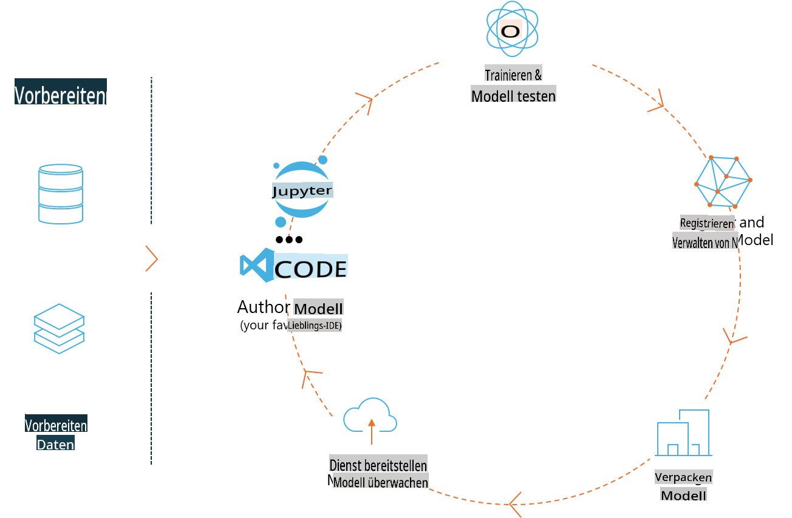
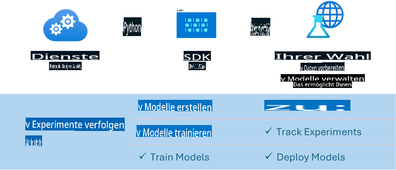

# MLflow

[MLflow](https://mlflow.org/) ist eine Open-Source-Plattform, die entwickelt wurde, um den gesamten Lebenszyklus des maschinellen Lernens zu verwalten.



MLFlow wird verwendet, um den ML-Lebenszyklus zu verwalten, einschließlich Experimentieren, Reproduzierbarkeit, Bereitstellung und einer zentralen Modellregistrierung. MLFlow bietet derzeit vier Hauptkomponenten:

- **MLflow Tracking:** Aufzeichnen und Abfragen von Experimenten, Code, Datenkonfigurationen und Ergebnissen.
- **MLflow Projects:** Verpacken von Data-Science-Code in einem Format, das auf jeder Plattform reproduziert werden kann.
- **MLflow Models:** Bereitstellen von maschinellen Lernmodellen in unterschiedlichen Umgebungen.
- **Model Registry:** Speichern, annotieren und verwalten von Modellen in einem zentralen Repository.

Es bietet Funktionen zum Verfolgen von Experimenten, Verpacken von Code für reproduzierbare Abläufe sowie zum Teilen und Bereitstellen von Modellen. MLFlow ist in Databricks integriert und unterstützt eine Vielzahl von ML-Bibliotheken, wodurch es bibliotheksunabhängig ist. Es kann mit jeder maschinellen Lernbibliothek und in jeder Programmiersprache verwendet werden, da es eine REST-API und CLI für Benutzerfreundlichkeit bereitstellt.


Wichtige Funktionen von MLFlow umfassen:

- **Experiment Tracking:** Aufzeichnen und Vergleichen von Parametern und Ergebnissen.
- **Model Management:** Bereitstellen von Modellen auf verschiedenen Plattformen für Serving und Inferenz.
- **Model Registry:** Gemeinsames Verwalten des Lebenszyklus von MLflow-Modellen, einschließlich Versionierung und Anmerkungen.
- **Projects:** Verpacken von ML-Code für das Teilen oder die Produktionsnutzung.  
MLFlow unterstützt auch den MLOps-Kreislauf, der die Datenvorbereitung, Registrierung und Verwaltung von Modellen, Verpackung von Modellen für die Ausführung, Bereitstellung von Diensten und Überwachung von Modellen umfasst. Ziel ist es, den Übergang von einem Prototyp zu einem Produktionsworkflow zu vereinfachen, insbesondere in Cloud- und Edge-Umgebungen.

## E2E-Szenario – Aufbau eines Wrappers und Nutzung von Phi-3 als MLFlow-Modell

In diesem End-to-End-Beispiel zeigen wir zwei verschiedene Ansätze, um einen Wrapper um das Phi-3 Small Language Model (SLM) zu erstellen und es dann entweder lokal oder in der Cloud, z. B. in einem Azure Machine Learning-Arbeitsbereich, als MLFlow-Modell auszuführen.



| Projekt | Beschreibung | Speicherort |
| ------------ | ----------- | -------- |
| Transformer Pipeline | Die Transformer Pipeline ist die einfachste Option, einen Wrapper zu erstellen, wenn Sie ein HuggingFace-Modell mit dem experimentellen Transformer-Flavor von MLFlow verwenden möchten. | [**TransformerPipeline.ipynb**](../../../../../../code/06.E2E/E2E_Phi-3-MLflow_TransformerPipeline.ipynb) |
| Custom Python Wrapper | Zum Zeitpunkt der Erstellung unterstützte die Transformer-Pipeline keine MLFlow-Wrapper-Generierung für HuggingFace-Modelle im ONNX-Format, selbst mit dem experimentellen Optimum-Python-Paket. Für solche Fälle können Sie einen benutzerdefinierten Python-Wrapper für den MLFlow-Modus erstellen. | [**CustomPythonWrapper.ipynb**](../../../../../../code/06.E2E/E2E_Phi-3-MLflow_CustomPythonWrapper.ipynb) |

## Projekt: Transformer Pipeline

1. Sie benötigen die relevanten Python-Pakete von MLFlow und HuggingFace:

    ``` Python
    import mlflow
    import transformers
    ```

2. Als Nächstes sollten Sie eine Transformer-Pipeline initiieren, indem Sie auf das Zielmodell Phi-3 im HuggingFace-Repository verweisen. Wie aus der Modellkarte von _Phi-3-mini-4k-instruct_ hervorgeht, handelt es sich bei seiner Aufgabe um „Textgenerierung“:

    ``` Python
    pipeline = transformers.pipeline(
        task = "text-generation",
        model = "microsoft/Phi-3-mini-4k-instruct"
    )
    ```

3. Nun können Sie die Transformer-Pipeline Ihres Phi-3-Modells im MLFlow-Format speichern und zusätzliche Details wie den Ziel-Artefaktpfad, spezifische Modelleinstellungen und den Inferenz-API-Typ angeben:

    ``` Python
    model_info = mlflow.transformers.log_model(
        transformers_model = pipeline,
        artifact_path = "phi3-mlflow-model",
        model_config = model_config,
        task = "llm/v1/chat"
    )
    ```

## Projekt: Custom Python Wrapper

1. Hier können wir Microsofts [ONNX Runtime generate() API](https://github.com/microsoft/onnxruntime-genai) für die Inferenz des ONNX-Modells sowie das Codieren/Decodieren von Tokens verwenden. Sie müssen das Paket _onnxruntime_genai_ für Ihre Zielumgebung auswählen, wobei im folgenden Beispiel die CPU verwendet wird:

    ``` Python
    import mlflow
    from mlflow.models import infer_signature
    import onnxruntime_genai as og
    ```

1. Unsere benutzerdefinierte Klasse implementiert zwei Methoden: _load_context()_, um das **ONNX-Modell** von Phi-3 Mini 4K Instruct, **Generatorparameter** und den **Tokenizer** zu initialisieren, und _predict()_, um Ausgabetokens für den bereitgestellten Prompt zu generieren:

    ``` Python
    class Phi3Model(mlflow.pyfunc.PythonModel):
        def load_context(self, context):
            # Retrieving model from the artifacts
            model_path = context.artifacts["phi3-mini-onnx"]
            model_options = {
                 "max_length": 300,
                 "temperature": 0.2,         
            }
        
            # Defining the model
            self.phi3_model = og.Model(model_path)
            self.params = og.GeneratorParams(self.phi3_model)
            self.params.set_search_options(**model_options)
            
            # Defining the tokenizer
            self.tokenizer = og.Tokenizer(self.phi3_model)
    
        def predict(self, context, model_input):
            # Retrieving prompt from the input
            prompt = model_input["prompt"][0]
            self.params.input_ids = self.tokenizer.encode(prompt)
    
            # Generating the model's response
            response = self.phi3_model.generate(self.params)
    
            return self.tokenizer.decode(response[0][len(self.params.input_ids):])
    ```

1. Sie können nun die Funktion _mlflow.pyfunc.log_model()_ verwenden, um einen benutzerdefinierten Python-Wrapper (im Pickle-Format) für das Phi-3-Modell zusammen mit dem ursprünglichen ONNX-Modell und den erforderlichen Abhängigkeiten zu erstellen:

    ``` Python
    model_info = mlflow.pyfunc.log_model(
        artifact_path = artifact_path,
        python_model = Phi3Model(),
        artifacts = {
            "phi3-mini-onnx": "cpu_and_mobile/cpu-int4-rtn-block-32-acc-level-4",
        },
        input_example = input_example,
        signature = infer_signature(input_example, ["Run"]),
        extra_pip_requirements = ["torch", "onnxruntime_genai", "numpy"],
    )
    ```

## Signaturen der generierten MLFlow-Modelle

1. In Schritt 3 des Projekts Transformer Pipeline oben haben wir die Aufgabe des MLFlow-Modells auf „_llm/v1/chat_“ festgelegt. Eine solche Anweisung generiert einen API-Wrapper für das Modell, der mit OpenAIs Chat-API kompatibel ist, wie unten gezeigt:

    ``` Python
    {inputs: 
      ['messages': Array({content: string (required), name: string (optional), role: string (required)}) (required), 'temperature': double (optional), 'max_tokens': long (optional), 'stop': Array(string) (optional), 'n': long (optional), 'stream': boolean (optional)],
    outputs: 
      ['id': string (required), 'object': string (required), 'created': long (required), 'model': string (required), 'choices': Array({finish_reason: string (required), index: long (required), message: {content: string (required), name: string (optional), role: string (required)} (required)}) (required), 'usage': {completion_tokens: long (required), prompt_tokens: long (required), total_tokens: long (required)} (required)],
    params: 
      None}
    ```

1. Dadurch können Sie Ihren Prompt im folgenden Format einreichen:

    ``` Python
    messages = [{"role": "user", "content": "What is the capital of Spain?"}]
    ```

1. Anschließend können Sie eine mit der OpenAI-API kompatible Nachbearbeitung verwenden, z. B. _response[0][‘choices’][0][‘message’][‘content’]_, um Ihre Ausgabe in etwa so zu gestalten:

    ``` JSON
    Question: What is the capital of Spain?
    
    Answer: The capital of Spain is Madrid. It is the largest city in Spain and serves as the political, economic, and cultural center of the country. Madrid is located in the center of the Iberian Peninsula and is known for its rich history, art, and architecture, including the Royal Palace, the Prado Museum, and the Plaza Mayor.
    
    Usage: {'prompt_tokens': 11, 'completion_tokens': 73, 'total_tokens': 84}
    ```

1. In Schritt 3 des Projekts Custom Python Wrapper oben erlauben wir dem MLFlow-Paket, die Signatur des Modells aus einem gegebenen Eingabe-Beispiel zu generieren. Die Signatur unseres MLFlow-Wrappers sieht dann wie folgt aus:

    ``` Python
    {inputs: 
      ['prompt': string (required)],
    outputs: 
      [string (required)],
    params: 
      None}
    ```

1. Unser Prompt müsste daher den Schlüssel „prompt“ im Dictionary enthalten, ähnlich wie hier:

    ``` Python
    {"prompt": "<|system|>You are a stand-up comedian.<|end|><|user|>Tell me a joke about atom<|end|><|assistant|>",}
    ```

1. Die Ausgabe des Modells wird dann im String-Format bereitgestellt:

    ``` JSON
    Alright, here's a little atom-related joke for you!
    
    Why don't electrons ever play hide and seek with protons?
    
    Because good luck finding them when they're always "sharing" their electrons!
    
    Remember, this is all in good fun, and we're just having a little atomic-level humor!
    ```

**Haftungsausschluss**:  
Dieses Dokument wurde mithilfe von KI-basierten maschinellen Übersetzungsdiensten übersetzt. Obwohl wir uns um Genauigkeit bemühen, weisen wir darauf hin, dass automatisierte Übersetzungen Fehler oder Ungenauigkeiten enthalten können. Das Originaldokument in seiner ursprünglichen Sprache sollte als maßgebliche Quelle betrachtet werden. Für kritische Informationen wird eine professionelle menschliche Übersetzung empfohlen. Wir übernehmen keine Haftung für Missverständnisse oder Fehlinterpretationen, die sich aus der Nutzung dieser Übersetzung ergeben.