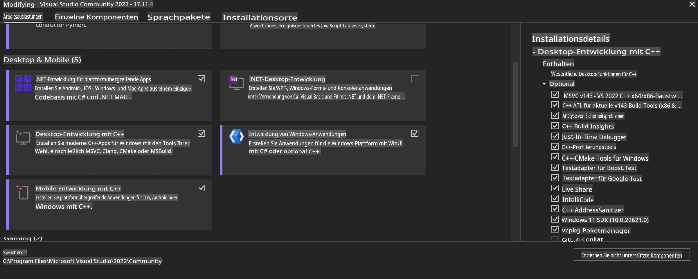
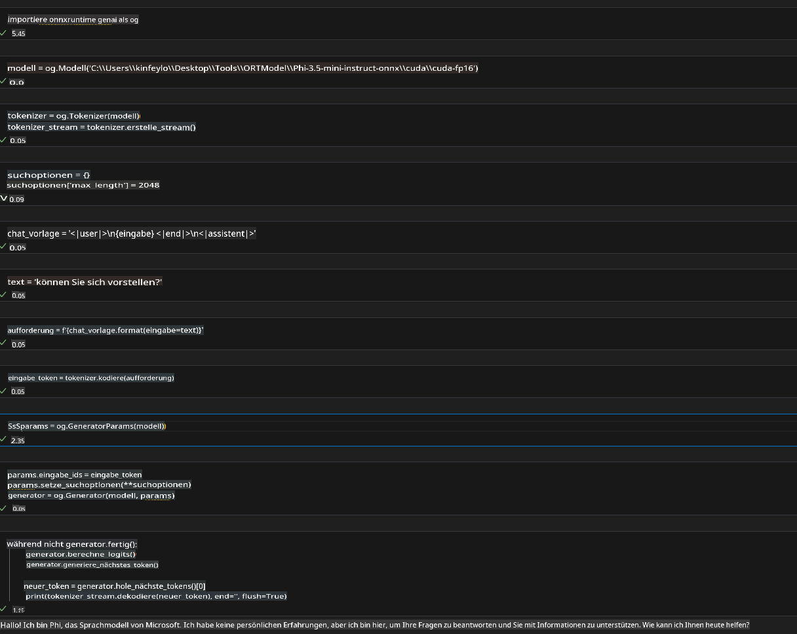
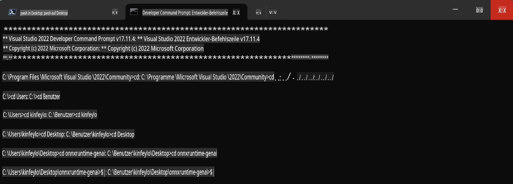

# **Leitfaden für OnnxRuntime GenAI Windows GPU**

Dieser Leitfaden bietet Schritte zur Einrichtung und Nutzung von ONNX Runtime (ORT) mit GPUs unter Windows. Er wurde entwickelt, um Ihnen zu helfen, GPU-Beschleunigung für Ihre Modelle zu nutzen und so Leistung und Effizienz zu steigern.

Das Dokument enthält Anleitungen zu:

- Einrichtung der Umgebung: Anweisungen zur Installation der erforderlichen Abhängigkeiten wie CUDA, cuDNN und ONNX Runtime.
- Konfiguration: Wie Sie die Umgebung und ONNX Runtime so konfigurieren, dass GPU-Ressourcen effektiv genutzt werden.
- Optimierungstipps: Hinweise zur Feinabstimmung Ihrer GPU-Einstellungen für optimale Leistung.

### **1. Python 3.10.x / 3.11.8**

   ***Hinweis*** Es wird empfohlen, [miniforge](https://github.com/conda-forge/miniforge/releases/latest/download/Miniforge3-Windows-x86_64.exe) als Ihre Python-Umgebung zu verwenden.

   ```bash

   conda create -n pydev python==3.11.8

   conda activate pydev

   ```

   ***Erinnerung*** Wenn Sie bereits eine ONNX-Bibliothek für Python installiert haben, deinstallieren Sie diese bitte.

### **2. Installieren Sie CMake mit winget**

   ```bash

   winget install -e --id Kitware.CMake

   ```

### **3. Installieren Sie Visual Studio 2022 - Desktop-Entwicklung mit C++**

   ***Hinweis*** Wenn Sie nicht selbst kompilieren möchten, können Sie diesen Schritt überspringen.



### **4. Installieren Sie den NVIDIA-Treiber**

1. **NVIDIA GPU-Treiber**  [https://www.nvidia.com/en-us/drivers/](https://www.nvidia.com/en-us/drivers/)

2. **NVIDIA CUDA 12.4** [https://developer.nvidia.com/cuda-12-4-0-download-archive](https://developer.nvidia.com/cuda-12-4-0-download-archive)

3. **NVIDIA CUDNN 9.4**  [https://developer.nvidia.com/cudnn-downloads](https://developer.nvidia.com/cudnn-downloads)

***Erinnerung*** Bitte verwenden Sie die Standardeinstellungen während der Installation.

### **5. NVIDIA-Umgebung einrichten**

Kopieren Sie die NVIDIA CUDNN 9.4 lib-, bin- und include-Dateien in die entsprechenden Verzeichnisse von NVIDIA CUDA 12.4.

- Kopieren Sie die Dateien aus *'C:\Program Files\NVIDIA\CUDNN\v9.4\bin\12.6'* nach *'C:\Program Files\NVIDIA GPU Computing Toolkit\CUDA\v12.4\bin'*.

- Kopieren Sie die Dateien aus *'C:\Program Files\NVIDIA\CUDNN\v9.4\include\12.6'* nach *'C:\Program Files\NVIDIA GPU Computing Toolkit\CUDA\v12.4\include'*.

- Kopieren Sie die Dateien aus *'C:\Program Files\NVIDIA\CUDNN\v9.4\lib\12.6'* nach *'C:\Program Files\NVIDIA GPU Computing Toolkit\CUDA\v12.4\lib\x64'*.

### **6. Phi-3.5-mini-instruct-onnx herunterladen**

   ```bash

   winget install -e --id Git.Git

   winget install -e --id GitHub.GitLFS

   git lfs install

   git clone https://huggingface.co/microsoft/Phi-3.5-mini-instruct-onnx

   ```

### **7. InferencePhi35Instruct.ipynb ausführen**

   Öffnen Sie [Notebook](../../../../../../code/09.UpdateSamples/Aug/ortgpu-phi35-instruct.ipynb) und führen Sie es aus.



### **8. ORT GenAI GPU kompilieren**

   ***Hinweis*** 

   1. Deinstallieren Sie zunächst alle ONNX-, ONNXRuntime- und ONNXRuntime-GenAI-Bibliotheken.

   ```bash

   pip list 
   
   ```

   Danach deinstallieren Sie alle ONNXRuntime-Bibliotheken, z. B.:

   ```bash

   pip uninstall onnxruntime

   pip uninstall onnxruntime-genai

   pip uninstall onnxruntume-genai-cuda
   
   ```

   2. Überprüfen Sie die Unterstützung für Visual Studio-Erweiterungen.

   Überprüfen Sie *C:\Program Files\NVIDIA GPU Computing Toolkit\CUDA\v12.4\extras*, um sicherzustellen, dass *C:\Program Files\NVIDIA GPU Computing Toolkit\CUDA\v12.4\extras\visual_studio_integration* vorhanden ist.

   Falls nicht, überprüfen Sie andere CUDA-Toolkit-Treiberordner und kopieren Sie den Ordner *visual_studio_integration* und dessen Inhalt nach *C:\Program Files\NVIDIA GPU Computing Toolkit\CUDA\v12.4\extras\visual_studio_integration*.

   - Wenn Sie nicht selbst kompilieren möchten, können Sie diesen Schritt überspringen.

   ```bash

   git clone https://github.com/microsoft/onnxruntime-genai

   ```

   - Laden Sie [https://github.com/microsoft/onnxruntime/releases/download/v1.19.2/onnxruntime-win-x64-gpu-1.19.2.zip](https://github.com/microsoft/onnxruntime/releases/download/v1.19.2/onnxruntime-win-x64-gpu-1.19.2.zip) herunter.

   - Entpacken Sie die Datei *onnxruntime-win-x64-gpu-1.19.2.zip*, benennen Sie sie in **ort** um und kopieren Sie den Ordner **ort** in *onnxruntime-genai*.

   - Öffnen Sie das Windows-Terminal, wechseln Sie zum Entwickler-Befehlszeilenfenster für VS 2022 und navigieren Sie zu *onnxruntime-genai*.



   - Kompilieren Sie es mit Ihrer Python-Umgebung.

   ```bash

   cd onnxruntime-genai

   python build.py --use_cuda  --cuda_home "C:\Program Files\NVIDIA GPU Computing Toolkit\CUDA\v12.4" --config Release
 

   cd build/Windows/Release/Wheel

   pip install .whl

   ```

**Haftungsausschluss**:  
Dieses Dokument wurde mithilfe von KI-gestützten maschinellen Übersetzungsdiensten übersetzt. Obwohl wir uns um Genauigkeit bemühen, beachten Sie bitte, dass automatisierte Übersetzungen Fehler oder Ungenauigkeiten enthalten können. Das Originaldokument in seiner ursprünglichen Sprache sollte als maßgebliche Quelle betrachtet werden. Für kritische Informationen wird eine professionelle menschliche Übersetzung empfohlen. Wir übernehmen keine Haftung für Missverständnisse oder Fehlinterpretationen, die sich aus der Nutzung dieser Übersetzung ergeben.