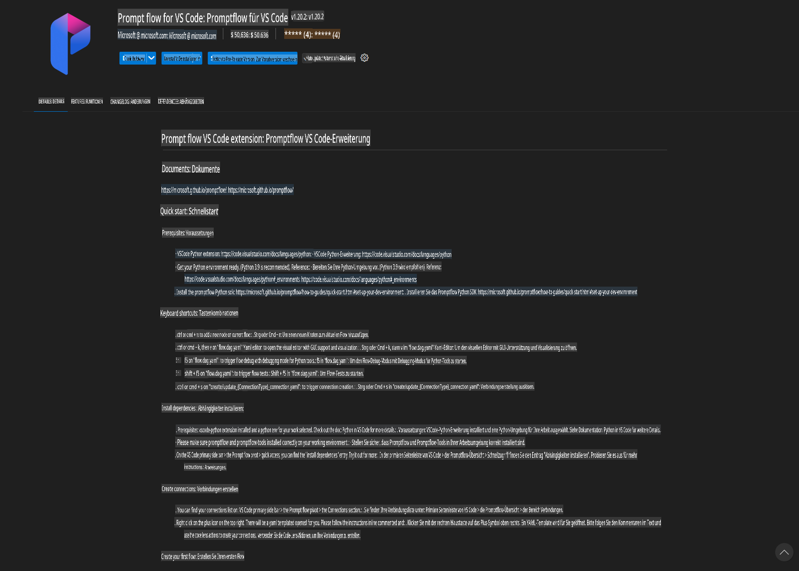
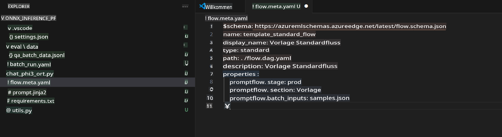
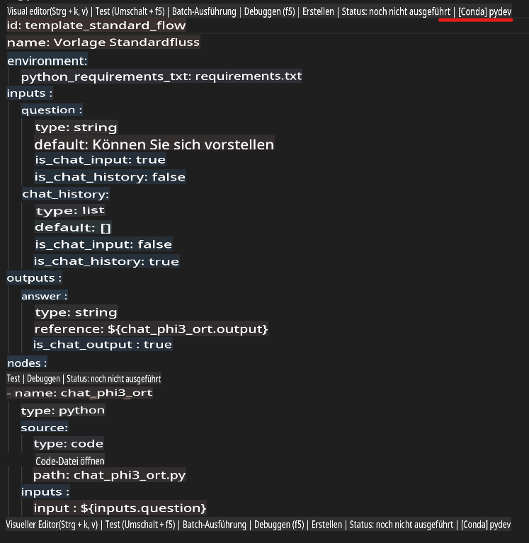
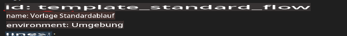
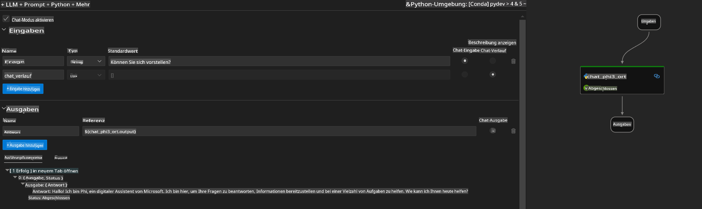
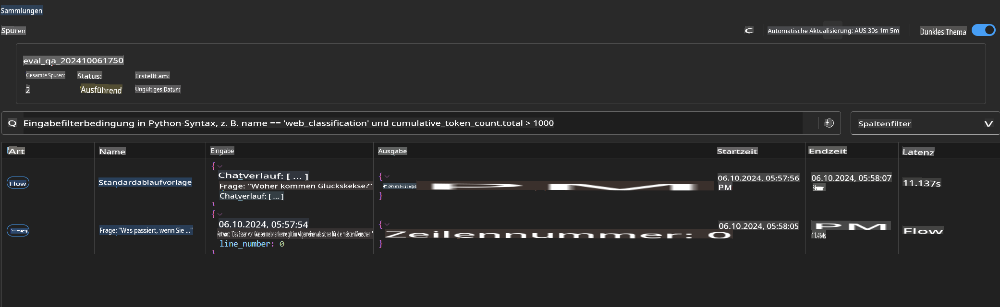

# Verwendung von Windows GPU zur Erstellung einer Prompt Flow-Lösung mit Phi-3.5-Instruct ONNX

Das folgende Dokument ist ein Beispiel dafür, wie PromptFlow mit ONNX (Open Neural Network Exchange) für die Entwicklung von KI-Anwendungen basierend auf Phi-3-Modellen genutzt werden kann.

PromptFlow ist eine Sammlung von Entwicklungstools, die den gesamten Entwicklungszyklus von KI-Anwendungen auf Basis großer Sprachmodelle (LLM) von der Ideenfindung und Prototypenerstellung bis hin zu Tests und Evaluierung vereinfachen soll.

Durch die Integration von PromptFlow mit ONNX können Entwickler:

- **Modellleistung optimieren**: ONNX für effiziente Modellinferenz und -bereitstellung nutzen.
- **Entwicklung vereinfachen**: PromptFlow verwenden, um den Workflow zu verwalten und wiederkehrende Aufgaben zu automatisieren.
- **Zusammenarbeit verbessern**: Bessere Zusammenarbeit im Team durch eine einheitliche Entwicklungsumgebung ermöglichen.

**Prompt flow** ist eine Sammlung von Entwicklungstools, die den gesamten Entwicklungszyklus von KI-Anwendungen auf Basis großer Sprachmodelle (LLM) vereinfacht – von der Ideenfindung, Prototypenerstellung, Testphase und Evaluierung bis hin zur Produktionseinführung und Überwachung. Es erleichtert das Prompt-Engineering erheblich und ermöglicht die Erstellung von LLM-Anwendungen in Produktionsqualität.

Prompt flow kann mit OpenAI, dem Azure OpenAI Service sowie anpassbaren Modellen (z. B. Huggingface, lokale LLMs/SLMs) verbunden werden. Wir möchten das quantisierte ONNX-Modell von Phi-3.5 in lokalen Anwendungen bereitstellen. Prompt flow kann uns dabei helfen, unsere Geschäftspläne besser zu strukturieren und lokale Lösungen basierend auf Phi-3.5 zu erstellen. In diesem Beispiel werden wir die ONNX Runtime GenAI-Bibliothek verwenden, um die Prompt Flow-Lösung auf Basis einer Windows GPU zu realisieren.

## **Installation**

### **ONNX Runtime GenAI für Windows GPU**

Lesen Sie diese Anleitung, um die ONNX Runtime GenAI für Windows GPU einzurichten: [Hier klicken](./ORTWindowGPUGuideline.md)

### **Einrichtung von Prompt Flow in VSCode**

1. Installieren Sie die Prompt Flow VS Code-Erweiterung.



2. Nach der Installation der Prompt Flow VS Code-Erweiterung klicken Sie auf die Erweiterung und wählen Sie **Installation dependencies**. Folgen Sie dieser Anleitung, um das Prompt Flow SDK in Ihrer Umgebung zu installieren.


3. Laden Sie den [Beispielcode](../../../../../../code/09.UpdateSamples/Aug/pf/onnx_inference_pf) herunter und öffnen Sie diesen mit VS Code.



4. Öffnen Sie **flow.dag.yaml**, um Ihre Python-Umgebung auszuwählen.



   Öffnen Sie **chat_phi3_ort.py**, um den Speicherort Ihres Phi-3.5-Instruct ONNX-Modells zu ändern.


5. Führen Sie Ihren Prompt Flow aus, um ihn zu testen.

Öffnen Sie **flow.dag.yaml** und klicken Sie auf den visuellen Editor.



Nach dem Klick darauf können Sie den Testlauf starten.



1. Sie können Batch-Befehle im Terminal ausführen, um weitere Ergebnisse zu überprüfen.

```bash

pf run create --file batch_run.yaml --stream --name 'Your eval qa name'    

```

Sie können die Ergebnisse in Ihrem Standardbrowser überprüfen.



**Haftungsausschluss**:  
Dieses Dokument wurde mithilfe von KI-gestützten maschinellen Übersetzungsdiensten übersetzt. Obwohl wir uns um Genauigkeit bemühen, weisen wir darauf hin, dass automatisierte Übersetzungen Fehler oder Ungenauigkeiten enthalten können. Das Originaldokument in seiner ursprünglichen Sprache sollte als maßgebliche Quelle betrachtet werden. Für kritische Informationen wird eine professionelle menschliche Übersetzung empfohlen. Wir übernehmen keine Haftung für Missverständnisse oder Fehlinterpretationen, die aus der Nutzung dieser Übersetzung entstehen.