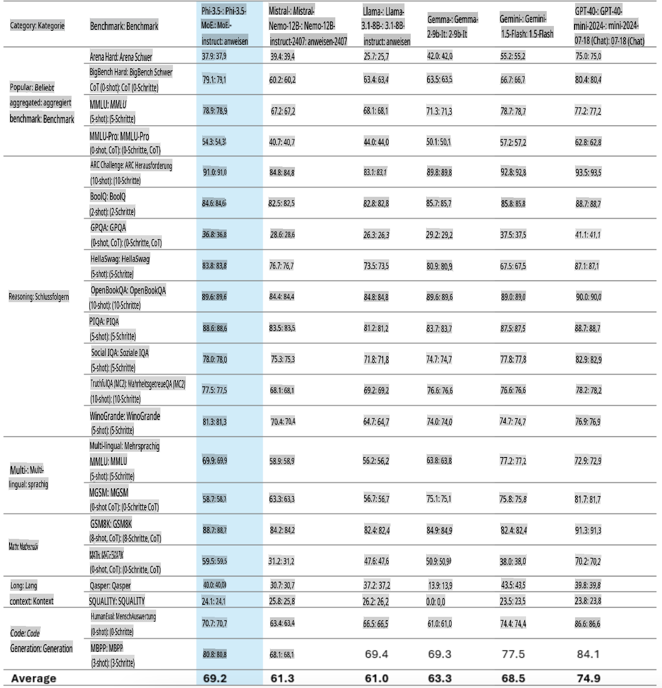
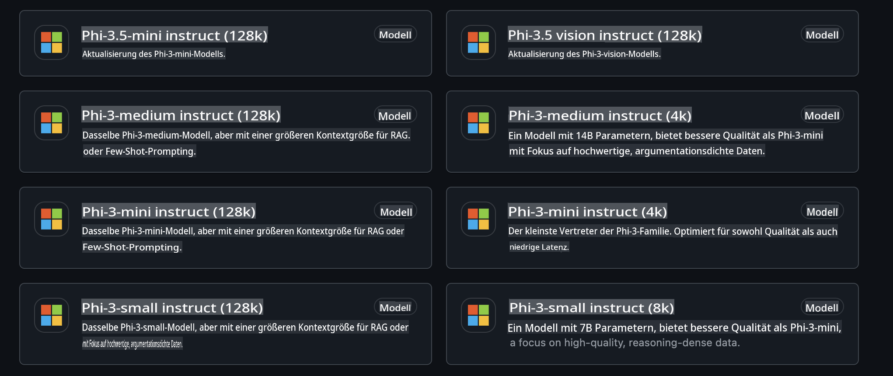
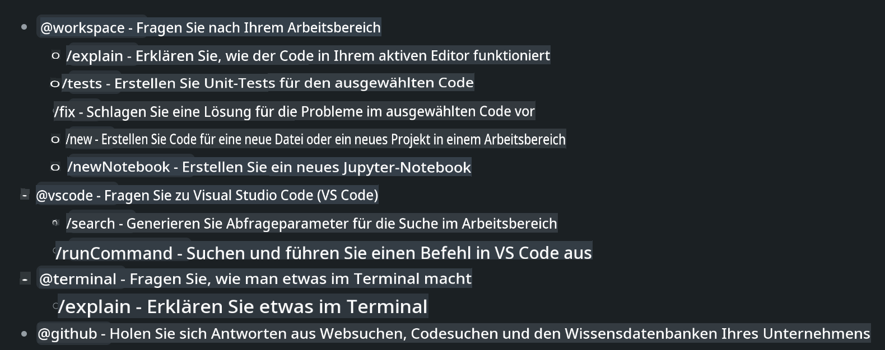
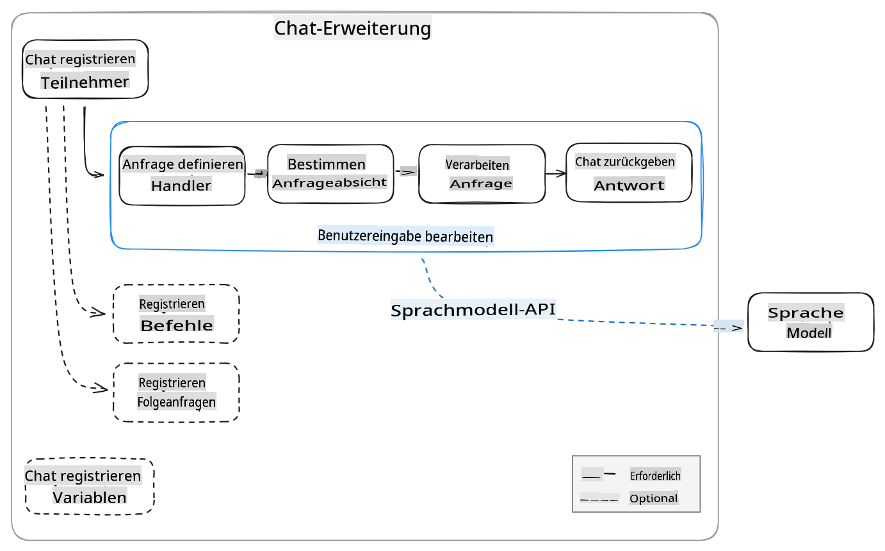
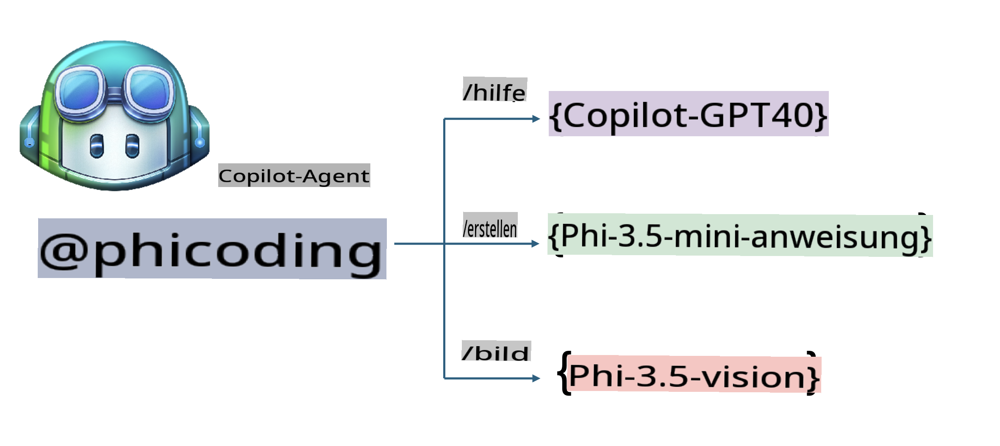
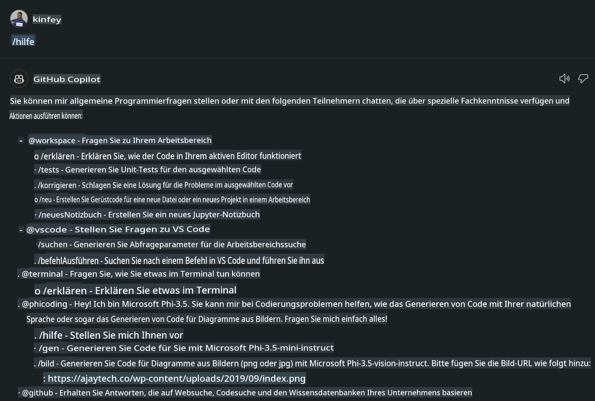
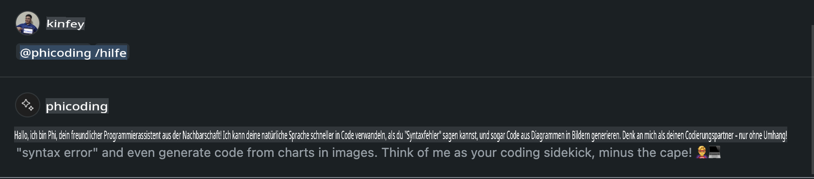
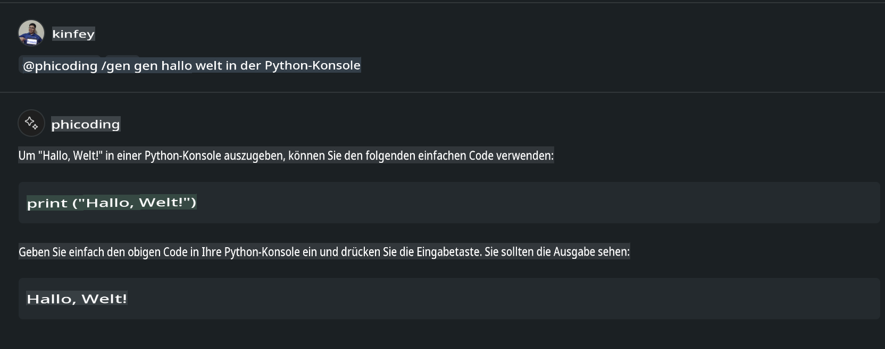
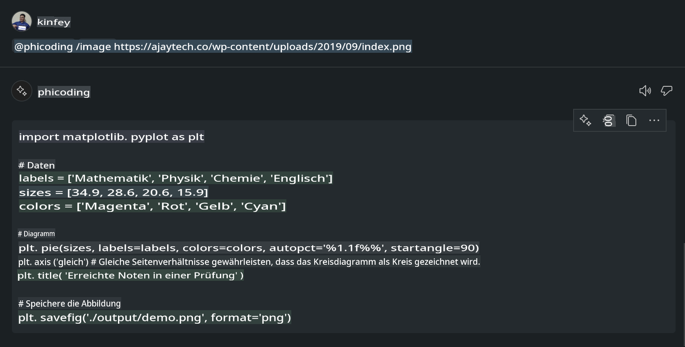

# **Erstellen Sie Ihren eigenen Visual Studio Code Chat Copilot Agent mit Phi-3.5 von GitHub Models**

Nutzen Sie Visual Studio Code Copilot? Besonders im Chat können Sie verschiedene Agents einsetzen, um die Fähigkeiten zum Erstellen, Schreiben und Verwalten von Projekten in Visual Studio Code zu verbessern. Visual Studio Code bietet eine API, die es Unternehmen und Einzelpersonen ermöglicht, verschiedene Agents basierend auf ihren geschäftlichen Anforderungen zu erstellen, um deren Fähigkeiten in spezifischen Fachgebieten zu erweitern. In diesem Artikel konzentrieren wir uns auf **Phi-3.5-mini-instruct (128k)** und **Phi-3.5-vision-instruct (128k)** von GitHub Models, um Ihren eigenen Visual Studio Code Agent zu erstellen.

## **Über Phi-3.5 in GitHub Models**

Es ist bekannt, dass Phi-3/3.5-mini-instruct aus der Phi-3/3.5-Familie starke Fähigkeiten im Verstehen und Generieren von Code besitzt und Vorteile gegenüber Gemma-2-9b und Mistral-Nemo-12B-instruct-2407 bietet.



Die neuesten GitHub Models bieten bereits Zugriff auf die Modelle Phi-3.5-mini-instruct (128k) und Phi-3.5-vision-instruct (128k). Entwickler können diese über das OpenAI SDK, Azure AI Inference SDK und die REST API nutzen.



***Hinweis:*** Es wird empfohlen, hier das Azure AI Inference SDK zu verwenden, da es besser mit dem Azure Model Catalog in der Produktionsumgebung kombiniert werden kann.

Im Folgenden finden Sie die Ergebnisse von **Phi-3.5-mini-instruct (128k)** und **Phi-3.5-vision-instruct (128k)** im Szenario der Codegenerierung nach der Anbindung an GitHub Models sowie eine Vorbereitung für die folgenden Beispiele.

**Demo: GitHub Models Phi-3.5-mini-instruct (128k) generiert Code aus Prompt** ([Klicken Sie hier](../../../../../../code/09.UpdateSamples/Aug/ghmodel_phi35_instruct_demo.ipynb))

**Demo: GitHub Models Phi-3.5-vision-instruct (128k) generiert Code aus Bild** ([Klicken Sie hier](../../../../../../code/09.UpdateSamples/Aug/ghmodel_phi35_vision_demo.ipynb))

## **Über den GitHub Copilot Chat Agent**

Der GitHub Copilot Chat Agent kann in unterschiedlichen Projektszenarien verschiedene Aufgaben basierend auf dem Code erledigen. Das System verfügt über vier Agents: workspace, github, terminal, vscode.



Indem Sie den Namen des Agents mit einem ‘@’ hinzufügen, können Sie die entsprechende Aufgabe schnell erledigen. Für Unternehmen können durch Hinzufügen eigener geschäftsbezogener Inhalte wie Anforderungen, Codierung, Testspezifikationen und Releases leistungsstarke private Unternehmensfunktionen basierend auf GitHub Copilot erstellt werden.

Der Visual Studio Code Chat Agent hat nun offiziell seine API veröffentlicht, die es Unternehmen oder Unternehmensentwicklern ermöglicht, Agents basierend auf unterschiedlichen Software-Business-Ökosystemen zu entwickeln. Basierend auf der Entwicklungsweise der Visual Studio Code Extension Development können Sie einfach die Schnittstelle der Visual Studio Code Chat Agent API nutzen. Wir können basierend auf diesem Prozess entwickeln.



Das Entwicklungsszenario kann die Anbindung an Drittanbieter-Modell-APIs (wie GitHub Models, Azure Model Catalog und selbst entwickelte Dienste basierend auf Open-Source-Modellen) unterstützen und auch die von GitHub Copilot bereitgestellten Modelle gpt-35-turbo, gpt-4 und gpt-4o nutzen.

## **Einen Agenten @phicoding basierend auf Phi-3.5 hinzufügen**

Wir versuchen, die Programmierfähigkeiten von Phi-3.5 zu integrieren, um Aufgaben wie das Schreiben von Code und das Generieren von Code aus Bildern zu erledigen. Wir erstellen einen Agenten namens @PHI, der auf Phi-3.5 basiert. Im Folgenden finden Sie einige Funktionen:

1. Generieren einer Selbstvorstellung basierend auf GPT-4o, bereitgestellt von GitHub Copilot, durch den **@phicoding /help**-Befehl.

2. Generieren von Code für verschiedene Programmiersprachen basierend auf **Phi-3.5-mini-instruct (128k)** durch den **@phicoding /gen**-Befehl.

3. Generieren von Code basierend auf **Phi-3.5-vision-instruct (128k)** und Bildvervollständigung durch den **@phicoding /image**-Befehl.



## **Verwandte Schritte**

1. Installieren Sie die Entwicklungsunterstützung für Visual Studio Code Extension mit npm.

```bash

npm install --global yo generator-code 

```
2. Erstellen Sie ein Visual Studio Code Extension Plugin (im Typescript-Entwicklungsmodus, benannt als phiext).

```bash

yo code 

```

3. Öffnen Sie das erstellte Projekt und bearbeiten Sie die package.json. Hier finden Sie die zugehörigen Anweisungen und Konfigurationen sowie die Konfiguration der GitHub Models. Beachten Sie, dass Sie hier Ihren GitHub Models-Token hinzufügen müssen.

```json

{
  "name": "phiext",
  "displayName": "phiext",
  "description": "",
  "version": "0.0.1",
  "engines": {
    "vscode": "^1.93.0"
  },
  "categories": [
    "AI",
    "Chat"
  ],
  "activationEvents": [],
  "enabledApiProposals": [
      "chatVariableResolver"
  ],
  "main": "./dist/extension.js",
  "contributes": {
    "chatParticipants": [
        {
            "id": "chat.phicoding",
            "name": "phicoding",
            "description": "Hey! I am Microsoft Phi-3.5, She can help me with coding problems, such as generation code with your natural language, or even generation code about chart from images. Just ask me anything!",
            "isSticky": true,
            "commands": [
                {
                    "name": "help",
                    "description": "Introduce myself to you"
                },
                {
                    "name": "gen",
                    "description": "Generate code for you with Microsoft Phi-3.5-mini-instruct"
                },
                {
                    "name": "image",
                    "description": "Generate code for chart from image(png or jpg) with Microsoft Phi-3.5-vision-instruct, please add image url like this : https://ajaytech.co/wp-content/uploads/2019/09/index.png"
                }
            ]
        }
    ],
    "commands": [
        {
            "command": "phicoding.namesInEditor",
            "title": "Use Microsoft Phi 3.5 in Editor"
        }
    ],
    "configuration": {
      "type": "object",
      "title": "githubmodels",
      "properties": {
        "githubmodels.endpoint": {
          "type": "string",
          "default": "https://models.inference.ai.azure.com",
          "description": "Your GitHub Models Endpoint",
          "order": 0
        },
        "githubmodels.api_key": {
          "type": "string",
          "default": "Your GitHub Models Token",
          "description": "Your GitHub Models Token",
          "order": 1
        },
        "githubmodels.phi35instruct": {
          "type": "string",
          "default": "Phi-3.5-mini-instruct",
          "description": "Your Phi-35-Instruct Model",
          "order": 2
        },
        "githubmodels.phi35vision": {
          "type": "string",
          "default": "Phi-3.5-vision-instruct",
          "description": "Your Phi-35-Vision Model",
          "order": 3
        }
      }
    }
  },
  "scripts": {
    "vscode:prepublish": "npm run package",
    "compile": "webpack",
    "watch": "webpack --watch",
    "package": "webpack --mode production --devtool hidden-source-map",
    "compile-tests": "tsc -p . --outDir out",
    "watch-tests": "tsc -p . -w --outDir out",
    "pretest": "npm run compile-tests && npm run compile && npm run lint",
    "lint": "eslint src",
    "test": "vscode-test"
  },
  "devDependencies": {
    "@types/vscode": "^1.93.0",
    "@types/mocha": "^10.0.7",
    "@types/node": "20.x",
    "@typescript-eslint/eslint-plugin": "^8.3.0",
    "@typescript-eslint/parser": "^8.3.0",
    "eslint": "^9.9.1",
    "typescript": "^5.5.4",
    "ts-loader": "^9.5.1",
    "webpack": "^5.94.0",
    "webpack-cli": "^5.1.4",
    "@vscode/test-cli": "^0.0.10",
    "@vscode/test-electron": "^2.4.1"
  },
  "dependencies": {
    "@types/node-fetch": "^2.6.11",
    "node-fetch": "^3.3.2",
    "@azure-rest/ai-inference": "latest",
    "@azure/core-auth": "latest",
    "@azure/core-sse": "latest"
  }
}


```

4. Bearbeiten Sie src/extension.ts.

```typescript

// The module 'vscode' contains the VS Code extensibility API
// Import the module and reference it with the alias vscode in your code below
import * as vscode from 'vscode';
import ModelClient from "@azure-rest/ai-inference";
import { AzureKeyCredential } from "@azure/core-auth";


interface IPhiChatResult extends vscode.ChatResult {
    metadata: {
        command: string;
    };
}


const MODEL_SELECTOR: vscode.LanguageModelChatSelector = { vendor: 'copilot', family: 'gpt-4o' };

function isValidImageUrl(url: string): boolean {
    const regex = /^(https?:\/\/.*\.(?:png|jpg))$/i;
    return regex.test(url);
}
  

// This method is called when your extension is activated
// Your extension is activated the very first time the command is executed
export function activate(context: vscode.ExtensionContext) {

    const codinghandler: vscode.ChatRequestHandler = async (request: vscode.ChatRequest, context: vscode.ChatContext, stream: vscode.ChatResponseStream, token: vscode.CancellationToken): Promise<IPhiChatResult> => {


        const config : any = vscode.workspace.getConfiguration('githubmodels');
        const endPoint: string = config.get('endpoint');
        const apiKey: string = config.get('api_key');
        const phi35instruct: string = config.get('phi35instruct');
        const phi35vision: string = config.get('phi35vision');
        
        if (request.command === 'help') {

            const content = "Welcome to Coding assistant with Microsoft Phi-3.5"; 
            stream.progress(content);


            try {
                const [model] = await vscode.lm.selectChatModels(MODEL_SELECTOR);
                if (model) {
                    const messages = [
                        vscode.LanguageModelChatMessage.User("Please help me express this content in a humorous way: I am a programming assistant who can help you convert natural language into code and generate code based on the charts in the images. output format like this : Hey I am Phi ......")
                    ];
                    const chatResponse = await model.sendRequest(messages, {}, token);
                    for await (const fragment of chatResponse.text) {
                        stream.markdown(fragment);
                    }
                }
            } catch(err) {
                console.log(err);
            }


            return { metadata: { command: 'help' } };

        }

        
        if (request.command === 'gen') {

            const content = "Welcome to use phi-3.5 to generate code";

            stream.progress(content);

            const client = new ModelClient(endPoint, new AzureKeyCredential(apiKey));

            const response = await client.path("/chat/completions").post({
              body: {
                messages: [
                  { role:"system", content: "You are a coding assistant.Help answer all code generation questions." },
                  { role:"user", content: request.prompt }
                ],
                model: phi35instruct,
                temperature: 0.4,
                max_tokens: 1000,
                top_p: 1.
              }
            });

            stream.markdown(response.body.choices[0].message.content);

            return { metadata: { command: 'gen' } };

        }


        
        if (request.command === 'image') {


            const content = "Welcome to use phi-3.5 to generate code from image(png or jpg),image url like this:https://ajaytech.co/wp-content/uploads/2019/09/index.png";

            stream.progress(content);

            if (!isValidImageUrl(request.prompt)) {
                stream.markdown('Please provide a valid image URL');
                return { metadata: { command: 'image' } };
            }
            else
            {

                const client = new ModelClient(endPoint, new AzureKeyCredential(apiKey));
    
                const response = await client.path("/chat/completions").post({
                    body: {
                      messages: [
                        { role: "system", content: "You are a helpful assistant that describes images in details." },
                        { role: "user", content: [
                            { type: "text", text: "Please generate code according to the chart in the picture according to the following requirements\n1. Keep all information in the chart, including data and text\n2. Do not generate additional information that is not included in the chart\n3. Please extract data from the picture, do not generate it from csv\n4. Please save the regenerated chart as a chart and save it to ./output/demo.png"},
                            { type: "image_url", image_url: {url: request.prompt}
                            }
                          ]
                        }
                      ],
                      model: phi35vision,
                      temperature: 0.4,
                      max_tokens: 2048,
                      top_p: 1.
                    }
                  });
    
                
                stream.markdown(response.body.choices[0].message.content);
    
                return { metadata: { command: 'image' } };
            }


        }


        return { metadata: { command: '' } };
    };


    const phi_ext = vscode.chat.createChatParticipant("chat.phicoding", codinghandler);

    phi_ext.iconPath = new vscode.ThemeIcon('sparkle');


    phi_ext.followupProvider = {
        provideFollowups(result: IPhiChatResult, context: vscode.ChatContext, token: vscode.CancellationToken) {
            return [{
                prompt: 'Let us coding with Phi-3.5 😋😋😋😋',
                label: vscode.l10n.t('Enjoy coding with Phi-3.5'),
                command: 'help'
            } satisfies vscode.ChatFollowup];
        }
    };

    context.subscriptions.push(phi_ext);
}

// This method is called when your extension is deactivated
export function deactivate() {}


```

6. Ausführung.

***/help***



***@phicoding /help***



***@phicoding /gen***



***@phicoding /image***



Sie können den Beispielcode herunterladen: [Klicken Sie hier](../../../../../../code/09.UpdateSamples/Aug/vscode)

## **Ressourcen**

1. Registrieren Sie sich bei GitHub Models [https://gh.io/models](https://gh.io/models)

2. Erfahren Sie mehr über die Entwicklung von Visual Studio Code Extensions [https://code.visualstudio.com/api/get-started/your-first-extension](https://code.visualstudio.com/api/get-started/your-first-extension)

3. Erfahren Sie mehr über die Visual Studio Code Copilot Chat API [https://code.visualstudio.com/api/extension-guides/chat](https://code.visualstudio.com/api/extension-guides/chat)

**Haftungsausschluss**:  
Dieses Dokument wurde mithilfe von KI-gestützten maschinellen Übersetzungsdiensten übersetzt. Obwohl wir uns um Genauigkeit bemühen, weisen wir darauf hin, dass automatisierte Übersetzungen Fehler oder Ungenauigkeiten enthalten können. Das Originaldokument in seiner ursprünglichen Sprache sollte als maßgebliche Quelle betrachtet werden. Für kritische Informationen wird eine professionelle menschliche Übersetzung empfohlen. Wir übernehmen keine Haftung für Missverständnisse oder Fehlinterpretationen, die sich aus der Nutzung dieser Übersetzung ergeben.