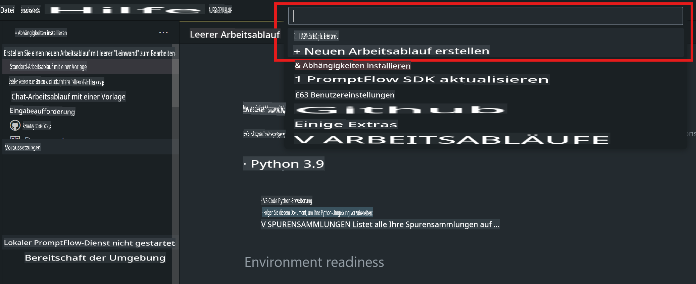
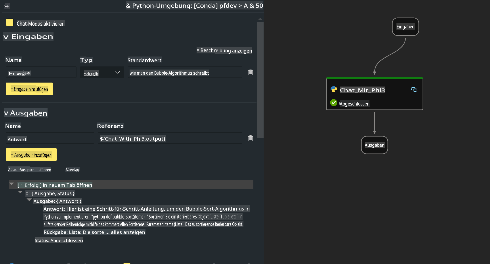

# **Lab 2 - Prompt Flow mit Phi-3-mini auf AIPC ausführen**

## **Was ist Prompt Flow**

Prompt Flow ist eine Suite von Entwicklungstools, die den gesamten Entwicklungszyklus von LLM-basierten KI-Anwendungen vereinfacht – von der Ideenfindung über Prototyping, Testen, Evaluieren bis hin zur Bereitstellung und Überwachung in der Produktion. Es erleichtert das Prompt-Engineering erheblich und ermöglicht es Ihnen, LLM-Anwendungen in Produktionsqualität zu entwickeln.

Mit Prompt Flow können Sie:

- Flows erstellen, die LLMs, Prompts, Python-Code und andere Tools in einem ausführbaren Workflow miteinander verbinden.

- Ihre Flows debuggen und iterieren, insbesondere die Interaktion mit LLMs, und das mit Leichtigkeit.

- Ihre Flows bewerten, Qualitäts- und Leistungsmetriken mit größeren Datensätzen berechnen.

- Tests und Bewertungen in Ihr CI/CD-System integrieren, um die Qualität Ihres Flows sicherzustellen.

- Ihre Flows auf der von Ihnen gewählten Plattform bereitstellen oder problemlos in den Code Ihrer Anwendung integrieren.

- (Optional, aber sehr empfehlenswert) Mit Ihrem Team zusammenarbeiten, indem Sie die Cloud-Version von Prompt Flow in Azure AI nutzen.

## **Was ist AIPC**

Ein AI-PC verfügt über eine CPU, eine GPU und eine NPU, die jeweils spezifische KI-Beschleunigungsfähigkeiten besitzen. Eine NPU (Neural Processing Unit) ist ein spezialisierter Beschleuniger, der KI- und ML-Aufgaben direkt auf Ihrem PC ausführt, anstatt Daten zur Verarbeitung in die Cloud zu senden. Auch GPU und CPU können diese Aufgaben übernehmen, aber die NPU ist besonders gut für energieeffiziente KI-Berechnungen geeignet. Der AI-PC stellt einen grundlegenden Wandel in der Funktionsweise unserer Computer dar. Es handelt sich nicht um eine Lösung für ein zuvor nicht existentes Problem, sondern um eine erhebliche Verbesserung für den täglichen PC-Gebrauch.

Wie funktioniert das? Im Vergleich zu generativer KI und den massiven großen Sprachmodellen (LLMs), die auf riesigen Mengen öffentlicher Daten trainiert werden, ist die KI, die auf Ihrem PC läuft, auf nahezu allen Ebenen zugänglicher. Das Konzept ist einfacher zu verstehen, und da es auf Ihren Daten basiert, ohne die Cloud zu nutzen, sind die Vorteile für eine breitere Nutzergruppe sofort ansprechender.

Kurzfristig umfasst die Welt des AI-PCs persönliche Assistenten und kleinere KI-Modelle, die direkt auf Ihrem PC laufen und Ihre Daten nutzen, um persönliche, private und sicherere KI-Verbesserungen für alltägliche Aufgaben zu bieten – wie das Erstellen von Meeting-Protokollen, Organisieren einer Fantasy-Football-Liga, Automatisieren von Foto- und Video-Bearbeitungen oder das Planen der perfekten Reiseroute für ein Familientreffen basierend auf den Ankunfts- und Abfahrtszeiten aller Beteiligten.

## **Generierung von Code-Flows auf AIPC**

***Hinweis***: Falls Sie die Umgebungsinstallation noch nicht abgeschlossen haben, besuchen Sie bitte [Lab 0 - Installationen](./01.Installations.md).

1. Öffnen Sie die Prompt Flow-Erweiterung in Visual Studio Code und erstellen Sie ein leeres Flow-Projekt.



2. Fügen Sie Eingabe- und Ausgabeparameter hinzu und fügen Sie Python-Code als neuen Flow hinzu.



Sie können diese Struktur (flow.dag.yaml) als Referenz verwenden, um Ihren Flow zu erstellen.

```yaml

inputs:
  question:
    type: string
    default: how to write Bubble Algorithm
outputs:
  answer:
    type: string
    reference: ${Chat_With_Phi3.output}
nodes:
- name: Chat_With_Phi3
  type: python
  source:
    type: code
    path: Chat_With_Phi3.py
  inputs:
    question: ${inputs.question}


```

3. Fügen Sie Code in ***Chat_With_Phi3.py*** ein.

```python


from promptflow.core import tool

# import torch
from transformers import AutoTokenizer, pipeline,TextStreamer
import intel_npu_acceleration_library as npu_lib

import warnings

import asyncio
import platform

class Phi3CodeAgent:
    
    model = None
    tokenizer = None
    text_streamer = None
    
    model_id = "microsoft/Phi-3-mini-4k-instruct"

    @staticmethod
    def init_phi3():
        
        if Phi3CodeAgent.model is None or Phi3CodeAgent.tokenizer is None or Phi3CodeAgent.text_streamer is None:
            Phi3CodeAgent.model = npu_lib.NPUModelForCausalLM.from_pretrained(
                                    Phi3CodeAgent.model_id,
                                    torch_dtype="auto",
                                    dtype=npu_lib.int4,
                                    trust_remote_code=True
                                )
            Phi3CodeAgent.tokenizer = AutoTokenizer.from_pretrained(Phi3CodeAgent.model_id)
            Phi3CodeAgent.text_streamer = TextStreamer(Phi3CodeAgent.tokenizer, skip_prompt=True)

    

    @staticmethod
    def chat_with_phi3(prompt):
        
        Phi3CodeAgent.init_phi3()

        messages = "<|system|>You are a AI Python coding assistant. Please help me to generate code in Python.The answer only genertated Python code, but any comments and instructions do not need to be generated<|end|><|user|>" + prompt +"<|end|><|assistant|>"


        generation_args = {
            "max_new_tokens": 1024,
            "return_full_text": False,
            "temperature": 0.3,
            "do_sample": False,
            "streamer": Phi3CodeAgent.text_streamer,
        }

        pipe = pipeline(
            "text-generation",
            model=Phi3CodeAgent.model,
            tokenizer=Phi3CodeAgent.tokenizer,
            # **generation_args
        )

        result = ''

        with warnings.catch_warnings():
            warnings.simplefilter("ignore")
            response = pipe(messages, **generation_args)
            result =response[0]['generated_text']
            return result


@tool
def my_python_tool(question: str) -> str:
    if platform.system() == 'Windows':
        asyncio.set_event_loop_policy(asyncio.WindowsSelectorEventLoopPolicy())
    return Phi3CodeAgent.chat_with_phi3(question)


```

4. Sie können den Flow im Debug- oder Ausführungsmodus testen, um zu überprüfen, ob der generierte Code funktioniert.


5. Führen Sie den Flow als Entwicklungs-API im Terminal aus.

```

pf flow serve --source ./ --port 8080 --host localhost   

```

Sie können ihn in Postman / Thunder Client testen.

### **Hinweise**

1. Der erste Durchlauf dauert lange. Es wird empfohlen, das Phi-3-Modell über die Hugging Face CLI herunterzuladen.

2. Aufgrund der begrenzten Rechenleistung der Intel NPU wird empfohlen, Phi-3-mini-4k-instruct zu verwenden.

3. Wir nutzen die Intel NPU-Beschleunigung zur Quantisierung der INT4-Konvertierung. Wenn Sie den Service jedoch erneut ausführen, müssen Sie die Cache- und nc_workshop-Ordner löschen.

## **Ressourcen**

1. Erfahren Sie mehr über Prompt Flow [https://microsoft.github.io/promptflow/](https://microsoft.github.io/promptflow/)

2. Erfahren Sie mehr über Intel NPU-Beschleunigung [https://github.com/intel/intel-npu-acceleration-library](https://github.com/intel/intel-npu-acceleration-library)

3. Beispielcode herunterladen [Local NPU Agent Sample Code](../../../../../../../../../code/07.Lab/01/AIPC)

**Haftungsausschluss**:  
Dieses Dokument wurde mithilfe von KI-gestützten maschinellen Übersetzungsdiensten übersetzt. Obwohl wir uns um Genauigkeit bemühen, beachten Sie bitte, dass automatisierte Übersetzungen Fehler oder Ungenauigkeiten enthalten können. Das Originaldokument in seiner ursprünglichen Sprache sollte als maßgebliche Quelle betrachtet werden. Für kritische Informationen wird eine professionelle menschliche Übersetzung empfohlen. Wir übernehmen keine Haftung für Missverständnisse oder Fehlinterpretationen, die aus der Nutzung dieser Übersetzung entstehen.