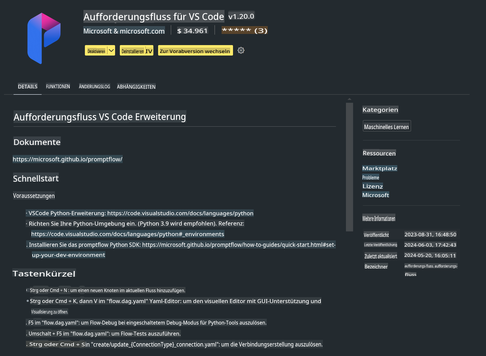

# **Lab 0 - Installation**

Wenn wir das Lab betreten, müssen wir die entsprechende Umgebung einrichten:

### **1. Python 3.11+**

Es wird empfohlen, miniforge zu verwenden, um Ihre Python-Umgebung zu konfigurieren.

Um miniforge zu konfigurieren, besuchen Sie bitte [https://github.com/conda-forge/miniforge](https://github.com/conda-forge/miniforge).

Nach der Konfiguration von miniforge führen Sie den folgenden Befehl in PowerShell aus:

```bash

conda create -n pyenv python==3.11.8 -y

conda activate pyenv

```

### **2. Prompt flow SDK installieren**

Im Lab 1 verwenden wir Prompt flow, daher müssen Sie das Prompt flow SDK einrichten.

```bash

pip install promptflow --upgrade

```

Sie können das Prompt flow SDK mit diesem Befehl überprüfen:

```bash

pf --version

```

### **3. Visual Studio Code Prompt flow Erweiterung installieren**



### **4. Apple's MLX Framework**

MLX ist ein Array-Framework für maschinelles Lernen auf Apple Silicon, entwickelt von der Apple Machine Learning Forschung. Mit dem **Apple MLX Framework** können Sie LLM / SLM auf Apple Silicon beschleunigen. Wenn Sie mehr erfahren möchten, lesen Sie bitte [https://github.com/microsoft/PhiCookBook/blob/main/md/01.Introduction/03/MLX_Inference.md](https://github.com/microsoft/PhiCookBook/blob/main/md/01.Introduction/03/MLX_Inference.md).

Installieren Sie die MLX Framework-Bibliothek in bash:

```bash

pip install mlx-lm

```

### **5. Andere Python-Bibliotheken**

Erstellen Sie eine requirements.txt-Datei und fügen Sie diesen Inhalt hinzu:

```txt

notebook
numpy 
scipy 
scikit-learn 
matplotlib 
pandas 
pillow 
graphviz

```

### **6. NVM installieren**

Installieren Sie nvm in PowerShell:

```bash

brew install nvm

```

Installieren Sie Node.js 18.20:

```bash

nvm install 18.20.0

nvm use 18.20.0

```

### **7. Visual Studio Code Entwicklungsunterstützung installieren**

```bash

npm install --global yo generator-code

```

Herzlichen Glückwunsch! Sie haben das SDK erfolgreich konfiguriert. Fahren Sie nun mit den praktischen Schritten fort.

**Haftungsausschluss**:  
Dieses Dokument wurde mit KI-gestützten maschinellen Übersetzungsdiensten übersetzt. Obwohl wir uns um Genauigkeit bemühen, beachten Sie bitte, dass automatisierte Übersetzungen Fehler oder Ungenauigkeiten enthalten können. Das Originaldokument in seiner ursprünglichen Sprache sollte als maßgebliche Quelle betrachtet werden. Für kritische Informationen wird eine professionelle menschliche Übersetzung empfohlen. Wir haften nicht für Missverständnisse oder Fehlinterpretationen, die aus der Nutzung dieser Übersetzung entstehen.