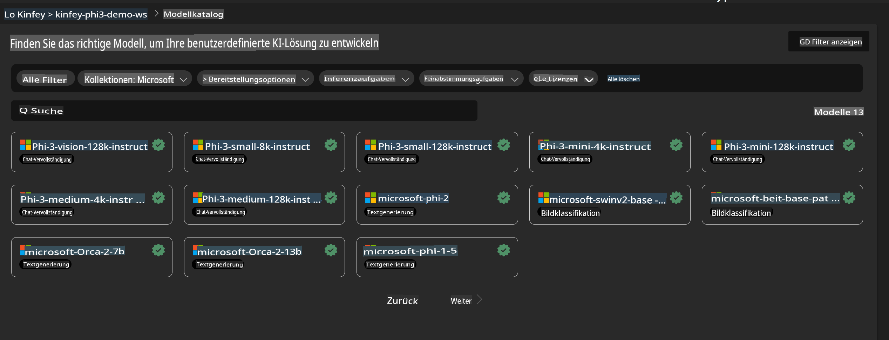
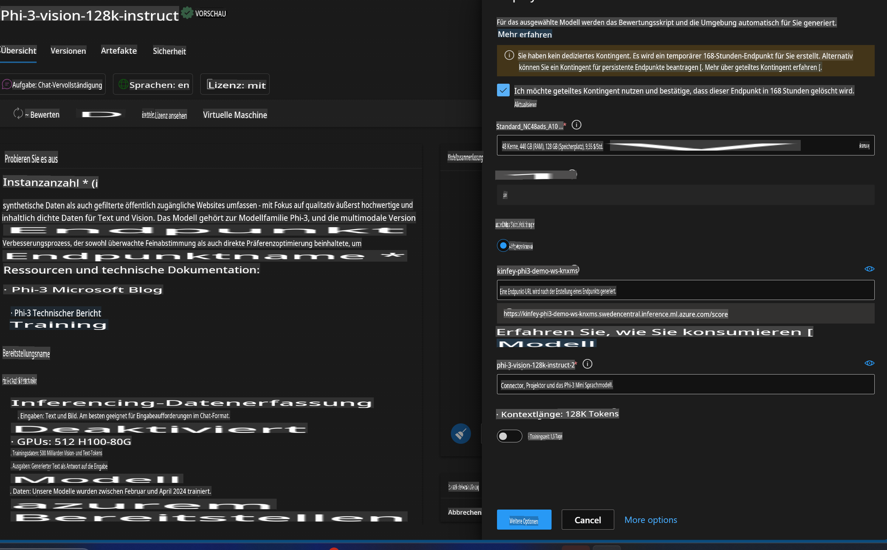
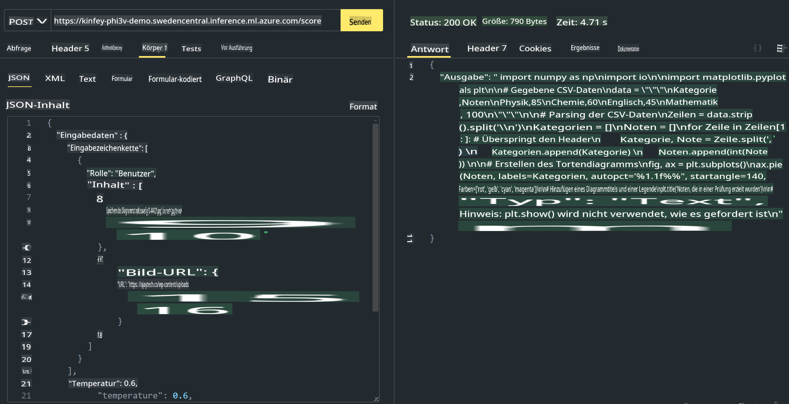

# **Lab 3 - Phi-3-Vision auf dem Azure Machine Learning Service bereitstellen**

Wir nutzen NPU, um den Produktionsbetrieb des lokalen Codes abzuschließen, und möchten anschließend die Möglichkeit einführen, PHI-3-VISION zu integrieren, um Bilder in Code umzuwandeln.

In dieser Anleitung können wir schnell einen Model-as-a-Service Phi-3 Vision-Dienst im Azure Machine Learning Service aufbauen.

***Hinweis***: Phi-3 Vision benötigt Rechenleistung, um Inhalte schneller zu generieren. Wir benötigen Cloud-Computing-Ressourcen, um dies zu ermöglichen.


### **1. Azure Machine Learning Service erstellen**

Wir müssen einen Azure Machine Learning Service im Azure-Portal erstellen. Wenn Sie erfahren möchten, wie das geht, besuchen Sie bitte diesen Link: [https://learn.microsoft.com/azure/machine-learning/quickstart-create-resources?view=azureml-api-2](https://learn.microsoft.com/azure/machine-learning/quickstart-create-resources?view=azureml-api-2)


### **2. Phi-3 Vision im Azure Machine Learning Service auswählen**




### **3. Phi-3-Vision in Azure bereitstellen**




### **4. Endpoint in Postman testen**




***Hinweis***

1. Die zu übermittelnden Parameter müssen Authorization, azureml-model-deployment und Content-Type enthalten. Sie müssen die Bereitstellungsinformationen prüfen, um diese zu erhalten.

2. Um Parameter zu übermitteln, muss Phi-3-Vision einen Bildlink übertragen. Bitte orientieren Sie sich an der Methode von GPT-4-Vision, um Parameter zu übermitteln, wie z. B.

```json

{
  "input_data":{
    "input_string":[
      {
        "role":"user",
        "content":[ 
          {
            "type": "text",
            "text": "You are a Python coding assistant.Please create Python code for image "
          },
          {
              "type": "image_url",
              "image_url": {
                "url": "https://ajaytech.co/wp-content/uploads/2019/09/index.png"
              }
          }
        ]
      }
    ],
    "parameters":{
          "temperature": 0.6,
          "top_p": 0.9,
          "do_sample": false,
          "max_new_tokens": 2048
    }
  }
}

```

3. Verwenden Sie die Post-Methode, um **/score** aufzurufen.

**Herzlichen Glückwunsch**! Sie haben die schnelle Bereitstellung von PHI-3-VISION abgeschlossen und ausprobiert, wie Sie Bilder zur Codegenerierung verwenden können. Als Nächstes können wir Anwendungen in Kombination mit NPUs und der Cloud entwickeln.

**Haftungsausschluss**:  
Dieses Dokument wurde mit KI-gestützten maschinellen Übersetzungsdiensten übersetzt. Obwohl wir uns um Genauigkeit bemühen, beachten Sie bitte, dass automatisierte Übersetzungen Fehler oder Ungenauigkeiten enthalten können. Das Originaldokument in seiner ursprünglichen Sprache sollte als maßgebliche Quelle betrachtet werden. Für kritische Informationen wird eine professionelle menschliche Übersetzung empfohlen. Wir haften nicht für Missverständnisse oder Fehlinterpretationen, die sich aus der Nutzung dieser Übersetzung ergeben.