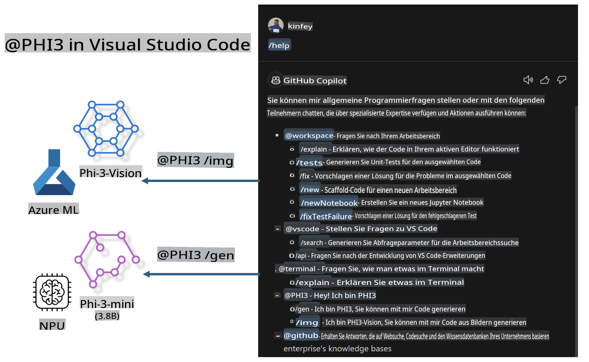

# **Erstellen Sie Ihren eigenen Visual Studio Code GitHub Copilot Chat mit der Microsoft Phi-3-Familie**

Haben Sie den Workspace-Agenten in GitHub Copilot Chat verwendet? Möchten Sie einen eigenen Code-Agenten für Ihr Team erstellen? Dieses praktische Lab zielt darauf ab, das Open-Source-Modell zu kombinieren, um einen unternehmensweiten Code-Business-Agenten zu entwickeln.

## **Grundlagen**

### **Warum Microsoft Phi-3 wählen**

Phi-3 ist eine Modellfamilie, die phi-3-mini, phi-3-small und phi-3-medium umfasst, basierend auf unterschiedlichen Trainingsparametern für Textgenerierung, Dialogvervollständigung und Codegenerierung. Es gibt auch phi-3-vision, das auf Vision basiert. Es ist ideal für Unternehmen oder verschiedene Teams, um Offline-Lösungen für generative KI zu entwickeln.

Empfohlener Link: [https://github.com/microsoft/PhiCookBook/blob/main/md/01.Introduction/01/01.PhiFamily.md](https://github.com/microsoft/PhiCookBook/blob/main/md/01.Introduction/01/01.PhiFamily.md)

### **Microsoft GitHub Copilot Chat**

Die GitHub Copilot Chat-Erweiterung bietet eine Chat-Oberfläche, mit der Sie mit GitHub Copilot interagieren und Antworten auf codingbezogene Fragen direkt in VS Code erhalten können, ohne Dokumentationen durchsuchen oder in Online-Foren suchen zu müssen.

Copilot Chat verwendet möglicherweise Syntaxhervorhebung, Einrückungen und andere Formatierungsfunktionen, um die generierten Antworten übersichtlicher zu gestalten. Je nach Benutzerfrage kann das Ergebnis Links zu Kontexten enthalten, die Copilot zur Generierung einer Antwort verwendet hat, wie z. B. Quellcodedateien oder Dokumentationen, oder Schaltflächen, um auf Funktionen von VS Code zuzugreifen.

- Copilot Chat integriert sich in Ihren Entwickler-Workflow und bietet Unterstützung, wo Sie sie benötigen:

- Starten Sie ein Inline-Chat-Gespräch direkt aus dem Editor oder Terminal, um Hilfe beim Codieren zu erhalten

- Verwenden Sie die Chat-Ansicht, um jederzeit einen KI-Assistenten an Ihrer Seite zu haben

- Starten Sie den Quick Chat, um eine schnelle Frage zu stellen und direkt weiterzuarbeiten

Sie können GitHub Copilot Chat in verschiedenen Szenarien nutzen, z. B.:

- Beantwortung von Codingfragen, wie man ein Problem am besten löst

- Erklärung von fremdem Code und Vorschläge zur Verbesserung

- Vorschläge für Codekorrekturen

- Generierung von Unit-Testfällen

- Erstellung von Codedokumentationen

Empfohlener Link: [https://code.visualstudio.com/docs/copilot/copilot-chat](https://code.visualstudio.com/docs/copilot/copilot-chat?WT.mc_id=aiml-137032-kinfeylo)

### **Microsoft GitHub Copilot Chat @workspace**

Die Referenzierung von **@workspace** in Copilot Chat ermöglicht es Ihnen, Fragen zu Ihrem gesamten Codebestand zu stellen. Basierend auf der Frage ruft Copilot intelligent relevante Dateien und Symbole ab, die es dann in seinen Antworten als Links und Codebeispiele referenziert.

Um Ihre Frage zu beantworten, durchsucht **@workspace** dieselben Quellen, die ein Entwickler verwenden würde, um in einem Codebestand in VS Code zu navigieren:

- Alle Dateien im Workspace, außer denjenigen, die durch eine .gitignore-Datei ignoriert werden

- Verzeichnisstruktur mit verschachtelten Ordner- und Dateinamen

- Den Code-Suchindex von GitHub, wenn der Workspace ein GitHub-Repository ist und durch die Codesuche indexiert wurde

- Symbole und Definitionen im Workspace

- Aktuell ausgewählter Text oder sichtbarer Text im aktiven Editor

Hinweis: .gitignore wird umgangen, wenn Sie eine Datei geöffnet haben oder Text in einer ignorierten Datei ausgewählt haben.

Empfohlener Link: [[https://code.visualstudio.com/docs/copilot/copilot-chat](https://code.visualstudio.com/docs/copilot/workspace-context?WT.mc_id=aiml-137032-kinfeylo)]

## **Mehr über dieses Lab erfahren**

GitHub Copilot hat die Programmier-Effizienz in Unternehmen stark verbessert, und jedes Unternehmen hofft, die relevanten Funktionen von GitHub Copilot anpassen zu können. Viele Unternehmen haben Erweiterungen entwickelt, die GitHub Copilot ähneln, basierend auf ihren eigenen Geschäftsszenarien und Open-Source-Modellen. Für Unternehmen sind angepasste Erweiterungen leichter zu kontrollieren, aber dies beeinträchtigt auch die Benutzererfahrung. Schließlich ist GitHub Copilot leistungsstärker, wenn es um allgemeine Szenarien und Professionalität geht. Wenn die Benutzererfahrung konsistent bleibt, wäre es besser, die eigene Erweiterung des Unternehmens anzupassen. GitHub Copilot Chat bietet relevante APIs für Unternehmen, um die Chat-Erfahrung zu erweitern. Eine konsistente Erfahrung zu gewährleisten und gleichzeitig angepasste Funktionen zu haben, bietet eine bessere Benutzererfahrung.

Dieses Lab verwendet hauptsächlich das Phi-3-Modell in Kombination mit der lokalen NPU und Azure-Hybrid, um einen benutzerdefinierten Agenten in GitHub Copilot Chat ***@PHI3*** zu erstellen, um Entwicklern in Unternehmen bei der Codegenerierung ***(@PHI3 /gen)*** und der Generierung von Code basierend auf Bildern ***(@PHI3 /img)*** zu helfen.

### ***Hinweis:*** 

Dieses Lab wird derzeit auf dem AIPC von Intel CPU und Apple Silicon implementiert. Wir werden die Qualcomm-Version der NPU weiterhin aktualisieren.

## **Lab**

| Name | Beschreibung | AIPC | Apple |
| ------------ | ----------- | -------- |-------- |
| Lab0 - Installationen(✅) | Konfigurieren und Installieren der relevanten Umgebungen und Installationstools | [Go](./HOL/AIPC/01.Installations.md) |[Go](./HOL/Apple/01.Installations.md) |
| Lab1 - Prompt Flow mit Phi-3-mini ausführen (✅) | In Kombination mit AIPC / Apple Silicon, unter Verwendung der lokalen NPU, Codegenerierung durch Phi-3-mini erstellen | [Go](./HOL/AIPC/02.PromptflowWithNPU.md) |  [Go](./HOL/Apple/02.PromptflowWithMLX.md) |
| Lab2 - Phi-3-vision auf Azure Machine Learning Service bereitstellen (✅) | Code generieren, indem das Modellkatalog-Modell Phi-3-vision des Azure Machine Learning Service bereitgestellt wird | [Go](./HOL/AIPC/03.DeployPhi3VisionOnAzure.md) |[Go](./HOL/Apple/03.DeployPhi3VisionOnAzure.md) |
| Lab3 - Einen @phi-3-Agenten in GitHub Copilot Chat erstellen (✅)  | Einen benutzerdefinierten Phi-3-Agenten in GitHub Copilot Chat erstellen, um Codegenerierung, Code aus Grafiken, RAG usw. zu erledigen | [Go](./HOL/AIPC/04.CreatePhi3AgentInVSCode.md) | [Go](./HOL/Apple/04.CreatePhi3AgentInVSCode.md) |
| Beispielcode (✅)  | Beispielcode herunterladen | [Go](../../../../../../../code/07.Lab/01/AIPC) | [Go](../../../../../../../code/07.Lab/01/Apple) |

## **Ressourcen**

1. Phi-3 Cookbook [https://github.com/microsoft/Phi-3CookBook](https://github.com/microsoft/Phi-3CookBook)

2. Mehr über GitHub Copilot erfahren [https://learn.microsoft.com/training/paths/copilot/](https://learn.microsoft.com/training/paths/copilot/?WT.mc_id=aiml-137032-kinfeylo)

3. Mehr über GitHub Copilot Chat erfahren [https://learn.microsoft.com/training/paths/accelerate-app-development-using-github-copilot/](https://learn.microsoft.com/training/paths/accelerate-app-development-using-github-copilot/?WT.mc_id=aiml-137032-kinfeylo)

4. Mehr über die GitHub Copilot Chat API erfahren [https://code.visualstudio.com/api/extension-guides/chat](https://code.visualstudio.com/api/extension-guides/chat?WT.mc_id=aiml-137032-kinfeylo)

5. Mehr über Azure AI Foundry erfahren [https://learn.microsoft.com/training/paths/create-custom-copilots-ai-studio/](https://learn.microsoft.com/training/paths/create-custom-copilots-ai-studio/?WT.mc_id=aiml-137032-kinfeylo)

6. Mehr über den Modellkatalog von Azure AI Foundry erfahren [https://learn.microsoft.com/azure/ai-studio/how-to/model-catalog-overview](https://learn.microsoft.com/azure/ai-studio/how-to/model-catalog-overview)

**Haftungsausschluss**:  
Dieses Dokument wurde mithilfe von KI-basierten maschinellen Übersetzungsdiensten übersetzt. Obwohl wir uns um Genauigkeit bemühen, beachten Sie bitte, dass automatisierte Übersetzungen Fehler oder Ungenauigkeiten enthalten können. Das Originaldokument in seiner ursprünglichen Sprache sollte als maßgebliche Quelle betrachtet werden. Für kritische Informationen wird eine professionelle menschliche Übersetzung empfohlen. Wir übernehmen keine Haftung für Missverständnisse oder Fehlinterpretationen, die aus der Nutzung dieser Übersetzung entstehen.