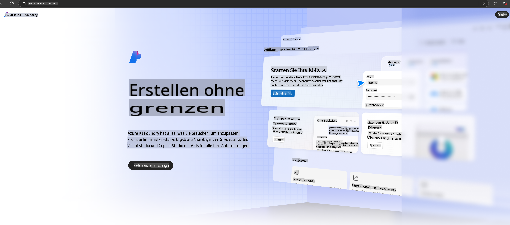

# **Verwendung von Phi-3 in Azure AI Foundry**

Mit der Entwicklung von Generativer KI streben wir an, eine einheitliche Plattform zu nutzen, um verschiedene LLMs und SLMs, die Integration von Unternehmensdaten, Feinabstimmungs-/RAG-Operationen und die Bewertung verschiedener Unternehmensbereiche nach der Integration von LLMs und SLMs zu verwalten. So können intelligente Anwendungen der Generativen KI besser umgesetzt werden. [Azure AI Foundry](https://ai.azure.com) ist eine unternehmensgerechte Plattform für generative KI-Anwendungen.

Mit Azure AI Foundry können Sie Antworten von großen Sprachmodellen (LLMs) bewerten und Komponenten für Anwendungen mit Prompt Flow orchestrieren, um eine bessere Leistung zu erzielen. Die Plattform erleichtert die Skalierbarkeit, um Prototypen mühelos in vollwertige Produktionslösungen zu überführen. Kontinuierliches Monitoring und Verfeinerung sichern langfristigen Erfolg.

Wir können das Phi-3-Modell mit wenigen einfachen Schritten schnell auf Azure AI Foundry bereitstellen und anschließend Azure AI Foundry nutzen, um Phi-3-bezogene Aufgaben wie Playground/Chat, Feinabstimmung, Bewertung und mehr durchzuführen.

## **1. Vorbereitung**

Wenn Sie bereits über die [Azure Developer CLI](https://learn.microsoft.com/azure/developer/azure-developer-cli/overview?WT.mc_id=aiml-138114-kinfeylo) auf Ihrem Rechner verfügen, ist die Verwendung dieser Vorlage so einfach wie das Ausführen dieses Befehls in einem neuen Verzeichnis.

## Manuelle Erstellung

Das Erstellen eines Microsoft Azure AI Foundry-Projekts und -Hubs ist eine großartige Möglichkeit, Ihre KI-Arbeit zu organisieren und zu verwalten. Hier ist eine Schritt-für-Schritt-Anleitung, um Ihnen den Einstieg zu erleichtern:

### Erstellen eines Projekts in Azure AI Foundry

1. **Gehen Sie zu Azure AI Foundry**: Melden Sie sich im Azure AI Foundry-Portal an.
2. **Erstellen Sie ein Projekt**:
   - Wenn Sie sich in einem Projekt befinden, wählen Sie oben links auf der Seite "Azure AI Foundry", um zur Startseite zu gelangen.
   - Wählen Sie "+ Projekt erstellen".
   - Geben Sie einen Namen für das Projekt ein.
   - Wenn Sie über einen Hub verfügen, wird dieser standardmäßig ausgewählt. Wenn Sie Zugriff auf mehr als einen Hub haben, können Sie einen anderen aus der Dropdown-Liste auswählen. Wenn Sie einen neuen Hub erstellen möchten, wählen Sie "Neuen Hub erstellen" und geben Sie einen Namen ein.
   - Wählen Sie "Erstellen".

### Erstellen eines Hubs in Azure AI Foundry

1. **Gehen Sie zu Azure AI Foundry**: Melden Sie sich mit Ihrem Azure-Konto an.
2. **Erstellen Sie einen Hub**:
   - Wählen Sie das Verwaltungszentrum im linken Menü.
   - Wählen Sie "Alle Ressourcen" und dann den Pfeil neben "+ Neues Projekt" und wählen Sie "+ Neuen Hub".
   - Geben Sie im Dialogfeld "Einen neuen Hub erstellen" einen Namen für Ihren Hub ein (z. B. contoso-hub) und passen Sie die anderen Felder nach Wunsch an.
   - Wählen Sie "Weiter", überprüfen Sie die Informationen und klicken Sie dann auf "Erstellen".

Für detailliertere Anweisungen können Sie die offizielle [Microsoft-Dokumentation](https://learn.microsoft.com/azure/ai-studio/how-to/create-projects) konsultieren.

Nach erfolgreicher Erstellung können Sie über [ai.azure.com](https://ai.azure.com/) auf das erstellte Studio zugreifen.

Auf einer AI Foundry können mehrere Projekte existieren. Erstellen Sie ein Projekt in AI Foundry, um die Vorbereitung abzuschließen.

Erstellen Sie Azure AI Foundry [QuickStarts](https://learn.microsoft.com/azure/ai-studio/quickstarts/get-started-code).

## **2. Bereitstellen eines Phi-Modells in Azure AI Foundry**

Klicken Sie auf die Option "Erkunden" des Projekts, um den Modellkatalog zu öffnen, und wählen Sie Phi-3 aus.

Wählen Sie Phi-3-mini-4k-instruct.

Klicken Sie auf 'Bereitstellen', um das Modell Phi-3-mini-4k-instruct bereitzustellen.

> [!NOTE]
>
> Sie können die Rechenleistung bei der Bereitstellung auswählen.

## **3. Playground-Chat mit Phi in Azure AI Foundry**

Gehen Sie zur Bereitstellungsseite, wählen Sie Playground aus und chatten Sie mit Phi-3 in Azure AI Foundry.

## **4. Bereitstellung des Modells aus Azure AI Foundry**

Um ein Modell aus dem Azure-Modellkatalog bereitzustellen, können Sie folgende Schritte ausführen:

- Melden Sie sich bei Azure AI Foundry an.
- Wählen Sie das Modell, das Sie bereitstellen möchten, aus dem Modellkatalog von Azure AI Foundry aus.
- Wählen Sie auf der Detailseite des Modells "Bereitstellen" und dann "Serverless API mit Azure AI Content Safety".
- Wählen Sie das Projekt aus, in dem Sie Ihre Modelle bereitstellen möchten. Um das Serverless API-Angebot zu nutzen, muss Ihr Workspace in der Region East US 2 oder Schweden Central liegen. Sie können den Bereitstellungsnamen anpassen.
- Im Bereitstellungsassistenten wählen Sie "Preise und Bedingungen", um sich über die Preise und Nutzungsbedingungen zu informieren.
- Wählen Sie "Bereitstellen". Warten Sie, bis die Bereitstellung abgeschlossen ist und Sie zur Seite "Bereitstellungen" weitergeleitet werden.
- Wählen Sie "Im Playground öffnen", um mit dem Modell zu interagieren.
- Sie können jederzeit zur Seite "Bereitstellungen" zurückkehren, die Bereitstellung auswählen und die Ziel-URL des Endpunkts sowie den Geheimschlüssel notieren, mit denen Sie die Bereitstellung aufrufen und Ergebnisse generieren können.
- Sie finden die Details des Endpunkts, die URL und die Zugriffsschlüssel jederzeit, indem Sie zum Tab "Erstellen" navigieren und unter "Komponenten" "Bereitstellungen" auswählen.

> [!NOTE]
> Bitte beachten Sie, dass Ihr Konto über die Azure AI Developer-Rollenberechtigungen für die Ressourcengruppe verfügen muss, um diese Schritte auszuführen.

## **5. Nutzung der Phi-API in Azure AI Foundry**

Sie können über Postman GET auf https://{Ihr Projektname}.region.inference.ml.azure.com/swagger.json zugreifen und in Kombination mit dem Schlüssel die bereitgestellten Schnittstellen kennenlernen.

Sie können die Anfrageparameter sowie die Antwortparameter sehr bequem einsehen.

**Haftungsausschluss**:  
Dieses Dokument wurde mithilfe von KI-gestützten maschinellen Übersetzungsdiensten übersetzt. Obwohl wir uns um Genauigkeit bemühen, weisen wir darauf hin, dass automatisierte Übersetzungen Fehler oder Ungenauigkeiten enthalten können. Das Originaldokument in seiner ursprünglichen Sprache sollte als maßgebliche Quelle betrachtet werden. Für kritische Informationen wird eine professionelle menschliche Übersetzung empfohlen. Wir übernehmen keine Haftung für Missverständnisse oder Fehlinterpretationen, die aus der Nutzung dieser Übersetzung entstehen.