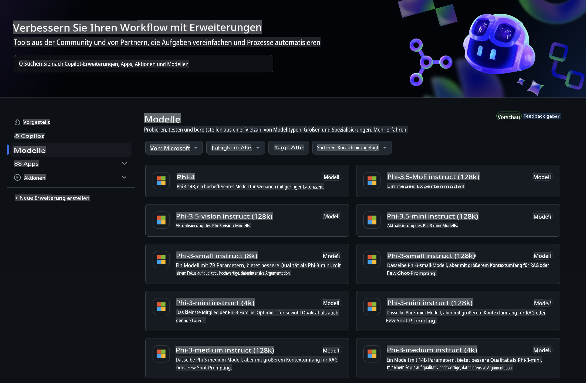
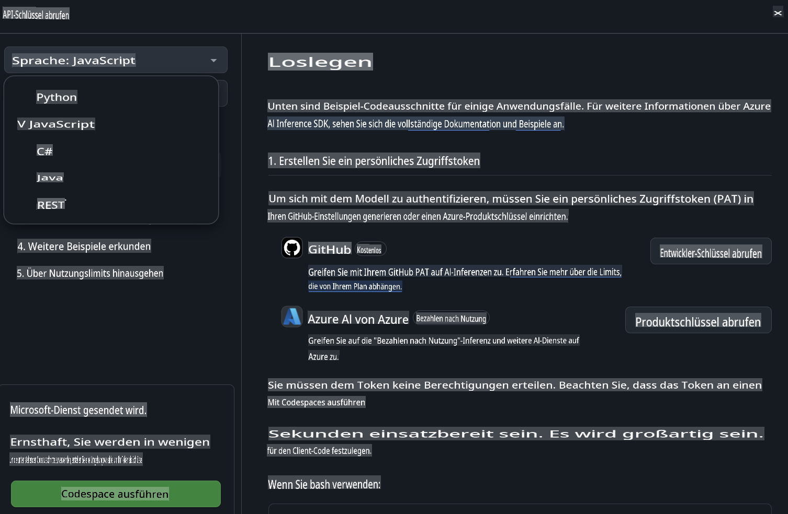

## GitHub-Modelle – Öffentliche Beta mit eingeschränktem Zugang

Willkommen bei [GitHub-Modelle](https://github.com/marketplace/models)! Wir haben alles vorbereitet, damit Sie die auf Azure AI gehosteten KI-Modelle erkunden können.



Weitere Informationen zu den auf GitHub-Modelle verfügbaren Modellen finden Sie im [GitHub Model Marketplace](https://github.com/marketplace/models).

## Verfügbare Modelle

Jedes Modell verfügt über eine eigene Testumgebung und Beispielcode.


### Phi-3-Modelle im GitHub-Modellkatalog

[Phi-3-Medium-128k-Instruct](https://github.com/marketplace/models/azureml/Phi-3-medium-128k-instruct)

[Phi-3-medium-4k-instruct](https://github.com/marketplace/models/azureml/Phi-3-medium-4k-instruct)

[Phi-3-mini-128k-instruct](https://github.com/marketplace/models/azureml/Phi-3-mini-128k-instruct)

[Phi-3-mini-4k-instruct](https://github.com/marketplace/models/azureml/Phi-3-mini-4k-instruct)

[Phi-3-small-128k-instruct](https://github.com/marketplace/models/azureml/Phi-3-small-128k-instruct)

[Phi-3-small-8k-instruct](https://github.com/marketplace/models/azureml/Phi-3-small-8k-instruct)

## Erste Schritte

Es gibt einige grundlegende Beispiele, die Sie sofort ausprobieren können. Sie finden diese im Samples-Verzeichnis. Wenn Sie direkt mit Ihrer bevorzugten Programmiersprache beginnen möchten, stehen Beispiele in den folgenden Sprachen zur Verfügung:

- Python  
- JavaScript  
- cURL  

Es gibt auch eine spezielle Codespaces-Umgebung, um die Beispiele und Modelle auszuführen.



## Beispielcode

Unten finden Sie Beispielcodes für einige Anwendungsfälle. Weitere Informationen zur Azure AI Inference SDK finden Sie in der vollständigen Dokumentation und den Beispielen.

## Einrichtung

1. Erstellen Sie ein persönliches Zugriffstoken  
   Sie müssen dem Token keine Berechtigungen zuweisen. Beachten Sie, dass das Token an einen Microsoft-Dienst gesendet wird.

Um die folgenden Codebeispiele zu verwenden, erstellen Sie eine Umgebungsvariable, um Ihr Token als Schlüssel für den Client-Code festzulegen.

Wenn Sie bash verwenden:  
```
export GITHUB_TOKEN="<your-github-token-goes-here>"
```  
Wenn Sie PowerShell verwenden:  

```
$Env:GITHUB_TOKEN="<your-github-token-goes-here>"
```  

Wenn Sie die Windows-Eingabeaufforderung verwenden:  

```
set GITHUB_TOKEN=<your-github-token-goes-here>
```  

## Python-Beispiel

### Abhängigkeiten installieren  
Installieren Sie das Azure AI Inference SDK mit pip (Erforderlich: Python >=3.8):  

```
pip install azure-ai-inference
```  

### Ein einfaches Codebeispiel ausführen  

Dieses Beispiel zeigt einen grundlegenden Aufruf der Chat Completion API. Es nutzt den GitHub AI-Modell-Inferenz-Endpunkt und Ihr GitHub-Token. Der Aufruf ist synchron.  

```
import os
from azure.ai.inference import ChatCompletionsClient
from azure.ai.inference.models import SystemMessage, UserMessage
from azure.core.credentials import AzureKeyCredential

endpoint = "https://models.inference.ai.azure.com"
# Replace Model_Name 
model_name = "Phi-3-small-8k-instruct"
token = os.environ["GITHUB_TOKEN"]

client = ChatCompletionsClient(
    endpoint=endpoint,
    credential=AzureKeyCredential(token),
)

response = client.complete(
    messages=[
        SystemMessage(content="You are a helpful assistant."),
        UserMessage(content="What is the capital of France?"),
    ],
    model=model_name,
    temperature=1.,
    max_tokens=1000,
    top_p=1.
)

print(response.choices[0].message.content)
```  

### Ein mehrstufiges Gespräch führen  

Dieses Beispiel zeigt ein mehrstufiges Gespräch mit der Chat Completion API. Wenn Sie das Modell für eine Chat-Anwendung verwenden, müssen Sie den Verlauf des Gesprächs verwalten und die neuesten Nachrichten an das Modell senden.  

```
import os
from azure.ai.inference import ChatCompletionsClient
from azure.ai.inference.models import AssistantMessage, SystemMessage, UserMessage
from azure.core.credentials import AzureKeyCredential

token = os.environ["GITHUB_TOKEN"]
endpoint = "https://models.inference.ai.azure.com"
# Replace Model_Name
model_name = "Phi-3-small-8k-instruct"

client = ChatCompletionsClient(
    endpoint=endpoint,
    credential=AzureKeyCredential(token),
)

messages = [
    SystemMessage(content="You are a helpful assistant."),
    UserMessage(content="What is the capital of France?"),
    AssistantMessage(content="The capital of France is Paris."),
    UserMessage(content="What about Spain?"),
]

response = client.complete(messages=messages, model=model_name)

print(response.choices[0].message.content)
```  

### Ausgabe streamen  

Für eine bessere Benutzererfahrung möchten Sie die Antwort des Modells streamen, sodass das erste Token früh angezeigt wird und Sie nicht auf lange Antworten warten müssen.  

```
import os
from azure.ai.inference import ChatCompletionsClient
from azure.ai.inference.models import SystemMessage, UserMessage
from azure.core.credentials import AzureKeyCredential

token = os.environ["GITHUB_TOKEN"]
endpoint = "https://models.inference.ai.azure.com"
# Replace Model_Name
model_name = "Phi-3-small-8k-instruct"

client = ChatCompletionsClient(
    endpoint=endpoint,
    credential=AzureKeyCredential(token),
)

response = client.complete(
    stream=True,
    messages=[
        SystemMessage(content="You are a helpful assistant."),
        UserMessage(content="Give me 5 good reasons why I should exercise every day."),
    ],
    model=model_name,
)

for update in response:
    if update.choices:
        print(update.choices[0].delta.content or "", end="")

client.close()
```  

## JavaScript

### Abhängigkeiten installieren  

Installieren Sie Node.js.  

Kopieren Sie die folgenden Zeilen und speichern Sie sie als Datei package.json in Ihrem Ordner.  

```
{
  "type": "module",
  "dependencies": {
    "@azure-rest/ai-inference": "latest",
    "@azure/core-auth": "latest",
    "@azure/core-sse": "latest"
  }
}
```  

Hinweis: @azure/core-sse wird nur benötigt, wenn Sie die Chat Completion-Antwort streamen.  

Öffnen Sie ein Terminalfenster in diesem Ordner und führen Sie npm install aus.  

Für jedes der untenstehenden Codebeispiele kopieren Sie den Inhalt in eine Datei sample.js und führen Sie diese mit node sample.js aus.  

### Ein einfaches Codebeispiel ausführen  

Dieses Beispiel zeigt einen grundlegenden Aufruf der Chat Completion API. Es nutzt den GitHub AI-Modell-Inferenz-Endpunkt und Ihr GitHub-Token. Der Aufruf ist synchron.  

```
import ModelClient from "@azure-rest/ai-inference";
import { AzureKeyCredential } from "@azure/core-auth";

const token = process.env["GITHUB_TOKEN"];
const endpoint = "https://models.inference.ai.azure.com";
// Update your modelname
const modelName = "Phi-3-small-8k-instruct";

export async function main() {

  const client = new ModelClient(endpoint, new AzureKeyCredential(token));

  const response = await client.path("/chat/completions").post({
    body: {
      messages: [
        { role:"system", content: "You are a helpful assistant." },
        { role:"user", content: "What is the capital of France?" }
      ],
      model: modelName,
      temperature: 1.,
      max_tokens: 1000,
      top_p: 1.
    }
  });

  if (response.status !== "200") {
    throw response.body.error;
  }
  console.log(response.body.choices[0].message.content);
}

main().catch((err) => {
  console.error("The sample encountered an error:", err);
});
```  

### Ein mehrstufiges Gespräch führen  

Dieses Beispiel zeigt ein mehrstufiges Gespräch mit der Chat Completion API. Wenn Sie das Modell für eine Chat-Anwendung verwenden, müssen Sie den Verlauf des Gesprächs verwalten und die neuesten Nachrichten an das Modell senden.  

```
import ModelClient from "@azure-rest/ai-inference";
import { AzureKeyCredential } from "@azure/core-auth";

const token = process.env["GITHUB_TOKEN"];
const endpoint = "https://models.inference.ai.azure.com";
// Update your modelname
const modelName = "Phi-3-small-8k-instruct";

export async function main() {

  const client = new ModelClient(endpoint, new AzureKeyCredential(token));

  const response = await client.path("/chat/completions").post({
    body: {
      messages: [
        { role: "system", content: "You are a helpful assistant." },
        { role: "user", content: "What is the capital of France?" },
        { role: "assistant", content: "The capital of France is Paris." },
        { role: "user", content: "What about Spain?" },
      ],
      model: modelName,
    }
  });

  if (response.status !== "200") {
    throw response.body.error;
  }

  for (const choice of response.body.choices) {
    console.log(choice.message.content);
  }
}

main().catch((err) => {
  console.error("The sample encountered an error:", err);
});
```  

### Ausgabe streamen  
Für eine bessere Benutzererfahrung möchten Sie die Antwort des Modells streamen, sodass das erste Token früh angezeigt wird und Sie nicht auf lange Antworten warten müssen.  

```
import ModelClient from "@azure-rest/ai-inference";
import { AzureKeyCredential } from "@azure/core-auth";
import { createSseStream } from "@azure/core-sse";

const token = process.env["GITHUB_TOKEN"];
const endpoint = "https://models.inference.ai.azure.com";
// Update your modelname
const modelName = "Phi-3-small-8k-instruct";

export async function main() {

  const client = new ModelClient(endpoint, new AzureKeyCredential(token));

  const response = await client.path("/chat/completions").post({
    body: {
      messages: [
        { role: "system", content: "You are a helpful assistant." },
        { role: "user", content: "Give me 5 good reasons why I should exercise every day." },
      ],
      model: modelName,
      stream: true
    }
  }).asNodeStream();

  const stream = response.body;
  if (!stream) {
    throw new Error("The response stream is undefined");
  }

  if (response.status !== "200") {
    stream.destroy();
    throw new Error(`Failed to get chat completions, http operation failed with ${response.status} code`);
  }

  const sseStream = createSseStream(stream);

  for await (const event of sseStream) {
    if (event.data === "[DONE]") {
      return;
    }
    for (const choice of (JSON.parse(event.data)).choices) {
        process.stdout.write(choice.delta?.content ?? ``);
    }
  }
}

main().catch((err) => {
  console.error("The sample encountered an error:", err);
});
```  

## REST

### Ein einfaches Codebeispiel ausführen  

Fügen Sie das Folgende in eine Shell ein:  

```
curl -X POST "https://models.inference.ai.azure.com/chat/completions" \
    -H "Content-Type: application/json" \
    -H "Authorization: Bearer $GITHUB_TOKEN" \
    -d '{
        "messages": [
            {
                "role": "system",
                "content": "You are a helpful assistant."
            },
            {
                "role": "user",
                "content": "What is the capital of France?"
            }
        ],
        "model": "Phi-3-small-8k-instruct"
    }'
```  

### Ein mehrstufiges Gespräch führen  

Rufen Sie die Chat Completion API auf und übergeben Sie den Chat-Verlauf:  

```
curl -X POST "https://models.inference.ai.azure.com/chat/completions" \
    -H "Content-Type: application/json" \
    -H "Authorization: Bearer $GITHUB_TOKEN" \
    -d '{
        "messages": [
            {
                "role": "system",
                "content": "You are a helpful assistant."
            },
            {
                "role": "user",
                "content": "What is the capital of France?"
            },
            {
                "role": "assistant",
                "content": "The capital of France is Paris."
            },
            {
                "role": "user",
                "content": "What about Spain?"
            }
        ],
        "model": "Phi-3-small-8k-instruct"
    }'
```  

### Ausgabe streamen  

Dies ist ein Beispiel für den Aufruf des Endpunkts und das Streamen der Antwort.  

```
curl -X POST "https://models.inference.ai.azure.com/chat/completions" \
    -H "Content-Type: application/json" \
    -H "Authorization: Bearer $GITHUB_TOKEN" \
    -d '{
        "messages": [
            {
                "role": "system",
                "content": "You are a helpful assistant."
            },
            {
                "role": "user",
                "content": "Give me 5 good reasons why I should exercise every day."
            }
        ],
        "stream": true,
        "model": "Phi-3-small-8k-instruct"
    }'
```  

## KOSTENLOSE Nutzung und Nutzungslimits für GitHub-Modelle  


Die [Nutzungslimits für die Testumgebung und die kostenlose API-Nutzung](https://docs.github.com/en/github-models/prototyping-with-ai-models#rate-limits) sollen Ihnen helfen, Modelle auszuprobieren und Ihre KI-Anwendung zu prototypisieren. Für die Nutzung über diese Limits hinaus und um Ihre Anwendung zu skalieren, müssen Sie Ressourcen über ein Azure-Konto bereitstellen und sich von dort aus authentifizieren, anstatt Ihr GitHub-Personal-Access-Token zu verwenden. Sie müssen sonst nichts in Ihrem Code ändern. Verwenden Sie diesen Link, um zu erfahren, wie Sie die Limits des kostenlosen Tiers in Azure AI überschreiten können.

### Hinweise  

Denken Sie daran, dass Sie beim Interagieren mit einem Modell mit KI experimentieren, sodass inhaltliche Fehler möglich sind.  

Die Funktion unterliegt verschiedenen Einschränkungen (einschließlich Anfragen pro Minute, Anfragen pro Tag, Token pro Anfrage und gleichzeitige Anfragen) und ist nicht für produktive Anwendungsfälle ausgelegt.  

GitHub-Modelle nutzt Azure AI Content Safety. Diese Filter können im Rahmen der GitHub-Modelle-Erfahrung nicht deaktiviert werden. Wenn Sie Modelle über einen kostenpflichtigen Dienst einsetzen, konfigurieren Sie bitte Ihre Inhaltsfilter entsprechend Ihren Anforderungen.  

Dieser Dienst unterliegt den Pre-Release-Bedingungen von GitHub.  

**Haftungsausschluss**:  
Dieses Dokument wurde mit KI-gestützten maschinellen Übersetzungsdiensten übersetzt. Obwohl wir uns um Genauigkeit bemühen, beachten Sie bitte, dass automatisierte Übersetzungen Fehler oder Ungenauigkeiten enthalten können. Das Originaldokument in seiner ursprünglichen Sprache sollte als maßgebliche Quelle betrachtet werden. Für kritische Informationen wird eine professionelle menschliche Übersetzung empfohlen. Wir haften nicht für Missverständnisse oder Fehlinterpretationen, die sich aus der Nutzung dieser Übersetzung ergeben.