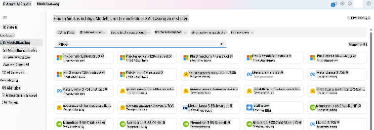
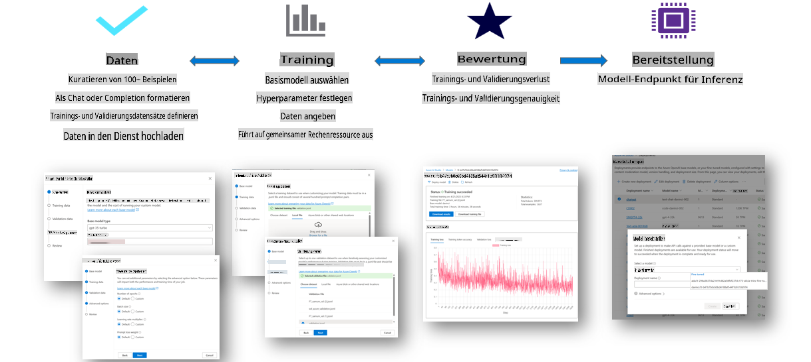
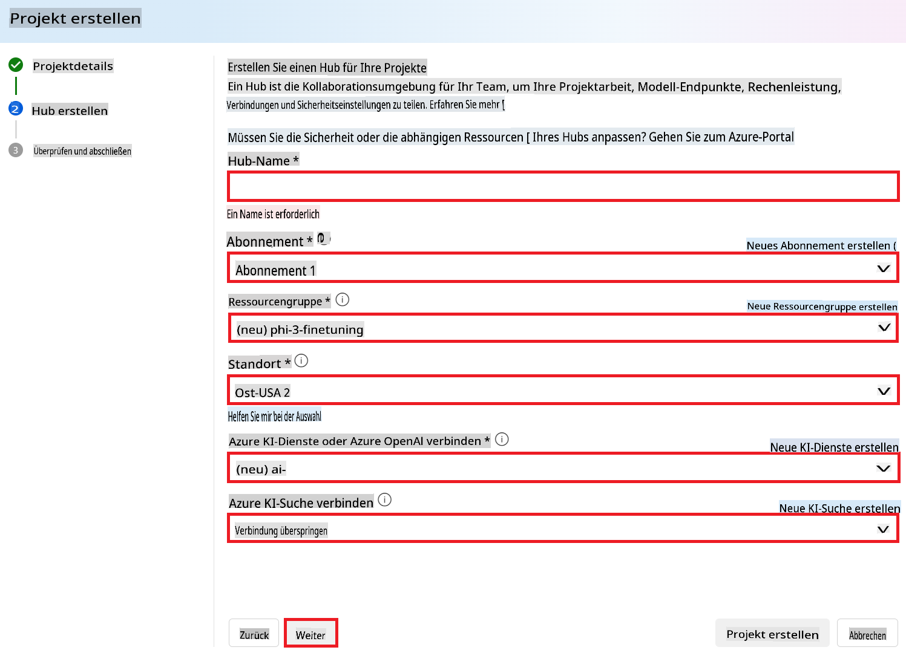
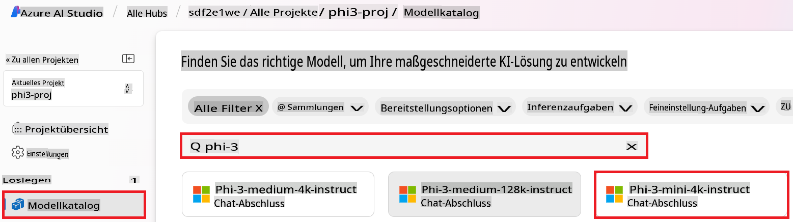
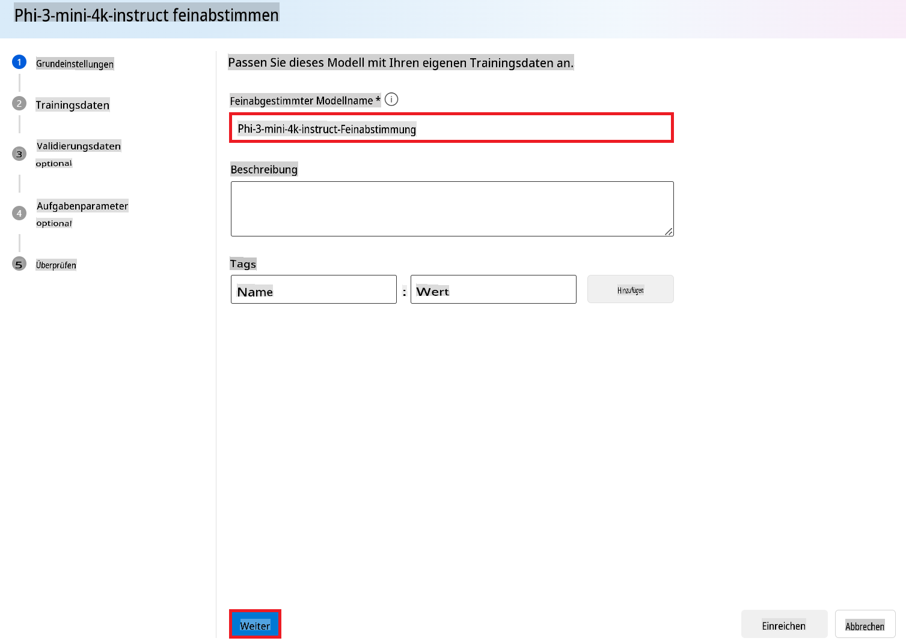
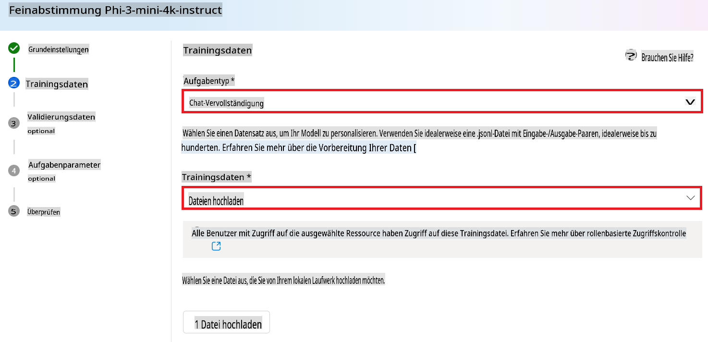
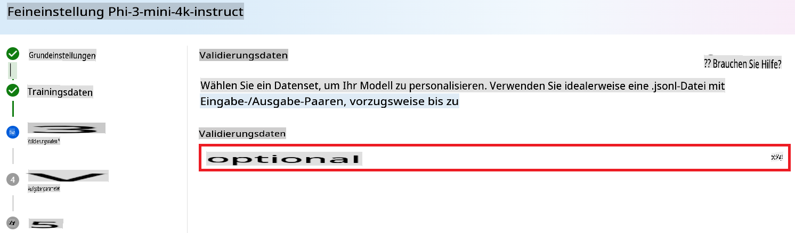
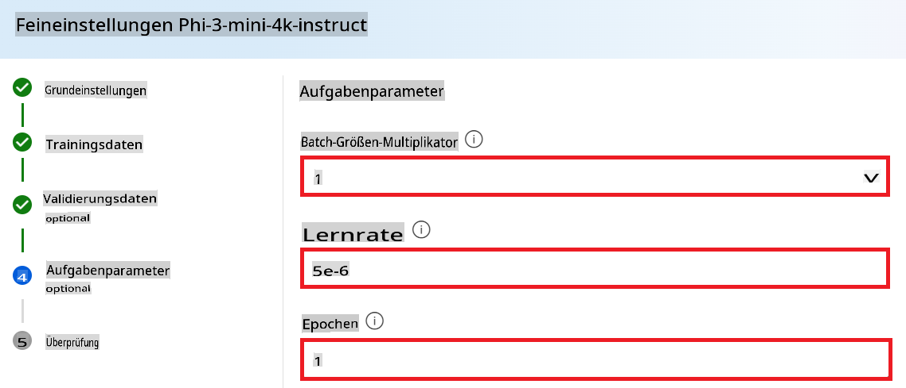
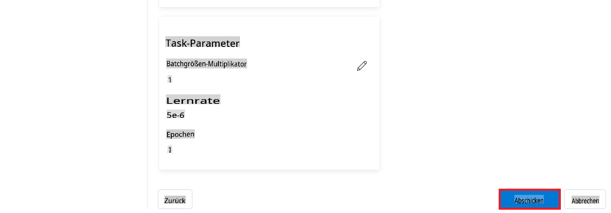
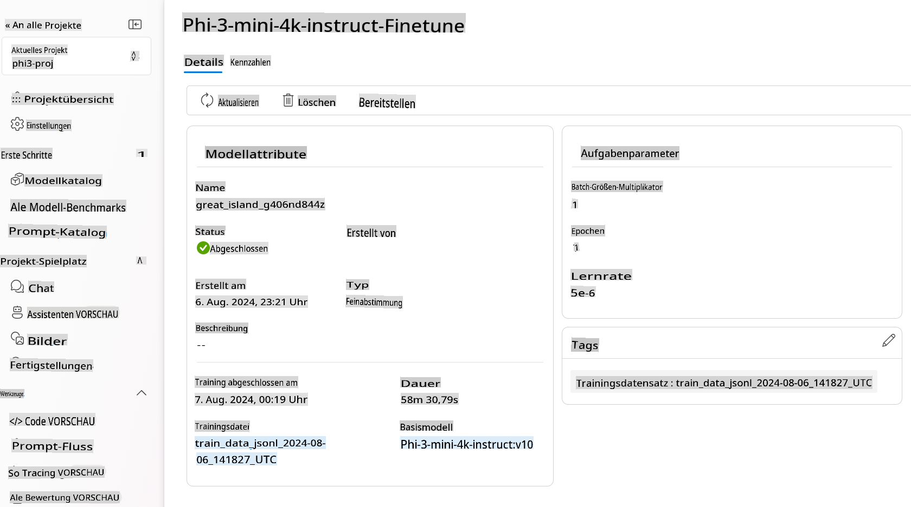

# Feinabstimmung von Phi-3 mit Azure AI Foundry

Lassen Sie uns erkunden, wie Microsofts Phi-3 Mini Sprachmodell mithilfe von Azure AI Foundry feinabgestimmt werden kann. Feinabstimmung ermöglicht es, Phi-3 Mini an spezifische Aufgaben anzupassen, wodurch es noch leistungsfähiger und kontextbewusster wird.

## Überlegungen

- **Fähigkeiten:** Welche Modelle können feinabgestimmt werden? Wozu kann das Basismodell angepasst werden?
- **Kosten:** Wie sieht das Preismodell für die Feinabstimmung aus?
- **Anpassbarkeit:** In welchem Umfang kann ich das Basismodell ändern – und auf welche Weise?
- **Bequemlichkeit:** Wie läuft die Feinabstimmung ab – muss ich benutzerdefinierten Code schreiben? Muss ich eigene Rechenressourcen bereitstellen?
- **Sicherheit:** Feinabgestimmte Modelle können Sicherheitsrisiken bergen – gibt es Schutzmaßnahmen, um unbeabsichtigten Schaden zu vermeiden?



## Vorbereitung zur Feinabstimmung

### Voraussetzungen

> [!NOTE]
> Für Modelle der Phi-3-Familie ist das Pay-as-you-go-Modell zur Feinabstimmung nur in Hubs verfügbar, die in der Region **East US 2** erstellt wurden.

- Ein Azure-Abonnement. Falls Sie noch kein Azure-Abonnement besitzen, erstellen Sie ein [kostenpflichtiges Azure-Konto](https://azure.microsoft.com/pricing/purchase-options/pay-as-you-go), um zu beginnen.

- Ein [AI Foundry-Projekt](https://ai.azure.com?WT.mc_id=aiml-138114-kinfeylo).
- Azure-Rollenbasierte Zugriffssteuerungen (Azure RBAC) werden verwendet, um Zugriff auf Vorgänge in Azure AI Foundry zu gewähren. Um die Schritte in diesem Artikel auszuführen, muss Ihrem Benutzerkonto die Rolle __Azure AI Developer__ für die Ressourcengruppe zugewiesen sein.

### Registrierung des Abonnementanbieters

Überprüfen Sie, ob das Abonnement beim Ressourcendiensteanbieter `Microsoft.Network` registriert ist.

1. Melden Sie sich beim [Azure-Portal](https://portal.azure.com) an.
1. Wählen Sie **Abonnements** aus dem linken Menü.
1. Wählen Sie das Abonnement aus, das Sie verwenden möchten.
1. Wählen Sie **AI-Projekteinstellungen** > **Ressourcenanbieter** aus dem linken Menü.
1. Stellen Sie sicher, dass **Microsoft.Network** in der Liste der Ressourcenanbieter enthalten ist. Falls nicht, fügen Sie es hinzu.

### Datenvorbereitung

Bereiten Sie Ihre Trainings- und Validierungsdaten vor, um Ihr Modell zu feinabstimmen. Ihre Trainings- und Validierungsdatensätze bestehen aus Eingabe- und Ausgabebeispielen, die zeigen, wie das Modell funktionieren soll.

Stellen Sie sicher, dass alle Ihre Trainingsbeispiele dem erwarteten Format für Inferenz entsprechen. Um Modelle effektiv feinabzustimmen, sorgen Sie für einen ausgewogenen und vielfältigen Datensatz.

Das bedeutet, Datenbalance zu wahren, verschiedene Szenarien einzubeziehen und Trainingsdaten regelmäßig zu verfeinern, um sie an reale Erwartungen anzupassen. Dies führt letztendlich zu genaueren und ausgewogeneren Modellantworten.

Verschiedene Modelltypen erfordern unterschiedliche Formate der Trainingsdaten.

### Chat Completion

Die von Ihnen verwendeten Trainings- und Validierungsdaten **müssen** im JSON Lines (JSONL)-Format vorliegen. Für `Phi-3-mini-128k-instruct` muss der Feinabstimmungsdatensatz im Konversationsformat vorliegen, das von der Chat Completions API verwendet wird.

### Beispiel-Dateiformat

```json
    {"messages": [{"role": "system", "content": "You are an Xbox customer support agent whose primary goal is to help users with issues they are experiencing with their Xbox devices. You are friendly and concise. You only provide factual answers to queries, and do not provide answers that are not related to Xbox."}, {"role": "user", "content": "Is Xbox better than PlayStation?"}, {"role": "assistant", "content": "I apologize, but I cannot provide personal opinions. My primary job is to assist you with any issues related to your Xbox device. Do you have any Xbox-related issues that need addressing?"}]}
    {"messages": [{"role": "system", "content": "You are an Xbox customer support agent whose primary goal is to help users with issues they are experiencing with their Xbox devices. You are friendly and concise. You only provide factual answers to queries, and do not provide answers that are not related to Xbox."}, {"role": "user", "content": "Can I play PC games on my Xbox?"}, {"role": "assistant", "content": "While Xbox consoles don't natively support PC games, they can play an array of Xbox games, many of which are also available on PC. Can I assist you with finding games compatible with your Xbox device?"}]}
    {"messages": [{"role": "system", "content": "You are an Xbox customer support agent whose primary goal is to help users with issues they are experiencing with their Xbox devices. You are friendly and concise. You only provide factual answers to queries, and do not provide answers that are not related to Xbox."}, {"role": "user", "content": "I'm having trouble connecting my Xbox to the Wi-Fi."}, {"role": "assistant", "content": "No worries, let's go through the network settings on your Xbox. Can you please tell me what happens when you try to connect it to the Wi-Fi?"}]}
```

Das unterstützte Dateiformat ist JSON Lines. Dateien werden in den Standard-Datenspeicher hochgeladen und in Ihrem Projekt verfügbar gemacht.

## Feinabstimmung von Phi-3 mit Azure AI Foundry

Azure AI Foundry ermöglicht es Ihnen, große Sprachmodelle durch Feinabstimmung an Ihre eigenen Datensätze anzupassen. Feinabstimmung bietet erheblichen Mehrwert, indem sie Anpassung und Optimierung für spezifische Aufgaben und Anwendungen ermöglicht. Dies führt zu verbesserter Leistung, Kosteneffizienz, reduzierter Latenz und maßgeschneiderten Ergebnissen.



### Ein neues Projekt erstellen

1. Melden Sie sich bei [Azure AI Foundry](https://ai.azure.com) an.

1. Wählen Sie **+Neues Projekt**, um ein neues Projekt in Azure AI Foundry zu erstellen.

    

1. Führen Sie die folgenden Aufgaben aus:

    - Projekt **Hub-Name**. Dieser muss ein eindeutiger Wert sein.
    - Wählen Sie den **Hub**, den Sie verwenden möchten (erstellen Sie bei Bedarf einen neuen).

    

1. Führen Sie die folgenden Aufgaben aus, um einen neuen Hub zu erstellen:

    - Geben Sie **Hub-Name** ein. Dieser muss ein eindeutiger Wert sein.
    - Wählen Sie Ihr Azure-**Abonnement**.
    - Wählen Sie die zu verwendende **Ressourcengruppe** (erstellen Sie bei Bedarf eine neue).
    - Wählen Sie den gewünschten **Standort** aus.
    - Wählen Sie **Azure AI Services verbinden**, um die zu verwendenden Dienste zu verbinden (erstellen Sie bei Bedarf neue).
    - Wählen Sie **Azure AI Search verbinden**, um **Verbindung überspringen** auszuwählen.

    

1. Wählen Sie **Weiter**.
1. Wählen Sie **Projekt erstellen**.

### Datenvorbereitung

Bevor Sie mit der Feinabstimmung beginnen, sammeln oder erstellen Sie einen Datensatz, der für Ihre Aufgabe relevant ist, z. B. Chat-Anweisungen, Frage-Antwort-Paare oder andere relevante Textdaten. Säubern und verarbeiten Sie diese Daten, indem Sie Rauschen entfernen, fehlende Werte bearbeiten und den Text tokenisieren.

### Feinabstimmung von Phi-3-Modellen in Azure AI Foundry

> [!NOTE]
> Die Feinabstimmung von Phi-3-Modellen wird derzeit in Projekten unterstützt, die sich in East US 2 befinden.

1. Wählen Sie **Modellkatalog** aus der linken Seitenleiste.

1. Geben Sie *phi-3* in die **Suchleiste** ein und wählen Sie das Phi-3-Modell aus, das Sie verwenden möchten.

    

1. Wählen Sie **Feinabstimmen**.

    

1. Geben Sie den **Namen des feinabgestimmten Modells** ein.

    

1. Wählen Sie **Weiter**.

1. Führen Sie die folgenden Aufgaben aus:

    - Wählen Sie den **Aufgabentyp** **Chat Completion** aus.
    - Wählen Sie die **Trainingsdaten** aus, die Sie verwenden möchten. Sie können sie über die Daten von Azure AI Foundry oder aus Ihrer lokalen Umgebung hochladen.

    

1. Wählen Sie **Weiter**.

1. Laden Sie die **Validierungsdaten** hoch, die Sie verwenden möchten, oder wählen Sie **Automatische Aufteilung der Trainingsdaten**.

    

1. Wählen Sie **Weiter**.

1. Führen Sie die folgenden Aufgaben aus:

    - Wählen Sie den **Batch-Größen-Multiplikator**, den Sie verwenden möchten.
    - Wählen Sie die **Lernrate**, die Sie verwenden möchten.
    - Wählen Sie die **Epochen**, die Sie verwenden möchten.

    

1. Wählen Sie **Einreichen**, um den Feinabstimmungsprozess zu starten.

    

1. Sobald Ihr Modell feinabgestimmt ist, wird der Status als **Abgeschlossen** angezeigt, wie im Bild unten dargestellt. Nun können Sie das Modell bereitstellen und in Ihrer eigenen Anwendung, im Playground oder im Prompt-Flow verwenden. Weitere Informationen finden Sie unter [Wie man Phi-3-Modelle mit Azure AI Foundry bereitstellt](https://learn.microsoft.com/azure/ai-studio/how-to/deploy-models-phi-3?tabs=phi-3-5&pivots=programming-language-python).

    

> [!NOTE]
> Für detailliertere Informationen zur Feinabstimmung von Phi-3 besuchen Sie bitte [Feinabstimmung von Phi-3-Modellen in Azure AI Foundry](https://learn.microsoft.com/azure/ai-studio/how-to/fine-tune-phi-3?tabs=phi-3-mini).

## Bereinigung Ihrer feinabgestimmten Modelle

Sie können ein feinabgestimmtes Modell aus der Liste der Feinabstimmungsmodelle in [Azure AI Foundry](https://ai.azure.com) oder von der Modell-Detailseite löschen. Wählen Sie das feinabgestimmte Modell aus, das Sie von der Feinabstimmungsseite löschen möchten, und klicken Sie dann auf die Schaltfläche Löschen, um das feinabgestimmte Modell zu entfernen.

> [!NOTE]
> Sie können ein benutzerdefiniertes Modell nicht löschen, wenn es eine bestehende Bereitstellung hat. Sie müssen zuerst Ihre Modellbereitstellung löschen, bevor Sie Ihr benutzerdefiniertes Modell löschen können.

## Kosten und Kontingente

### Kosten- und Kontingentüberlegungen für Phi-3-Modelle, die als Service feinabgestimmt werden

Phi-Modelle, die als Service feinabgestimmt werden, werden von Microsoft angeboten und sind in Azure AI Foundry integriert. Die Preise finden Sie beim [Bereitstellen](https://learn.microsoft.com/azure/ai-studio/how-to/deploy-models-phi-3?tabs=phi-3-5&pivots=programming-language-python) oder Feinabstimmen der Modelle unter dem Tab „Preise und Bedingungen“ im Bereitstellungsassistenten.

## Inhaltsfilterung

Modelle, die als Service mit Pay-as-you-go bereitgestellt werden, sind durch Azure AI Content Safety geschützt. Bei der Bereitstellung an Echtzeit-Endpunkte können Sie diese Funktion deaktivieren. Mit aktivierter Azure AI Content Safety durchlaufen sowohl die Eingabeaufforderung als auch die Ausgabe eine Kombination von Klassifikationsmodellen, die darauf abzielen, die Ausgabe schädlicher Inhalte zu erkennen und zu verhindern. Das Inhaltsfilterungssystem erkennt und reagiert auf bestimmte Kategorien potenziell schädlicher Inhalte sowohl in Eingabeaufforderungen als auch in Ausgaben. Weitere Informationen finden Sie unter [Azure AI Content Safety](https://learn.microsoft.com/azure/ai-studio/concepts/content-filtering).

**Feinabstimmungskonfiguration**

Hyperparameter: Definieren Sie Hyperparameter wie Lernrate, Batch-Größe und Anzahl der Trainingsepochen.

**Loss-Funktion**

Wählen Sie eine geeignete Loss-Funktion für Ihre Aufgabe (z. B. Kreuzentropie).

**Optimizer**

Wählen Sie einen Optimierer (z. B. Adam) für Gradientenaktualisierungen während des Trainings.

**Feinabstimmungsprozess**

- Vortrainiertes Modell laden: Laden Sie den Phi-3 Mini-Checkpoint.
- Benutzerdefinierte Schichten hinzufügen: Fügen Sie aufgabenspezifische Schichten hinzu (z. B. Klassifikationskopf für Chat-Anweisungen).

**Modell trainieren**
Feinabstimmen des Modells mit Ihrem vorbereiteten Datensatz. Überwachen Sie den Trainingsfortschritt und passen Sie Hyperparameter nach Bedarf an.

**Auswertung und Validierung**

Validierungsset: Teilen Sie Ihre Daten in Trainings- und Validierungssets auf.

**Leistung bewerten**

Verwenden Sie Metriken wie Genauigkeit, F1-Score oder Perplexität, um die Modellleistung zu bewerten.

## Feinabgestimmtes Modell speichern

**Checkpoint**
Speichern Sie den Checkpoint des feinabgestimmten Modells für die zukünftige Verwendung.

## Bereitstellung

- Bereitstellung als Webdienst: Stellen Sie Ihr feinabgestimmtes Modell als Webdienst in Azure AI Foundry bereit.
- Endpoint testen: Senden Sie Testabfragen an den bereitgestellten Endpoint, um dessen Funktionalität zu überprüfen.

## Iterieren und Verbessern

Iterieren: Falls die Leistung nicht zufriedenstellend ist, iterieren Sie durch Anpassung der Hyperparameter, Hinzufügen weiterer Daten oder Feinabstimmung über zusätzliche Epochen.

## Überwachen und Verfeinern

Überwachen Sie kontinuierlich das Verhalten des Modells und verfeinern Sie es bei Bedarf.

## Anpassen und Erweitern

Benutzerdefinierte Aufgaben: Phi-3 Mini kann für verschiedene Aufgaben über Chat-Anweisungen hinaus feinabgestimmt werden. Erkunden Sie andere Anwendungsfälle!
Experimentieren: Probieren Sie verschiedene Architekturen, Schichtenkombinationen und Techniken aus, um die Leistung zu verbessern.

> [!NOTE]
> Feinabstimmung ist ein iterativer Prozess. Experimentieren Sie, lernen Sie und passen Sie Ihr Modell an, um die besten Ergebnisse für Ihre spezifische Aufgabe zu erzielen!

**Haftungsausschluss**:  
Dieses Dokument wurde mithilfe von KI-basierten maschinellen Übersetzungsdiensten übersetzt. Obwohl wir uns um Genauigkeit bemühen, beachten Sie bitte, dass automatisierte Übersetzungen Fehler oder Ungenauigkeiten enthalten können. Das Originaldokument in seiner ursprünglichen Sprache sollte als maßgebliche Quelle betrachtet werden. Für kritische Informationen wird eine professionelle menschliche Übersetzung empfohlen. Wir übernehmen keine Haftung für Missverständnisse oder Fehlinterpretationen, die sich aus der Nutzung dieser Übersetzung ergeben.