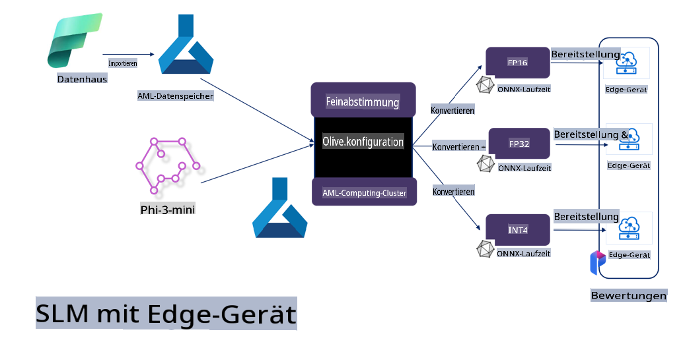

# **Feinabstimmung von Phi-3 mit Microsoft Olive**

[Olive](https://github.com/microsoft/OLive?WT.mc_id=aiml-138114-kinfeylo) ist ein benutzerfreundliches, hardwarebewusstes Modelloptimierungstool, das branchenführende Techniken zur Modellkomprimierung, Optimierung und Kompilierung zusammenführt.

Es wurde entwickelt, um den Prozess der Optimierung von Machine-Learning-Modellen zu vereinfachen und sicherzustellen, dass diese die spezifischen Hardwarearchitekturen effizient nutzen.

Egal, ob Sie an cloudbasierten Anwendungen oder Edge-Geräten arbeiten – Olive ermöglicht es Ihnen, Ihre Modelle mühelos und effektiv zu optimieren.

## Hauptmerkmale:
- Olive bündelt und automatisiert Optimierungstechniken für die gewünschten Hardwareziele.
- Da keine einzelne Optimierungstechnik für alle Szenarien geeignet ist, ermöglicht Olive Erweiterbarkeit, indem Branchenexperten ihre Optimierungsinnovationen einbringen können.

## Reduzierter Entwicklungsaufwand:
- Entwickler müssen oft mehrere hardware-spezifische Toolchains erlernen und nutzen, um trainierte Modelle für den Einsatz vorzubereiten und zu optimieren.
- Olive vereinfacht dieses Erlebnis, indem es die Optimierungstechniken für die gewünschte Hardware automatisiert.

## Einsatzbereite End-to-End-Optimierungslösung:

Durch die Kombination und Feinabstimmung integrierter Techniken bietet Olive eine einheitliche Lösung für die End-to-End-Optimierung. Es berücksichtigt Einschränkungen wie Genauigkeit und Latenzzeit bei der Optimierung von Modellen.

## Verwendung von Microsoft Olive zur Feinabstimmung

Microsoft Olive ist ein äußerst benutzerfreundliches Open-Source-Modelloptimierungstool, das sowohl Feinabstimmung als auch Referenzierung im Bereich der generativen künstlichen Intelligenz abdecken kann. Es erfordert nur eine einfache Konfiguration, kombiniert mit der Verwendung von Open-Source-Sprachmodellen und zugehörigen Laufzeitumgebungen (AzureML / lokale GPU, CPU, DirectML). Damit können Sie die Feinabstimmung oder Referenzierung des Modells durch automatische Optimierung abschließen und das beste Modell finden, um es in der Cloud oder auf Edge-Geräten bereitzustellen. Unternehmen können ihre eigenen branchenspezifischen Modelle lokal und in der Cloud erstellen.


## Feinabstimmung von Phi-3 mit Microsoft Olive 



## Beispielcode und Beispiel für Phi-3 Olive
In diesem Beispiel verwenden Sie Olive, um:

- Einen LoRA-Adapter zu trainieren, der Phrasen in Sad, Joy, Fear und Surprise klassifiziert.
- Die Adaptergewichte mit dem Basismodell zu verschmelzen.
- Das Modell zu optimieren und in INT4 zu quantisieren.

[Beispielcode](../../code/03.Finetuning/olive-ort-example/README.md)

### Einrichtung von Microsoft Olive

Die Installation von Microsoft Olive ist sehr einfach und kann für CPU, GPU, DirectML und Azure ML durchgeführt werden.

```bash
pip install olive-ai
```

Wenn Sie ein ONNX-Modell mit einer CPU ausführen möchten, können Sie Folgendes verwenden:

```bash
pip install olive-ai[cpu]
```

Wenn Sie ein ONNX-Modell mit einer GPU ausführen möchten, können Sie Folgendes verwenden:

```python
pip install olive-ai[gpu]
```

Wenn Sie Azure ML verwenden möchten, nutzen Sie:

```python
pip install git+https://github.com/microsoft/Olive#egg=olive-ai[azureml]
```

**Hinweis**  
Betriebssystem-Anforderung: Ubuntu 20.04 / 22.04 

### **Config.json von Microsoft Olive**

Nach der Installation können Sie verschiedene modellbezogene Einstellungen über die Konfigurationsdatei vornehmen, einschließlich Daten, Rechenleistung, Training, Bereitstellung und Modellerstellung.

**1. Daten**

Auf Microsoft Olive können sowohl lokale als auch Cloud-Daten für das Training verwendet werden, und dies kann in den Einstellungen konfiguriert werden.

*Lokale Daten-Einstellungen*

Sie können einfach den Datensatz einrichten, der für die Feinabstimmung trainiert werden soll, normalerweise im JSON-Format, und ihn mit der Datentemplate adaptieren. Dies muss basierend auf den Anforderungen des Modells angepasst werden (z. B. an das Format, das von Microsoft Phi-3-mini benötigt wird. Wenn Sie andere Modelle haben, beachten Sie bitte die erforderlichen Feinabstimmungsformate anderer Modelle).

```json

    "data_configs": [
        {
            "name": "dataset_default_train",
            "type": "HuggingfaceContainer",
            "load_dataset_config": {
                "params": {
                    "data_name": "json", 
                    "data_files":"dataset/dataset-classification.json",
                    "split": "train"
                }
            },
            "pre_process_data_config": {
                "params": {
                    "dataset_type": "corpus",
                    "text_cols": [
                            "phrase",
                            "tone"
                    ],
                    "text_template": "### Text: {phrase}\n### The tone is:\n{tone}",
                    "corpus_strategy": "join",
                    "source_max_len": 2048,
                    "pad_to_max_len": false,
                    "use_attention_mask": false
                }
            }
        }
    ],
```

**Einstellungen für Cloud-Datenquellen**

Indem Sie den Datenspeicher von Azure AI Studio / Azure Machine Learning Service verknüpfen, können Sie Daten in der Cloud einbinden. Sie können unterschiedliche Datenquellen über Microsoft Fabric und Azure Data in Azure AI Studio / Azure Machine Learning Service einführen, um die Daten für die Feinabstimmung zu unterstützen.

```json

    "data_configs": [
        {
            "name": "dataset_default_train",
            "type": "HuggingfaceContainer",
            "load_dataset_config": {
                "params": {
                    "data_name": "json", 
                    "data_files": {
                        "type": "azureml_datastore",
                        "config": {
                            "azureml_client": {
                                "subscription_id": "Your Azure Subscrition ID",
                                "resource_group": "Your Azure Resource Group",
                                "workspace_name": "Your Azure ML Workspaces name"
                            },
                            "datastore_name": "workspaceblobstore",
                            "relative_path": "Your train_data.json Azure ML Location"
                        }
                    },
                    "split": "train"
                }
            },
            "pre_process_data_config": {
                "params": {
                    "dataset_type": "corpus",
                    "text_cols": [
                            "Question",
                            "Best Answer"
                    ],
                    "text_template": "<|user|>\n{Question}<|end|>\n<|assistant|>\n{Best Answer}\n<|end|>",
                    "corpus_strategy": "join",
                    "source_max_len": 2048,
                    "pad_to_max_len": false,
                    "use_attention_mask": false
                }
            }
        }
    ],
    
```

**2. Rechenleistungskonfiguration**

Wenn Sie lokal arbeiten möchten, können Sie direkt lokale Datenressourcen nutzen. Wenn Sie die Ressourcen von Azure AI Studio / Azure Machine Learning Service verwenden möchten, müssen Sie die entsprechenden Azure-Parameter, Rechenleistung und andere Einstellungen konfigurieren.

```json

    "systems": {
        "aml": {
            "type": "AzureML",
            "config": {
                "accelerators": ["gpu"],
                "hf_token": true,
                "aml_compute": "Your Azure AI Studio / Azure Machine Learning Service Compute Name",
                "aml_docker_config": {
                    "base_image": "Your Azure AI Studio / Azure Machine Learning Service docker",
                    "conda_file_path": "conda.yaml"
                }
            }
        },
        "azure_arc": {
            "type": "AzureML",
            "config": {
                "accelerators": ["gpu"],
                "aml_compute": "Your Azure AI Studio / Azure Machine Learning Service Compute Name",
                "aml_docker_config": {
                    "base_image": "Your Azure AI Studio / Azure Machine Learning Service docker",
                    "conda_file_path": "conda.yaml"
                }
            }
        }
    },
```

***Hinweis***

Da dies über einen Container in Azure AI Studio / Azure Machine Learning Service ausgeführt wird, muss die erforderliche Umgebung konfiguriert werden. Dies wird in der Datei `conda.yaml` definiert.

```yaml

name: project_environment
channels:
  - defaults
dependencies:
  - python=3.8.13
  - pip=22.3.1
  - pip:
      - einops
      - accelerate
      - azure-keyvault-secrets
      - azure-identity
      - bitsandbytes
      - datasets
      - huggingface_hub
      - peft
      - scipy
      - sentencepiece
      - torch>=2.2.0
      - transformers
      - git+https://github.com/microsoft/Olive@jiapli/mlflow_loading_fix#egg=olive-ai[gpu]
      - --extra-index-url https://aiinfra.pkgs.visualstudio.com/PublicPackages/_packaging/ORT-Nightly/pypi/simple/ 
      - ort-nightly-gpu==1.18.0.dev20240307004
      - --extra-index-url https://aiinfra.pkgs.visualstudio.com/PublicPackages/_packaging/onnxruntime-genai/pypi/simple/
      - onnxruntime-genai-cuda

    

```

**3. Auswahl Ihres SLM**

Sie können das Modell direkt von Hugging Face verwenden oder es mit dem Model Catalog von Azure AI Studio / Azure Machine Learning kombinieren, um das zu verwendende Modell auszuwählen. Im folgenden Codebeispiel verwenden wir Microsoft Phi-3-mini als Beispiel.

Wenn Sie das Modell lokal haben, können Sie diese Methode verwenden:

```json

    "input_model":{
        "type": "PyTorchModel",
        "config": {
            "hf_config": {
                "model_name": "model-cache/microsoft/phi-3-mini",
                "task": "text-generation",
                "model_loading_args": {
                    "trust_remote_code": true
                }
            }
        }
    },
```

Wenn Sie ein Modell aus Azure AI Studio / Azure Machine Learning Service verwenden möchten, können Sie diese Methode verwenden:

```json

    "input_model":{
        "type": "PyTorchModel",
        "config": {
            "model_path": {
                "type": "azureml_registry_model",
                "config": {
                    "name": "microsoft/Phi-3-mini-4k-instruct",
                    "registry_name": "azureml-msr",
                    "version": "11"
                }
            },
             "model_file_format": "PyTorch.MLflow",
             "hf_config": {
                "model_name": "microsoft/Phi-3-mini-4k-instruct",
                "task": "text-generation",
                "from_pretrained_args": {
                    "trust_remote_code": true
                }
            }
        }
    },
```

**Hinweis:**  
Wir müssen Azure AI Studio / Azure Machine Learning Service integrieren. Bitte beachten Sie bei der Einrichtung des Modells die Versionsnummer und die zugehörige Benennung.

Alle Modelle auf Azure müssen auf PyTorch.MLflow eingestellt sein.

Sie benötigen ein Hugging Face-Konto und müssen den Schlüssel mit dem Schlüsselwert von Azure AI Studio / Azure Machine Learning verknüpfen.

**4. Algorithmus**

Microsoft Olive bietet eine gute Unterstützung für die Feinabstimmungsalgorithmen Lora und QLora. Alles, was Sie konfigurieren müssen, sind einige relevante Parameter. Hier nehmen wir QLora als Beispiel.

```json
        "lora": {
            "type": "LoRA",
            "config": {
                "target_modules": [
                    "o_proj",
                    "qkv_proj"
                ],
                "double_quant": true,
                "lora_r": 64,
                "lora_alpha": 64,
                "lora_dropout": 0.1,
                "train_data_config": "dataset_default_train",
                "eval_dataset_size": 0.3,
                "training_args": {
                    "seed": 0,
                    "data_seed": 42,
                    "per_device_train_batch_size": 1,
                    "per_device_eval_batch_size": 1,
                    "gradient_accumulation_steps": 4,
                    "gradient_checkpointing": false,
                    "learning_rate": 0.0001,
                    "num_train_epochs": 3,
                    "max_steps": 10,
                    "logging_steps": 10,
                    "evaluation_strategy": "steps",
                    "eval_steps": 187,
                    "group_by_length": true,
                    "adam_beta2": 0.999,
                    "max_grad_norm": 0.3
                }
            }
        },
```

Wenn Sie eine Quantisierungskonvertierung durchführen möchten, unterstützt die Hauptversion von Microsoft Olive bereits die Methode `onnxruntime-genai`. Sie können diese nach Bedarf konfigurieren:

1. Adaptergewichte mit dem Basismodell verschmelzen.
2. Das Modell mit der erforderlichen Präzision mithilfe von ModelBuilder in ein ONNX-Modell konvertieren.

Zum Beispiel die Konvertierung in quantisiertes INT4:

```json

        "merge_adapter_weights": {
            "type": "MergeAdapterWeights"
        },
        "builder": {
            "type": "ModelBuilder",
            "config": {
                "precision": "int4"
            }
        }
```

**Hinweis**  
- Wenn Sie QLoRA verwenden, wird die Quantisierungskonvertierung mit ONNXRuntime-genai derzeit nicht unterstützt.

- Es sei darauf hingewiesen, dass Sie die oben genannten Schritte nach Ihren eigenen Bedürfnissen konfigurieren können. Es ist nicht erforderlich, alle Schritte vollständig zu konfigurieren. Je nach Bedarf können Sie direkt die Schritte des Algorithmus ohne Feinabstimmung verwenden. Schließlich müssen Sie die relevanten Engines konfigurieren.

```json

    "engine": {
        "log_severity_level": 0,
        "host": "aml",
        "target": "aml",
        "search_strategy": false,
        "execution_providers": ["CUDAExecutionProvider"],
        "cache_dir": "../model-cache/models/phi3-finetuned/cache",
        "output_dir" : "../model-cache/models/phi3-finetuned"
    }
```

**5. Feinabstimmung abgeschlossen**

Führen Sie auf der Befehlszeile den folgenden Befehl im Verzeichnis der Datei `olive-config.json` aus:

```bash
olive run --config olive-config.json  
```

**Haftungsausschluss**:  
Dieses Dokument wurde mithilfe von KI-gestützten maschinellen Übersetzungsdiensten übersetzt. Obwohl wir uns um Genauigkeit bemühen, beachten Sie bitte, dass automatisierte Übersetzungen Fehler oder Ungenauigkeiten enthalten können. Das Originaldokument in seiner jeweiligen Ausgangssprache sollte als maßgebliche Quelle betrachtet werden. Für kritische Informationen wird eine professionelle menschliche Übersetzung empfohlen. Wir übernehmen keine Haftung für Missverständnisse oder Fehlinterpretationen, die aus der Nutzung dieser Übersetzung entstehen.