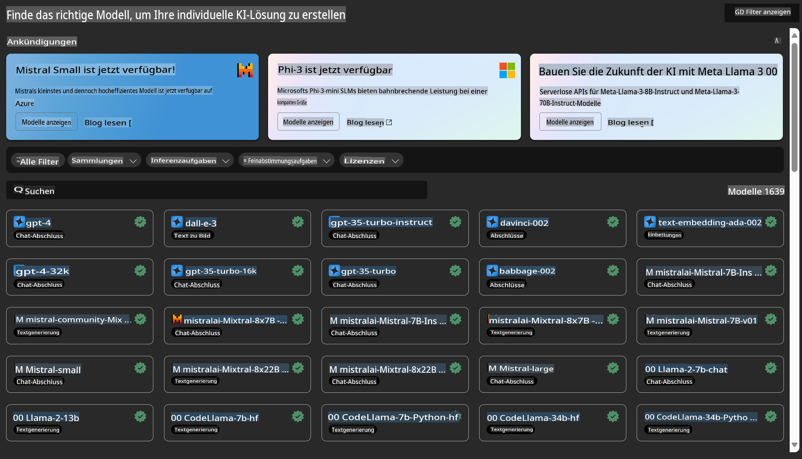
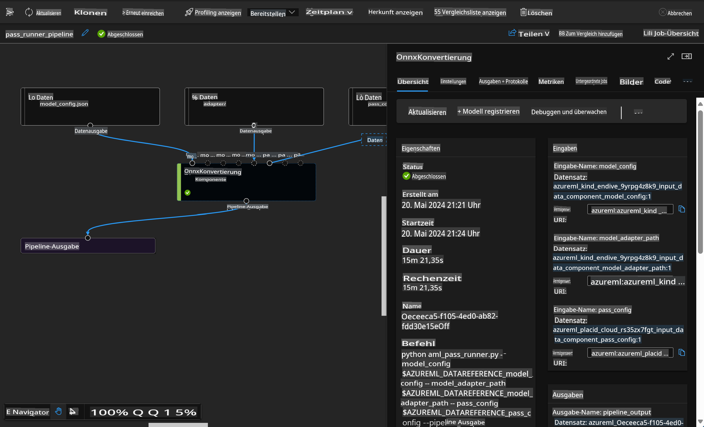

# **Einführung in den Azure Machine Learning Service**

[Azure Machine Learning](https://ml.azure.com?WT.mc_id=aiml-138114-kinfeylo) ist ein Cloud-Dienst, der den Lebenszyklus von Machine-Learning-Projekten (ML) beschleunigt und verwaltet.

ML-Experten, Data Scientists und Ingenieure können ihn in ihrem Arbeitsalltag nutzen, um:

- Modelle zu trainieren und bereitzustellen.
- Machine Learning Operations (MLOps) zu verwalten.
- Sie können ein Modell in Azure Machine Learning erstellen oder ein Modell verwenden, das mit einer Open-Source-Plattform wie PyTorch, TensorFlow oder scikit-learn entwickelt wurde.
- MLOps-Tools helfen Ihnen, Modelle zu überwachen, erneut zu trainieren und neu bereitzustellen.

## Für wen ist Azure Machine Learning geeignet?

**Data Scientists und ML-Ingenieure**

Sie können Tools nutzen, um ihre täglichen Arbeitsabläufe zu beschleunigen und zu automatisieren.  
Azure ML bietet Funktionen für Fairness, Nachvollziehbarkeit, Nachverfolgbarkeit und Auditierbarkeit.

**Anwendungsentwickler**

Sie können Modelle nahtlos in Anwendungen oder Dienste integrieren.

**Plattformentwickler**

Ihnen steht eine robuste Sammlung von Tools zur Verfügung, die durch langlebige Azure Resource Manager APIs unterstützt werden.  
Diese Tools ermöglichen den Aufbau fortschrittlicher ML-Tooling.

**Unternehmen**

Unternehmen, die in der Microsoft Azure Cloud arbeiten, profitieren von vertrauter Sicherheit und rollenbasierter Zugriffskontrolle.  
Projekte können eingerichtet werden, um den Zugriff auf geschützte Daten und bestimmte Operationen zu steuern.

## Produktivität für das gesamte Team
ML-Projekte erfordern oft ein Team mit unterschiedlichen Fähigkeiten, um sie zu erstellen und zu warten.

Azure ML bietet Tools, die es Ihnen ermöglichen:
- Mit Ihrem Team über gemeinsame Notebooks, Rechenressourcen, serverlose Compute-Umgebungen, Daten und Umgebungen zusammenzuarbeiten.
- Modelle mit Fairness, Nachvollziehbarkeit, Nachverfolgbarkeit und Auditierbarkeit zu entwickeln, um Anforderungen an Herkunftsnachweise und Audits zu erfüllen.
- ML-Modelle schnell und einfach in großem Umfang bereitzustellen sowie effizient mit MLOps zu verwalten und zu steuern.
- Machine-Learning-Workloads überall mit integrierter Governance, Sicherheit und Compliance auszuführen.

## Plattformübergreifende Tools

Jedes Teammitglied eines ML-Teams kann seine bevorzugten Tools verwenden, um die Arbeit zu erledigen.  
Egal, ob Sie schnelle Experimente durchführen, Hyperparameter optimieren, Pipelines erstellen oder Inferenzprozesse verwalten – Sie können vertraute Schnittstellen nutzen, darunter:
- Azure Machine Learning Studio
- Python SDK (v2)
- Azure CLI (v2)
- Azure Resource Manager REST APIs

Während Sie Modelle verfeinern und im gesamten Entwicklungszyklus zusammenarbeiten, können Sie Assets, Ressourcen und Metriken innerhalb der Azure Machine Learning Studio-Benutzeroberfläche teilen und finden.

## **LLM/SLM in Azure ML**

Azure ML hat viele LLM/SLM-bezogene Funktionen hinzugefügt und kombiniert LLMOps und SLMOps, um eine unternehmensweite Plattform für generative künstliche Intelligenz zu schaffen.

### **Model Catalog**

Unternehmensnutzer können über den Model Catalog verschiedene Modelle je nach Geschäftsszenario bereitstellen und diese als Model as Service anbieten, sodass Entwickler oder Nutzer des Unternehmens darauf zugreifen können.

Der Model Catalog im Azure Machine Learning Studio ist das zentrale Element, um eine Vielzahl von Modellen zu entdecken und zu nutzen, die den Aufbau von generativen KI-Anwendungen ermöglichen. Der Katalog bietet Hunderte von Modellen von Anbietern wie Azure OpenAI Service, Mistral, Meta, Cohere, Nvidia und Hugging Face, einschließlich von Microsoft trainierter Modelle. Modelle von anderen Anbietern als Microsoft gelten gemäß den Produktbedingungen von Microsoft als Nicht-Microsoft-Produkte und unterliegen den mit dem Modell bereitgestellten Bedingungen.

### **Job Pipeline**

Der Kern einer Machine-Learning-Pipeline besteht darin, eine vollständige Machine-Learning-Aufgabe in einen mehrstufigen Workflow zu unterteilen. Jeder Schritt ist eine überschaubare Komponente, die individuell entwickelt, optimiert, konfiguriert und automatisiert werden kann. Die Schritte sind über klar definierte Schnittstellen miteinander verbunden. Der Azure Machine Learning Pipeline-Dienst orchestriert automatisch alle Abhängigkeiten zwischen den Pipeline-Schritten.

Beim Fine-Tuning von SLM/LLM können wir unsere Daten, Trainings- und Generierungsprozesse über Pipelines verwalten.

### **Prompt Flow**

**Vorteile der Verwendung von Azure Machine Learning Prompt Flow**  
Azure Machine Learning Prompt Flow bietet eine Vielzahl von Vorteilen, die Nutzern helfen, von der Ideenfindung über Experimente bis hin zu produktionsreifen LLM-basierten Anwendungen zu gelangen:

**Agilität im Prompt Engineering**

- Interaktive Entwicklungsumgebung: Azure Machine Learning Prompt Flow bietet eine visuelle Darstellung der Struktur des Flows, sodass Nutzer ihre Projekte leicht verstehen und navigieren können. Es bietet auch eine notebook-ähnliche Codierungsumgebung für eine effiziente Flow-Entwicklung und Debugging.
- Varianten für Prompt-Tuning: Nutzer können mehrere Prompt-Varianten erstellen und vergleichen, um einen iterativen Verfeinerungsprozess zu ermöglichen.
- Bewertung: Eingebaute Bewertungsflows ermöglichen es Nutzern, die Qualität und Effektivität ihrer Prompts und Flows zu beurteilen.
- Umfassende Ressourcen: Azure Machine Learning Prompt Flow enthält eine Bibliothek mit integrierten Tools, Beispielen und Vorlagen, die als Ausgangspunkt für die Entwicklung dienen, Kreativität fördern und den Prozess beschleunigen.

**Unternehmensreife für LLM-basierte Anwendungen**

- Zusammenarbeit: Azure Machine Learning Prompt Flow unterstützt die Teamzusammenarbeit, sodass mehrere Nutzer gemeinsam an Prompt-Engineering-Projekten arbeiten, Wissen teilen und Versionskontrolle aufrechterhalten können.
- All-in-One-Plattform: Azure Machine Learning Prompt Flow vereinfacht den gesamten Prompt-Engineering-Prozess – von der Entwicklung und Bewertung bis hin zur Bereitstellung und Überwachung. Nutzer können ihre Flows mühelos als Azure Machine Learning Endpoints bereitstellen und ihre Leistung in Echtzeit überwachen, um einen optimalen Betrieb und kontinuierliche Verbesserungen sicherzustellen.
- Unternehmensreife Lösungen von Azure Machine Learning: Prompt Flow nutzt die robusten, unternehmensreifen Lösungen von Azure Machine Learning und bietet eine sichere, skalierbare und zuverlässige Grundlage für die Entwicklung, Erprobung und Bereitstellung von Flows.

Mit Azure Machine Learning Prompt Flow können Nutzer ihre Agilität im Prompt Engineering entfalten, effektiv zusammenarbeiten und unternehmensgerechte Lösungen nutzen, um erfolgreiche LLM-basierte Anwendungen zu entwickeln und bereitzustellen.

Durch die Kombination der Rechenleistung, Daten und verschiedenen Komponenten von Azure ML können Unternehmensentwickler ihre eigenen KI-Anwendungen einfach erstellen.

**Haftungsausschluss**:  
Dieses Dokument wurde mit KI-basierten maschinellen Übersetzungsdiensten übersetzt. Obwohl wir uns um Genauigkeit bemühen, weisen wir darauf hin, dass automatisierte Übersetzungen Fehler oder Ungenauigkeiten enthalten können. Das Originaldokument in seiner ursprünglichen Sprache sollte als maßgebliche Quelle betrachtet werden. Für kritische Informationen wird eine professionelle menschliche Übersetzung empfohlen. Wir übernehmen keine Haftung für Missverständnisse oder Fehlinterpretationen, die sich aus der Nutzung dieser Übersetzung ergeben.