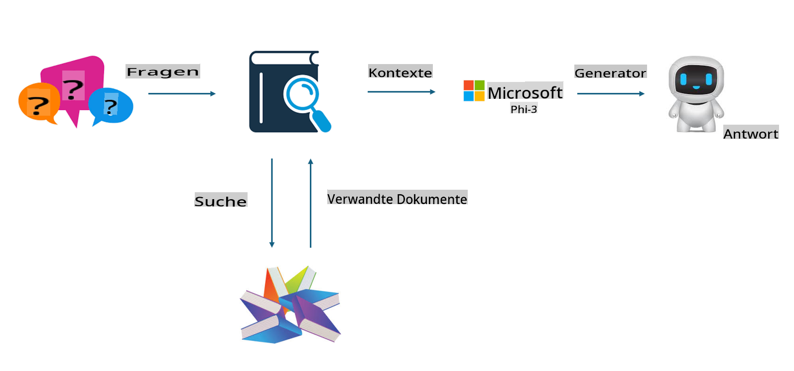
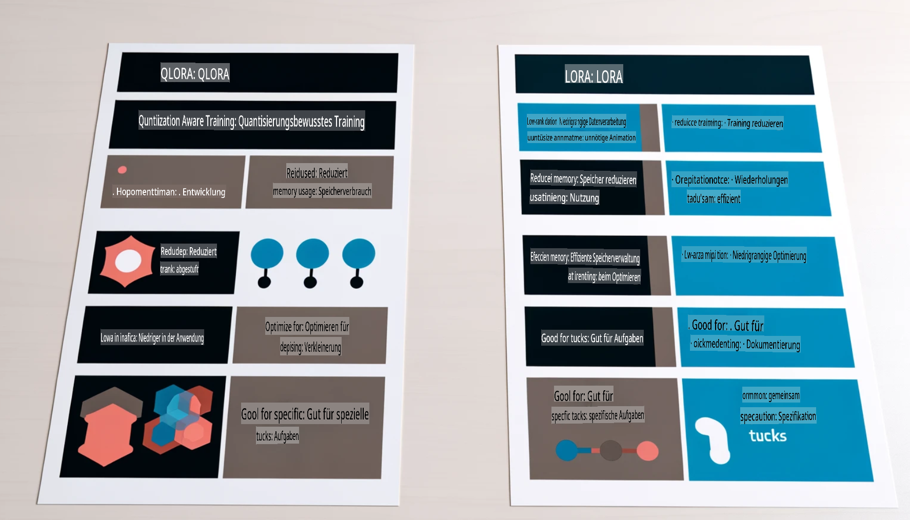

# **Lass Phi-3 ein Branchenexperte werden**

Um das Phi-3-Modell in einer Branche einzusetzen, muss man dem Phi-3-Modell branchenspezifische Geschäftsdaten hinzufügen. Dafür gibt es zwei verschiedene Ansätze: RAG (Retrieval Augmented Generation) und Fine-Tuning.

## **RAG vs. Fine-Tuning**

### **Retrieval Augmented Generation**

RAG kombiniert Datenabfrage mit Textgenerierung. Die strukturierten und unstrukturierten Daten eines Unternehmens werden in einer Vektordatenbank gespeichert. Bei der Suche nach relevanten Inhalten werden passende Zusammenfassungen und Inhalte gefunden, um einen Kontext zu bilden. Anschließend wird die Textgenerierungsfähigkeit von LLM/SLM genutzt, um Inhalte zu erstellen.

### **Fine-Tuning**

Fine-Tuning basiert auf der Verfeinerung eines bestehenden Modells. Es erfordert keinen Neustart mit dem Modellalgorithmus, jedoch muss kontinuierlich Datenmaterial gesammelt werden. Wenn in Branchenanwendungen präzisere Fachbegriffe und sprachliche Ausdrucksweisen benötigt werden, ist Fine-Tuning die bessere Wahl. Wenn sich Ihre Daten jedoch häufig ändern, kann Fine-Tuning kompliziert werden.

### **Wie wählt man aus?**

1. Wenn unsere Antwort externe Daten einbeziehen muss, ist RAG die beste Wahl.

2. Wenn stabile und präzise Branchenkenntnisse ausgegeben werden sollen, ist Fine-Tuning eine gute Option. RAG priorisiert das Abrufen relevanter Inhalte, trifft jedoch möglicherweise nicht immer die speziellen Nuancen.

3. Fine-Tuning erfordert ein qualitativ hochwertiges Datenset. Wenn es sich nur um einen kleinen Datenbereich handelt, wird der Unterschied gering sein. RAG ist flexibler.

4. Fine-Tuning ist eine Art "Blackbox", eine Metaphysik, deren interner Mechanismus schwer zu verstehen ist. RAG hingegen erleichtert es, die Datenquelle zu finden, wodurch Halluzinationen oder Inhaltsfehler effektiv angepasst und eine bessere Transparenz geboten werden.

### **Anwendungsfälle**

1. Vertikale Branchen, die spezifische Fachterminologie und Ausdrucksweisen erfordern: ***Fine-Tuning*** ist hier die beste Wahl.

2. QA-Systeme, die die Synthese verschiedener Wissenspunkte umfassen: ***RAG*** ist die beste Wahl.

3. Die Kombination automatisierter Geschäftsabläufe: ***RAG + Fine-Tuning*** ist die optimale Lösung.

## **Wie verwendet man RAG**

Eine Vektordatenbank ist eine Sammlung von Daten, die in mathematischer Form gespeichert sind. Vektordatenbanken erleichtern es maschinellen Lernmodellen, frühere Eingaben zu speichern, wodurch maschinelles Lernen für Anwendungsfälle wie Suche, Empfehlungen und Textgenerierung unterstützt werden kann. Daten können anhand von Ähnlichkeitsmetriken identifiziert werden, anstatt auf exakten Übereinstimmungen zu basieren, was es Computermodellen ermöglicht, den Kontext der Daten zu verstehen.

Die Vektordatenbank ist der Schlüssel zur Umsetzung von RAG. Wir können Daten durch Vektormodelle wie text-embedding-3, jina-ai-embedding usw. in Vektorspeicher umwandeln.

Erfahren Sie mehr über die Erstellung einer RAG-Anwendung [https://github.com/microsoft/Phi-3CookBook](https://github.com/microsoft/Phi-3CookBook?WT.mc_id=aiml-138114-kinfeylo)

## **Wie verwendet man Fine-Tuning**

Die häufig verwendeten Algorithmen im Fine-Tuning sind Lora und QLora. Wie wählt man aus?
- [Mehr erfahren mit diesem Beispiel-Notebook](../../../../code/04.Finetuning/Phi_3_Inference_Finetuning.ipynb)
- [Beispiel eines Python FineTuning-Skripts](../../../../code/04.Finetuning/FineTrainingScript.py)

### **Lora und QLora**

LoRA (Low-Rank Adaptation) und QLoRA (Quantized Low-Rank Adaptation) sind beide Techniken zur Feinabstimmung großer Sprachmodelle (LLMs) mithilfe von Parameter Efficient Fine Tuning (PEFT). PEFT-Techniken wurden entwickelt, um Modelle effizienter zu trainieren als herkömmliche Methoden.  
LoRA ist eine eigenständige Fine-Tuning-Technik, die den Speicherbedarf durch die Anwendung einer Low-Rank-Approximation auf die Gewichtungsaktualisierungsmatrix reduziert. Sie bietet schnelle Trainingszeiten und behält eine Leistung bei, die nahe an traditionellen Fine-Tuning-Methoden liegt.  

QLoRA ist eine erweiterte Version von LoRA, die Quantisierungstechniken einsetzt, um den Speicherbedarf weiter zu reduzieren. QLoRA quantisiert die Präzision der Gewichtungsparameter im vortrainierten LLM auf eine 4-Bit-Präzision, was speichereffizienter ist als LoRA. Allerdings ist das Training mit QLoRA etwa 30 % langsamer als mit LoRA, da zusätzliche Schritte zur Quantisierung und Dekompression erforderlich sind.  

QLoRA nutzt LoRA als Ergänzung, um Fehler zu korrigieren, die durch die Quantisierung entstehen. QLoRA ermöglicht die Feinabstimmung massiver Modelle mit Milliarden von Parametern auf relativ kleinen, leicht verfügbaren GPUs. Zum Beispiel kann QLoRA ein Modell mit 70 Milliarden Parametern, das normalerweise 36 GPUs benötigt, mit nur 2 GPUs feinabstimmen.

**Haftungsausschluss**:  
Dieses Dokument wurde mit KI-basierten maschinellen Übersetzungsdiensten übersetzt. Obwohl wir uns um Genauigkeit bemühen, weisen wir darauf hin, dass automatisierte Übersetzungen Fehler oder Ungenauigkeiten enthalten können. Das Originaldokument in seiner ursprünglichen Sprache sollte als maßgebliche Quelle betrachtet werden. Für kritische Informationen wird eine professionelle menschliche Übersetzung empfohlen. Wir übernehmen keine Haftung für Missverständnisse oder Fehlinterpretationen, die aus der Nutzung dieser Übersetzung resultieren.