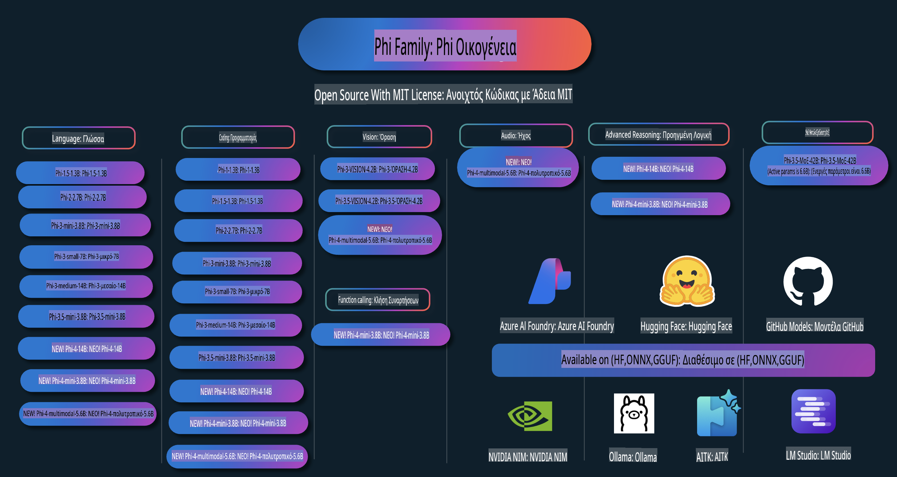

# Phi Cookbook: Πρακτικά Παραδείγματα με τα Μοντέλα Phi της Microsoft

  

  
  
  

  
  

Το Phi είναι μια σειρά από ανοιχτού κώδικα μοντέλα AI που έχει αναπτύξει η Microsoft.

Το Phi είναι αυτή τη στιγμή το πιο ισχυρό και οικονομικό μικρό μοντέλο γλώσσας (SLM), με εξαιρετικές επιδόσεις σε πολλαπλές γλώσσες, λογική, παραγωγή κειμένου/συνομιλιών, προγραμματισμό, εικόνες, ήχο και άλλα σενάρια.

Μπορείτε να αναπτύξετε το Phi στο cloud ή σε edge συσκευές και να δημιουργήσετε εύκολα εφαρμογές γεννητικού AI με περιορισμένη υπολογιστική ισχύ.

Ακολουθήστε αυτά τα βήματα για να ξεκινήσετε να χρησιμοποιείτε αυτούς τους πόρους:  
1. **Δημιουργία διακλάδωσης (Fork) του αποθετηρίου**: Πατήστε   
2. **Κλωνοποίηση του αποθετηρίου**: `git clone https://github.com/microsoft/PhiCookBook.git`  
3. [**Γίνετε μέλος της Microsoft AI Discord Κοινότητας και γνωρίστε ειδικούς και άλλους προγραμματιστές**](https://discord.com/invite/ByRwuEEgH4?WT.mc_id=aiml-137032-kinfeylo)

## Πίνακας Περιεχομένων

- Εισαγωγή
  - [Καλωσήρθατε στην Οικογένεια Phi](./md/01.Introduction/01/01.PhiFamily.md)
  - [Ρύθμιση του περιβάλλοντός σας](./md/01.Introduction/01/01.EnvironmentSetup.md)
  - [Κατανόηση των Βασικών Τεχνολογιών](./md/01.Introduction/01/01.Understandingtech.md)
  - [Ασφάλεια AI για τα Μοντέλα Phi](./md/01.Introduction/01/01.AISafety.md)
  - [Υποστήριξη Υλικού για τα Phi](./md/01.Introduction/01/01.Hardwaresupport.md)
  - [Διαθεσιμότητα Μοντέλων Phi σε Πλατφόρμες](./md/01.Introduction/01/01.Edgeandcloud.md)
  - [Χρήση Guidance-ai και Phi](./md/01.Introduction/01/01.Guidance.md)
  - [Μοντέλα στο GitHub Marketplace](https://github.com/marketplace/models)
  - [Κατάλογος Μοντέλων Azure AI](https://ai.azure.com)

- Χρήση του Phi σε διαφορετικά περιβάλλοντα
  - [Hugging face](./md/01.Introduction/02/01.HF.md)
  - [Μοντέλα GitHub](./md/01.Introduction/02/02.GitHubModel.md)
  - [Κατάλογος Μοντέλων Azure AI Foundry](./md/01.Introduction/02/03.AzureAIFoundry.md)
  - [Ollama](./md/01.Introduction/02/04.Ollama.md)
  - [AI Toolkit VSCode (AITK)](./md/01.Introduction/02/05.AITK.md)
  - [NVIDIA NIM](./md/01.Introduction/02/06.NVIDIA.md)

- Χρήση της Οικογένειας Phi
  - [Χρήση του Phi σε iOS](./md/01.Introduction/03/iOS_Inference.md)
  - [Χρήση του Phi σε Android](./md/01.Introduction/03/Android_Inference.md)
- [Εκτέλεση Phi σε Jetson](./md/01.Introduction/03/Jetson_Inference.md)
    - [Εκτέλεση Phi σε AI PC](./md/01.Introduction/03/AIPC_Inference.md)
    - [Εκτέλεση Phi με το Apple MLX Framework](./md/01.Introduction/03/MLX_Inference.md)
    - [Εκτέλεση Phi σε Τοπικό Server](./md/01.Introduction/03/Local_Server_Inference.md)
    - [Εκτέλεση Phi σε Απομακρυσμένο Server χρησιμοποιώντας το AI Toolkit](./md/01.Introduction/03/Remote_Interence.md)
    - [Εκτέλεση Phi με Rust](./md/01.Introduction/03/Rust_Inference.md)
    - [Εκτέλεση Phi--Vision Τοπικά](./md/01.Introduction/03/Vision_Inference.md)
    - [Εκτέλεση Phi με Kaito AKS, Azure Containers (επίσημη υποστήριξη)](./md/01.Introduction/03/Kaito_Inference.md)
- [Ποσοτικοποίηση της Οικογένειας Phi](./md/01.Introduction/04/QuantifyingPhi.md)
    - [Ποσοτικοποίηση των Phi-3.5 / 4 με χρήση του llama.cpp](./md/01.Introduction/04/UsingLlamacppQuantifyingPhi.md)
    - [Ποσοτικοποίηση των Phi-3.5 / 4 με επεκτάσεις Generative AI για onnxruntime](./md/01.Introduction/04/UsingORTGenAIQuantifyingPhi.md)
    - [Ποσοτικοποίηση των Phi-3.5 / 4 με το Intel OpenVINO](./md/01.Introduction/04/UsingIntelOpenVINOQuantifyingPhi.md)
    - [Ποσοτικοποίηση των Phi-3.5 / 4 με το Apple MLX Framework](./md/01.Introduction/04/UsingAppleMLXQuantifyingPhi.md)

- Αξιολόγηση του Phi
    - [Υπεύθυνη AI](./md/01.Introduction/05/ResponsibleAI.md)
    - [Azure AI Foundry για Αξιολόγηση](./md/01.Introduction/05/AIFoundry.md)
    - [Χρήση του Promptflow για Αξιολόγηση](./md/01.Introduction/05/Promptflow.md)

- RAG με το Azure AI Search
    - [Πώς να χρησιμοποιήσετε τα Phi-4-mini και Phi-4-multimodal (RAG) με το Azure AI Search](https://github.com/microsoft/PhiCookBook/blob/main/code/06.E2E/E2E_Phi-4-RAG-Azure-AI-Search.ipynb)

- Παραδείγματα ανάπτυξης εφαρμογών Phi
  - Εφαρμογές Κειμένου & Συνομιλίας
    - Παραδείγματα Phi-4 🆕
      - [📓] [Συνομιλία με το Phi-4-mini ONNX Model](./md/02.Application/01.TextAndChat/Phi4/ChatWithPhi4ONNX/README.md)
      - [Συνομιλία με το Phi-4 τοπικά με ONNX Model στο .NET](../../md/04.HOL/dotnet/src/LabsPhi4-Chat-01OnnxRuntime)
      - [Συνομιλία .NET Console App με το Phi-4 ONNX χρησιμοποιώντας το Semantic Kernel](../../md/04.HOL/dotnet/src/LabsPhi4-Chat-02SK)
    - Παραδείγματα Phi-3 / 3.5
      - [Τοπικό Chatbot στον περιηγητή χρησιμοποιώντας το Phi3, ONNX Runtime Web και WebGPU](https://github.com/microsoft/onnxruntime-inference-examples/tree/main/js/chat)
      - [Συνομιλία OpenVino](./md/02.Application/01.TextAndChat/Phi3/E2E_OpenVino_Chat.md)
      - [Πολυμοντέλο - Διαδραστικό Phi-3-mini και OpenAI Whisper](./md/02.Application/01.TextAndChat/Phi3/E2E_Phi-3-mini_with_whisper.md)
      - [MLFlow - Δημιουργία wrapper και χρήση του Phi-3 με το MLFlow](./md//02.Application/01.TextAndChat/Phi3/E2E_Phi-3-MLflow.md)
      - [Βελτιστοποίηση Μοντέλου - Πώς να βελτιστοποιήσετε το μοντέλο Phi-3-min για το ONNX Runtime Web με το Olive](https://github.com/microsoft/Olive/tree/main/examples/phi3)
      - [Εφαρμογή WinUI3 με το Phi-3 mini-4k-instruct-onnx](https://github.com/microsoft/Phi3-Chat-WinUI3-Sample/)
      - [Δείγμα Εφαρμογής Σημειώσεων με Τεχνητή Νοημοσύνη στο WinUI3](https://github.com/microsoft/ai-powered-notes-winui3-sample)
      - [Fine-tune και Ενσωμάτωση Προσαρμοσμένων Μοντέλων Phi-3 με το Prompt flow](./md/02.Application/01.TextAndChat/Phi3/E2E_Phi-3-FineTuning_PromptFlow_Integration.md)
      - [Fine-tune και Ενσωμάτωση Προσαρμοσμένων Μοντέλων Phi-3 με το Prompt flow στο Azure AI Foundry](./md/02.Application/01.TextAndChat/Phi3/E2E_Phi-3-FineTuning_PromptFlow_Integration_AIFoundry.md)
      - [Αξιολόγηση του Fine-tuned Μοντέλου Phi-3 / Phi-3.5 στο Azure AI Foundry με Έμφαση στις Αρχές Υπεύθυνης AI της Microsoft](./md/02.Application/01.TextAndChat/Phi3/E2E_Phi-3-Evaluation_AIFoundry.md)
- [📓] [Δείγμα πρόβλεψης γλώσσας Phi-3.5-mini-instruct (Κινέζικα/Αγγλικά)](../../md/02.Application/01.TextAndChat/Phi3/phi3-instruct-demo.ipynb)
      - [Chatbot RAG Phi-3.5-Instruct WebGPU](./md/02.Application/01.TextAndChat/Phi3/WebGPUWithPhi35Readme.md)
      - [Χρήση GPU Windows για δημιουργία λύσης Prompt flow με Phi-3.5-Instruct ONNX](./md/02.Application/01.TextAndChat/Phi3/UsingPromptFlowWithONNX.md)
      - [Χρήση του Microsoft Phi-3.5 tflite για δημιουργία Android εφαρμογής](./md/02.Application/01.TextAndChat/Phi3/UsingPhi35TFLiteCreateAndroidApp.md)
      - [Παράδειγμα Q&A .NET χρησιμοποιώντας τοπικό μοντέλο ONNX Phi-3 με το Microsoft.ML.OnnxRuntime](../../md/04.HOL/dotnet/src/LabsPhi301)
      - [Εφαρμογή συνομιλίας κονσόλας .NET με Semantic Kernel και Phi-3](../../md/04.HOL/dotnet/src/LabsPhi302)

  - Δείγματα κώδικα SDK Inference Azure AI 
    - Δείγματα Phi-4 🆕
      - [📓] [Δημιουργία κώδικα έργου με το Phi-4-multimodal](./md/02.Application/02.Code/Phi4/GenProjectCode/README.md)
    - Δείγματα Phi-3 / 3.5
      - [Δημιουργήστε το δικό σας Visual Studio Code GitHub Copilot Chat με την οικογένεια Microsoft Phi-3](./md/02.Application/02.Code/Phi3/VSCodeExt/README.md)
      - [Δημιουργήστε τον δικό σας Visual Studio Code Chat Copilot Agent με το Phi-3.5 μέσω των μοντέλων GitHub](/md/02.Application/02.Code/Phi3/CreateVSCodeChatAgentWithGitHubModels.md)

  - Δείγματα Προηγμένης Λογικής
    - Δείγματα Phi-4 🆕
      - [📓] [Δείγματα μίνι λογικής Phi-4](./md/02.Application/03.AdvancedReasoning/Phi4/AdvancedResoningPhi4mini/README.md)
  
  - Επιδείξεις
      - [Επιδείξεις μίνι Phi-4 που φιλοξενούνται στο Hugging Face Spaces](https://huggingface.co/spaces/microsoft/phi-4-mini?WT.mc_id=aiml-137032-kinfeylo)
      - [Επιδείξεις πολυτροπικού Phi-4 που φιλοξενούνται στο Hugging Face Spaces](https://huggingface.co/spaces/microsoft/phi-4-multimodal?WT.mc_id=aiml-137032-kinfeylo)
  - Δείγματα Όρασης
    - Δείγματα Phi-4 🆕
      - [📓] [Χρήση του Phi-4-multimodal για ανάγνωση εικόνων και δημιουργία κώδικα](./md/02.Application/04.Vision/Phi4/CreateFrontend/README.md) 
    - Δείγματα Phi-3 / 3.5
      -  [📓][Phi-3-vision-Μετατροπή κειμένου από εικόνα σε κείμενο](../../md/02.Application/04.Vision/Phi3/E2E_Phi-3-vision-image-text-to-text-online-endpoint.ipynb)
      - [Phi-3-vision-ONNX](https://onnxruntime.ai/docs/genai/tutorials/phi3-v.html)
      - [📓][Phi-3-vision CLIP Embedding](../../md/02.Application/04.Vision/Phi3/E2E_Phi-3-vision-image-text-to-text-online-endpoint.ipynb)
      - [ΕΠΙΔΕΙΞΗ: Phi-3 Ανακύκλωση](https://github.com/jennifermarsman/PhiRecycling/)
      - [Phi-3-vision - Οπτικός γλωσσικός βοηθός - με Phi3-Vision και OpenVINO](https://docs.openvino.ai/nightly/notebooks/phi-3-vision-with-output.html)
      - [Phi-3 Vision Nvidia NIM](./md/02.Application/04.Vision/Phi3/E2E_Nvidia_NIM_Vision.md)
      - [Phi-3 Vision OpenVino](./md/02.Application/04.Vision/Phi3/E2E_OpenVino_Phi3Vision.md)
      - [📓][Δείγμα πολλαπλών καρέ ή εικόνων Phi-3.5 Vision](../../md/02.Application/04.Vision/Phi3/phi3-vision-demo.ipynb)
      - [Τοπικό μοντέλο ONNX Phi-3 Vision χρησιμοποιώντας το Microsoft.ML.OnnxRuntime .NET](../../md/04.HOL/dotnet/src/LabsPhi303)
      - [Μενού για τοπικό μοντέλο ONNX Phi-3 Vision χρησιμοποιώντας το Microsoft.ML.OnnxRuntime .NET](../../md/04.HOL/dotnet/src/LabsPhi304)

  - Δείγματα Ήχου
    - Δείγματα Phi-4 🆕
      - [📓] [Εξαγωγή απομαγνητοφωνήσεων ήχου με το Phi-4-multimodal](./md/02.Application/05.Audio/Phi4/Transciption/README.md)
      - [📓] [Δείγμα Ήχου Phi-4-multimodal](../../md/02.Application/05.Audio/Phi4/Siri/demo.ipynb)
      - [📓] [Δείγμα Μετάφρασης Ομιλίας Phi-4-multimodal](../../md/02.Application/05.Audio/Phi4/Translate/demo.ipynb)
      - [Εφαρμογή κονσόλας .NET με το Phi-4-multimodal για ανάλυση αρχείου ήχου και δημιουργία απομαγνητοφώνησης](../../md/04.HOL/dotnet/src/LabsPhi4-MultiModal-02Audio)

  - Δείγματα MOE
    - Δείγματα Phi-3 / 3.5
      - [📓] [Δείγμα Social Media Μοντέλων Μείγματος Ειδικών (MoEs) Phi-3.5](../../md/02.Application/06.MoE/Phi3/phi3_moe_demo.ipynb)
      - [📓] [Δημιουργία αγωγού RAG (Ανάκτηση-Ενισχυμένη Γενεά) με NVIDIA NIM Phi-3 MOE, Azure AI Search, και LlamaIndex](../../md/02.Application/06.MoE/Phi3/azure-ai-search-nvidia-rag.ipynb)
  - Δείγματα Κλήσης Συναρτήσεων
    - Δείγματα Phi-4 🆕
      -  [📓] [Χρήση Κλήσης Συναρτήσεων με το Phi-4-mini](./md/02.Application/07.FunctionCalling/Phi4/FunctionCallingBasic/README.md)
  - Δείγματα Ανάμειξης Πολυτροπικών
    - Δείγματα Phi-4 🆕
- [📓] [Χρήση του Phi-4-multimodal ως Τεχνολογικός δημοσιογράφος](../../md/02.Application/08.Multimodel/Phi4/TechJournalist/phi_4_mm_audio_text_publish_news.ipynb)  
  - [.NET εφαρμογή κονσόλας που χρησιμοποιεί το Phi-4-multimodal για ανάλυση εικόνων](../../md/04.HOL/dotnet/src/LabsPhi4-MultiModal-01Images)

- Fine-tuning Δείγματα Phi  
  - [Σενάρια Fine-tuning](./md/03.FineTuning/FineTuning_Scenarios.md)  
  - [Fine-tuning vs RAG](./md/03.FineTuning/FineTuning_vs_RAG.md)  
  - [Fine-tuning: Κάνε το Phi-3 ειδικό στον κλάδο](./md/03.FineTuning/LetPhi3gotoIndustriy.md)  
  - [Fine-tuning του Phi-3 με το AI Toolkit για το VS Code](./md/03.FineTuning/Finetuning_VSCodeaitoolkit.md)  
  - [Fine-tuning του Phi-3 με την υπηρεσία Azure Machine Learning](./md/03.FineTuning/Introduce_AzureML.md)  
  - [Fine-tuning του Phi-3 με Lora](./md/03.FineTuning/FineTuning_Lora.md)  
  - [Fine-tuning του Phi-3 με QLora](./md/03.FineTuning/FineTuning_Qlora.md)  
  - [Fine-tuning του Phi-3 με το Azure AI Foundry](./md/03.FineTuning/FineTuning_AIFoundry.md)  
  - [Fine-tuning του Phi-3 με το Azure ML CLI/SDK](./md/03.FineTuning/FineTuning_MLSDK.md)  
  - [Fine-tuning με το Microsoft Olive](./md/03.FineTuning/FineTuning_MicrosoftOlive.md)  
  - [Fine-tuning με το Microsoft Olive Hands-On Lab](./md/03.FineTuning/olive-lab/readme.md)  
  - [Fine-tuning του Phi-3-vision με Weights and Bias](./md/03.FineTuning/FineTuning_Phi-3-visionWandB.md)  
  - [Fine-tuning του Phi-3 με το Apple MLX Framework](./md/03.FineTuning/FineTuning_MLX.md)  
  - [Fine-tuning του Phi-3-vision (επίσημη υποστήριξη)](./md/03.FineTuning/FineTuning_Vision.md)  
  - [Fine-tuning του Phi-3 με το Kaito AKS, Azure Containers (επίσημη υποστήριξη)](./md/03.FineTuning/FineTuning_Kaito.md)  
  - [Fine-tuning του Phi-3 και του 3.5 Vision](https://github.com/2U1/Phi3-Vision-Finetune)

- Εργαστήριο Εμπειρίας  
  - [Εξερεύνηση καινοτόμων μοντέλων: LLMs, SLMs, τοπική ανάπτυξη και άλλα](https://github.com/microsoft/aitour-exploring-cutting-edge-models)  
  - [Απελευθερώνοντας το δυναμικό του NLP: Fine-Tuning με το Microsoft Olive](https://github.com/azure/Ignite_FineTuning_workshop)

- Ακαδημαϊκές Ερευνητικές Εργασίες και Δημοσιεύσεις  
  - [Textbooks Are All You Need II: phi-1.5 τεχνική αναφορά](https://arxiv.org/abs/2309.05463)  
  - [Phi-3 Τεχνική Αναφορά: Ένα Ικανό Μοντέλο Γλώσσας Τοπικά στο Τηλέφωνό σας](https://arxiv.org/abs/2404.14219)  
  - [Phi-4 Τεχνική Αναφορά](https://arxiv.org/abs/2412.08905)  
  - [Βελτιστοποίηση Μικρών Μοντέλων Γλώσσας για Εντός Οχήματος Λειτουργίες](https://arxiv.org/abs/2501.02342)  
  - [(WhyPHI) Fine-Tuning PHI-3 για Ερωτήσεις Πολλαπλής Επιλογής: Μεθοδολογία, Αποτελέσματα και Προκλήσεις](https://arxiv.org/abs/2501.01588)

## Χρήση των Μοντέλων Phi  

### Phi στο Azure AI Foundry  

Μπορείτε να μάθετε πώς να χρησιμοποιείτε το Microsoft Phi και πώς να δημιουργείτε ολοκληρωμένες λύσεις στις διάφορες συσκευές σας. Για να δοκιμάσετε το Phi μόνοι σας, ξεκινήστε παίζοντας με τα μοντέλα και προσαρμόζοντας το Phi στα δικά σας σενάρια μέσω του [Azure AI Foundry Azure AI Model Catalog](https://aka.ms/phi3-azure-ai). Μπορείτε να μάθετε περισσότερα ξεκινώντας από τον οδηγό [Azure AI Foundry](/md/02.QuickStart/AzureAIFoundry_QuickStart.md).

**Playground**  
Κάθε μοντέλο έχει έναν ειδικό χώρο δοκιμών [Azure AI Playground](https://aka.ms/try-phi3).

### Phi στα Μοντέλα του GitHub  

Μπορείτε να μάθετε πώς να χρησιμοποιείτε το Microsoft Phi και πώς να δημιουργείτε ολοκληρωμένες λύσεις στις διάφορες συσκευές σας. Για να δοκιμάσετε το Phi μόνοι σας, ξεκινήστε παίζοντας με το μοντέλο και προσαρμόζοντας το Phi στα δικά σας σενάρια μέσω του [GitHub Model Catalog](https://github.com/marketplace/models?WT.mc_id=aiml-137032-kinfeylo). Μπορείτε να μάθετε περισσότερα ξεκινώντας από τον οδηγό [GitHub Model Catalog](/md/02.QuickStart/GitHubModel_QuickStart.md).

**Playground**
Κάθε μοντέλο διαθέτει ένα ειδικό [περιβάλλον δοκιμών για το μοντέλο](/md/02.QuickStart/GitHubModel_QuickStart.md).

### Phi στο Hugging Face

Μπορείτε επίσης να βρείτε το μοντέλο στο [Hugging Face](https://huggingface.co/microsoft)

**Περιβάλλον δοκιμών**
 [Περιβάλλον Hugging Chat](https://huggingface.co/chat/models/microsoft/Phi-3-mini-4k-instruct)

## Υπεύθυνη Τεχνητή Νοημοσύνη

Η Microsoft δεσμεύεται να βοηθήσει τους πελάτες της να χρησιμοποιούν τα προϊόντα Τεχνητής Νοημοσύνης με υπευθυνότητα, μοιράζοντας τις γνώσεις της και χτίζοντας σχέσεις εμπιστοσύνης μέσω εργαλείων όπως οι Σημειώσεις Διαφάνειας και οι Αξιολογήσεις Επιπτώσεων. Πολλοί από αυτούς τους πόρους βρίσκονται στο [https://aka.ms/RAI](https://aka.ms/RAI).  
Η προσέγγιση της Microsoft για υπεύθυνη Τεχνητή Νοημοσύνη βασίζεται στις αρχές μας για δικαιοσύνη, αξιοπιστία και ασφάλεια, ιδιωτικότητα και προστασία, συμπερίληψη, διαφάνεια και λογοδοσία.

Τα μεγάλης κλίμακας μοντέλα φυσικής γλώσσας, εικόνας και ομιλίας - όπως αυτά που χρησιμοποιούνται σε αυτό το δείγμα - ενδέχεται να συμπεριφέρονται με τρόπους που είναι άδικοι, αναξιόπιστοι ή προσβλητικοί, προκαλώντας έτσι βλάβες. Συμβουλευτείτε τη [Σημείωση Διαφάνειας της υπηρεσίας Azure OpenAI](https://learn.microsoft.com/legal/cognitive-services/openai/transparency-note?tabs=text) για να ενημερωθείτε σχετικά με τους κινδύνους και τους περιορισμούς.

Η συνιστώμενη προσέγγιση για την αντιμετώπιση αυτών των κινδύνων είναι η ενσωμάτωση ενός συστήματος ασφάλειας στην αρχιτεκτονική σας που μπορεί να ανιχνεύει και να αποτρέπει επιβλαβείς συμπεριφορές. Η [Ασφάλεια Περιεχομένου του Azure AI](https://learn.microsoft.com/azure/ai-services/content-safety/overview) παρέχει ένα ανεξάρτητο επίπεδο προστασίας, ικανό να ανιχνεύει επιβλαβές περιεχόμενο που παράγεται από χρήστες ή από Τεχνητή Νοημοσύνη σε εφαρμογές και υπηρεσίες. Η Ασφάλεια Περιεχομένου του Azure AI περιλαμβάνει APIs για κείμενο και εικόνα που σας επιτρέπουν να ανιχνεύετε επιβλαβές υλικό. Στο Azure AI Foundry, η υπηρεσία Ασφάλειας Περιεχομένου σας επιτρέπει να δείτε, να εξερευνήσετε και να δοκιμάσετε παραδείγματα κώδικα για την ανίχνευση επιβλαβούς περιεχομένου σε διάφορες μορφές. Η ακόλουθη [τεκμηρίωση γρήγορης έναρξης](https://learn.microsoft.com/azure/ai-services/content-safety/quickstart-text?tabs=visual-studio%2Clinux&pivots=programming-language-rest) σας καθοδηγεί στη διαδικασία αποστολής αιτημάτων στην υπηρεσία.

Ένας άλλος παράγοντας που πρέπει να ληφθεί υπόψη είναι η συνολική απόδοση της εφαρμογής. Σε εφαρμογές πολλαπλών μοντέλων και πολλαπλών μορφών, η απόδοση σημαίνει ότι το σύστημα λειτουργεί όπως εσείς και οι χρήστες σας περιμένετε, συμπεριλαμβανομένου του να μην παράγει επιβλαβείς εξόδους. Είναι σημαντικό να αξιολογήσετε την απόδοση της συνολικής εφαρμογής σας χρησιμοποιώντας [Αξιολογητές Απόδοσης και Ποιότητας και Αξιολογητές Κινδύνου και Ασφάλειας](https://learn.microsoft.com/azure/ai-studio/concepts/evaluation-metrics-built-in). Μπορείτε επίσης να δημιουργήσετε και να αξιολογήσετε με [προσαρμοσμένους αξιολογητές](https://learn.microsoft.com/azure/ai-studio/how-to/develop/evaluate-sdk#custom-evaluators).

Μπορείτε να αξιολογήσετε την εφαρμογή Τεχνητής Νοημοσύνης σας στο περιβάλλον ανάπτυξης χρησιμοποιώντας το [Azure AI Evaluation SDK](https://microsoft.github.io/promptflow/index.html). Δίνοντας είτε ένα σύνολο δεδομένων δοκιμής είτε έναν στόχο, οι γεννήσεις της εφαρμογής σας Τεχνητής Νοημοσύνης μετριούνται ποσοτικά με ενσωματωμένους αξιολογητές ή προσαρμοσμένους αξιολογητές της επιλογής σας. Για να ξεκινήσετε με το azure ai evaluation sdk και να αξιολογήσετε το σύστημά σας, μπορείτε να ακολουθήσετε τον [οδηγό γρήγορης έναρξης](https://learn.microsoft.com/azure/ai-studio/how-to/develop/flow-evaluate-sdk). Μόλις εκτελέσετε έναν κύκλο αξιολόγησης, μπορείτε να [οπτικοποιήσετε τα αποτελέσματα στο Azure AI Foundry](https://learn.microsoft.com/azure/ai-studio/how-to/evaluate-flow-results).

## Εμπορικά Σήματα

Αυτό το έργο μπορεί να περιέχει εμπορικά σήματα ή λογότυπα για έργα, προϊόντα ή υπηρεσίες. Η εξουσιοδοτημένη χρήση των εμπορικών σημάτων ή λογοτύπων της Microsoft υπόκειται και πρέπει να ακολουθεί τις [Οδηγίες Χρήσης Εμπορικών Σημάτων & Επωνυμιών της Microsoft](https://www.microsoft.com/legal/intellectualproperty/trademarks/usage/general).  
Η χρήση εμπορικών σημάτων ή λογοτύπων της Microsoft σε τροποποιημένες εκδόσεις αυτού του έργου δεν πρέπει να προκαλεί σύγχυση ή να υπονοεί χορηγία από τη Microsoft. Οποιαδήποτε χρήση εμπορικών σημάτων ή λογοτύπων τρίτων υπόκειται στις πολιτικές αυτών των τρίτων.

**Αποποίηση ευθυνών**:  
Αυτό το έγγραφο έχει μεταφραστεί χρησιμοποιώντας υπηρεσίες αυτόματης μετάφρασης βασισμένες σε τεχνητή νοημοσύνη. Παρόλο που καταβάλλουμε προσπάθειες για ακρίβεια, παρακαλούμε να έχετε υπόψη ότι οι αυτόματες μεταφράσεις ενδέχεται να περιέχουν λάθη ή ανακρίβειες. Το πρωτότυπο έγγραφο στη μητρική του γλώσσα θα πρέπει να θεωρείται η αυθεντική πηγή. Για κρίσιμες πληροφορίες, συνιστάται επαγγελματική ανθρώπινη μετάφραση. Δεν φέρουμε ευθύνη για τυχόν παρανοήσεις ή εσφαλμένες ερμηνείες που προκύπτουν από τη χρήση αυτής της μετάφρασης.