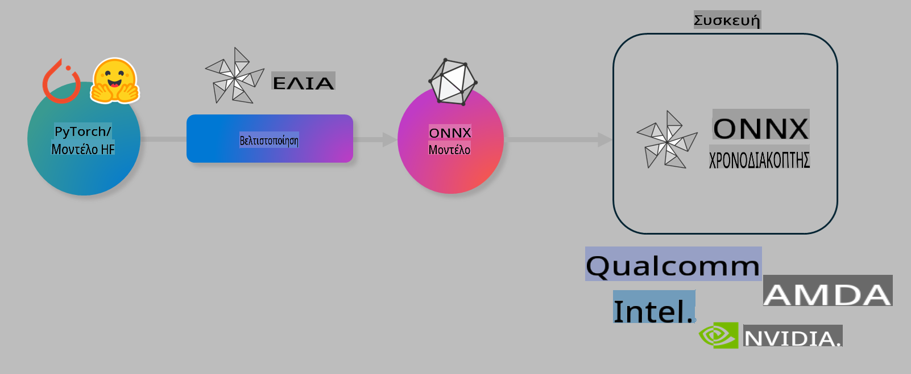

# Εργαστήριο. Βελτιστοποίηση AI μοντέλων για inference σε συσκευές

## Εισαγωγή 

> [!IMPORTANT]
> Αυτό το εργαστήριο απαιτεί **Nvidia A10 ή A100 GPU** με τους σχετικούς οδηγούς και εγκατεστημένο το CUDA toolkit (έκδοση 12+).

> [!NOTE]
> Πρόκειται για ένα εργαστήριο διάρκειας **35 λεπτών**, το οποίο θα σας δώσει μια πρακτική εισαγωγή στις βασικές έννοιες της βελτιστοποίησης μοντέλων για inference σε συσκευές χρησιμοποιώντας το OLIVE.

## Στόχοι Μάθησης

Με την ολοκλήρωση αυτού του εργαστηρίου, θα μπορείτε να χρησιμοποιήσετε το OLIVE για:

- Κβαντοποίηση ενός AI μοντέλου χρησιμοποιώντας τη μέθοδο κβαντοποίησης AWQ.
- Fine-tuning ενός AI μοντέλου για συγκεκριμένο έργο.
- Δημιουργία LoRA adapters (μοντέλα fine-tuned) για αποδοτικό inference σε συσκευές χρησιμοποιώντας το ONNX Runtime.

### Τι είναι το Olive

Το Olive (*O*NNX *live*) είναι ένα εργαλείο βελτιστοποίησης μοντέλων με συνοδευτικό CLI, που σας επιτρέπει να παραδίδετε μοντέλα για το ONNX runtime +++https://onnxruntime.ai+++ με υψηλή ποιότητα και απόδοση.



Η είσοδος στο Olive είναι συνήθως ένα μοντέλο PyTorch ή Hugging Face και η έξοδος είναι ένα βελτιστοποιημένο ONNX μοντέλο που εκτελείται σε μια συσκευή (στόχος ανάπτυξης) με το ONNX runtime. Το Olive βελτιστοποιεί το μοντέλο για τον AI επιταχυντή (NPU, GPU, CPU) της συσκευής, που παρέχεται από προμηθευτές υλικού όπως Qualcomm, AMD, Nvidia ή Intel.

Το Olive εκτελεί μια *ροή εργασίας*, που είναι μια διατεταγμένη ακολουθία ατομικών εργασιών βελτιστοποίησης μοντέλου που ονομάζονται *passes* - παραδείγματα passes περιλαμβάνουν: συμπίεση μοντέλου, καταγραφή γραφήματος, κβαντοποίηση, βελτιστοποίηση γραφήματος. Κάθε pass έχει ένα σύνολο παραμέτρων που μπορούν να ρυθμιστούν για την επίτευξη των καλύτερων μετρικών, όπως η ακρίβεια και η καθυστέρηση, που αξιολογούνται από τον αντίστοιχο αξιολογητή. Το Olive χρησιμοποιεί μια στρατηγική αναζήτησης που εφαρμόζει έναν αλγόριθμο αναζήτησης για αυτόματη ρύθμιση κάθε pass ξεχωριστά ή συνόλου passes μαζί.

#### Οφέλη του Olive

- **Μείωση απογοήτευσης και χρόνου** από πειραματισμούς με διαφορετικές τεχνικές βελτιστοποίησης γραφήματος, συμπίεσης και κβαντοποίησης. Ορίστε τους περιορισμούς ποιότητας και απόδοσης σας και αφήστε το Olive να βρει αυτόματα το καλύτερο μοντέλο για εσάς.
- **Περισσότερα από 40 ενσωματωμένα στοιχεία βελτιστοποίησης μοντέλων** που καλύπτουν τεχνικές αιχμής σε κβαντοποίηση, συμπίεση, βελτιστοποίηση γραφήματος και fine-tuning.
- **Εύχρηστο CLI** για κοινές εργασίες βελτιστοποίησης μοντέλων. Για παράδειγμα, olive quantize, olive auto-opt, olive finetune.
- Ενσωματωμένη συσκευασία και ανάπτυξη μοντέλων.
- Υποστήριξη για δημιουργία μοντέλων για **Multi LoRA serving**.
- Δημιουργία ροών εργασίας με YAML/JSON για οργάνωση εργασιών βελτιστοποίησης και ανάπτυξης μοντέλων.
- Ενσωμάτωση με **Hugging Face** και **Azure AI**.
- Ενσωματωμένος μηχανισμός **caching** για **εξοικονόμηση κόστους**.

## Οδηγίες Εργαστηρίου
> [!NOTE]
> Βεβαιωθείτε ότι έχετε προετοιμάσει το Azure AI Hub και το Project σας και έχετε ρυθμίσει τον A100 υπολογιστή σας όπως περιγράφεται στο Εργαστήριο 1.

### Βήμα 0: Συνδεθείτε στον Azure AI Υπολογιστή σας

Θα συνδεθείτε στον Azure AI υπολογιστή χρησιμοποιώντας τη δυνατότητα απομακρυσμένης σύνδεσης στο **VS Code.** 

1. Ανοίξτε την εφαρμογή επιφάνειας εργασίας **VS Code**:
1. Ανοίξτε το **command palette** πατώντας **Shift+Ctrl+P**.
1. Στο command palette αναζητήστε **AzureML - remote: Connect to compute instance in New Window**.
1. Ακολουθήστε τις οδηγίες στην οθόνη για να συνδεθείτε στον Υπολογιστή. Αυτό περιλαμβάνει την επιλογή της συνδρομής Azure, της Ομάδας Πόρων, του Έργου και του Ονόματος Υπολογιστή που ρυθμίσατε στο Εργαστήριο 1.
1. Όταν συνδεθείτε στον Azure ML Υπολογιστή σας, αυτό θα εμφανιστεί στην **κάτω αριστερή γωνία του Visual Code** `><Azure ML: Compute Name`

### Βήμα 1: Κλωνοποιήστε αυτό το αποθετήριο

Στο VS Code, μπορείτε να ανοίξετε ένα νέο τερματικό με **Ctrl+J** και να κλωνοποιήσετε αυτό το αποθετήριο:

Στο τερματικό θα δείτε την προτροπή

```
azureuser@computername:~/cloudfiles/code$ 
```
Κλωνοποιήστε τη λύση 

```bash
cd ~/localfiles
git clone https://github.com/microsoft/phi-3cookbook.git
```

### Βήμα 2: Ανοίξτε τον Φάκελο στο VS Code

Για να ανοίξετε το VS Code στον σχετικό φάκελο, εκτελέστε την παρακάτω εντολή στο τερματικό, η οποία θα ανοίξει ένα νέο παράθυρο:

```bash
code phi-3cookbook/code/04.Finetuning/Olive-lab
```

Εναλλακτικά, μπορείτε να ανοίξετε τον φάκελο επιλέγοντας **File** > **Open Folder**. 

### Βήμα 3: Εξαρτήσεις

Ανοίξτε ένα παράθυρο τερματικού στο VS Code στον Azure AI Υπολογιστή σας (συμβουλή: **Ctrl+J**) και εκτελέστε τις παρακάτω εντολές για να εγκαταστήσετε τις εξαρτήσεις:

```bash
conda create -n olive-ai python=3.11 -y
conda activate olive-ai
pip install -r requirements.txt
az extension remove -n azure-cli-ml
az extension add -n ml
```

> [!NOTE]
> Θα χρειαστούν ~5 λεπτά για να εγκατασταθούν όλες οι εξαρτήσεις.

Σε αυτό το εργαστήριο θα κατεβάσετε και θα ανεβάσετε μοντέλα στον κατάλογο μοντέλων Azure AI. Για να έχετε πρόσβαση στον κατάλογο μοντέλων, θα χρειαστεί να συνδεθείτε στο Azure χρησιμοποιώντας:

```bash
az login
```

> [!NOTE]
> Κατά τη σύνδεση θα σας ζητηθεί να επιλέξετε τη συνδρομή σας. Βεβαιωθείτε ότι έχετε επιλέξει τη συνδρομή που παρέχεται για αυτό το εργαστήριο.

### Βήμα 4: Εκτέλεση εντολών Olive 

Ανοίξτε ένα παράθυρο τερματικού στο VS Code στον Azure AI Υπολογιστή σας (συμβουλή: **Ctrl+J**) και βεβαιωθείτε ότι το περιβάλλον `olive-ai` conda είναι ενεργοποιημένο:

```bash
conda activate olive-ai
```

Στη συνέχεια, εκτελέστε τις παρακάτω εντολές Olive στη γραμμή εντολών.

1. **Επιθεωρήστε τα δεδομένα:** Σε αυτό το παράδειγμα, θα κάνετε fine-tuning στο μοντέλο Phi-3.5-Mini ώστε να εξειδικευτεί στην απάντηση ερωτήσεων που σχετίζονται με ταξίδια. Ο παρακάτω κώδικας εμφανίζει τις πρώτες εγγραφές του dataset, οι οποίες είναι σε μορφή JSON lines:
   
    ```bash
    head data/data_sample_travel.jsonl
    ```
1. **Κβαντοποίηση του μοντέλου:** Πριν την εκπαίδευση του μοντέλου, πρώτα το κβαντοποιείτε με την παρακάτω εντολή που χρησιμοποιεί μια τεχνική που ονομάζεται Active Aware Quantization (AWQ) +++https://arxiv.org/abs/2306.00978+++. Η AWQ κβαντοποιεί τα βάρη ενός μοντέλου λαμβάνοντας υπόψη τις ενεργοποιήσεις που παράγονται κατά τη διάρκεια του inference. Αυτό σημαίνει ότι η διαδικασία κβαντοποίησης λαμβάνει υπόψη την πραγματική κατανομή δεδομένων στις ενεργοποιήσεις, διατηρώντας καλύτερα την ακρίβεια του μοντέλου σε σύγκριση με παραδοσιακές μεθόδους κβαντοποίησης βαρών.
    
    ```bash
    olive quantize \
       --model_name_or_path microsoft/Phi-3.5-mini-instruct \
       --trust_remote_code \
       --algorithm awq \
       --output_path models/phi/awq \
       --log_level 1
    ```
    
    Χρειάζονται **~8 λεπτά** για να ολοκληρωθεί η κβαντοποίηση AWQ, η οποία θα **μειώσει το μέγεθος του μοντέλου από ~7.5GB σε ~2.5GB**.
   
   Σε αυτό το εργαστήριο, σας δείχνουμε πώς να εισάγετε μοντέλα από το Hugging Face (για παράδειγμα: `microsoft/Phi-3.5-mini-instruct`). However, Olive also allows you to input models from the Azure AI catalog by updating the `model_name_or_path` argument to an Azure AI asset ID (for example:  `azureml://registries/azureml/models/Phi-3.5-mini-instruct/versions/4`). 

1. **Train the model:** Next, the `olive finetune` η εντολή κάνει fine-tuning στο κβαντοποιημένο μοντέλο. Η κβαντοποίηση του μοντέλου *πριν* το fine-tuning αντί για μετά, προσφέρει καλύτερη ακρίβεια καθώς η διαδικασία fine-tuning ανακτά μέρος της απώλειας από την κβαντοποίηση.
    
    ```bash
    olive finetune \
        --method lora \
        --model_name_or_path models/phi/awq \
        --data_files "data/data_sample_travel.jsonl" \
        --data_name "json" \
        --text_template "<|user|>\n{prompt}<|end|>\n<|assistant|>\n{response}<|end|>" \
        --max_steps 100 \
        --output_path ./models/phi/ft \
        --log_level 1
    ```
    
    Χρειάζονται **~6 λεπτά** για να ολοκληρωθεί το Fine-tuning (με 100 βήματα).

1. **Βελτιστοποίηση:** Με το μοντέλο εκπαιδευμένο, τώρα το βελτιστοποιείτε χρησιμοποιώντας την εντολή `auto-opt` command, which will capture the ONNX graph and automatically perform a number of optimizations to improve the model performance for CPU by compressing the model and doing fusions. It should be noted, that you can also optimize for other devices such as NPU or GPU by just updating the `--device` and `--provider` του Olive - αλλά για τους σκοπούς αυτού του εργαστηρίου θα χρησιμοποιήσουμε CPU.

    ```bash
    olive auto-opt \
       --model_name_or_path models/phi/ft/model \
       --adapter_path models/phi/ft/adapter \
       --device cpu \
       --provider CPUExecutionProvider \
       --use_ort_genai \
       --output_path models/phi/onnx-ao \
       --log_level 1
    ```
    
    Χρειάζονται **~5 λεπτά** για να ολοκληρωθεί η βελτιστοποίηση.

### Βήμα 5: Γρήγορο τεστ inference του μοντέλου

Για να δοκιμάσετε το inference του μοντέλου, δημιουργήστε ένα αρχείο Python στον φάκελό σας με το όνομα **app.py** και αντιγράψτε-επικολλήστε τον παρακάτω κώδικα:

```python
import onnxruntime_genai as og
import numpy as np

print("loading model and adapters...", end="", flush=True)
model = og.Model("models/phi/onnx-ao/model")
adapters = og.Adapters(model)
adapters.load("models/phi/onnx-ao/model/adapter_weights.onnx_adapter", "travel")
print("DONE!")

tokenizer = og.Tokenizer(model)
tokenizer_stream = tokenizer.create_stream()

params = og.GeneratorParams(model)
params.set_search_options(max_length=100, past_present_share_buffer=False)
user_input = "what is the best thing to see in chicago"
params.input_ids = tokenizer.encode(f"<|user|>\n{user_input}<|end|>\n<|assistant|>\n")

generator = og.Generator(model, params)

generator.set_active_adapter(adapters, "travel")

print(f"{user_input}")

while not generator.is_done():
    generator.compute_logits()
    generator.generate_next_token()

    new_token = generator.get_next_tokens()[0]
    print(tokenizer_stream.decode(new_token), end='', flush=True)

print("\n")
```

Εκτελέστε τον κώδικα χρησιμοποιώντας:

```bash
python app.py
```

### Βήμα 6: Ανεβάστε το μοντέλο στο Azure AI

Ανεβάζοντας το μοντέλο σε ένα αποθετήριο μοντέλων Azure AI, το καθιστάτε διαθέσιμο σε άλλα μέλη της ομάδας ανάπτυξης και εξασφαλίζετε τον έλεγχο εκδόσεων του μοντέλου. Για να ανεβάσετε το μοντέλο, εκτελέστε την παρακάτω εντολή:

> [!NOTE]
> Ενημερώστε το `{}` placeholders with the name of your resource group and Azure AI Project Name. 

To find your resource group `"resourceGroup"και το όνομα του Azure AI Project και εκτελέστε την παρακάτω εντολή 

```
az ml workspace show
```

Ή μεταβείτε στο +++ai.azure.com+++ και επιλέξτε **management center** **project** **overview**

Ενημερώστε τα `{}` placeholders με το όνομα της ομάδας πόρων σας και το όνομα του Azure AI Project.

```bash
az ml model create \
    --name ft-for-travel \
    --version 1 \
    --path ./models/phi/onnx-ao \
    --resource-group {RESOURCE_GROUP_NAME} \
    --workspace-name {PROJECT_NAME}
```
Στη συνέχεια, μπορείτε να δείτε το ανεβασμένο μοντέλο σας και να το αναπτύξετε στη διεύθυνση https://ml.azure.com/model/list

**Αποποίηση Ευθυνών**:  
Αυτό το έγγραφο έχει μεταφραστεί χρησιμοποιώντας υπηρεσίες μετάφρασης με βάση την τεχνητή νοημοσύνη. Ενώ καταβάλλουμε κάθε προσπάθεια για ακρίβεια, παρακαλούμε να έχετε υπόψη ότι οι αυτοματοποιημένες μεταφράσεις ενδέχεται να περιέχουν λάθη ή ανακρίβειες. Το αρχικό έγγραφο στη μητρική του γλώσσα θα πρέπει να θεωρείται η αυθεντική πηγή. Για κρίσιμες πληροφορίες, συνιστάται επαγγελματική μετάφραση από άνθρωπο. Δεν φέρουμε ευθύνη για τυχόν παρανοήσεις ή παρερμηνείες που προκύπτουν από τη χρήση αυτής της μετάφρασης.