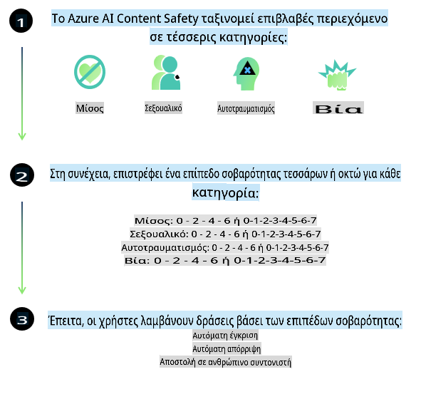
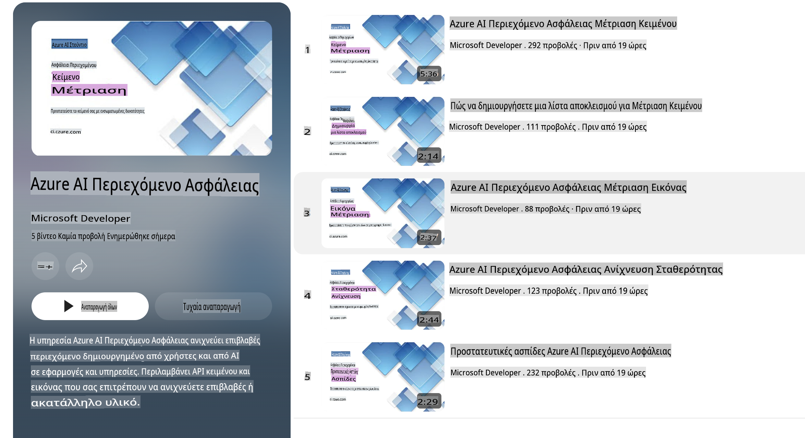

# Ασφάλεια AI για τα μοντέλα Phi

Η οικογένεια μοντέλων Phi αναπτύχθηκε σύμφωνα με το [Microsoft Responsible AI Standard](https://query.prod.cms.rt.microsoft.com/cms/api/am/binary/RE5cmFl), ένα σύνολο εταιρικών απαιτήσεων που βασίζεται στις εξής έξι αρχές: λογοδοσία, διαφάνεια, δικαιοσύνη, αξιοπιστία και ασφάλεια, ιδιωτικότητα και ασφάλεια, καθώς και συμπερίληψη, οι οποίες αποτελούν τις [αρχές Υπεύθυνης AI της Microsoft](https://www.microsoft.com/ai/responsible-ai).

Όπως και τα προηγούμενα μοντέλα Phi, υιοθετήθηκε μια πολυδιάστατη προσέγγιση αξιολόγησης και εκπαίδευσης ασφάλειας μετά την αρχική εκπαίδευση, με επιπλέον μέτρα για να ληφθούν υπόψη οι πολυγλωσσικές δυνατότητες αυτής της έκδοσης. Η προσέγγισή μας για την εκπαίδευση και τις αξιολογήσεις ασφάλειας, που περιλαμβάνει δοκιμές σε πολλές γλώσσες και κατηγορίες κινδύνου, περιγράφεται στο [Phi Safety Post-Training Paper](https://arxiv.org/abs/2407.13833). Παρόλο που τα μοντέλα Phi επωφελούνται από αυτή την προσέγγιση, οι προγραμματιστές θα πρέπει να εφαρμόζουν τις βέλτιστες πρακτικές υπεύθυνης AI, συμπεριλαμβανομένης της χαρτογράφησης, της μέτρησης και της μείωσης των κινδύνων που σχετίζονται με τη συγκεκριμένη χρήση και το πολιτισμικό και γλωσσικό πλαίσιο.

## Βέλτιστες Πρακτικές

Όπως και άλλα μοντέλα, η οικογένεια μοντέλων Phi μπορεί δυνητικά να εμφανίσει συμπεριφορές που είναι άδικες, αναξιόπιστες ή προσβλητικές.

Μερικές από τις περιορισμένες συμπεριφορές των SLM και LLM που πρέπει να γνωρίζετε περιλαμβάνουν:

- **Ποιότητα Υπηρεσίας:** Τα μοντέλα Phi είναι κυρίως εκπαιδευμένα σε κείμενα στα Αγγλικά. Οι γλώσσες εκτός των Αγγλικών θα έχουν χειρότερη απόδοση. Οι ποικιλίες της αγγλικής γλώσσας με λιγότερη εκπροσώπηση στα δεδομένα εκπαίδευσης μπορεί να έχουν χειρότερη απόδοση από την τυπική Αμερικανική Αγγλική.
- **Αναπαράσταση Βλαβών & Διαιώνιση Στερεοτύπων:** Αυτά τα μοντέλα μπορεί να υπερεκπροσωπούν ή να υποεκπροσωπούν ομάδες ανθρώπων, να διαγράφουν την εκπροσώπηση ορισμένων ομάδων ή να ενισχύουν υποτιμητικά ή αρνητικά στερεότυπα. Παρά την εκπαίδευση ασφάλειας, αυτοί οι περιορισμοί μπορεί να εξακολουθούν να υπάρχουν λόγω των διαφορετικών επιπέδων εκπροσώπησης διαφορετικών ομάδων ή της παρουσίας παραδειγμάτων αρνητικών στερεοτύπων στα δεδομένα εκπαίδευσης που αντικατοπτρίζουν πραγματικά πρότυπα και κοινωνικές προκαταλήψεις.
- **Ακατάλληλο ή Προσβλητικό Περιεχόμενο:** Αυτά τα μοντέλα μπορεί να παράγουν άλλους τύπους ακατάλληλου ή προσβλητικού περιεχομένου, γεγονός που μπορεί να τα καθιστά ακατάλληλα για ευαίσθητα πλαίσια χωρίς επιπλέον μετριασμούς που είναι συγκεκριμένοι για τη χρήση.
- **Αξιοπιστία Πληροφοριών:** Τα γλωσσικά μοντέλα μπορεί να δημιουργήσουν περιεχόμενο χωρίς νόημα ή να επινοήσουν περιεχόμενο που μπορεί να φαίνεται λογικό αλλά είναι ανακριβές ή ξεπερασμένο.
- **Περιορισμένο Εύρος για Κώδικα:** Η πλειονότητα των δεδομένων εκπαίδευσης του Phi-3 βασίζεται στην Python και χρησιμοποιεί κοινές βιβλιοθήκες όπως "typing, math, random, collections, datetime, itertools". Εάν το μοντέλο δημιουργήσει Python scripts που χρησιμοποιούν άλλες βιβλιοθήκες ή scripts σε άλλες γλώσσες, συνιστούμε ανεπιφύλακτα στους χρήστες να επαληθεύουν χειροκίνητα όλες τις χρήσεις API.

Οι προγραμματιστές θα πρέπει να εφαρμόζουν τις βέλτιστες πρακτικές υπεύθυνης AI και είναι υπεύθυνοι για τη διασφάλιση ότι μια συγκεκριμένη χρήση συμμορφώνεται με τους σχετικούς νόμους και κανονισμούς (π.χ. ιδιωτικότητα, εμπόριο κ.λπ.).

## Σκέψεις για Υπεύθυνη AI

Όπως και άλλα γλωσσικά μοντέλα, τα μοντέλα της σειράς Phi μπορεί δυνητικά να εμφανίσουν συμπεριφορές που είναι άδικες, αναξιόπιστες ή προσβλητικές. Μερικές από τις περιορισμένες συμπεριφορές που πρέπει να γνωρίζετε περιλαμβάνουν:

**Ποιότητα Υπηρεσίας:** Τα μοντέλα Phi είναι κυρίως εκπαιδευμένα σε κείμενα στα Αγγλικά. Οι γλώσσες εκτός των Αγγλικών θα έχουν χειρότερη απόδοση. Οι ποικιλίες της αγγλικής γλώσσας με λιγότερη εκπροσώπηση στα δεδομένα εκπαίδευσης μπορεί να έχουν χειρότερη απόδοση από την τυπική Αμερικανική Αγγλική.

**Αναπαράσταση Βλαβών & Διαιώνιση Στερεοτύπων:** Αυτά τα μοντέλα μπορεί να υπερεκπροσωπούν ή να υποεκπροσωπούν ομάδες ανθρώπων, να διαγράφουν την εκπροσώπηση ορισμένων ομάδων ή να ενισχύουν υποτιμητικά ή αρνητικά στερεότυπα. Παρά την εκπαίδευση ασφάλειας, αυτοί οι περιορισμοί μπορεί να εξακολουθούν να υπάρχουν λόγω των διαφορετικών επιπέδων εκπροσώπησης διαφορετικών ομάδων ή της παρουσίας παραδειγμάτων αρνητικών στερεοτύπων στα δεδομένα εκπαίδευσης που αντικατοπτρίζουν πραγματικά πρότυπα και κοινωνικές προκαταλήψεις.

**Ακατάλληλο ή Προσβλητικό Περιεχόμενο:** Αυτά τα μοντέλα μπορεί να παράγουν άλλους τύπους ακατάλληλου ή προσβλητικού περιεχομένου, γεγονός που μπορεί να τα καθιστά ακατάλληλα για ευαίσθητα πλαίσια χωρίς επιπλέον μετριασμούς που είναι συγκεκριμένοι για τη χρήση.  
**Αξιοπιστία Πληροφοριών:** Τα γλωσσικά μοντέλα μπορεί να δημιουργήσουν περιεχόμενο χωρίς νόημα ή να επινοήσουν περιεχόμενο που μπορεί να φαίνεται λογικό αλλά είναι ανακριβές ή ξεπερασμένο.

**Περιορισμένο Εύρος για Κώδικα:** Η πλειονότητα των δεδομένων εκπαίδευσης του Phi-3 βασίζεται στην Python και χρησιμοποιεί κοινές βιβλιοθήκες όπως "typing, math, random, collections, datetime, itertools". Εάν το μοντέλο δημιουργήσει Python scripts που χρησιμοποιούν άλλες βιβλιοθήκες ή scripts σε άλλες γλώσσες, συνιστούμε ανεπιφύλακτα στους χρήστες να επαληθεύουν χειροκίνητα όλες τις χρήσεις API.

Οι προγραμματιστές θα πρέπει να εφαρμόζουν τις βέλτιστες πρακτικές υπεύθυνης AI και είναι υπεύθυνοι για τη διασφάλιση ότι μια συγκεκριμένη χρήση συμμορφώνεται με τους σχετικούς νόμους και κανονισμούς (π.χ. ιδιωτικότητα, εμπόριο κ.λπ.). Σημαντικές περιοχές για εξέταση περιλαμβάνουν:

**Κατανομή:** Τα μοντέλα μπορεί να μην είναι κατάλληλα για σενάρια που θα μπορούσαν να έχουν σημαντικό αντίκτυπο στη νομική κατάσταση ή στην κατανομή πόρων ή ευκαιριών ζωής (π.χ. στέγαση, εργασία, πίστωση κ.λπ.) χωρίς περαιτέρω αξιολογήσεις και πρόσθετες τεχνικές αποφυγής προκατάληψης.

**Σενάρια Υψηλού Κινδύνου:** Οι προγραμματιστές θα πρέπει να αξιολογήσουν την καταλληλότητα χρήσης μοντέλων σε σενάρια υψηλού κινδύνου όπου άδικες, αναξιόπιστες ή προσβλητικές έξοδοι μπορεί να είναι εξαιρετικά δαπανηρές ή να οδηγήσουν σε βλάβες. Αυτό περιλαμβάνει την παροχή συμβουλών σε ευαίσθητους ή εξειδικευμένους τομείς όπου η ακρίβεια και η αξιοπιστία είναι κρίσιμες (π.χ. νομικές ή ιατρικές συμβουλές). Πρόσθετα μέτρα ασφαλείας θα πρέπει να εφαρμόζονται σε επίπεδο εφαρμογής ανάλογα με το πλαίσιο ανάπτυξης.

**Παραπληροφόρηση:** Τα μοντέλα μπορεί να παράγουν ανακριβείς πληροφορίες. Οι προγραμματιστές θα πρέπει να ακολουθούν τις βέλτιστες πρακτικές διαφάνειας και να ενημερώνουν τους τελικούς χρήστες ότι αλληλεπιδρούν με ένα σύστημα AI. Σε επίπεδο εφαρμογής, οι προγραμματιστές μπορούν να δημιουργήσουν μηχανισμούς ανατροφοδότησης και pipelines για να βασίζουν τις απαντήσεις σε πληροφορίες που είναι συγκεκριμένες για τη χρήση και το πλαίσιο, μια τεχνική γνωστή ως Retrieval Augmented Generation (RAG).

**Παραγωγή Επιβλαβούς Περιεχομένου:** Οι προγραμματιστές θα πρέπει να αξιολογούν τις εξόδους για το πλαίσιο τους και να χρησιμοποιούν διαθέσιμους ταξινομητές ασφάλειας ή προσαρμοσμένες λύσεις κατάλληλες για τη χρήση τους.

**Κακή Χρήση:** Άλλες μορφές κακής χρήσης, όπως απάτη, spam ή παραγωγή κακόβουλου λογισμικού, μπορεί να είναι δυνατές, και οι προγραμματιστές θα πρέπει να διασφαλίζουν ότι οι εφαρμογές τους δεν παραβιάζουν τους ισχύοντες νόμους και κανονισμούς.

### Fine-tuning και Ασφάλεια Περιεχομένου AI

Μετά την προσαρμογή ενός μοντέλου, συνιστούμε ανεπιφύλακτα τη χρήση μέτρων [Azure AI Content Safety](https://learn.microsoft.com/azure/ai-services/content-safety/overview) για την παρακολούθηση του περιεχομένου που δημιουργείται από τα μοντέλα, την ταυτοποίηση και τον αποκλεισμό πιθανών κινδύνων, απειλών και ζητημάτων ποιότητας.

Το [Azure AI Content Safety](https://learn.microsoft.com/azure/ai-services/content-safety/overview) υποστηρίζει τόσο περιεχόμενο κειμένου όσο και εικόνας. Μπορεί να αναπτυχθεί στο cloud, σε αποσυνδεδεμένα containers και σε συσκευές edge/embedded.

## Επισκόπηση του Azure AI Content Safety

Το Azure AI Content Safety δεν είναι λύση που ταιριάζει σε όλους· μπορεί να προσαρμοστεί για να ευθυγραμμιστεί με τις συγκεκριμένες πολιτικές των επιχειρήσεων. Επιπλέον, τα πολυγλωσσικά μοντέλα του επιτρέπουν την κατανόηση πολλών γλωσσών ταυτόχρονα.

- **Azure AI Content Safety**
- **Microsoft Developer**
- **5 videos**

Η υπηρεσία Azure AI Content Safety ανιχνεύει επιβλαβές περιεχόμενο που δημιουργείται από χρήστες ή AI σε εφαρμογές και υπηρεσίες. Περιλαμβάνει APIs κειμένου και εικόνας που επιτρέπουν την ανίχνευση επιβλαβούς ή ακατάλληλου υλικού.

[AI Content Safety Playlist](https://www.youtube.com/playlist?list=PLlrxD0HtieHjaQ9bJjyp1T7FeCbmVcPkQ)

**Αποποίηση Ευθύνης**:  
Αυτό το έγγραφο έχει μεταφραστεί χρησιμοποιώντας υπηρεσίες μηχανικής μετάφρασης που βασίζονται σε τεχνητή νοημοσύνη. Ενώ καταβάλλουμε προσπάθειες για ακρίβεια, παρακαλούμε να έχετε υπόψη ότι οι αυτοματοποιημένες μεταφράσεις ενδέχεται να περιέχουν σφάλματα ή ανακρίβειες. Το πρωτότυπο έγγραφο στη μητρική του γλώσσα θα πρέπει να θεωρείται η έγκυρη πηγή. Για κρίσιμες πληροφορίες, συνιστάται επαγγελματική ανθρώπινη μετάφραση. Δεν φέρουμε ευθύνη για τυχόν παρεξηγήσεις ή εσφαλμένες ερμηνείες που προκύπτουν από τη χρήση αυτής της μετάφρασης.