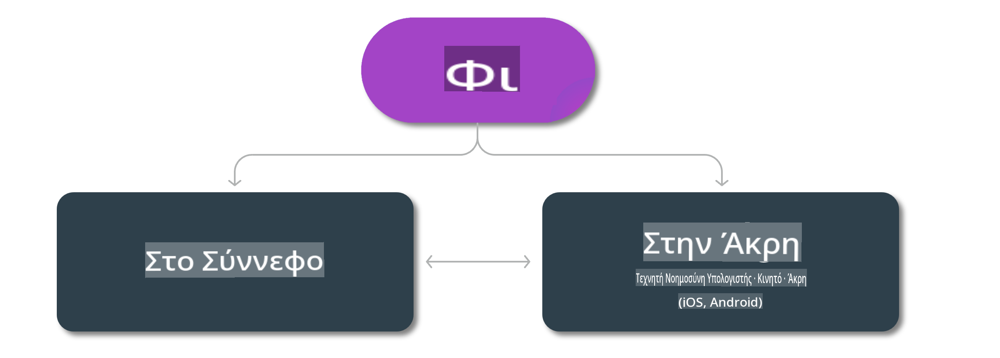

# Μοντέλα Phi & Διαθεσιμότητα στις πλατφόρμες 

## Σενάρια Edge & Cloud

## Διαθεσιμότητα Μοντέλων και Πόροι

| | | | | | | | | |
|-|-|-|-|-|-|-|-|-|
|Μοντέλο|Είσοδος|Μήκος Περιεχομένου|Azure AI (MaaS)|Azure ML (MaaP)|ONNX|Hugging Face|Ollama|Nvidia NIM|
|Phi-3-vision-128k-instruct|Κείμενο+Εικόνα|128k|[Playground & Ανάπτυξη](https://ai.azure.com/explore/models/Phi-3-vision-128k-instruct/version/2/registry/azureml)|[Playground, Ανάπτυξη & Εκπαίδευση](https://ml.azure.com/registries/azureml/models/Phi-3-vision-128k-instruct/version/2)|[CUDA](https://huggingface.co/microsoft/Phi-3-vision-128k-instruct-onnx-cuda/tree/main),[CPU](https://huggingface.co/microsoft/Phi-3-vision-128k-instruct-onnx-cpu/tree/main), [DirectML](https://huggingface.co/microsoft/Phi-3-vision-128k-instruct-onnx-directml/tree/main)|[Λήψη](https://huggingface.co/microsoft/Phi-3-vision-128k-instruct)|-Μη Διαθέσιμο-|[NIM APIs](https://build.nvidia.com/microsoft/phi-3-vision-128k-instruct)|
|Phi-3-mini-4k-instruct|Κείμενο|4k|[Playground & Ανάπτυξη](https://aka.ms/phi3-mini-4k-azure-ml)|[Playground, Ανάπτυξη](https://aka.ms/phi3-mini-4k-azure-ml) & Εκπαίδευση|[CUDA](https://huggingface.co/microsoft/Phi-3-mini-4k-instruct-onnx), [Web](https://huggingface.co/microsoft/Phi-3-mini-4k-instruct-onnx)|[Playground & Λήψη](https://huggingface.co/chat/models/microsoft/Phi-3-mini-4k-instruct)|[GGUF](https://huggingface.co/microsoft/Phi-3-mini-4k-instruct-gguf)|[NIM APIs](https://build.nvidia.com/microsoft/phi-3-mini-4k)|
|Phi-3-mini-128k-instruct|Κείμενο|128k|[Playground & Ανάπτυξη](https://ai.azure.com/explore/models/Phi-3-mini-128k-instruct/version/9/registry/azureml)|[Playground, Ανάπτυξη](https://ai.azure.com/explore/models/Phi-3-mini-128k-instruct/version/9/registry/azureml) & Εκπαίδευση|[CUDA](https://huggingface.co/microsoft/Phi-3-mini-128k-instruct-onnx)|[Λήψη](https://huggingface.co/microsoft/Phi-3-mini-128k-instruct-onnx)|-Μη Διαθέσιμο-|[NIM APIs](https://build.nvidia.com/microsoft/phi-3-mini)|
|Phi-3-small-8k-instruct|Κείμενο|8k|[Playground & Ανάπτυξη](https://ml.azure.com/registries/azureml/models/Phi-3-small-8k-instruct/version/2)|[Playground, Ανάπτυξη](https://ai.azure.com/explore/models/Phi-3-small-8k-instruct/version/2/registry/azureml) & Εκπαίδευση|[CUDA](https://huggingface.co/microsoft/Phi-3-small-8k-instruct-onnx-cuda)|[Λήψη](https://huggingface.co/microsoft/Phi-3-small-8k-instruct-onnx-cuda)|-Μη Διαθέσιμο-|[NIM APIs](https://build.nvidia.com/microsoft/phi-3-small-8k-instruct?docker=false)|
|Phi-3-small-128k-instruct|Κείμενο|128k|[Playground & Ανάπτυξη](https://ai.azure.com/explore/models/Phi-3-small-128k-instruct/version/2/registry/azureml)|[Playground, Ανάπτυξη](https://ml.azure.com/registries/azureml/models/Phi-3-small-128k-instruct/version/2) & Εκπαίδευση|[CUDA](https://huggingface.co/microsoft/Phi-3-medium-128k-instruct-onnx-cuda)|[Λήψη](https://huggingface.co/microsoft/Phi-3-small-128k-instruct)|-Μη Διαθέσιμο-|[NIM APIs](https://build.nvidia.com/microsoft/phi-3-small-128k-instruct?docker=false)|
|Phi-3-medium-4k-instruct|Κείμενο|4k|[Playground & Deployment](https://huggingface.co/microsoft/Phi-3-medium-4k-instruct)|[Playground, Deployment](https://ml.azure.com/registries/azureml/models/Phi-3-medium-4k-instruct/version/2) & Προσαρμογή|[CUDA](https://huggingface.co/microsoft/Phi-3-medium-4k-instruct-onnx-cuda/tree/main), [CPU](https://huggingface.co/microsoft/Phi-3-medium-4k-instruct-onnx-cpu/tree/main), [DirectML](https://huggingface.co/microsoft/Phi-3-medium-4k-instruct-onnx-directml/tree/main)|[Λήψη](https://huggingface.co/microsoft/Phi-3-medium-4k-instruct)|-Μη Διαθέσιμο-|[NIM APIs](https://build.nvidia.com/microsoft/phi-3-medium-4k-instruct?docker=false)|
|Phi-3-medium-128k-instruct|Κείμενο|128k|[Playground & Deployment](https://ai.azure.com/explore/models/Phi-3-medium-128k-instruct/version/2)|[Playground, Deployment](https://ml.azure.com/registries/azureml/models/Phi-3-medium-128k-instruct/version/2) & Προσαρμογή|[CUDA](https://huggingface.co/microsoft/Phi-3-medium-128k-instruct-onnx-cuda/tree/main), [CPU](https://huggingface.co/microsoft/Phi-3-medium-128k-instruct-onnx-cpu/tree/main), [DirectML](https://huggingface.co/microsoft/Phi-3-medium-128k-instruct-onnx-directml/tree/main)|[Λήψη](https://huggingface.co/microsoft/Phi-3-medium-128k-instruct)|-Μη Διαθέσιμο-|-Μη Διαθέσιμο-|

**Αποποίηση ευθύνης**:  
Αυτό το έγγραφο έχει μεταφραστεί χρησιμοποιώντας υπηρεσίες μηχανικής μετάφρασης με τεχνητή νοημοσύνη. Παρόλο που καταβάλλουμε προσπάθειες για ακρίβεια, παρακαλούμε να έχετε υπόψη ότι οι αυτοματοποιημένες μεταφράσεις ενδέχεται να περιέχουν λάθη ή ανακρίβειες. Το πρωτότυπο έγγραφο στη μητρική του γλώσσα θα πρέπει να θεωρείται η αυθεντική πηγή. Για κρίσιμες πληροφορίες, συνιστάται επαγγελματική ανθρώπινη μετάφραση. Δεν φέρουμε ευθύνη για τυχόν παρεξηγήσεις ή εσφαλμένες ερμηνείες που προκύπτουν από τη χρήση αυτής της μετάφρασης.