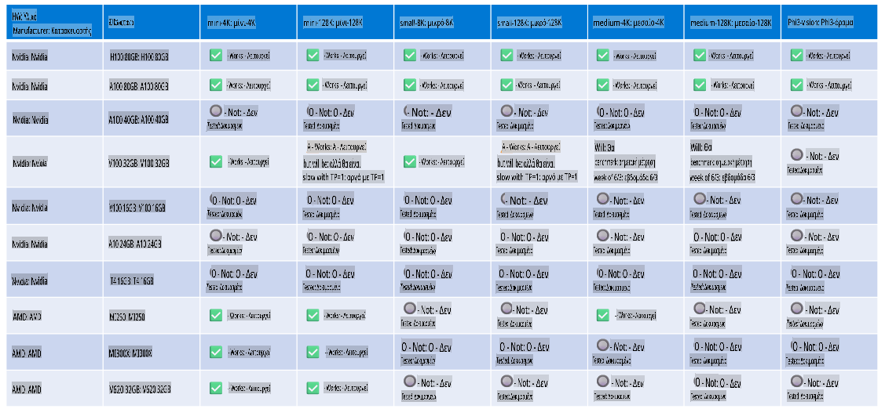

# Υποστήριξη Υλικού Phi

Το Microsoft Phi έχει βελτιστοποιηθεί για το ONNX Runtime και υποστηρίζει το Windows DirectML. Λειτουργεί καλά σε διάφορους τύπους υλικού, όπως GPUs, CPUs και ακόμα και κινητές συσκευές.

## Συσκευές Υλικού
Συγκεκριμένα, το υποστηριζόμενο υλικό περιλαμβάνει:

- GPU SKU: RTX 4090 (DirectML)
- GPU SKU: 1 A100 80GB (CUDA)
- CPU SKU: Standard F64s v2 (64 vCPUs, 128 GiB μνήμη)

## Κινητές Συσκευές SKU

- Android - Samsung Galaxy S21
- Apple iPhone 14 ή νεότερο με επεξεργαστή A16/A17

## Προδιαγραφές Υλικού Phi

- Ελάχιστη απαιτούμενη διαμόρφωση.
- Windows: GPU συμβατή με DirectX 12 και ελάχιστο 4GB συνδυασμένης RAM

CUDA: NVIDIA GPU με Compute Capability >= 7.02



## Εκτέλεση του onnxruntime σε πολλαπλές GPUs

Αυτή τη στιγμή, τα διαθέσιμα μοντέλα Phi ONNX είναι μόνο για 1 GPU. Είναι εφικτό να υποστηριχθεί multi-gpu για το μοντέλο Phi, αλλά το ORT με 2 GPUs δεν εγγυάται ότι θα παρέχει μεγαλύτερη απόδοση σε σύγκριση με 2 instances του ORT. Παρακαλούμε δείτε το [ONNX Runtime](https://onnxruntime.ai/) για τις πιο πρόσφατες ενημερώσεις.

Στο [Build 2024 η ομάδα GenAI ONNX](https://youtu.be/WLW4SE8M9i8?si=EtG04UwDvcjunyfC) ανακοίνωσε ότι ενεργοποίησε multi-instance αντί για multi-gpu για τα μοντέλα Phi.

Αυτή τη στιγμή σας επιτρέπει να εκτελείτε ένα instance του onnxruntime ή onnxruntime-genai με τη μεταβλητή περιβάλλοντος CUDA_VISIBLE_DEVICES όπως παρακάτω.

```Python
CUDA_VISIBLE_DEVICES=0 python infer.py
CUDA_VISIBLE_DEVICES=1 python infer.py
```

Ανακαλύψτε περισσότερα για το Phi στο [Azure AI Foundry](https://ai.azure.com)

**Αποποίηση Ευθυνών**:  
Αυτό το έγγραφο έχει μεταφραστεί χρησιμοποιώντας υπηρεσίες μετάφρασης βασισμένες σε τεχνητή νοημοσύνη. Παρόλο που καταβάλλουμε προσπάθειες για ακρίβεια, παρακαλούμε να έχετε υπόψη ότι οι αυτοματοποιημένες μεταφράσεις ενδέχεται να περιέχουν λάθη ή ανακρίβειες. Το πρωτότυπο έγγραφο στη μητρική του γλώσσα θα πρέπει να θεωρείται η αυθεντική πηγή. Για κρίσιμες πληροφορίες, συνιστάται επαγγελματική ανθρώπινη μετάφραση. Δεν φέρουμε ευθύνη για τυχόν παρεξηγήσεις ή εσφαλμένες ερμηνείες που προκύπτουν από τη χρήση αυτής της μετάφρασης.