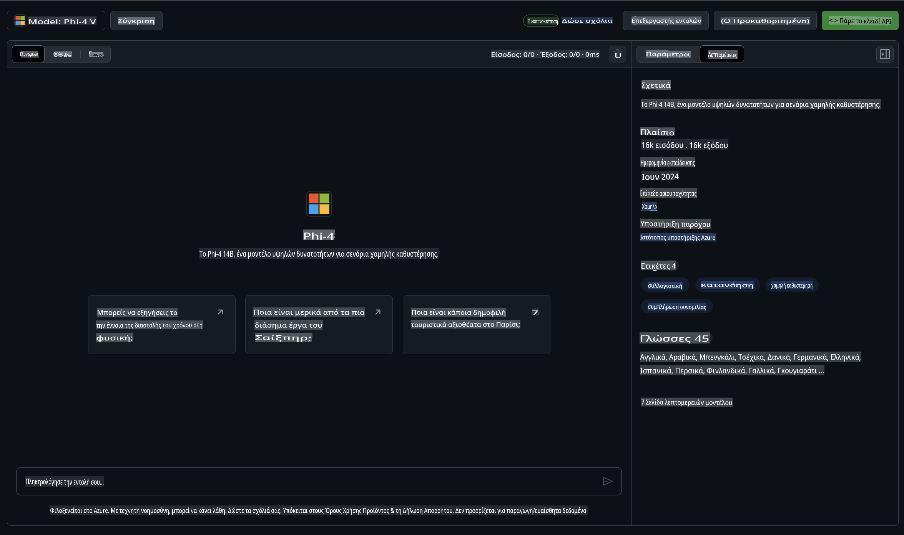
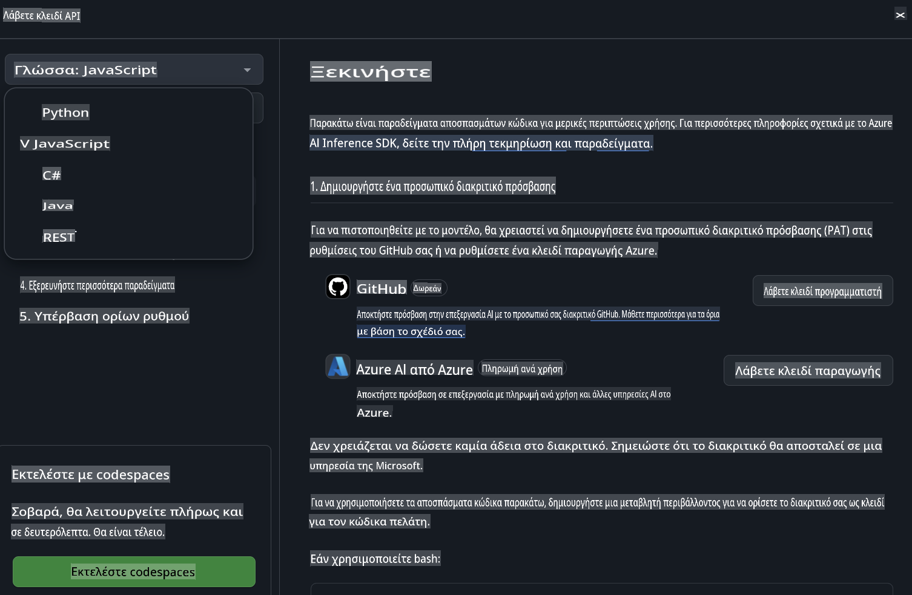
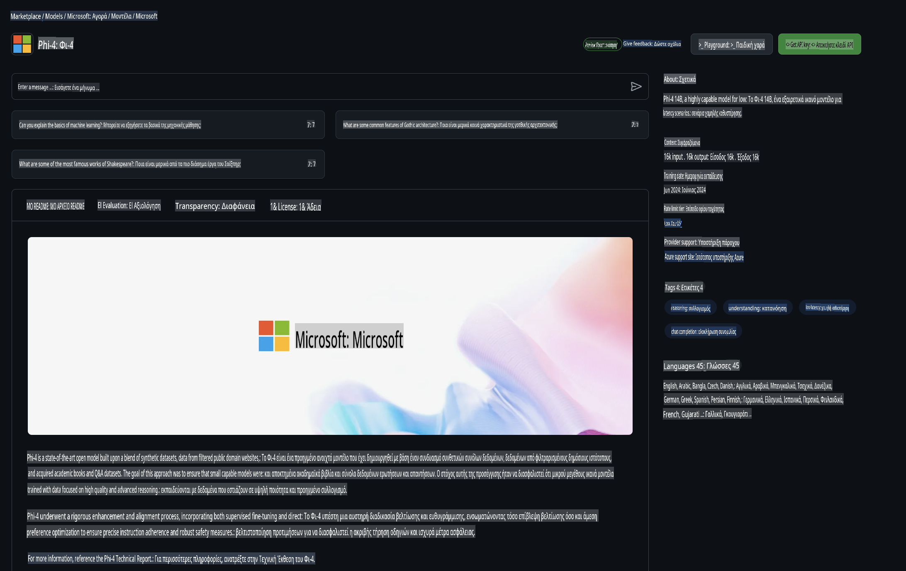

## Οικογένεια Phi στα Μοντέλα του GitHub

Καλώς ήρθατε στα [GitHub Models](https://github.com/marketplace/models)! Είμαστε έτοιμοι για να εξερευνήσετε τα Μοντέλα Τεχνητής Νοημοσύνης που φιλοξενούνται στο Azure AI.


Για περισσότερες πληροφορίες σχετικά με τα διαθέσιμα Μοντέλα στα GitHub Models, δείτε το [GitHub Model Marketplace](https://github.com/marketplace/models).

## Διαθέσιμα Μοντέλα

Κάθε μοντέλο έχει δικό του playground και δείγματα κώδικα.



### Οικογένεια Phi στον Κατάλογο Μοντέλων του GitHub

- [Phi-4](https://github.com/marketplace/models/azureml/Phi-4)

- [Phi-3.5-MoE instruct (128k)](https://github.com/marketplace/models/azureml/Phi-3-5-MoE-instruct)

- [Phi-3.5-vision instruct (128k)](https://github.com/marketplace/models/azureml/Phi-3-5-vision-instruct)

- [Phi-3.5-mini instruct (128k)](https://github.com/marketplace/models/azureml/Phi-3-5-mini-instruct)

- [Phi-3-Medium-128k-Instruct](https://github.com/marketplace/models/azureml/Phi-3-medium-128k-instruct)

- [Phi-3-medium-4k-instruct](https://github.com/marketplace/models/azureml/Phi-3-medium-4k-instruct)

- [Phi-3-mini-128k-instruct](https://github.com/marketplace/models/azureml/Phi-3-mini-128k-instruct)

- [Phi-3-mini-4k-instruct](https://github.com/marketplace/models/azureml/Phi-3-mini-4k-instruct)

- [Phi-3-small-128k-instruct](https://github.com/marketplace/models/azureml/Phi-3-small-128k-instruct)

- [Phi-3-small-8k-instruct](https://github.com/marketplace/models/azureml/Phi-3-small-8k-instruct)

## Ξεκινώντας

Υπάρχουν μερικά βασικά παραδείγματα έτοιμα για εκτέλεση. Μπορείτε να τα βρείτε στον φάκελο των δειγμάτων. Αν θέλετε να ξεκινήσετε απευθείας με την αγαπημένη σας γλώσσα, τα παραδείγματα είναι διαθέσιμα στις εξής γλώσσες:

- Python
- JavaScript
- C#
- Java
- cURL

Υπάρχει επίσης ένα αφιερωμένο περιβάλλον Codespaces για την εκτέλεση των δειγμάτων και των μοντέλων.



## Παράδειγμα Κώδικα

Παρακάτω παρατίθενται αποσπάσματα κώδικα για μερικές περιπτώσεις χρήσης. Για περισσότερες πληροφορίες σχετικά με το Azure AI Inference SDK, δείτε την πλήρη τεκμηρίωση και τα δείγματα.

## Ρύθμιση

1. Δημιουργήστε ένα προσωπικό access token  
Δεν χρειάζεται να δώσετε δικαιώματα στο token. Σημειώστε ότι το token θα σταλεί σε μια υπηρεσία της Microsoft.

Για να χρησιμοποιήσετε τα παρακάτω αποσπάσματα κώδικα, δημιουργήστε μια μεταβλητή περιβάλλοντος για να ορίσετε το token σας ως κλειδί για τον client κώδικα.

Αν χρησιμοποιείτε bash:
```
export GITHUB_TOKEN="<your-github-token-goes-here>"
```  
Αν χρησιμοποιείτε powershell:
```
$Env:GITHUB_TOKEN="<your-github-token-goes-here>"
```  

Αν χρησιμοποιείτε Windows command prompt:
```
set GITHUB_TOKEN=<your-github-token-goes-here>
```  

## Παράδειγμα Python

### Εγκατάσταση εξαρτήσεων  
Εγκαταστήστε το Azure AI Inference SDK χρησιμοποιώντας pip (Απαιτείται: Python >=3.8):

```
pip install azure-ai-inference
```  

### Εκτέλεση ενός βασικού παραδείγματος κώδικα  

Αυτό το παράδειγμα δείχνει μια βασική κλήση στο chat completion API. Χρησιμοποιεί το endpoint inference του GitHub AI model και το προσωπικό σας GitHub token. Η κλήση είναι συγχρονισμένη.

```python
import os
from azure.ai.inference import ChatCompletionsClient
from azure.ai.inference.models import SystemMessage, UserMessage
from azure.core.credentials import AzureKeyCredential

endpoint = "https://models.inference.ai.azure.com"
model_name = "Phi-4"
token = os.environ["GITHUB_TOKEN"]

client = ChatCompletionsClient(
    endpoint=endpoint,
    credential=AzureKeyCredential(token),
)

response = client.complete(
    messages=[
        UserMessage(content="I have $20,000 in my savings account, where I receive a 4% profit per year and payments twice a year. Can you please tell me how long it will take for me to become a millionaire? Also, can you please explain the math step by step as if you were explaining it to an uneducated person?"),
    ],
    temperature=0.4,
    top_p=1.0,
    max_tokens=2048,
    model=model_name
)

print(response.choices[0].message.content)
```  

### Εκτέλεση συνομιλίας πολλών γύρων  

Αυτό το παράδειγμα δείχνει μια συνομιλία πολλών γύρων με το chat completion API. Όταν χρησιμοποιείτε το μοντέλο για μια εφαρμογή συνομιλίας, θα πρέπει να διαχειρίζεστε το ιστορικό της συνομιλίας και να στέλνετε τα τελευταία μηνύματα στο μοντέλο.

```
import os
from azure.ai.inference import ChatCompletionsClient
from azure.ai.inference.models import AssistantMessage, SystemMessage, UserMessage
from azure.core.credentials import AzureKeyCredential

token = os.environ["GITHUB_TOKEN"]
endpoint = "https://models.inference.ai.azure.com"
# Replace Model_Name
model_name = "Phi-4"

client = ChatCompletionsClient(
    endpoint=endpoint,
    credential=AzureKeyCredential(token),
)

messages = [
    SystemMessage(content="You are a helpful assistant."),
    UserMessage(content="What is the capital of France?"),
    AssistantMessage(content="The capital of France is Paris."),
    UserMessage(content="What about Spain?"),
]

response = client.complete(messages=messages, model=model_name)

print(response.choices[0].message.content)
```  

### Ροή εξόδου  

Για καλύτερη εμπειρία χρήστη, θα θέλετε να κάνετε ροή της απόκρισης του μοντέλου, ώστε να εμφανίζεται το πρώτο token νωρίς και να αποφεύγετε να περιμένετε για μακροσκελείς αποκρίσεις.

```
import os
from azure.ai.inference import ChatCompletionsClient
from azure.ai.inference.models import SystemMessage, UserMessage
from azure.core.credentials import AzureKeyCredential

token = os.environ["GITHUB_TOKEN"]
endpoint = "https://models.inference.ai.azure.com"
# Replace Model_Name
model_name = "Phi-4"

client = ChatCompletionsClient(
    endpoint=endpoint,
    credential=AzureKeyCredential(token),
)

response = client.complete(
    stream=True,
    messages=[
        SystemMessage(content="You are a helpful assistant."),
        UserMessage(content="Give me 5 good reasons why I should exercise every day."),
    ],
    model=model_name,
)

for update in response:
    if update.choices:
        print(update.choices[0].delta.content or "", end="")

client.close()
```  

## ΔΩΡΕΑΝ Χρήση και Όρια Ρυθμού για τα GitHub Models  



Τα [όρια ρυθμού για το playground και τη δωρεάν χρήση API](https://docs.github.com/en/github-models/prototyping-with-ai-models#rate-limits) έχουν σχεδιαστεί για να σας βοηθήσουν να πειραματιστείτε με τα μοντέλα και να δημιουργήσετε πρωτότυπες εφαρμογές AI. Για χρήση πέρα από αυτά τα όρια, και για να κλιμακώσετε την εφαρμογή σας, πρέπει να προμηθευτείτε πόρους από έναν λογαριασμό Azure και να κάνετε αυθεντικοποίηση από εκεί αντί για το προσωπικό σας GitHub token. Δεν χρειάζεται να αλλάξετε τίποτα άλλο στον κώδικά σας. Χρησιμοποιήστε αυτόν τον σύνδεσμο για να μάθετε πώς να ξεπεράσετε τα όρια του δωρεάν επιπέδου στο Azure AI.

### Αποκαλύψεις  

Θυμηθείτε ότι όταν αλληλεπιδράτε με ένα μοντέλο, πειραματίζεστε με AI, οπότε είναι πιθανό να υπάρχουν λάθη στο περιεχόμενο.

Η λειτουργία υπόκειται σε διάφορα όρια (συμπεριλαμβανομένων αιτημάτων ανά λεπτό, αιτημάτων ανά ημέρα, tokens ανά αίτημα και ταυτόχρονων αιτημάτων) και δεν έχει σχεδιαστεί για περιπτώσεις χρήσης παραγωγής.

Τα GitHub Models χρησιμοποιούν το Azure AI Content Safety. Αυτά τα φίλτρα δεν μπορούν να απενεργοποιηθούν ως μέρος της εμπειρίας των GitHub Models. Αν αποφασίσετε να χρησιμοποιήσετε μοντέλα μέσω μιας επί πληρωμή υπηρεσίας, παρακαλούμε ρυθμίστε τα φίλτρα περιεχομένου σας ώστε να ανταποκρίνονται στις απαιτήσεις σας.

Αυτή η υπηρεσία υπόκειται στους Όρους Προ-κυκλοφορίας του GitHub.

**Αποποίηση Ευθύνης**:  
Αυτό το έγγραφο έχει μεταφραστεί χρησιμοποιώντας υπηρεσίες αυτόματης μετάφρασης με βάση την τεχνητή νοημοσύνη. Παρόλο που καταβάλλουμε προσπάθειες για ακρίβεια, παρακαλούμε να έχετε υπόψη ότι οι αυτοματοποιημένες μεταφράσεις ενδέχεται να περιέχουν λάθη ή ανακρίβειες. Το πρωτότυπο έγγραφο στη μητρική του γλώσσα θα πρέπει να θεωρείται η έγκυρη πηγή. Για κρίσιμες πληροφορίες, συνιστάται επαγγελματική μετάφραση από άνθρωπο. Δεν φέρουμε ευθύνη για τυχόν παρεξηγήσεις ή εσφαλμένες ερμηνείες που προκύπτουν από τη χρήση αυτής της μετάφρασης.